[](https://opensource.org/licenses/MPL-2.0)
[](https://GitHub.com/Naereen/StrapDown.js/graphs/commit-activity)

[](https://GitHub.com/AdrianAntico/RemixAutoML/issues/)
[](http://makeapullrequest.com)


# Installing RemixAutoML in 2 Easy Steps:

### 1. First, install R package dependencies:
  
```
library(devtools)
to_install <- c("arules","catboost","caTools","data.table","doParallel","xgboost",
  "foreach","forecast","fpp","ggplot2","gridExtra","h2o","itertools","lubridate",
  "magick","Matrix", "MLmetrics","monreg","nortest","RColorBrewer","recommenderlab","ROCR","zoo",
  "pROC","scatterplot3d","stringr","sde","timeDate","tm","tsoutliers","wordcloud","Rcpp","RODBC")
for (i in to_install) {
  message(paste("looking for ", i))
  if(i == "catboost" & !requireNamespace(i)) {
    
    # Choose a different release version (currently v17.3 and v0.21 are the latest releases that are fully functional
    devtools::install_github('catboost/catboost', subdir = 'catboost/R-package')
    # remotes::install_url('https://github.com/catboost/catboost/releases/download/v0.17.5/catboost-R-Windows-0.17.5.tgz', build_opts = c("--no-multiarch"))
  } else if(i == "h2o" & !requireNamespace(i)) {
    if ("package:h2o" %in% search()) { detach("package:h2o", unload=TRUE) }
    if ("h2o" %in% rownames(installed.packages())) { remove.packages("h2o") }
    pkgs <- c("RCurl","jsonlite")
    for (pkg in pkgs) {
      if (! (pkg %in% rownames(installed.packages()))) { install.packages(pkg) }
    }
    install.packages("h2o")
  } else if (!requireNamespace(i)) {
    message(paste("     installing", i))
    install.packages(i)
  }
}
```


### 2. Next, install RemixAutoML via GitHub:

```
# Install RemixAutoML:
devtools::install_github('AdrianAntico/RemixAutoML', upgrade = FALSE, dependencies = FALSE, force = TRUE)
```

# Installation Troubleshooting 

The most common issue some users are having when trying to install <code>RemixAutoML</code> is the installation of the <code>catboost</code> package dependency in R. Since <code>catboost</code> is not on CRAN, it can only be installed via GitHub. To install <code>catboost</code> without error (and consequently install <code>RemixAutoML</code> without error), try running this line of code first, then restart your R session, then re-run the 2-step installation process above. (<a href="https://github.com/catboost/catboost/issues/612" target="_blank">Reference</a>):

```
options(devtools.install.args = c("--no-multiarch", "--no-test-load"))
install.packages("https://github.com/catboost/catboost/releases/download/v0.17.3/catboost-R-Windows-0.17.3.tgz", repos = NULL, type = "source", INSTALL_opts = c("--no-multiarch", "--no-test-load"))
```
 

If you're having still having trouble installing, see if this issue helps you out:


# RemixAutoML
> This is a collection of functions that I have made to speed up machine learning and to ensure high quality modeling results and output are generated. They are great at establishing solid baselines that are extremely challenging to beat using alternative methods (if at all). **They are intended to make the development cycle fast and robust, along with making operationalizing quick and easy, with low latency model scoring.** 

You can contact me via <a href="https://www.linkedin.com/in/adrian-antico/" target="_blank">LinkedIn</a> for any questions about the package. If you want to be a contributer, contact me via LinkedIn email.

## RemixAutoML Blogs: 
[AutoML Frameworks in R & Python](https://iamnagdev.com/2020/04/01/automl-frameworks-in-r-python/)

[AI for Small to Medium Size Businesses: A Management Take On The Challenges...](https://www.remixinstitute.com/blog/business-ai-for-small-to-medium-sized-businesses-with-remixautoml/#.XX-lD2ZlD8A)

[Why Machine Learning is more Practical than Econometrics in the Real World](https://medium.com/@adrianantico/machine-learning-vs-econometrics-in-the-real-world-4058095b1013)

[Build Thousands of Automated Demand Forecasts in 15 Minutes Using AutoCatBoostCARMA in R](https://www.remixinstitute.com/blog/automated-demand-forecasts-using-autocatboostcarma-in-r/#.XUIO1ntlCDM)

[Automate Your KPI Forecasts With Only 1 Line of R Code Using AutoTS](https://www.remixinstitute.com/blog/automate-your-kpi-forecasts-with-only-1-line-of-r-code-using-autots/#.XUIOr3tlCDM)

[Companies Are Demanding Model Interpretability. Here’s How To Do It Right](https://www.remixinstitute.com/blog/companies-are-demanding-model-interpretability-heres-how-to-do-it-right/#.XUIN1HtlCDM)

[The Easiest Way to Create Thresholds And Improve Your Classification Model](https://www.remixinstitute.com/blog/the-easiest-way-to-create-thresholds-and-improve-your-classification-model/#.XUINVntlCDM)

## Automated Supervised Learning Training Functions: 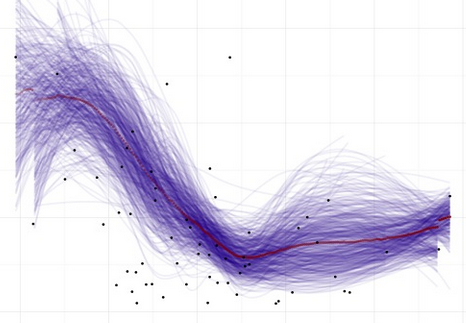
<details><summary>click to expand</summary> 
<p>
  
#### Regression:
____________________________________________________________________________________________________________________________________________
<details><summary>click to expand</summary>
<p>
  
##### **AutoCatBoostRegression()** GPU + CPU
<code>AutoCatBoostRegression()</code> utilizes the CatBoost algorithm in the below steps

##### **AutoXGBoostRegression()** GPU + CPU
<code>AutoXGBoostRegression()</code> utilizes the XGBoost algorithm in the below steps 

##### **AutoH2oGBMRegression()**
<code>AutoH2oGBMRegression()</code> utilizes the H2O Gradient Boosting algorithm in the below steps 

##### **AutoH2oDRFRegression()**
<code>AutoH2oDRFRegression()</code> utilizes the H2o Distributed Random Forest algorithm in the below steps 

##### **AutoH2oGLMRegression()**
<code>AutoH2oGLMRegression()</code> utilizes the H2o generalized linear model algorithm in the below steps 

##### **AutoH2oMLRegression()**
<code>AutoH2oMLRegression()</code> utilizes the H2o AutoML algorithm in the below steps 
  
#### The Auto_Regression() models handle a multitude of tasks. In order:
1. Convert your data to data.table format for faster processing
2. Transform your target variable using the best normalization method based on the <code>AutoTransformationCreate()</code> function
3. Create train, validation, and test data, utilizing the <code>AutoDataPartition()</code> function, if you didn't supply those directly to the function
4. Consoldate columns that are used for modeling and what metadata you want returned in your test data with predictions
5. Dichotomize categorical variables (for <code>AutoXGBoostRegression()</code>) and save the factor levels for scoring in a way that guarentees consistency across training, validation, and test data sets, utilizing the <code>DummifyDT()</code> function
6. Save the final modeling column names for reference
7. Handles the data conversion to the appropriate modeling type, such as CatBoost, H2O, and XGBoost
8. Build out a random hyperparameter set for a random grid search for model grid tuning (which includes the default model hyperparameters) if you choose to run a grid tune
9. Loop through the grid-tuning process, building N models
10. Collect the evaluation metrics for each grid tune run
11. Identify the best model of the set of models built in the grid tuning search
12. Save the hyperparameters from the winning grid tuned model
13. Build the final model based on the best model from the grid tuning model search (I remove each model after evaluation metrics are generated in the grid tune to avoid memory overflow)
14. Back-transform your predictions based on the best transformation used earlier in the process
15. Collect evaluation metrics based on performance on test data (based on back-transformed data)
16. Store the final predictions with the associated test data and other columns you want included in that set
17. Save your transformation metadata for recreating them in a scoring process
18. Build out and save an Evaluation Calibration Line Plot and Evaluation Calibration Box-Plot, using the <code>EvalPlot()</code> function
19. Generate and save Variable Importance
20. Generate and save Partital Dependence Calibration Line Plots and Partital Dependence Calibration Box-Plots, using the <code>ParDepPlots()</code> function
21. Return all the objects generated in a named list for immediate use and evaluation
 
</p>
</details>

#### Binary Classification:
____________________________________________________________________________________________________________________________________________
<details><summary>click to expand</summary>
<p>
  
##### **AutoCatBoostClassifier()** GPU + CPU
<code>AutoCatBoostClassifier()</code> utilizes the CatBoost algorithm in the below steps

##### **AutoXGBoostClassifier()** GPU + CPU
<code>AutoXGBoostClassifier()</code> utilizes the XGBoost algorithm in the below steps

##### **AutoH2oGBMClassifier()**
<code>AutoH2oGBMClassifier()</code> utilizes the H2O Gradient Boosting algorithm in the below steps

##### **AutoH2oDRFClassifier()**
<code>AutoH2oDRFClassifier()</code> utilizes the H2O Distributed Random Forest algorithm in the below steps

##### **AutoH2oGLMClassifier()**
<code>AutoH2oGLMClassifier()</code> utilizes the H2O generalized linear model algorithm in the below steps

##### **AutoH2oMLClassifier()**
<code>AutoH2oMLClassifier()</code> utilizes the H2o AutoML algorithm in the below steps 
  
#### The Auto_Classifier() models handle a multitude of tasks. In order:
1. Convert your data to data.table format for faster processing
2. Create train, validation, and test data if you didn't supply those directly to the function
3. Consoldate columns that are used for modeling and what is to be kept for data returned
4. Dichotomize categorical variables (for AutoXGBoostRegression) and save the factor levels for scoring in a way that guarentees consistency across training, validation, and test data sets
5. Saves the final column names for modeling to a csv for later reference
6. Handles the data conversion to the appropriate type, based on model type (CatBoost, H2O, and XGBoost)
7. Build out a random hyperparameter set for a random grid search for model tuning (includes the default model hyperparameters) if you want to utilize that feature
8. Build the grid tuned models
9. Collect the evaluation metrics for each grid tune run
10. Identify the best model of the set of models built in the grid tuning setup
11. Save the hyperparameters from the winning grid tuned model
12. Build the final model based on the best model from the grid tuning model search
13. Collect evaluation metrics based on performance on test data
14. Store the final predictions with the associated test data and other columns you want included in that set
15. Build out and save an Evaluation Calibration Line Plot
16. Build out and save an ROC plot with the top 5 models used in grid-tuning (includes the winning model)
17. Generate and save Variable Importance data
18. Generate and save Partital Dependence Calibration Line Plots
19. Return all the objects generated in a named list for immediate use

</p>
</details>

#### Multinomial Classification:
____________________________________________________________________________________________________________________________________________
<details><summary>click to expand</summary>
<p>
  
##### **AutoCatBoostMultiClass()** GPU + CPU
<code>AutoCatBoostMultiClass()</code> utilizes the CatBoost algorithm in the below steps

##### **AutoXGBoostMultiClass()** GPU + CPU
<code>AutoXGBoostMultiClass()</code> utilizes the XGBoost algorithm in the below steps

##### **AutoH2oGBMMultiClass()**
<code>AutoH2oGBMMultiClass()</code> utilizes the H2O Gradient Boosting algorithm in the below steps

##### **AutoH2oDRFMultiClass()**
<code>AutoH2oDRFMultiClass()</code> utilizes the H2O Distributed Random Forest algorithm in the below steps

##### **AutoH2oGLMMultiClass()**
<code>AutoH2oGLMMultiClass()</code> utilizes the H2O generalized linear model algorithm in the below steps

##### **AutoH2oMLMultiClass()**
<code>AutoH2oMLMultiClass()</code> utilizes the H2o AutoML algorithm in the below steps
  
#### The Auto_MultiClass() models handle a multitude of tasks. In order:
1. Convert your data to data.table format for faster processing
2. Create train, validation, and test data if you didn't supply those directly to the function
3. Consoldate columns that are used for modeling and what is to be kept for data returned
4. Dichotomize categorical variables (for AutoXGBoostRegression) and save the factor levels for scoring in a way that guarentees consistency across training, validation, and test data sets
5. Saves the final column names for modeling to a csv for later reference
6. Ensures the target levels are consistent across train, validate, and test sets and save the levels to file
7. Handles the data conversion to the appropriate type, based on model type (CatBoost, H2O, and XGBoost)
8. Build out a random hyperparameter set for a random grid search for model tuning (includes the default model hyperparameters) if you want to utilize that feature
9. Build the grid tuned models
10. Collect the evaluation metrics for each grid tune run
11. Identify the best model of the set of models built in the grid tuning setup
12. Save the hyperparameters from the winning grid tuned model
13. Build the final model based on the best model from the grid tuning model search
14. Collect evaluation metrics based on performance on test data
15. Store the final predictions with the associated test data and other columns you want included in that set
16. Generate and save Variable Importance data
17. Return all the objects generated in a named list for immediate use

</p>
</details>

#### Generalized Hurdle Models:
____________________________________________________________________________________________________________________________________________
<details><summary>click to expand</summary>
<p>
  
First step is to build either a binary classification model (in the case of a single bucket value, such as zero) or a multiclass model (for the case of multiple bucket values, such as zero and 10). The next step is to subset the data for the cases of: less than the first split value, in between the first and second split value, second and third split value, ..., second to last and last split value, along with greater than last split value. For each data subset, a regression model is built for predicting values in the split value ranges. The final compilation is to multiply the probabilities of being in each group times the values supplied by the regression values for each group.

###### Single Partition
* E(y|x<sub>i</sub>) = Pr(X = 0) * 0 + Pr(X > 0) * E(X | X >= 0)  
* E(y|x<sub>i</sub>) = Pr(X < x<sub>1</sub>) * E(X | X < x<sub>1</sub>) + Pr(X >= x<sub>1</sub>) * E(X | X >= x<sub>1</sub>)

###### Multiple Partitions
* E(y|x<sub>i</sub>) = Pr(X = 0) * 0 + Pr(X < x<sub>2</sub>) * E(X | X < x<sub>2</sub>) + ... + Pr(X < x<sub>n</sub>) * E(X | X < x<sub>n</sub>) + Pr(X >= x<sub>n</sub>) * E(X | X >= x<sub>n</sub>)
* E(y|x<sub>i</sub>) = Pr(X < x<sub>1</sub>) * E(X | X < x<sub>1</sub>) + Pr(x<sub>1</sub> <= X < x<sub>2</sub>) * E(X | x<sub>1</sub> <= X < x<sub>2</sub>) + ... + Pr(x<sub>n-1</sub> <= X < x<sub>n</sub>) * E(X | x<sub>n-1</sub> <= X < x<sub>n</sub>) + Pr(X >= x<sub>n</sub>) * E(X | X >= x<sub>n</sub>)
  
##### **AutoCatBoostHurdleModel()**
<code>AutoCatBoostHurdleModel()</code> utilizes the CatBoost algorithm on the backend. 

##### **AutoXGBoostHurdleModel()**
<code>AutoXGBoostHurdleModel()</code> utilizes the XGBoost algorithm on the backend. 

##### **AutoH2oDRFHurdleModel()**
<code>AutoH2oDRFHurdleModel()</code> utilizes the H2O distributed random forest algorithm on the backend. 

##### **AutoH2oGBMHurdleModel()**
<code>AutoH2oGBMHurdleModel()</code> utilizes the H2O gradient boosting machine algorithm on the backend. 


</p>
</details>

#### General Purpose H2O Automated Modeling:
____________________________________________________________________________________________________________________________________________
<details><summary>click to expand</summary>
<p>
  
##### **AutoH2OModeler()**
<code>AutoH2OModeler()</code> automatically build any number of models along with generating partial dependence calibration plots, model evaluation calibration plots, grid tuning, and file storage for easy production implementation. Handles regression, quantile regression, time until event, and classification models (binary and multinomial) using numeric and factor variables without the need for monotonic transformations nor one-hot-encoding.
* Models include:
  * RandomForest (DRF)
  * GBM
  * Deeplearning
  * XGBoost (for Linux)
  * LightGBM (for Linux)
  * AutoML - medium debth grid tuning for Deeplearning, XGBoost (if available), DRF, GBM, GLM, and StackedEnsembles
</p>
</details>

#### Nonlinear Regression Modeling:
____________________________________________________________________________________________________________________________________________
<details><summary>click to expand</summary>
<p>
  
##### **AutoNLS()**

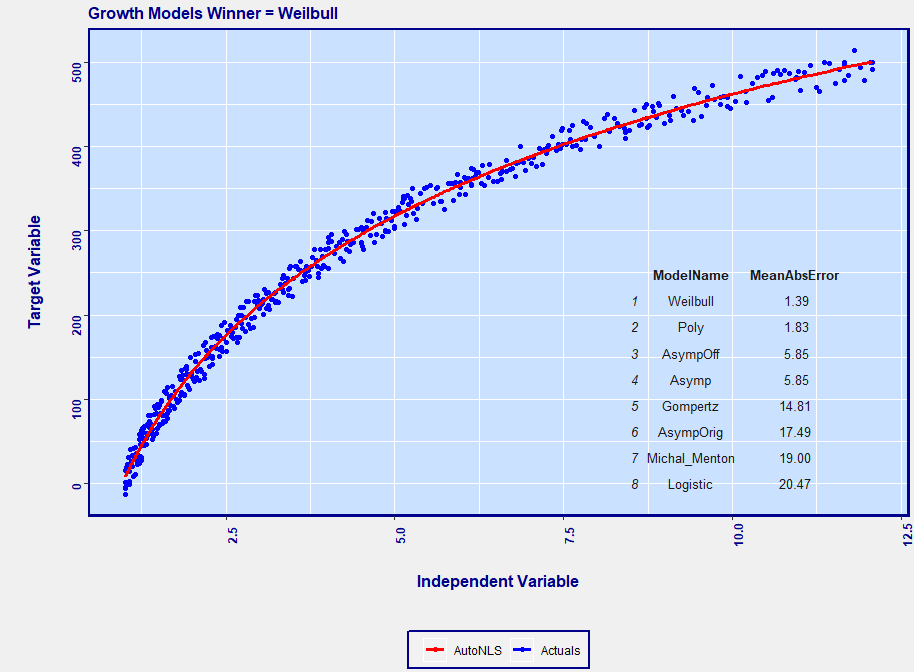

<code>AutoNLS()</code> is an automated nonlinear regression modeling. This function automatically finds the best model fit from the suite of models below and merges predictions to source data file. Great for forecasting growth over time or estimating single variable nonlinear functions.
* Models included:
  * Asymptotic
  * Asymptotic through origin
  * Asymptotic with offset
  * Bi-exponential
  * Four parameter logistic
  * Three parameter logistic
  * Gompertz
  * Michal Menton
  * Weibull
  * Polynomial regression or monotonic regression
  
</p>
</details>

</p>
</details>

## Automated Model Scoring Functions: 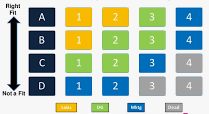
<details><summary>click to expand</summary>
<p>
  
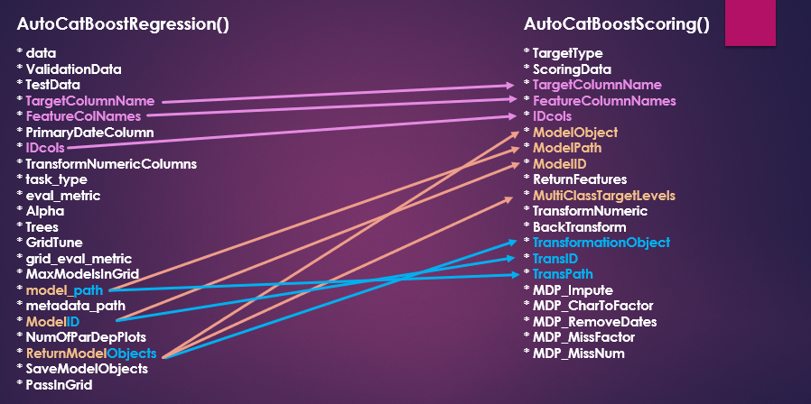

##### **AutoCatBoostScoring()**
<code>AutoCatBoostScoring()</code> is an automated scoring function that compliments the AutoCatBoost() model training functions. This function requires you to supply features for scoring. It will run ModelDataPrep() to prepare your features for catboost data conversion and scoring. It will also handle and transformations and back-transformations if you utilized that feature in the regression training case.

##### **AutoXGBoostScoring()**
<code>AutoXGBoostScoring()</code> is an automated scoring function that compliments the AutoXGBoost() model training functions. This function requires you to supply features for scoring. It will run ModelDataPrep() and the DummifyDT() functions to prepare your features for xgboost data conversion and scoring. It will also handle and transformations and back-transformations if you utilized that feature in the regression training case.

##### **AutoH2OMLScoring()**
<code>AutoH2OMLScoring()</code> is an automated scoring function that compliments the AutoH2oGBM__() and AutoH2oDRF__() model training functions. This function requires you to supply features for scoring. It will run ModelDataPrep()to prepare your features for H2O data conversion and scoring. It will also handle transformations and back-transformations if you utilized that feature in the regression training case and didn't do it yourself before hand.

##### **AutoH2OScoring()**
<code>AutoH2OScoring()</code> is for scoring models that were built with the AutoH2OModeler, AutoKMeans, and AutoWord2VecModeler functions. Scores mojo models or binary files by loading models into the H2O environment and scoring them. You can choose which output you wish to keep as well for classification and multinomial models. 
  
</p>
</details>

## Automated Time Series Modeling Functions: 
<details><summary>click to expand</summary>
<p>
  
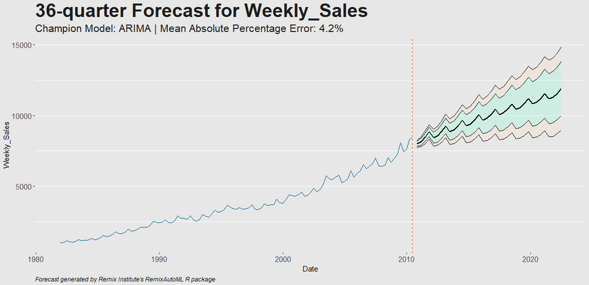

### **AutoBanditSarima()**
<code>AutoBanditArima()</code> is the newest weapon in the time series arsenal. This is the highest performing single series time series model in the package. The entire arima parameter space is divided up into blocks that are increasing in complexity of parameter settings. The multi-armed bandit will determine which parameter block to sample from more frequently based on which one is performing better than the others. The underlying bandit algorithm is the randomized probability matching algorithm found in the **bandit** package. I had to write a slight variation of it to allow for tweaking the number of intervals used in computing the integrals that result in the probabilities used for sampling. The evaluation is different from what exists today - you need to specify a weighting to use so that both the training metrics and validation metrics are used in calculating the best model. The user can specify 0% or 100% to go with just the one measure of their choice as well. The function returns a list with data.table of the forecasts and prediction inverals and the other item in the list is the Performance Grid results so you can see how every model tested performed.

```
# Pull in data
data <- data.table::as.data.table(fpp::cafe)
data.table::setnames(data, "x", "Weekly_Sales")
data.table::set(data, j = "Date", value = "1982-01-01")
data.table::setcolorder(data, c(2,1))
data[, Date := as.POSIXct(Date)]

# "1min"
data[, xx := 1:.N][, Date := Date + lubridate::minutes(1 * xx)][, xx := NULL]

# "5min"
#data[, xx := 1:.N][, Date := Date + lubridate::minutes(5 * xx)][, xx := NULL]

# "10min"
#data[, xx := 1:.N][, Date := Date + lubridate::minutes(10 * xx)][, xx := NULL]

# "15min"
#data[, xx := 1:.N][, Date := Date + lubridate::minutes(15 * xx)][, xx := NULL]

# "30min"
#data[, xx := 1:.N][, Date := Date + lubridate::minutes(30 * xx)][, xx := NULL]

# "hour"
#data[, xx := 1:.N][, Date := Date + lubridate::hours(xx)][, xx := NULL]

# Build model
Output <- RemixAutoML::AutoBanditSarima(
  data = data,
  TargetVariableName = "Weekly_Sales",
  DateColumnName = "Date",
  TimeAggLevel = "1min",
  EvaluationMetric = "MAE",
  NumHoldOutPeriods = 5L,
  NumFCPeriods = 5L,
  MaxLags = 5L,
  MaxSeasonalLags = 0L,
  MaxMovingAverages = 5L, 
  MaxSeasonalMovingAverages = 0L,
  MaxFourierPairs = 2L,
  TrainWeighting = 0.50,
  MaxConsecutiveFails = 50L,
  MaxNumberModels = 500L,
  MaxRunTimeMinutes = 30L)

# View output
Output$Forecast[ModelRank == min(ModelRank)]
View(Output$PerformanceGrid[DataSetName == "TSCleanModelFrequency"])
```

### **AutoBanditNNet()**
Same as AutoBanditArima except it uses the nnetar model behind the scenes.

$$$ **AutoTBATS()**
Same as AutoBanditArima except for the bandit testing and it uses TBATS behind the scenes. It just runs through all the parameter settings and builds each model and returns the same list as the other two above.

### **AutoTS()** 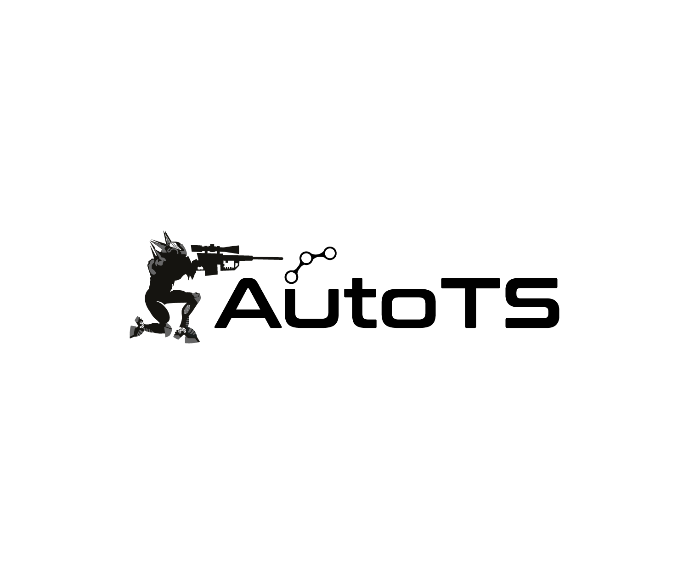
<code>AutoTS()</code> 

* Returns a list containing 
  * A data.table object with a date column and the forecasted values
  * The model evaluation results
  * The champion model for later use if desired
  * The name of the champion model
  * A time series ggplot with historical values and forecasted values with optional 80% and 95% prediction intervals
* The models tested internally include:
  * DSHW: Double Seasonal Holt-Winters
  * ARFIMA: Auto Regressive Fractional Integrated Moving Average
  * ARIMA: Auto Regressive Integrated Moving Average with specified max lags, seasonal lags, moving averages, and seasonal moving averages
  * ETS: Additive and Multiplicative Exponential Smoothing and Holt-Winters
  * NNetar: Auto Regressive Neural Network models automatically compares models with 1 lag or 1 seasonal lag compared to models with up to N lags and N seasonal lags
  * TBATS: Exponential smoothing state space model with Box-Cox transformation, ARMA errors, Trend and Seasonal components
  * TSLM: Time Series Linear Model - builds a linear model with trend and season components extracted from the data

For each of the models tested internally, several aspects should be noted:
* Optimal Box-Cox transformations are used in every run where data is strictly positive. The optimal transformation could also be "no transformation". 
* Four different treatments are tested for each model:
  * user-specified time frequency + no historical series smoothing & imputation
  * model-based time frequency + no historical smoothing and imputation
  * user-specified time frequency + historical series smoothing & imputation
  * model-based time frequency + historical smoothing & imputation

* You can specify MaxFourierPairs to test out if adding Fourier term regressors can increase forecast accuracy. The Fourier terms will be applied to the ARIMA and NNetar models only.
* For the ARIMA, ARFIMA, and TBATS, any number of lags and moving averages along with up to 1 seasonal lags and seasonal moving averages can be used (selection based on a stepwise procedure)
* For the Double Seasonal Holt-Winters model, alpha, beta, gamma, omega, and phi are determined using least-squares and the forecasts are adjusted using an AR(1) model for the errors
* The Exponential Smoothing State-Space model runs through an automatic selection of the error type, trend type, and season type, with the options being "none", "additive", and "multiplicative", along with testing of damped vs. non-damped trend (either additive or multiplicative), and alpha, beta, and phi are estimated
* The neural network is setup to test out every combination of lags and seasonal lags and the model with the best holdout score is selected
* The TBATS model utilizes any number of lags and moving averages for the errors, damped trend vs. non-damped trend are tested, trend vs. non-trend are also tested, and the model utilizes parallel processing for efficient run times
* The TSLM model utilizes a simple time trend and season depending on the frequency of the data

### The **CARMA** Suite 
<code>AutoTS()</code>

##### **AutoCatBoostCARMA()**
<code>AutoCatBoostCARMA()</code> utilizes the CatBoost alorithm

##### **AutoXGBoostCARMA()**
<code>AutoXGBoostCARMA()</code> utilizes the XGBoost alorithm

##### **AutoH2oDRFCARMA()**
<code>AutoH2oDRFCARMA()</code> utilizes the H2O Distributed Random Forest alorithm

##### **AutoH2oGBMCARMA()**
<code>AutoH2oGBMCARMA()</code> utilizes the H2O Gradient Boosting Machine alorithm

##### **AutoH2oGLMCARMA()**
<code>AutoH2oGLMCARMA()</code> utilizes the H2O generalized linear model alorithm

##### **AutoH2oMLCARMA()**
<code>AutoH2oMLCARMA()</code> utilizes the H2O AutoML alorithm


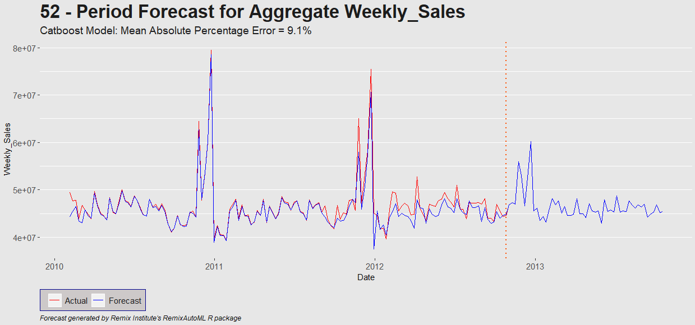


##### The CARMA suite utilizes several features to ensure proper models are built to generate the best possible out-of-sample forecasts.

**Feature engineering:** I use a time trend, calendar variables, holiday counts, differencing, along with fourier pairs and lags / rolling statistics (mean, sd, skewness, kurtosis, quantiles) and they can be generated by categorical variables and their interactions plus for various time-based aggregations. Internally, the CARMA functions utilize several RemixAutoML functions, all written using data.table for fast and memory efficient processing: 
  * <code>AutoLagRollStats()</code> - creates lags and moving average features (also creates lags and moving averages off of time between records)
  * <code>AutoLagRollStatsScoring()</code> - creates lags and moving average features for a single record (along with the time between vars)
  * <code>CreateCalendarVariables()</code> - creates numeric features identifying various time units based on date columns
  * <code>CreateHolidayVariables()</code> - creates count features based on the specified holiday groups you want to track and the date columns you supply

**Optimal transformations:** the target variable along with the associated lags and moving average features were transformed. This is really useful for regression models with categorical features that have associated target values that significantly differ from each other. The transformation options that are tested (using a Pearson test for normality) include: 
  * YeoJohnson
  * BoxCox
  * arcsinh
  * Identity
  * arcsin(sqrt(x)): proportion data only
  * logit(x): proportion data only

##### The functions used to create these and generate them for scoring models come from RemixAutoML:
* <code>AutoTransformationCreate()</code>
* <code>AutoTransformationScore()</code>

**Models:** there are four CARMA functions and each use a different algorithm for the model fitting. The models used to fit the time series data come from RemixAutoML and include: 
* <code>AutoCatBoostRegression()</code>
* <code>AutoXGBoostRegression()</code>
* <code>AutoH2oDRFRegression()</code>
* <code>AutoH2oGBMRegression()</code>

**GPU:** With the CatBoost and XGBoost functions, you can build the models utilizing GPU (I run them with a GeForce 1080ti) which results in an average 10x speedup in model training time (compared to running on CPU with 8 threads).

**Data partitioning:** for creating the training, validation, and test data, the CARMA functions utilize the <code>AutoDataPartition()</code> function and utilizes the "timeseries" option for the PartitionType argument which ensures that the train data reflects the furthest points back in time, followed by the validation data, and then the test data which is the most recent in time.

**Forecasting:** Once the regression model is built, the forecast process replicates the ARIMA process. Once a single step-ahead forecast is made, the lags and moving average features are updated based on the predicted values from scoring the model. Next, the rest of the other features are updated. Then the next forecast step is made, rinse and repeat for remaining forecasting steps. This process utilizes the RemixAutoML functions:
* <code>AutoCatBoostScoring()</code>
* <code>AutoXGBoostScoring()</code>
* <code>AutoH2oMLScoring()</code>
  
### Intermittent Demand Forecasting Functions

##### **TimeSeriesFill()**
<code>TimeSeriesFill()</code> is a function that will zero pad (currently only zero pad) a time series data set (not transactional data). There are three ways to use this function:
* Grouped data 1 - find the minimum and maximum dates regardless of grouping variables and use those values to ensure all group levels have all the dates represented within the series bounds (if missing, fill with zeros)
* Grouped data 2 - find the minimum and maximum dates with respect to each unique grouping variable level (grouping variables must be hierarchical) and zero pads missing dates within in each group level.
* Single series - Zero pad any missing dates within series bounds
* Used internally with the CARMA suite of functions by specifying the argument to enable this functionality

##### **ContinuousTimeDataGenerator()**
<code>ContinuousTimeDataGenerator()</code> is for frequency and size data sets. This function generates count and size data sets for intermittent demand forecasting, using the methods in this package.

##### **AutoCatBoostSizeFreqDist()**
<code>AutoCatBoostSizeFreqDist()</code> is for building size and frequency predictive distributions via quantile regressions. Size (or severity) and frequency (or count) quantile regressions are build and you supply the actual percentiles you want predicted. Use this with the <code>ID_SingleLevelGibbsSampler()</code> function to simulate from the joint distribution.

##### **AutoH2oGBMSizeFreqDist()**
<code>AutoH2oGBMSizeFreqDist()</code> is for building size and frequency predictive distributions via quantile regressions. Size (or severity) and frequency (or count) quantile regressions are build and you supply the actual percentiles you want predicted. Use this with the <code>ID_SingleLevelGibbsSampler()</code> function to simulate from the joint distribution.

##### **AutoCatBoostFreqSizeScoring()**
<code>AutoCatBoostFreqSizeScoring()</code> is for scoring the models build with <code>AutoCatBoostFreqSizeScoring()</code>. It will return the predicted values for every quantile model for both distributions for 1 to the max forecast periods you provided to build the scoring data. 

##### **AutoH2oGBMFreqSizeScoring()**
<code>AutoH2oGBMFreqSizeScoring()</code> is for scoring the models build with <code>AutoH2oGBMSizeFreqDist()</code>. It will return the predicted values for every quantile model for both distributions for 1 to the max forecast periods you provided to build the scoring data. 

</p>
</details>

## Automated Recommender System Functions: 
<details><summary>click to expand</summary>
<p>
  
##### **AutoRecomDataCreate()**
<code>AutoRecomDataCreate()</code> automatically creates your binary ratings matix from transaction data

##### **AutoRecommender()**
<code>AutoRecommender()</code> automated collaborative filtering modeling where each model below competes against one another for top performance
  * RandomItems
  * PopularItems
  * UserBasedCF  
  * ItemBasedCF
  * AssociationRules
  
##### **AutoRecommenderScoring()**
<code>AutoRecommenderScoring()</code> automatically score a recommender model from AutoRecommender()

##### **AutoMarketBasketModel()**
<code>AutoMarketBasketModel()</code> is a function that runs a market basket analysis automatically. It will convert your data, run the algorithm, and generate the recommended items. On top of that, it includes additional significance values not provided by the source pacakge. 
  
</p>
</details>

## Automated Unsupervised Learning Functions: 
<details><summary>click to expand</summary>
<p>

##### **GenTSAnomVars()**
<code>GenTSAnomVars()</code> generates time series anomaly variables. (Cross with Feature Engineering) Create indicator variables (high, low) along with cumulative anomaly rates (high, low) based on control limits methodology over a max of two grouping variables and a date variable (effectively a rolling GLM).

##### **ResidualOutliers()**
<code>ResidualOutliers()</code> Generate residual outliers from time series modeling. (Cross with Feature Engineering) Utilize tsoutliers to indicate outliers within a time series data set

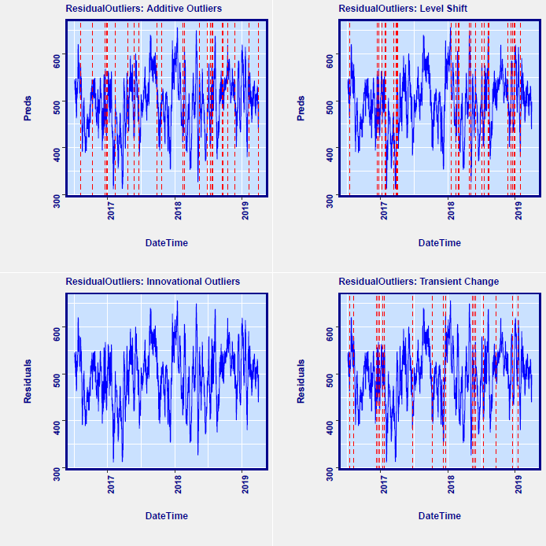

##### **AutoKMeans()** 
<code>AutoKMeans()</code> This function builds a generalized low rank model followed by KMeans. (Possible cross with Feature Engineering) Generate a column with a cluster identifier based on a grid tuned (optional) generalized low rank model and a grid tuned (optimal) K-Optimal searching K-Means algorithm

##### **ProblematicRecords()**
<code>ProblematicRecords()</code> automatically identifies anomalous data records via Isolation Forests from H2O.

</p>
</details>

## Automated Feature Engineering Functions: 
<details><summary>click to expand</summary>
<p>
  
##### **AutoLagRollStats()** 
<code>AutoLagRollStats()</code> builds lags and rolling statistics by grouping variables and their interactions along with multiple different time aggregations if selected. Rolling stats include mean, sd, skewness, kurtosis, and the 5th - 95th percentiles. This function was inspired by the distributed lag modeling framework but I wanted to use it for time series analysis as well and really generalize it as much as possible. The beauty of this function is inspired by analyzing whether a baseball player will get a basehit or more in his next at bat. One easy way to get a better idea of the likelihood is to look at his batting average and his career batting average. However, players go into hot streaks and slumps. How do we account for that? Well, in comes the functions here. You look at the batting average over the last N to N+x at bats, for various N and x. I keep going though - I want the same windows for calculating the players standard deviation, skewness, kurtosis, and various quantiles over those time windows. I also want to look at all those measure but by using weekly data - as in, over the last N weeks, pull in those stats too. 

##### **AutoLagRollStatsScoring()**
<code>AutoLagRollStatsScoring()</code> builds the above features for a partial set of records in a data set. The function is extremely useful as it can compute these feature vectors at a significantly faster rate than the non scoring version which comes in handy for scoring ML models. If you can find a way to make it faster, let me know.

##### **AutoHierarchicalFourier()**
<code>AutoHierarchicalFourier()</code> turns time series data into fourier series. This function can generate any number of fourier pairs the user wants (if they can actually build) and you can run it with grouped time series data. In the grouping case, fourier pairs can be created for each categorical variable along with the full interactions between specified categoricals. The process is parallelized as well to run as fast as possible.

##### **DT_GDL_Feature_Engineering()**
<code>DT_GDL_Feature_Engineering()</code> builds autoregressive and moving average features from target columns and distributed lags and distributed moving average from independent features distributed across time. On top of that, you can also create time between instances along with their associated lags and moving averages. This function works for data with groups and without groups. 100% data.table built. It runs super fast and can handle big data.

##### **Partial_DT_GDL_Feature_Engineering()**
<code>Partial_DT_GDL_Feature_Engineering()</code> is for generating the equivalent features built from DT_GDL_Feature_Engineering() for a set of new records as rapidly as possible. I used this to create the feature vectors for scoring models in production. This function is for generating lags and moving averages (along with lags and moving averages off of time between records), for a partial set of records in your data set, typical new records that become available for model scoring. Column names and ordering will be identical to the output from the corresponding DT_GDL_Feature_Engineering() function, which most likely was used to create features for model training.

##### **Scoring_GDL_Feature_Engineering()**
<code>Scoring_GDL_Feature_Engineering()</code> is a function that runs internally inside the CARMA functions but might have use outside of it. It is for scoring a single record, for no grouping variables, or one record per group level when a single group is utilized. Generates identical column names as the DT_GDL_Feature_Engineering() function and the Partial_GDL_Feature_Engineering() function. 

##### **AutoWord2VecModeler()**
<code>AutoWord2VecModeler()</code> generates a specified number of vectors for each column of text data in your data set and save the models for re-creating them later in the scoring process. You can choose to build individual models for each columns or one model for all your columns.

##### **CreateCalendarVariables()**
<code>ModelDataPrep()</code> This functions creates new columns that extract the calendar information from date columns, such as second, minute, hour, week day, day of month, day of year, week, isoweek, month, quarter, and year.

##### **CreateHolidayVariable()**
<code>ModelDataPrep()</code> This function counts up the number of specified holidays between the current record time stamp and the previous record time stamp.

##### **ModelDataPrep()**
<code>ModelDataPrep()</code> rapidly convert "inf" values to NA, convert character columns to factor columns, and impute with specified values for factor and numeric columns.

##### **DummifyDT()** 
<code>DummifyDT()</code> rapidly dichotomizes a list of columns in a data table (N+1 columns for N levels using one hot encoding or N columns for N levels otherwise). Several other arguments exist for outputting and saving factor levels for model scoring processes, which are used internally in the AutoXGBoost__() suite of modeling functions.

##### **AutoDataPartition()**
<code>AutoDataPartition()</code> is designed to achieve a few things that standard data partitioning processes or functions don't handle. First, you can choose to build any number of partitioned data sets beyond the standard train, validate, and test data sets. Second, you can choose between random sampling to split your data or you can choose a time-based partitioning. Third, for the random partitioning, you can specify stratification columns in your data to stratify by in order to ensure a proper split amongst your categorical features (E.g. think MultiClass targets). Lastly, it's 100% data.table so it will run fast and with low memory overhead.

##### **AutoTransformationCreate()**
<code>AutoTransformationCreate()</code> is a function for automatically identifying the optimal transformations for numeric features and transforming them once identified. This function will loop through your selected transformation options (YeoJohnson, BoxCox, Asinh, Asin, and Logit) and find the one that produces data that is the closest to normally distributed data. It then makes the transformation and collects the metadata information for use in the AutoTransformationScore() function, either by returning the objects (always) or saving them to file (optional).

##### **AutoTransformationScore()**
<code>AutoTransformationScore()</code> is a the compliment function to AutoTransformationCreate(). Automatically apply or inverse the transformations you identified in AutoTransformationCreate() to other data sets. This is useful for applying transformations to your validation and test data sets for modeling. It's also useful for back-transforming your target and prediction columns after you have build and score your models so you can obtain statistics on the original features.

##### **AutoDataDictionary()**
<code>AutoDataDictionary()</code> will pull back data dictionary data from a sql server environment.

</p>
</details>


## Automated Model Evaluation Functions: 
<details><summary>click to expand</summary>
<p>
  
##### **RemixClassificationMetrics()**
<code>RemixClassificationMetrics()</code> will return all confusion matrix metrics across all possible thresholds (seq(0.01,0.99,0.01) for any Remix Auto_Classification() model.

##### **ParDepCalPlots()**
<code>ParDepCalPlots()</code> is for visualizing the relationships of features and the reliability of the model in predicting those effects. Build a partial dependence calibration line plot, box plot or bar plot for the case of categorical variables.

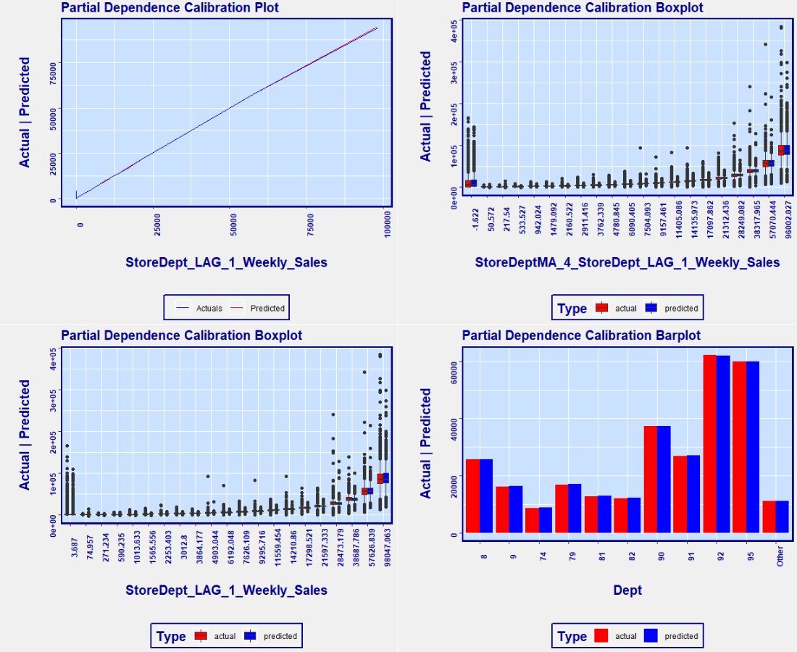


##### **EvalPlot()**
<code>EvalPlot()</code> Has two plot versions: calibration line plot of predicted values and actual values across range of predicted value, and calibration boxplot for seeing the accuracy and variability of predictions against actuals. 

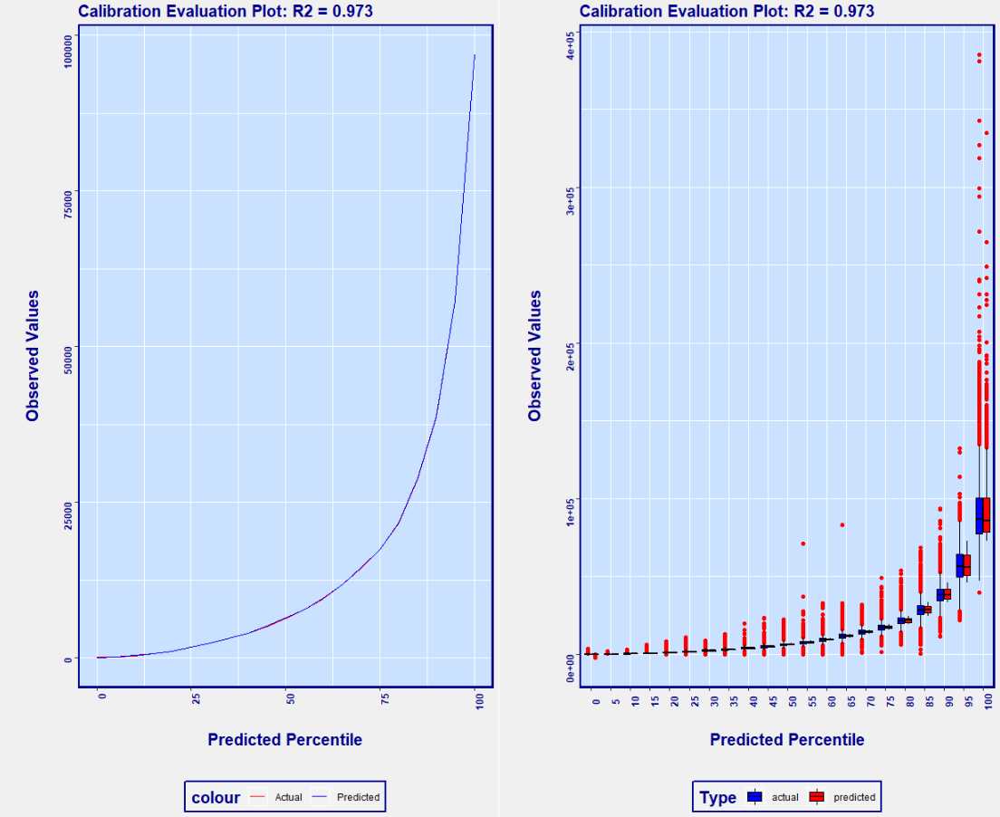

##### **threshOptim()**
<code>threshOptim()</code> is great for situations with asymmetric costs across the confusion matrix. Generate a cost-sensitive optimized threshold for classification models. Just supply the costs for false positives and false negatives (can supply costs for all four outcomes too) and the function will return the optimal threshold for maximizing "utility". 

##### **RedYellowGreen()**
<code>RedYellowGreen()</code> computes optimal thresholds for binary classification models where "don't classify" is an option. Consider a health care binary classification model that predicts whether or not a disease is present. This is certainly a case for threshOptim since the costs of false positives and false negatives can vary by a large margin. However, there is always the potential to run further analysis. The RedYellowGreen() function can compute two thresholds if you can supply a cost of "further analysis". Predicted values < the lower threshold are confidently classified as a negative case and predicted values > the upper threshold are confidently classified as a postive case. Predicted values in between the lower and upper thresholds are cases that should require further analysis.

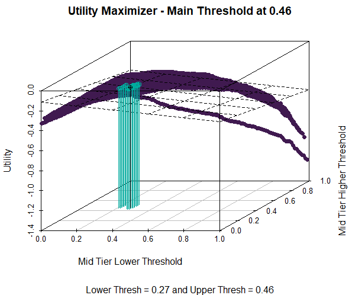


</p>
</details>


## Utilities, EDA, and Misc. Functions: 
<details><summary>click to expand</summary>
<p>
 
##### **AutoWordFreq()** 
<code>AutoWordFreq()</code> creates a word frequency data.table and a word cloud

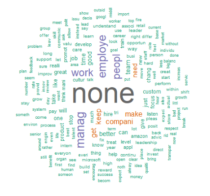

##### **AutoH2OTextPrepScoring()** 
<code>AutoH2OTextPrepScoring()</code> prepares your data for scoring based on models built with AutoWord2VecModel and runs internally inside the AutoH2OScoring() function. It cleans and tokenizes your text data.

##### **ProblematicFeatures()**
<code>ProblematicFeatures()</code> identifies columns that have either little to no variance, categorical variables with extremely high cardinality, too many NA's, too many zeros, or too high of a skew.

##### **RemixTheme()** 
<code>RemixTheme()</code> is a specific font, set of colors, and style for plots.

##### **ChartTheme()** 
<code>ChartTheme()</code> is a specific font, set of colors, and style for plots.

##### **multiplot()** 
<code>multiplot()</code> is useful for displaying multiple plots in a single pane. I've never had luck using grid so I just use this instead.

##### **tokenizeH2O()** 
<code>tokenizeH2O()</code> tokenizes an H2O string column.

##### **percRank()** 
<code>percRank()</code> is an inner function for calibration plots and partial dependence plots. It computes PercentRank for all numeric records in a column.

##### **SimpleCap()** 
<code>SimpleCap()</code> apply proper case to text.

##### **PrintObjectsSize()** 
<code>PrintObjectsSize()</code> prints out environment objects and their respective sizes. Useful for debugging programs.

##### **tempDatesFun()** 
<code>tempDatesFun()</code> is a special case for character conversion to date when importing from Excel.
</p>
</details>

