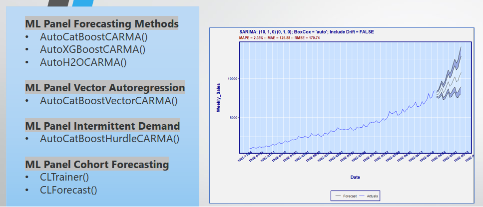

[](https://opensource.org/licenses/MPL-2.0)
[](https://GitHub.com/Naereen/StrapDown.js/graphs/commit-activity)

[](https://GitHub.com/AdrianAntico/RemixAutoML/issues/)
[](http://makeapullrequest.com)


## Background


<details><summary>Expand to view content</summary>
<p>
 
> Automated Machine Learning - In my view, AutoML should consist of functions to help make professional model development and operationalization more efficient. Most ML projects include at least one of the following: data wrangling, feature engineering, feature selection, model development, model evaluation, model interpretation, model optimization, and model operationalization. The functions in this package have been tested across a variety of industries and have consistently out-performd "state of the art" deep learning methods. I've watched coworkers spend months tuning and reconfiguring deep learning models just to have them lose to the functions here, in a matter of a day or two. My recommendation is to first utilize the functions here to establish a legit baseline performance. Then go and test out all the other methods. 

### Package Details
> Supervised Learning - Currently, I'm utilizing CatBoost, XGBoost, and H2O for all of the automated Machine Learning related functions. GPU's can be utilized with CatBoost and XGBoost. Multi-armed bandit grid tuning is available for CatBoost and XGBoost models, which utilize the concept of randomized probability matching, which is detailed in the R pacakge "bandit". 

> Time series forecasting - Automated functions for single series, panel data, vector autoregression, intermittent demand, and cohort panel data. The panel data models utilize the machine learning algos from above and the feature engineering functions below. They are extremely feature rich and the combination of all possible feature settings is huge. The models for individual series are fully optimized versions from the R package "forecast". I utilize the multi-armed bandit grid tuning algo used in the supervised learning models and apply it to the SARIMA and NNETAR models from the forecast package. I also measure performance on hold out data (and training data, or a blend of the two).

> Feature Engineering - Some of the feature engineering functions you can only find in this package, such as the <code>AutoLagRollStats()</code> and <code>AutoLagRollStatsScoring()</code> functions. You could classify the above functions into several buckets: categorical encoding, target encoding, and distributed lag. You can generate any number of discontiguous lags and rolling statistics (mean, sd, skewness, kurtosis, and every 5th percentile) along with time between records and their associated lags and rolling statistics for transactional level data. The function runs extremely fast if you don't utilize rolling stats other than mean (I still use <code>data.table::frollapply()</code> but the data.table guys admit it isn't optimized like the <code>data.table::frollmean()</code> function). Furthermore, you can generate all these features by any number of categorical variables and their interactions PLUS you can request those sets of features to be generated for differnt levels of time aggregations such as transactional, hourly, daily, weekly, monthly, quarterly, and yearly, all in one shot (that is, you do not have to run the function repeatedly to generate the features). Lastly, generating these kinds of time series features on the fly for only a subset of records in a data.table (typically for on-demand model scoring) is not an easy task to do correctly and quickly. However, I spent the time to make it run as fast as I could but I am open to suggestions for making it faster (that goes for any of the functions in RemixAutoML).

> Data Management - Every function here is written with fully-optimized data.table code so they run blazingly fast and are as memory efficient as possible. The current set of machine learning algorithms were chosen for their ability to work with big data and their ability to outperform other models, as demonstrated across a variety of real world use cases. The focus of the package is quality, not quantity.

> Documentation - Each exported function in the package has a help file and can be viewed in your RStudio session, e.g. <code>?RemixAutoML::ModelDataPrep</code>. Many of them come with examples coded up in the help files (at the bottom) that you can run to get a feel for how to set the parameters. There's also a listing of exported functions by category with code examples at the bottom of this readme. You can also jump into the R folder here to dig into the source code. 

</p>
</details>

## Installation

<details><summary>Expand to view content</summary>
<p>

#### 1. First, install R package dependencies: 
XGBoost runs significantly faster with GPU (it's already pretty fast on CPU) but it can be tricky to get installed. The blog below has been shown to be reliable for getting it done.
 [Install XGBoost on Windows for R with GPU Capability](https://medium.com/@karthikdulam/installing-xgboost-gpu-for-r-on-windows-10-7927a65c0ca8)
 
```
# Install Dependencies----
if(!("remotes" %in% rownames(installed.packages()))) install.packages("remotes"); print("remotes")
if(!("arules" %in% rownames(installed.packages()))) install.packages("arules"); print("arules")
if(!("bit64" %in% rownames(installed.packages()))) install.packages("bit64"); print("bit64")
if(!("caTools" %in% rownames(installed.packages()))) install.packages("caTools"); print("caTools")
if(!("combinat" %in% rownames(install.packages()))) install.packages("combinat"); print("combinat")
if(!("data.table" %in% rownames(installed.packages()))) install.packages("data.table"); print("data.table")
if(!("doParallel" %in% rownames(installed.packages()))) install.packages("doParallel"); print("doParallel")
if(!("e1071" %in% rownames(installed.packages()))) install.packages("e1071"); print("e1071")
if(!("fBasics" %in% rownames(installed.packages()))) install.packages("fBasics"); print("fBasics")
if(!("foreach" %in% rownames(installed.packages()))) install.packages("foreach"); print("foreach")
if(!("forecast" %in% rownames(installed.packages()))) install.packages("forecast"); print("forecast")
if(!("fpp" %in% rownames(installed.packages()))) install.packages("fpp"); print("fpp")
if(!("ggplot2" %in% rownames(installed.packages()))) install.packages("ggplot2"); print("ggplot2")
if(!("gridExtra" %in% rownames(installed.packages()))) install.packages("gridExtra"); print("gridExtra")
if(!("here" %in% rownames(installed.packages()))) install.packages("here"); print("here")
if(!("itertools" %in% rownames(installed.packages()))) install.packages("itertools"); print("itertools")
if(!("lime" %in% rownames(installed.packages()))) install.packages("lime"); print("lime")
if(!("lubridate" %in% rownames(installed.packages()))) install.packages("lubridate"); print("lubridate")
if(!("Matrix" %in% rownames(installed.packages()))) install.packages("Matrix"); print("Matrix")
if(!("MLmetrics" %in% rownames(installed.packages()))) install.packages("MLmetrics"); print("MLmetrics")
if(!("monreg" %in% rownames(installed.packages()))) install.packages("monreg"); print("monreg")
if(!("nortest" %in% rownames(installed.packages()))) install.packages("nortest"); print("nortest")
if(!("RColorBrewer" %in% rownames(installed.packages()))) install.packages("RColorBrewer"); print("RColorBrewer")
if(!("recommenderlab" %in% rownames(installed.packages()))) install.packages("recommenderlab"); print("recommenderlab")
if(!("ROCR" %in% rownames(installed.packages()))) install.packages("ROCR"); print("ROCR")
if(!("pROC" %in% rownames(installed.packages()))) install.packages("pROC"); print("pROC")
if(!("Rfast" %in% rownames(installed.packages()))) install.packages("Rfast"); print("Rfast")
if(!("scatterplot3d" %in% rownames(installed.packages()))) install.packages("scatterplot3d"); print("scatterplot3d")
if(!("stringr" %in% rownames(installed.packages()))) install.packages("stringr"); print("stringr")
if(!("sde" %in% rownames(installed.packages()))) install.packages("sde"); print("sde")
if(!("timeDate" %in% rownames(installed.packages()))) install.packages("timeDate"); print("timeDate")
if(!("tsoutliers" %in% rownames(installed.packages()))) install.packages("tsoutliers"); print("tsoutliers")
if(!("wordcloud" %in% rownames(installed.packages()))) install.packages("wordcloud"); print("wordcloud")
if(!("xgboost" %in% rownames(installed.packages()))) install.packages("xgboost"); print("xgboost")
for (pkg in c("RCurl","jsonlite")) if (! (pkg %in% rownames(installed.packages()))) { install.packages(pkg) }
install.packages("h2o", type = "source", repos = (c("http://h2o-release.s3.amazonaws.com/h2o/latest_stable_R")))
remotes::install_github('catboost/catboost', subdir = 'catboost/R-package')
remotes::install_github('AdrianAntico/RemixAutoML', upgrade = FALSE, dependencies = FALSE, force = TRUE)
```

### Installation Troubleshooting 
The most common issue some users are having when trying to install <code>RemixAutoML</code> is the installation of the <code>catboost</code> package dependency. Since <code>catboost</code> is not on CRAN it can only be installed through GitHub. To install <code>catboost</code> without error (and consequently install <code>RemixAutoML</code> without error), try running this line of code first, then restart your R session, then re-run the 2-step installation process above. (<a href="https://github.com/catboost/catboost/issues/612" target="_blank">Reference</a>):
If you're still having trouble submit an issue and I'll work with you to get it installed.

```
# Be sure to use the version you want versus what is listed below
options(devtools.install.args = c("--no-multiarch", "--no-test-load"))
install.packages("https://github.com/catboost/catboost/releases/download/v0.17.3/catboost-R-Windows-0.17.3.tgz", repos = NULL, type = "source", INSTALL_opts = c("--no-multiarch", "--no-test-load"))
```
 
If you're having still having trouble installing see if the issue below helps out:


</p>
</details>

## Common Workflows

<details><summary>Expand to view content</summary>
<p>

### Supervised Learning
#### An example workflow with function references
<details><summary>Expand to view content</summary>
<p>
 
1. Pull in data from your data warehouse (or from wherever) and clean it up
2. Run all the applicable feature engineering functions, such as <code>AutoLagRollStats()</code>, <code>AutoWord2VecModeler()</code>, <code>CreateCalendarVariables()</code>, <code>CreateHolidayVariables()</code>, etc.
3. Partition your data with <code>AutoDataPartition()</code> if you want to go with a data split other than 70/20/10, which is automatically applied in the supervised learning functions if you don't supply the ValidationData and TestData (and TrainOnFull is set to FALSE).
4. Run <code>AutoCatBoostRegression()</code> or <code>AutoCatBoostClassifier()</code> or <code>AutoCatBoostMultiClass()</code> with GPU if you have access to one
5. Run <code>AutoXGBoostRegression()</code> or <code>AutoXGBoostClassifier()</code> or <code>AutoXGBoostMultiClass()</code> with GPU if you have access to one
6. Run <code>AutoH2oGBMRegression()</code> or <code>AutoH2oGBMClassifier()</code> or <code>AutoH2oGBMMultiClass()</code> if you have the patience to wait for a CPU build.
7. Run <code>AutoH2oGLMRegression()</code> or <code>AutoH2oGLMClassifier()</code> or <code>AutoH2oGLMMultiClass()</code> if you want to give a generalized linear model a shot.
8. Run <code>AutoH2oMLRegression()</code> or <code>AutoH2oMLClassifier()</code> or <code>AutoH2oMLMultiClass()</code> to run H2O's AutoML function inside the RemixAutoML framework.
9. Run <code>AutoH2oDRFRegression()</code> or <code>AutoH2oDRFClassifier()</code> or <code>AutoH2oDRFMultiClass()</code> H2O's Distributed Random Forest can take a really long time to build. H2O's documentation has a great explanation for the reason why it takes much longer compared to their GBM algo.
10. Investigate model performance contained in the output object returned by those functions. You will be able to look at model calibration plots or box plots, ROC plots, partial depence calibration plots or boxplots, model metrics, etc.
12. If you ran one of the <code>Auto__Classifer()</code> function supply the validation to the function <code>RemixClassificationMetrics()</code> for an exhaustive threshold analysis
12. Pick your model of choice and kick off an extended grid tuning and figure out something else to do that week (or run it over the weekend). 
13. Compare your results with your coworkers results and see what's working and what isn't. Then you can either move on or continue exploring. Bargain with your boss to get that time to explore so you can learn new things.

</p>
</details>

### Forecasting
#### Single series and panel data using Time Series models or Machine Learning models

<details><summary>Expand to view content</summary>
<p>
 
Supply a data.table to run the functions below:
1. For single series check out <code>AutoBanditSarima()</code>, <code>AutoBanditNNet()</code>, <code>AutoTBATS()</code>, 
<code>AutoETS()</code>, <code>AutoArfima()</code>, or <code>AutoTS()</code> (older function; no longer developing)
2. For panel data OR single series check out <code>AutoCatBoostCARMA()</code>, <code>AutoXGBoostCARMA()</code>, <code>AutoH2OCARMA()</code>,<code>AutoCatBoostHurdleCARMA</code> or <code>AutoCatBoostVectorCARMA</code> or build a loop and run functions from (1)
3. If you have to do any funnel forecasting, check out AutoCatBoostChainLadder(). First you need to structure you data like the help example. When you think you have found a good configuration, set the parameter SaveModelObjects = TRUE. Then you can run the AutoMLChainLadderForecasting(). 

</p>
</details>

</p>
</details>

## RemixAutoML Blogs

<details><summary>Expand to view content</summary>
<p>
 
[The Most Feature Rich ML Forecasting Methods Available](https://adrianantico.medium.com/the-most-feature-rich-ml-forecasting-methods-available-compliments-of-remixautoml-61b53daf42e6)

[AutoML Frameworks in R & Python](https://iamnagdev.com/2020/04/01/automl-frameworks-in-r-python/)

[AI for Small to Medium Size Businesses: A Management Take On The Challenges...](https://www.remixinstitute.com/blog/business-ai-for-small-to-medium-sized-businesses-with-remixautoml/#.XX-lD2ZlD8A)

[Why Machine Learning is more Practical than Econometrics in the Real World](https://medium.com/@adrianantico/machine-learning-vs-econometrics-in-the-real-world-4058095b1013)

[Build Thousands of Automated Demand Forecasts in 15 Minutes Using AutoCatBoostCARMA in R](https://www.remixinstitute.com/blog/automated-demand-forecasts-using-autocatboostcarma-in-r/#.XUIO1ntlCDM)

[Automate Your KPI Forecasts With Only 1 Line of R Code Using AutoTS](https://www.remixinstitute.com/blog/automate-your-kpi-forecasts-with-only-1-line-of-r-code-using-autots/#.XUIOr3tlCDM)

[Companies Are Demanding Model Interpretability. Here’s How To Do It Right](https://www.remixinstitute.com/blog/companies-are-demanding-model-interpretability-heres-how-to-do-it-right/#.XUIN1HtlCDM)

[The Easiest Way to Create Thresholds And Improve Your Classification Model](https://www.remixinstitute.com/blog/the-easiest-way-to-create-thresholds-and-improve-your-classification-model/#.XUINVntlCDM)

</p>
</details>


## Feature Engineering 
<details><summary>Expand to view content</summary>
<p>

#### **AutoLagRollStats()** and **AutoLagRollStatsScoring()**

<details><summary>Code Example</summary>
<p>

```
# Create fake Panel Data----
Count <- 1L
for(Level in LETTERS) {
  datatemp <- RemixAutoML::FakeDataGenerator(
    Correlation = 0.75,
    N = 25000L,
    ID = 0L,
    ZIP = 0L,
    FactorCount = 0L,
    AddDate = TRUE,
    Classification = FALSE,
    MultiClass = FALSE)
  datatemp[, Factor1 := eval(Level)]
  if(Count == 1L) {
    data <- data.table::copy(datatemp)
  } else {
    data <- data.table::rbindlist(list(data, data.table::copy(datatemp)))
  }
  Count <- Count + 1L
}

# Add scoring records
data <- RemixAutoML::AutoLagRollStats(

  # Data
  data                 = data,
  DateColumn           = "DateTime",
  Targets              = "Adrian",
  HierarchyGroups      = NULL,
  IndependentGroups    = c("Factor1"),
  TimeUnitAgg          = "days",
  TimeGroups           = c("days", "weeks", "months", "quarters"),
  TimeBetween          = NULL,
  TimeUnit             = "days",

  # Services
  RollOnLag1           = TRUE,
  Type                 = "Lag",
  SimpleImpute         = TRUE,

  # Calculated Columns
  Lags                 = list("days" = c(seq(1,5,1)), "weeks" = c(seq(1,3,1)), "months" = c(seq(1,2,1)), "quarters" = c(seq(1,2,1))),
  MA_RollWindows       = list("days" = c(seq(1,5,1)), "weeks" = c(seq(1,3,1)), "months" = c(seq(1,2,1)), "quarters" = c(seq(1,2,1))),
  SD_RollWindows       = NULL,
  Skew_RollWindows     = NULL,
  Kurt_RollWindows     = NULL,
  Quantile_RollWindows = NULL,
  Quantiles_Selected   = NULL,
  Debug                = FALSE)
```

</p>
</details>

<details><summary>Code Example</summary>
<p>

```
# Create fake Panel Data----
Count <- 1L
for(Level in LETTERS) {
  datatemp <- RemixAutoML::FakeDataGenerator(
    Correlation = 0.75,
    N = 25000L,
    ID = 0L,
    ZIP = 0L,
    FactorCount = 0L,
    AddDate = TRUE,
    Classification = FALSE,
    MultiClass = FALSE)
  datatemp[, Factor1 := eval(Level)]
  if(Count == 1L) {
    data <- data.table::copy(datatemp)
  } else {
    data <- data.table::rbindlist(list(data, data.table::copy(datatemp)))
  }
  Count <- Count + 1L
}

# Create ID columns to know which records to score
data[, ID := .N:1L, by = "Factor1"]
data.table::set(data, i = which(data[["ID"]] == 2L), j = "ID", value = 1L)

# Score records
data <- RemixAutoML::AutoLagRollStatsScoring(

  # Data
  data                 = data,
  RowNumsID            = "ID",
  RowNumsKeep          = 1,
  DateColumn           = "DateTime",
  Targets              = "Adrian",
  HierarchyGroups      = c("Store","Dept"),
  IndependentGroups    = NULL,

  # Services
  TimeBetween          = NULL,
  TimeGroups           = c("days", "weeks", "months"),
  TimeUnit             = "day",
  TimeUnitAgg          = "day",
  RollOnLag1           = TRUE,
  Type                 = "Lag",
  SimpleImpute         = TRUE,

  # Calculated Columns
  Lags                  = list("days" = c(seq(1,5,1)), "weeks" = c(seq(1,3,1)), "months" = c(seq(1,2,1))),
  MA_RollWindows        = list("days" = c(seq(1,5,1)), "weeks" = c(seq(1,3,1)), "months" = c(seq(1,2,1))),
  SD_RollWindows        = list("days" = c(seq(1,5,1)), "weeks" = c(seq(1,3,1)), "months" = c(seq(1,2,1))),
  Skew_RollWindows      = list("days" = c(seq(1,5,1)), "weeks" = c(seq(1,3,1)), "months" = c(seq(1,2,1))),
  Kurt_RollWindows      = list("days" = c(seq(1,5,1)), "weeks" = c(seq(1,3,1)), "months" = c(seq(1,2,1))),
  Quantile_RollWindows  = list("days" = c(seq(1,5,1)), "weeks" = c(seq(1,3,1)), "months" = c(seq(1,2,1))),
  Quantiles_Selected    = c("q5","q10","q95"),
  Debug                 = FALSE)
```

</p>
</details>

<details><summary>Function Description</summary>
<p>
 
<code>AutoLagRollStats()</code> builds lags and rolling statistics by grouping variables and their interactions along with multiple different time aggregations if selected. Rolling stats include mean, sd, skewness, kurtosis, and the 5th - 95th percentiles. This function was inspired by the distributed lag modeling framework but I wanted to use it for time series analysis as well and really generalize it as much as possible. The beauty of this function is inspired by analyzing whether a baseball player will get a basehit or more in his next at bat. One easy way to get a better idea of the likelihood is to look at his batting average and his career batting average. However, players go into hot streaks and slumps. How do we account for that? Well, in comes the functions here. You look at the batting average over the last N to N+x at bats, for various N and x. I keep going though - I want the same windows for calculating the players standard deviation, skewness, kurtosis, and various quantiles over those time windows. I also want to look at all those measure but by using weekly data - as in, over the last N weeks, pull in those stats too. 

<code>AutoLagRollStatsScoring()</code> builds the above features for a partial set of records in a data set. The function is extremely useful as it can compute these feature vectors at a significantly faster rate than the non scoring version which comes in handy for scoring ML models. If you can find a way to make it faster, let me know.

</p>
</details>

#### **AutoInteraction()**

<details><summary>Code Example</summary>
<p>

```
#########################################
# Feature Engineering for Model Training
#########################################

# Create fake data
data <- RemixAutoML::FakeDataGenerator(
  Correlation = 0.70,
  N = 50000,
  ID = 2L,
  FactorCount = 2L,
  AddDate = TRUE,
  ZIP = 0L,
  TimeSeries = FALSE,
  ChainLadderData = FALSE,
  Classification = FALSE,
  MultiClass = FALSE)

# Print number of columns
print(ncol(data))

# Store names of numeric and integer cols
Cols <-names(data)[c(which(unlist(lapply(data, is.numeric))),
                     which(unlist(lapply(data, is.integer))))]

# Model Training Feature Engineering
system.time(data <- RemixAutoML::AutoInteraction(
  data = data,
  NumericVars = Cols,
  InteractionDepth = 4,
  Center = TRUE,
  Scale = TRUE,
  SkipCols = NULL,
  Scoring = FALSE,
  File = getwd()))

# user  system elapsed
# 3.29    0.81    4.13

# Print number of columns
print(ncol(data))
# 16

########################################
# Feature Engineering for Model Scoring
########################################

# Create fake data
data <- RemixAutoML::FakeDataGenerator(
  Correlation = 0.70,
  N = 50000,
  ID = 2L,
  FactorCount = 2L,
  AddDate = TRUE,
  ZIP = 0L,
  TimeSeries = FALSE,
  ChainLadderData = FALSE,
  Classification = FALSE,
  MultiClass = FALSE)

# Print number of columns
print(ncol(data))
# 16

# Reduce to single row to mock a scoring scenario
data <- data[1L]

# Model Scoring Feature Engineering
system.time(data <- RemixAutoML::AutoInteraction(
  data = data,
  NumericVars = names(data)[
    c(which(unlist(lapply(data, is.numeric))),
      which(unlist(lapply(data, is.integer))))],
  InteractionDepth = 4,
  Center = TRUE,
  Scale = TRUE,
  SkipCols = NULL,
  Scoring = TRUE,
  File = file.path(getwd(), "Standardize.Rdata")))

# user  system elapsed
# 0.19    0.00    0.19

# Print number of columns
print(ncol(data))
# 1095
```

</p>
</details>

<details><summary>Function Description</summary>
<p>

<code>AutoInteraction()</code> will build out any number of interactions you want for numeric variables. You supply a character vector of numeric or integer column names, along with the names of any numeric columns you want to skip (including the interaction column names) and the interactions will be automatically created for you. For example, if you want a 4th degree interaction from 10 numeric columns, you will have 10 C 2, 10 C 3, and 10 C 4 columns created. Now, let's say you build all those features and decide you don't want all 10 features to be included. Remove the feature name from the NumericVars character vector. Now, let's say you modeled all of the interaction features and want to remove the ones will the lowest scores on the variable importance list. Grab the names and run the interaction function again except this time supply those poor performing interaction column names to the SkipCols argument and they will be ignored. Now, if you want to interact any categorical variable with a numeric variable, you'll have to dummify the categorical variable first and then include the level specific dummy variable column names to the NumericVars character vector argument. If you set Center and Scale to TRUE then the interaction multiplication won't create huge numbers.

</p>
</details>

##### **AutoWord2VecModeler()**

<details><summary>Function Description</summary>
<p>
 
<code>AutoWord2VecModeler()</code> generates a specified number of vectors (word2vec) for each column of text data in your data set that you specify and it will save the models if you specify for re-creating them later in a model scoring process. You can choose to build individual models for each column or one model for all your columns. If you need to run several models for groups of text variables you can run the function several times. 

</p>
</details>

##### **CreateCalendarVariables()**

<details><summary>Code Example</summary>
<p>

```
# Create fake data with a Date column----
data <- RemixAutoML::FakeDataGenerator(
  Correlation = 0.75,
  N = 25000L,
  ID = 2L,
  ZIP = 0L,
  FactorCount = 4L,
  AddDate = TRUE,
  Classification = FALSE,
  MultiClass = FALSE)
for(i in seq_len(20L)) {
  print(i)
  data <- data.table::rbindlist(list(data, RemixAutoML::FakeDataGenerator(
    Correlation = 0.75,
    N = 25000L,
    ID = 2L,
    ZIP = 0L,
    FactorCount = 4L,
    AddDate = TRUE,
    Classification = FALSE,
    MultiClass = FALSE)))
}

# Create calendar variables - automatically excludes the second, minute, and hour selections since
#   it is not timestamp data
runtime <- system.time(
  data <- RemixAutoML::CreateCalendarVariables(
    data = data,
    DateCols = "DateTime",
    AsFactor = FALSE,
    TimeUnits = c("second", "minute", "hour", "wday", "mday", "yday", "week", "isoweek", "wom", "month", "quarter", "year")))
head(data)
print(runtime)
```

</p>
</details>

<details><summary>Function Description</summary>
<p>
 
<code>CreateCalendarVariables()</code> This functions creates numerical columns based on the date columns you supply such as second, minute, hour, week day, day of month, day of year, week, isoweek, wom, month, quarter, and year.

</p>
</details>

##### **CreateHolidayVariable()**

<details><summary>Code Example</summary>
<p>
 
```
# Create fake data with a Date----
data <- RemixAutoML::FakeDataGenerator(
  Correlation = 0.75,
  N = 25000L,
  ID = 2L,
  ZIP = 0L,
  FactorCount = 4L,
  AddDate = TRUE,
  Classification = FALSE,
  MultiClass = FALSE)
for(i in seq_len(20L)) {
  print(i)
  data <- data.table::rbindlist(list(data, RemixAutoML::FakeDataGenerator(
    Correlation = 0.75,
    N = 25000L,
    ID = 2L,
    ZIP = 0L,
    FactorCount = 4L,
    AddDate = TRUE,
    Classification = FALSE,
    MultiClass = FALSE)))
}
# Run function and time it
runtime <- system.time(
  data <- CreateHolidayVariables(
    data,
    DateCols = "DateTime",
    HolidayGroups = c("USPublicHolidays","EasterGroup","ChristmasGroup","OtherEcclesticalFeasts"),
    Holidays = NULL,
    GroupingVars = c("Factor_1","Factor_2","Factor_3","Factor_4"),
    Print = FALSE))
head(data)
print(runtime)
```

</p>
</details>

<details><summary>Function Description</summary>
<p>
 
<code>CreateHolidayVariable()</code> 
This function counts up the number of specified holidays between the current record time stamp and the previous record time stamp, by group as well if specified.

</p>
</details>

##### **AutoHierarchicalFourier()**

<details><summary>Function Description</summary>
<p>
 
<code>AutoHierarchicalFourier()</code> turns time series data into fourier series. This function can generate any number of fourier pairs the user wants (if they can actually build) and you can run it with grouped time series data. In the grouping case, fourier pairs can be created for each categorical variable along with the full interactions between specified categoricals. The process is parallelized as well to run as fast as possible.

</p>
</details>

##### **AutoTransformationCreate()** and **AutoTransformationScore()**

<details><summary>Descriptions</summary>
<p>
 
<code>AutoTransformationCreate()</code> is a function for automatically identifying the optimal transformations for numeric features and transforming them once identified. This function will loop through your selected transformation options (YeoJohnson, BoxCox, Asinh, Log, LogPlus1, Sqrt, along with Asin and Logit for proportion data) and find the one that produces the best fit to a normal distribution. It then generates the transformation and collects the metadata information for use in the AutoTransformationScore() function, either by returning the objects or saving them to file.

<code>AutoTransformationScore()</code> is a the compliment function to AutoTransformationCreate(). Automatically apply or inverse the transformations you identified in AutoTransformationCreate() to other data sets. This is useful for applying transformations to your validation and test data sets for modeling, which is done automatically for you if you specify.

</p>
</details>

##### **ModelDataPrep()**

<details><summary>Code Example</summary>
<p>
 
```
# Create fake data
data <- RemixAutoML::FakeDataGenerator(
  Correlation = 0.75,
  N = 250000L,
  ID = 2L,
  ZIP = 0L,
  FactorCount = 6L,
  AddDate = TRUE,
  Classification = FALSE,
  MultiClass = FALSE)

# Check column types
str(data)

# Convert some factors to character
data <- RemixAutoML::ModelDataPrep(
  data,
  Impute       = TRUE,
  CharToFactor = FALSE,
  FactorToChar = TRUE,
  IntToNumeric = TRUE,
  DateToChar   = FALSE,
  RemoveDates  = TRUE,
  MissFactor   = "0",
  MissNum      = -1,
  IgnoreCols   = c("Factor_1"))

# Check column types
str(data)
```

</p>
</details>

<details><summary>Function Description</summary>
<p>

<code>ModelDataPrep()</code> This function will loop through every column in your data and apply a variety of functions based on argument settings. For all columns not ignored, these tasks include:
* Character type to Factor type converstion
* Factor type to Character type conversion
* Constant value imputation for numeric and categorical columns
* Integer type to Numeric type conversion
* Date type to Character type conversion
* Remove date columns
* Ignore specified columns

</p>
</details>

##### **DummifyDT()** 

<details><summary>Code Example</summary>
<p>

```
# Create fake data with 10 categorical columns
data <- RemixAutoML::FakeDataGenerator(
  Correlation = 0.85, 
  N = 25000, 
  ID = 2L, 
  ZIP = 0, 
  FactorCount = 10L,
  AddDate = FALSE, 
  Classification = FALSE, 
  MultiClass = FALSE)

# Create dummy variables
data <- RemixAutoML::DummifyDT(
  data = data,
  cols = c("Factor_1",
           "Factor_2",
           "Factor_3",
           "Factor_4",
           "Factor_5",
           "Factor_6",
           "Factor_8",
           "Factor_9",
           "Factor_10"),
  KeepFactorCols = FALSE,
  OneHot = FALSE,
  SaveFactorLevels = FALSE,
  SavePath = normalizePath("./"),
  ImportFactorLevels = FALSE,
  FactorLevelsList = NULL,
  ClustScore = FALSE,
  ReturnFactorLevels = FALSE)
```

</p>
</details>

<details><summary>Function Description</summary>
<p>

<code>DummifyDT()</code> This function is used in the AutoXGBoost__() suite of modeling functions to manage categorical variables in your training, validation, and test sets. This function rapidly dichotomizes categorical columns in a data.table (N+1 columns for N levels using one hot encoding or N columns for N levels otherwise). Several other arguments exist for outputting and saving factor levels. This is useful in model training, validating, and scoring processes.

</p>
</details>

##### **DifferenceData()**

<details><summary>Function Description</summary>
<p>
 
<code>DifferenceData()</code> Create differences in your data (y1 - y0) for grouped or non-grouped data. 

</p>
</details>

##### **DifferenceDataReverse()**

<details><summary>Function Description</summary>
<p>
 
<code>DifferenceDataReverse()</code> Reverses the differences in your data for grouped or non-grouped data. 

</p>
</details>

##### **AutoDataPartition()**

<details><summary>Code Example</summary>
<p>

```
# Create fake data
data <- RemixAutoML::FakeDataGenerator(
  Correlation = 0.85, 
  N = 1000, 
  ID = 2, 
  ZIP = 0, 
  AddDate = FALSE, 
  Classification = FALSE, 
  MultiClass = FALSE)

# Run data partitioning function
dataSets <- RemixAutoML::AutoDataPartition(
  data,
  NumDataSets = 3L,
  Ratios = c(0.70,0.20,0.10),
  PartitionType = "random",
  StratifyColumnNames = NULL,
  StratifyNumericTarget = NULL,
  StratTargetPrecision = 1L,
  TimeColumnName = NULL)

# Collect data
TrainData <- dataSets$TrainData
ValidationData <- dataSets$ValidationData
TestData <- dataSets$TestData
```

</p>
</details>

<details><summary>Function Description</summary>
<p>

<code>AutoDataPartition()</code> is designed to achieve a few things that standard data partitioning processes or functions don't handle. First, you can choose to build any number of partitioned data sets beyond the standard train, validate, and test data sets. Second, you can choose between random sampling to split your data or you can choose a time-based partitioning. Third, for the random partitioning, you can specify a stratification columns in your data to stratify by in order to ensure a proper split amongst your categorical features (E.g. think MultiClass targets). Lastly, it's 100% data.table so it will run fast and with low memory overhead.

</p>
</details>

</p>
</details>

## Supervised Learning 
<details><summary>Expand to view content</summary> 
<p>
  
#### Regression
____________________________________________________________________________________________________________________________________________
<details><summary>click to expand</summary>
<p>
  
##### **AutoCatBoostRegression()** GPU Capable
<code>AutoCatBoostRegression()</code> utilizes the CatBoost algorithm in the below steps

<details><summary>Code Example</summary>
<p>
 
 ```
# Create some dummy correlated data
data <- RemixAutoML::FakeDataGenerator(
  Correlation = 0.85,
  N = 10000,
  ID = 2,
  ZIP = 0,
  AddDate = FALSE,
  Classification = FALSE,
  MultiClass = FALSE)

# Run function
TestModel <- RemixAutoML::AutoCatBoostRegression(

    # GPU or CPU and the number of available GPUs
    task_type = "GPU",
    NumGPUs = 1,

    # Metadata args
    ModelID = "Test_Model_1",
    model_path = normalizePath("./"),
    metadata_path = normalizePath("./"),
    SaveModelObjects = FALSE,
    SaveInfoToPDF = FALSE,
    ReturnModelObjects = TRUE,

    # Data args
    data = data,
    TrainOnFull = FALSE,
    ValidationData = NULL,
    TestData = NULL,
    Weights = NULL,
    TargetColumnName = "Adrian",
    FeatureColNames = names(data)[!names(data) %in%
      c("IDcol_1", "IDcol_2","Adrian")],
    PrimaryDateColumn = NULL,
    DummifyCols = FALSE,
    IDcols = c("IDcol_1","IDcol_2"),
    TransformNumericColumns = "Adrian",
    Methods = c("BoxCox", "Asinh", "Asin", "Log",
      "LogPlus1", "Sqrt", "Logit", "YeoJohnson"),

    # Model evaluation
    eval_metric = "RMSE",
    eval_metric_value = 1.5,
    loss_function = "RMSE",
    loss_function_value = 1.5,
    MetricPeriods = 10L,
    NumOfParDepPlots = ncol(data)-1L-2L,
    EvalPlots = TRUE,

    # Grid tuning args
    PassInGrid = NULL,
    GridTune = FALSE,
    MaxModelsInGrid = 30L,
    MaxRunsWithoutNewWinner = 20L,
    MaxRunMinutes = 60*60,
    Shuffles = 4L,
    BaselineComparison = "default",

    # ML args
    langevin = FALSE,
    diffusion_temperature = 10000,
    Trees = 1000,
    Depth = 6,
    L2_Leaf_Reg = 3.0,
    RandomStrength = 1,
    BorderCount = 128,
    LearningRate = NULL,
    RSM = 1,
    BootStrapType = NULL,
    GrowPolicy = "SymmetricTree",
    model_size_reg = 0.5,
    feature_border_type = "GreedyLogSum",
    sampling_unit = "Group",
    subsample = NULL,
    score_function = "Cosine",
    min_data_in_leaf = 1)

 # Output
 TestModel$Model
 TestModel$ValidationData
 TestModel$EvaluationPlot
 TestModel$EvaluationBoxPlot
 TestModel$EvaluationMetrics
 TestModel$VariableImportance
 TestModel$InteractionImportance
 TestModel$ShapValuesDT
 TestModel$VI_Plot
 TestModel$PartialDependencePlots
 TestModel$PartialDependenceBoxPlots
 TestModel$GridList
 TestModel$ColNames
 TestModel$TransformationResults
 ```
 
</p>
</details> 

##### **AutoXGBoostRegression()** GPU Capable
<code>AutoXGBoostRegression()</code> utilizes the XGBoost algorithm in the below steps 

<details><summary>Code Example</summary>
<p>
 
```
#' # Create some dummy correlated data
#' data <- RemixAutoML::FakeDataGenerator(
#'   Correlation = 0.85,
#'   N = 1000,
#'   ID = 2,
#'   ZIP = 0,
#'   AddDate = FALSE,
#'   Classification = FALSE,
#'   MultiClass = FALSE)
#'
#' # Run function
#' TestModel <- RemixAutoML::AutoXGBoostRegression(
#'
#'     # GPU or CPU
#'     TreeMethod = "hist",
#'     NThreads = parallel::detectCores(),
#'     LossFunction = 'reg:squarederror',
#'
#'     # Metadata args
#'     model_path = normalizePath("./"),
#'     metadata_path = NULL,
#'     ModelID = "Test_Model_1",
#'     ReturnFactorLevels = TRUE,
#'     ReturnModelObjects = TRUE,
#'     SaveModelObjects = FALSE,
#'
#'     # Data args
#'     data = data,
#'     TrainOnFull = FALSE,
#'     ValidationData = NULL,
#'     TestData = NULL,
#'     TargetColumnName = "Adrian",
#'     FeatureColNames = names(data)[!names(data) %in%
#'       c("IDcol_1", "IDcol_2","Adrian")],
#'     IDcols = c("IDcol_1","IDcol_2"),
#'     TransformNumericColumns = NULL,
#'     Methods = c("BoxCox", "Asinh", "Asin", "Log",
#'       "LogPlus1", "Sqrt", "Logit", "YeoJohnson"),
#'
#'     # Model evaluation args
#'     eval_metric = "rmse",
#'     NumOfParDepPlots = 3L,
#'
#'     # Grid tuning args
#'     PassInGrid = NULL,
#'     GridTune = FALSE,
#'     grid_eval_metric = "mse",
#'     BaselineComparison = "default",
#'     MaxModelsInGrid = 10L,
#'     MaxRunsWithoutNewWinner = 20L,
#'     MaxRunMinutes = 24L*60L,
#'     Verbose = 1L,
#'
#'     # ML args
#'     Shuffles = 1L,
#'     Trees = 50L,
#'     eta = 0.05,
#'     max_depth = 4L,
#'     min_child_weight = 1.0,
#'     subsample = 0.55,
#'     colsample_bytree = 0.55)
```
 
</p>
</details> 

##### **AutoH2oGBMRegression()**
<code>AutoH2oGBMRegression()</code> utilizes the H2O Gradient Boosting algorithm in the below steps 

<details><summary>Code Example</summary>
<p>

```
# Create some dummy correlated data
data <- RemixAutoML::FakeDataGenerator(
  Correlation = 0.85,
  N = 1000,
  ID = 2,
  ZIP = 0,
  AddDate = FALSE,
  Classification = FALSE,
  MultiClass = FALSE)

# Run function
TestModel <- RemixAutoML::AutoH2oGBMRegression(

    # Compute management
    MaxMem = {gc();paste0(as.character(floor(as.numeric(system("awk '/MemFree/ {print $2}' /proc/meminfo", intern=TRUE)) / 1000000)),"G")},
    NThreads = max(1, parallel::detectCores()-2),
    H2OShutdown = TRUE,
    H2OStartUp = TRUE,
    IfSaveModel = "mojo",

    # Model evaluation
    NumOfParDepPlots = 3,

    # Metadata arguments:
    model_path = normalizePath("./"),
    metadata_path = file.path(normalizePath("./")),
    ModelID = "FirstModel",
    ReturnModelObjects = TRUE,
    SaveModelObjects = FALSE,
    SaveInfoToPDF = FALSE,

    # Data arguments
    data = data,
    TrainOnFull = FALSE,
    ValidationData = NULL,
    TestData = NULL,
    TargetColumnName = "Adrian",
    FeatureColNames = names(data)[!names(data) %in% c("IDcol_1", "IDcol_2","Adrian")],
    WeightsColumn = NULL,
    TransformNumericColumns = NULL,
    Methods = c("BoxCox", "Asinh", "Asin", "Log", "LogPlus1", "Sqrt", "Logit","YeoJohnson"),

    # ML grid tuning args
    GridTune = FALSE,
    GridStrategy = "Cartesian",
    MaxRuntimeSecs = 60*60*24,
    StoppingRounds = 10,
    MaxModelsInGrid = 2,

    # Model args
    Trees = 50,
    LearnRate = 0.10,
    LearnRateAnnealing = 1,
    eval_metric = "RMSE",
    Alpha = NULL,
    Distribution = "poisson",
    MaxDepth = 20,
    SampleRate = 0.632,
    ColSampleRate = 1,
    ColSampleRatePerTree = 1,
    ColSampleRatePerTreeLevel  = 1,
    MinRows = 1,
    NBins = 20,
    NBinsCats = 1024,
    NBinsTopLevel = 1024,
    HistogramType = "AUTO",
    CategoricalEncoding = "AUTO")
```
 
</p>
</details> 

##### **AutoH2oDRFRegression()**
<code>AutoH2oDRFRegression()</code> utilizes the H2o Distributed Random Forest algorithm in the below steps 

<details><summary>Code Example</summary>
<p>
 
```
# Create some dummy correlated data
data <- RemixAutoML::FakeDataGenerator(
  Correlation = 0.85,
  N = 1000,
  ID = 2,
  ZIP = 0,
  AddDate = FALSE,
  Classification = FALSE,
  MultiClass = FALSE)

# Run function
TestModel <- RemixAutoML::AutoH2oDRFRegression(

    # Compute management
    MaxMem = {gc();paste0(as.character(floor(as.numeric(system("awk '/MemFree/ {print $2}' /proc/meminfo", intern=TRUE)) / 1000000)),"G")},
    NThreads = max(1L, parallel::detectCores() - 2L),
    H2OShutdown = TRUE,
    H2OStartUp = TRUE,
    IfSaveModel = "mojo",

    # Model evaluation:
    eval_metric = "RMSE",
    NumOfParDepPlots = 3,

    # Metadata arguments:
    model_path = normalizePath("./"),
    metadata_path = NULL,
    ModelID = "FirstModel",
    ReturnModelObjects = TRUE,
    SaveModelObjects = FALSE,
    SaveInfoToPDF = FALSE,

    # Data Args
    data = data,
    TrainOnFull = FALSE,
    ValidationData = NULL,
    TestData = NULL,
    TargetColumnName = "Adrian",
    FeatureColNames = names(data)[!names(data) %in% c("IDcol_1", "IDcol_2","Adrian")],
    WeightsColumn = NULL,
    TransformNumericColumns = NULL,
    Methods = c("BoxCox", "Asinh", "Asin", "Log", "LogPlus1", "Sqrt", "Logit", "YeoJohnson"),

    # Grid Tuning Args
    GridStrategy = "Cartesian",
    GridTune = FALSE,
    MaxModelsInGrid = 10,
    MaxRuntimeSecs = 60*60*24,
    StoppingRounds = 10,

    # ML Args
    Trees = 50,
    MaxDepth = 20,
    SampleRate = 0.632,
    MTries = -1,
    ColSampleRatePerTree = 1,
    ColSampleRatePerTreeLevel = 1,
    MinRows = 1,
    NBins = 20,
    NBinsCats = 1024,
    NBinsTopLevel = 1024,
    HistogramType = "AUTO",
    CategoricalEncoding = "AUTO")
```
 
</p>
</details> 

##### **AutoH2oGLMRegression()**
<code>AutoH2oGLMRegression()</code> utilizes the H2o generalized linear model algorithm in the below steps 

<details><summary>Code Example</summary>
<p>
 
```
# Create some dummy correlated data
data <- RemixAutoML::FakeDataGenerator(
  Correlation = 0.85,
  N = 1000,
  ID = 2,
  ZIP = 0,
  AddDate = FALSE,
  Classification = FALSE,
  MultiClass = FALSE)

# Run function
TestModel <- RemixAutoML::AutoH2oGLMRegression(

    # Compute management
    MaxMem = {gc();paste0(as.character(floor(as.numeric(system("awk '/MemFree/ {print $2}' /proc/meminfo", intern=TRUE)) / 1000000)),"G")},
    NThreads = max(1, parallel::detectCores()-2),
    H2OShutdown = TRUE,
    H2OStartUp = TRUE,
    IfSaveModel = "mojo",

    # Model evaluation:
    eval_metric = "RMSE",
    NumOfParDepPlots = 3,

    # Metadata arguments:
    model_path = NULL,
    metadata_path = NULL,
    ModelID = "FirstModel",
    ReturnModelObjects = TRUE,
    SaveModelObjects = FALSE,
    SaveInfoToPDF = FALSE,

    # Data arguments:
    data = data,
    TrainOnFull = FALSE,
    ValidationData = NULL,
    TestData = NULL,
    TargetColumnName = "Adrian",
    FeatureColNames = names(data)[!names(data) %in% c("IDcol_1", "IDcol_2","Adrian")],
    RandomColNumbers = NULL,
    InteractionColNumbers = NULL,
    WeightsColumn = NULL,
    TransformNumericColumns = NULL,
    Methods = c("BoxCox", "Asinh", "Asin", "Log", "LogPlus1", "Sqrt", "Logit", "YeoJohnson"),

    # Model args
    GridTune = FALSE,
    GridStrategy = "Cartesian",
    StoppingRounds = 10,
    MaxRunTimeSecs = 3600 * 24 * 7,
    MaxModelsInGrid = 10,
    Distribution = "gaussian",
    Link = "identity",
    TweedieLinkPower = NULL,
    TweedieVariancePower = NULL,
    RandomDistribution = NULL,
    RandomLink = NULL,
    Solver = "AUTO",
    Alpha = NULL,
    Lambda = NULL,
    LambdaSearch = FALSE,
    NLambdas = -1,
    Standardize = TRUE,
    RemoveCollinearColumns = FALSE,
    InterceptInclude = TRUE,
    NonNegativeCoefficients = FALSE)
```
 
</p>
</details> 

##### **AutoH2oMLRegression()**
<code>AutoH2oMLRegression()</code> utilizes the H2o AutoML algorithm in the below steps 

<details><summary>Code Example</summary>
<p>
 
```
# Create some dummy correlated data with numeric and categorical features
data <- RemixAutoML::FakeDataGenerator(Correlation = 0.85, N = 1000, ID = 2, ZIP = 0, AddDate = FALSE, Classification = FALSE, MultiClass = FALSE)

# Run function
TestModel <- RemixAutoML::AutoH2oMLRegression(

    # Compute management
    MaxMem = "32G",
    NThreads = max(1, parallel::detectCores()-2),
    H2OShutdown = TRUE,
    IfSaveModel = "mojo",

    # Model evaluation:
    #   'eval_metric' is the measure catboost uses when evaluting on holdout data during its bandit style process
    #   'NumOfParDepPlots' Number of partial dependence calibration plots generated.
    #     A value of 3 will return plots for the top 3 variables based on variable importance
    #     Won't be returned if GrowPolicy is either "Depthwise" or "Lossguide" is used
    #     Can run the RemixAutoML::ParDepCalPlots() with the outputted ValidationData
    eval_metric = "RMSE",
    NumOfParDepPlots = 3,

    # Metadata arguments:
    #   'ModelID' is used to create part of the file names generated when saving to file'
    #   'model_path' is where the minimal model objects for scoring will be stored
    #      'ModelID' will be the name of the saved model object
    #   'metadata_path' is where model evaluation and model interpretation files are saved
    #      objects saved to model_path if metadata_path is null
    #      Saved objects include:
    #         'ModelID_ValidationData.csv' is the supplied or generated TestData with predicted values
    #         'ModelID_VariableImportance.csv' is the variable importance.
    #            This won't be saved to file if GrowPolicy is either "Depthwise" or "Lossguide" was used
    #         'ModelID_ExperimentGrid.csv' if GridTune = TRUE.
    #            Results of all model builds including parameter settings, bandit probs, and grid IDs
    #         'ModelID_EvaluationMetrics.csv' which contains MSE, MAE, MAPE, R2
    model_path = NULL,
    metadata_path = NULL,
    ModelID = "FirstModel",
    ReturnModelObjects = TRUE,
    SaveModelObjects = FALSE,

    # Data arguments:
    #   'TrainOnFull' is to train a model with 100 percent of your data.
    #     That means no holdout data will be used for evaluation
    #   If ValidationData and TestData are NULL and TrainOnFull is FALSE then data will be split 70 20 10
    #   'PrimaryDateColumn' is a date column in data that is meaningful when sorted.
    #     CatBoost categorical treatment is enhanced when supplied
    #   'IDcols' are columns in your data that you don't use for modeling but get returned with ValidationData
    #   'TransformNumericColumns' is for transforming your target variable. Just supply the name of it
    TrainOnFull = FALSE,
    ValidationData = NULL,
    TestData = NULL,
    TargetColumnName = "Adrian",
    FeatureColNames = names(data)[!names(data) %in% c("IDcol_1", "IDcol_2","Adrian")],
    TransformNumericColumns = NULL,
    Methods = c("BoxCox", "Asinh", "Asin", "Log", "LogPlus1", "Logit", "YeoJohnson"),

    # Model args
    GridTune = FALSE,
    ExcludeAlgos = NULL,
    Trees = 50,
    MaxModelsInGrid = 10)
```

</p>
</details> 
 
##### **AutoH2oGAMRegression()**
<code>AutoH2oGLMRegression()</code> utilizes the H2o generalized linear model algorithm in the below steps 

<details><summary>Code Example</summary>
<p>
 
```
# Create some dummy correlated data
data <- RemixAutoML::FakeDataGenerator(
  Correlation = 0.85,
  N = 1000,
  ID = 2,
  ZIP = 0,
  AddDate = FALSE,
  Classification = FALSE,
  MultiClass = FALSE)

# Define GAM Columns to use - up to 9 are allowed
GamCols <- names(which(unlist(lapply(data, is.numeric))))
GamCols <- GamCols[!GamCols %in% c("Adrian","IDcol_1","IDcol_2")]
GamCols <- GamCols[1L:(min(9L,length(GamCols)))]

# Run function
TestModel <- RemixAutoML::AutoH2oGAMRegression(

 # Compute management
 MaxMem = {gc();paste0(as.character(floor(as.numeric(system("awk '/MemFree/ {print $2}' /proc/meminfo", intern=TRUE)) / 1000000)),"G")},
 NThreads = max(1, parallel::detectCores()-2),
 H2OShutdown = TRUE,
 H2OStartUp = TRUE,
 IfSaveModel = "mojo",

 # Model evaluation:
 eval_metric = "RMSE",
 NumOfParDepPlots = 3,

 # Metadata arguments:
 model_path = NULL,
 metadata_path = NULL,
 ModelID = "FirstModel",
 ReturnModelObjects = TRUE,
 SaveModelObjects = FALSE,
 SaveInfoToPDF = FALSE,

 # Data arguments:
 data = data,
 TrainOnFull = FALSE,
 ValidationData = NULL,
 TestData = NULL,
 TargetColumnName = "Adrian",
 FeatureColNames = names(data)[!names(data) %in% c("IDcol_1", "IDcol_2","Adrian")],
 InteractionColNumbers = NULL,
 WeightsColumn = NULL,
 GamColNames = GamCols,
 TransformNumericColumns = NULL,
 Methods = c("BoxCox", "Asinh", "Asin", "Log", "LogPlus1", "Sqrt", "Logit", "YeoJohnson"),

 # Model args
 num_knots = NULL,
 keep_gam_cols = TRUE,
 GridTune = FALSE,
 GridStrategy = "Cartesian",
 StoppingRounds = 10,
 MaxRunTimeSecs = 3600 * 24 * 7,
 MaxModelsInGrid = 10,
 Distribution = "gaussian",
 Link = "Family_Default",
 TweedieLinkPower = NULL,
 TweedieVariancePower = NULL,
 Solver = "AUTO",
 Alpha = NULL,
 Lambda = NULL,
 LambdaSearch = FALSE,
 NLambdas = -1,
 Standardize = TRUE,
 RemoveCollinearColumns = FALSE,
 InterceptInclude = TRUE,
 NonNegativeCoefficients = FALSE)
```
 
</p>
</details> 
  
#### The Auto_Regression() models handle a multitude of tasks. In order:
1. Convert your data to data.table format for faster processing
2. Transform your target variable using the best normalization method based on the <code>AutoTransformationCreate()</code> function
3. Create train, validation, and test data, utilizing the <code>AutoDataPartition()</code> function, if you didn't supply those directly to the function
4. Consoldate columns that are used for modeling and what metadata you want returned in your test data with predictions
5. Dichotomize categorical variables (for <code>AutoXGBoostRegression()</code>) and save the factor levels for scoring in a way that guarentees consistency across training, validation, and test data sets, utilizing the <code>DummifyDT()</code> function
6. Save the final modeling column names for reference
7. Handles the data conversion to the appropriate modeling type, such as CatBoost, H2O, and XGBoost
8. Multi-armed bandit hyperparameter tuning using randomized probability matching, if you choose to grid tune
9. Loop through the grid-tuning process, building N models
10. Collect the evaluation metrics for each grid tune run
11. Identify the best model of the set of models built in the grid tuning search
12. Save the hyperparameters from the winning grid tuned model
13. Build the final model based on the best model from the grid tuning model search (I remove each model after evaluation metrics are generated in the grid tune to avoid memory overflow)
14. Back-transform your predictions based on the best transformation used earlier in the process
15. Collect evaluation metrics based on performance on test data (based on back-transformed data)
16. Store the final predictions with the associated test data and other columns you want included in that set
17. Save your transformation metadata for recreating them in a scoring process
18. Build out and save an Evaluation Calibration Line Plot and Evaluation Calibration Box-Plot, using the <code>EvalPlot()</code> function
19. Generate and save Variable Importance
20. Generate and save Partital Dependence Calibration Line Plots and Partital Dependence Calibration Box-Plots, using the <code>ParDepPlots()</code> function
21. Return all the objects generated in a named list for immediate use and evaluation
 
</p>
</details>

#### Binary Classification
____________________________________________________________________________________________________________________________________________
<details><summary>click to expand</summary>
<p>
  
##### **AutoCatBoostClassifier()** GPU Capable
<code>AutoCatBoostClassifier()</code> utilizes the CatBoost algorithm in the below steps

<details><summary>Code Example</summary>
<p>

```
# Create some dummy correlated data
data <- RemixAutoML::FakeDataGenerator(
  Correlation = 0.85,
  N = 10000,
  ID = 2,
  ZIP = 0,
  AddDate = FALSE,
  Classification = TRUE,
  MultiClass = FALSE)

# Run function
TestModel <- RemixAutoML::AutoCatBoostClassifier(

    # GPU or CPU and the number of available GPUs
    task_type = "GPU",
    NumGPUs = 1,

    # Metadata args
    ModelID = "Test_Model_1",
    model_path = normalizePath("./"),
    metadata_path = normalizePath("./"),
    SaveModelObjects = FALSE,
    ReturnModelObjects = TRUE,
    SaveInfoToPDF = FALSE,

    # Data args
    data = data,
    TrainOnFull = FALSE,
    ValidationData = NULL,
    TestData = NULL,
    TargetColumnName = "Adrian",
    FeatureColNames = names(data)[!names(data) %in% c("IDcol_1","IDcol_2","Adrian")],
    PrimaryDateColumn = NULL,
    ClassWeights = c(1L,1L),
    IDcols = c("IDcol_1","IDcol_2"),

    # Evaluation args
    eval_metric = "AUC",
    loss_function = "Logloss",
    MetricPeriods = 10L,
    NumOfParDepPlots = ncol(data)-1L-2L,

    # Grid tuning args
    PassInGrid = NULL,
    GridTune = TRUE,
    MaxModelsInGrid = 30L,
    MaxRunsWithoutNewWinner = 20L,
    MaxRunMinutes = 24L*60L,
    Shuffles = 4L,
    BaselineComparison = "default",

    # ML args
    Trees = seq(100L, 500L, 50L),
    Depth = seq(4L, 8L, 1L),
    LearningRate = seq(0.01,0.10,0.01),
    L2_Leaf_Reg = seq(1.0, 10.0, 1.0),
    RandomStrength = 1,
    BorderCount = 128,
    RSM = c(0.80, 0.85, 0.90, 0.95, 1.0),
    BootStrapType = c("Bayesian", "Bernoulli", "Poisson", "MVS", "No"),
    GrowPolicy = c("SymmetricTree", "Depthwise", "Lossguide"),
    langevin = FALSE,
    diffusion_temperature = 10000,
    model_size_reg = 0.5,
    feature_border_type = "GreedyLogSum",
    sampling_unit = "Group",
    subsample = NULL,
    score_function = "Cosine",
    min_data_in_leaf = 1)

# Output
TestModel$Model
TestModel$ValidationData
TestModel$ROC_Plot
TestModel$EvaluationPlot
TestModel$EvaluationMetrics
TestModel$VariableImportance
TestModel$InteractionImportance
TestModel$ShapValuesDT
TestModel$VI_Plot
TestModel$PartialDependencePlots
TestModel$GridMetrics
TestModel$ColNames
```

</p>
</details>

##### **AutoXGBoostClassifier()** GPU Capable
<code>AutoXGBoostClassifier()</code> utilizes the XGBoost algorithm in the below steps

<details><summary>Code Example</summary>
<p>
 
```
# Create some dummy correlated data
data <- RemixAutoML::FakeDataGenerator(
  Correlation = 0.85,
  N = 1000L,
  ID = 2L,
  ZIP = 0L,
  AddDate = FALSE,
  Classification = TRUE,
  MultiClass = FALSE)

# Run function
TestModel <- RemixAutoML::AutoXGBoostClassifier(

    # GPU or CPU
    TreeMethod = "hist",
    NThreads = parallel::detectCores(),

    # Metadata args
    model_path = normalizePath("./"),
    metadata_path = NULL,
    ModelID = "Test_Model_1",
    ReturnFactorLevels = TRUE,
    ReturnModelObjects = TRUE,
    SaveModelObjects = FALSE,

    # Data args
    data = data,
    TrainOnFull = FALSE,
    ValidationData = NULL,
    TestData = NULL,
    TargetColumnName = "Adrian",
    FeatureColNames = names(data)[!names(data) %in%
      c("IDcol_1", "IDcol_2","Adrian")],
    IDcols = c("IDcol_1","IDcol_2"),

    # Model evaluation
    LossFunction = 'reg:logistic',
    eval_metric = "auc",
    NumOfParDepPlots = 3L,

    # Grid tuning args
    PassInGrid = NULL,
    GridTune = FALSE,
    BaselineComparison = "default",
    MaxModelsInGrid = 10L,
    MaxRunsWithoutNewWinner = 20L,
    MaxRunMinutes = 24L*60L,
    Verbose = 1L,

    # ML args
    Shuffles = 1L,
    Trees = 50L,
    eta = 0.05,
    max_depth = 4L,
    min_child_weight = 1.0,
    subsample = 0.55,
    colsample_bytree = 0.55)
```
 
</p>
</details> 

##### **AutoH2oGBMClassifier()**
<code>AutoH2oGBMClassifier()</code> utilizes the H2O Gradient Boosting algorithm in the below steps

<details><summary>Code Example</summary>
<p>


``` 
# Create some dummy correlated data
data <- RemixAutoML::FakeDataGenerator(
  Correlation = 0.85,
  N = 1000L,
  ID = 2L,
  ZIP = 0L,
  AddDate = FALSE,
  Classification = TRUE,
  MultiClass = FALSE)

TestModel <- RemixAutoML::AutoH2oGBMClassifier(

    # Compute management
    MaxMem = {gc();paste0(as.character(floor(as.numeric(system("awk '/MemFree/ {print $2}' /proc/meminfo", intern=TRUE)) / 1000000)),"G")},
    NThreads = max(1, parallel::detectCores()-2),
    H2OShutdown = TRUE,
    H2OStartUp = TRUE,
    IfSaveModel = "mojo",

    # Model evaluation
    NumOfParDepPlots = 3,

    # Metadata arguments:
    model_path = normalizePath("./"),
    metadata_path = file.path(normalizePath("./")),
    ModelID = "FirstModel",
    ReturnModelObjects = TRUE,
    SaveModelObjects = FALSE,
    SaveInfoToPDF = FALSE,

    # Data arguments
    data = data,
    TrainOnFull = FALSE,
    ValidationData = NULL,
    TestData = NULL,
    TargetColumnName = "Adrian",
    FeatureColNames = names(data)[!names(data) %in% c("IDcol_1", "IDcol_2","Adrian")],
    WeightsColumn = NULL,

    # ML grid tuning args
    GridTune = FALSE,
    GridStrategy = "Cartesian",
    MaxRuntimeSecs = 60*60*24,
    StoppingRounds = 10,
    MaxModelsInGrid = 2,

    # Model args
    Trees = 50,
    LearnRate = 0.10,
    LearnRateAnnealing = 1,
    eval_metric = "auc",
    Distribution = "bernoulli",
    MaxDepth = 20,
    SampleRate = 0.632,
    ColSampleRate = 1,
    ColSampleRatePerTree = 1,
    ColSampleRatePerTreeLevel  = 1,
    MinRows = 1,
    NBins = 20,
    NBinsCats = 1024,
    NBinsTopLevel = 1024,
    HistogramType = "AUTO",
    CategoricalEncoding = "AUTO")
```

</p>
</details> 

##### **AutoH2oDRFClassifier()**
<code>AutoH2oDRFClassifier()</code> utilizes the H2O Distributed Random Forest algorithm in the below steps

<details><summary>Code Example</summary>
<p>
 
```
# Create some dummy correlated data
data <- RemixAutoML::FakeDataGenerator(
  Correlation = 0.85,
  N = 1000L,
  ID = 2L,
  ZIP = 0L,
  AddDate = FALSE,
  Classification = TRUE,
  MultiClass = FALSE)

TestModel <- RemixAutoML::AutoH2oDRFClassifier(

    # Compute management
    MaxMem = {gc();paste0(as.character(floor(as.numeric(system("awk '/MemFree/ {print $2}' /proc/meminfo", intern=TRUE)) / 1000000)),"G")},
    NThreads = max(1L, parallel::detectCores() - 2L),
    IfSaveModel = "mojo",
    H2OShutdown = FALSE,
    H2OStartUp = TRUE,

    # Metadata arguments:
    eval_metric = "auc",
    NumOfParDepPlots = 3L,

    # Data arguments:
    model_path = normalizePath("./"),
    metadata_path = NULL,
    ModelID = "FirstModel",
    ReturnModelObjects = TRUE,
    SaveModelObjects = FALSE,
    SaveInfoToPDF = FALSE,

    # Model evaluation:
    data,
    TrainOnFull = FALSE,
    ValidationData = NULL,
    TestData = NULL,
    TargetColumnName = "Adrian",
    FeatureColNames = names(data)[!names(data) %in% c("IDcol_1", "IDcol_2", "Adrian")],
    WeightsColumn = NULL,

    # Grid Tuning Args
    GridStrategy = "Cartesian",
    GridTune = FALSE,
    MaxModelsInGrid = 10,
    MaxRuntimeSecs = 60*60*24,
    StoppingRounds = 10,

    # Model args
    Trees = 50L,
    MaxDepth = 20,
    SampleRate = 0.632,
    MTries = -1,
    ColSampleRatePerTree = 1,
    ColSampleRatePerTreeLevel = 1,
    MinRows = 1,
    NBins = 20,
    NBinsCats = 1024,
    NBinsTopLevel = 1024,
    HistogramType = "AUTO",
    CategoricalEncoding = "AUTO")
```
 
</p>
</details> 

##### **AutoH2oGLMClassifier()**
<code>AutoH2oGLMClassifier()</code> utilizes the H2O generalized linear model algorithm in the below steps

<details><summary>Code Example</summary>
<p>
 
```
# Create some dummy correlated data with numeric and categorical features
data <- RemixAutoML::FakeDataGenerator(
  Correlation = 0.85,
  N = 1000L,
  ID = 2L,
  ZIP = 0L,
  AddDate = FALSE,
  Classification = TRUE,
  MultiClass = FALSE)

# Run function
TestModel <- RemixAutoML::AutoH2oGLMClassifier(

    # Compute management
    MaxMem = {gc();paste0(as.character(floor(as.numeric(system("awk '/MemFree/ {print $2}' /proc/meminfo", intern=TRUE)) / 1000000)),"G")},
    NThreads = max(1, parallel::detectCores()-2),
    H2OShutdown = TRUE,
    H2OStartUp = TRUE,
    IfSaveModel = "mojo",

    # Model evaluation args
    eval_metric = "auc",
    NumOfParDepPlots = 3,

    # Metadata args
    model_path = NULL,
    metadata_path = NULL,
    ModelID = "FirstModel",
    ReturnModelObjects = TRUE,
    SaveModelObjects = FALSE,
    SaveInfoToPDF = FALSE,

    # Data args
    data = data,
    TrainOnFull = FALSE,
    ValidationData = NULL,
    TestData = NULL,
    TargetColumnName = "Adrian",
    FeatureColNames = names(data)[!names(data) %in%
      c("IDcol_1", "IDcol_2","Adrian")],
    RandomColNumbers = NULL,
    InteractionColNumbers = NULL,
    WeightsColumn = NULL,
    TransformNumericColumns = NULL,
    Methods = c("BoxCox", "Asinh", "Asin", "Log", "LogPlus1", "Sqrt", "Logit", "YeoJohnson"),

    # ML args
    GridTune = FALSE,
    GridStrategy = "Cartesian",
    StoppingRounds = 10,
    MaxRunTimeSecs = 3600 * 24 * 7,
    MaxModelsInGrid = 10,
    Distribution = "binomial",
    Link = "logit",
    RandomDistribution = NULL,
    RandomLink = NULL,
    Solver = "AUTO",
    Alpha = NULL,
    Lambda = NULL,
    LambdaSearch = FALSE,
    NLambdas = -1,
    Standardize = TRUE,
    RemoveCollinearColumns = FALSE,
    InterceptInclude = TRUE,
    NonNegativeCoefficients = FALSE)
```
 
</p>
</details> 

##### **AutoH2oMLClassifier()**
<code>AutoH2oMLClassifier()</code> utilizes the H2o AutoML algorithm in the below steps 

<details><summary>Code Example</summary>
<p>
 
```
# Create some dummy correlated data with numeric and categorical features
data <- RemixAutoML::FakeDataGenerator(Correlation = 0.85, N = 1000L, ID = 2L, ZIP = 0L, AddDate = FALSE, Classification = TRUE, MultiClass = FALSE)

TestModel <- RemixAutoML::AutoH2oMLClassifier(
   data,
   TrainOnFull = FALSE,
   ValidationData = NULL,
   TestData = NULL,
   TargetColumnName = "Adrian",
   FeatureColNames = names(data)[!names(data) %in% c("IDcol_1", "IDcol_2","Adrian")],
   ExcludeAlgos = NULL,
   eval_metric = "auc",
   Trees = 50,
   MaxMem = "32G",
   NThreads = max(1, parallel::detectCores()-2),
   MaxModelsInGrid = 10,
   model_path = normalizePath("./"),
   metadata_path = file.path(normalizePath("./"), "MetaData"),
   ModelID = "FirstModel",
   NumOfParDepPlots = 3,
   ReturnModelObjects = TRUE,
   SaveModelObjects = FALSE,
   IfSaveModel = "mojo",
   H2OShutdown = FALSE,
   HurdleModel = FALSE)
```
 
</p>
</details> 

##### **AutoH2oGAMClassifier()**

<details><summary>Code Example</summary>
<p>
 
```
# Create some dummy correlated data
data <- RemixAutoML::FakeDataGenerator(
  Correlation = 0.85,
  N = 1000,
  ID = 2,
  ZIP = 0,
  AddDate = FALSE,
  Classification = TRUE,
  MultiClass = FALSE)

# Define GAM Columns to use - up to 9 are allowed
GamCols <- names(which(unlist(lapply(data, is.numeric))))
GamCols <- GamCols[!GamCols %in% c("Adrian","IDcol_1","IDcol_2")]
GamCols <- GamCols[1L:(min(9L,length(GamCols)))]

# Run function
TestModel <- RemixAutoML::AutoH2oGAMClassifier(

  # Compute management
  MaxMem = {gc();paste0(as.character(floor(as.numeric(system("awk '/MemFree/ {print $2}' /proc/meminfo", intern=TRUE)) / 1000000)),"G")},
  NThreads = max(1, parallel::detectCores()-2),
  H2OShutdown = TRUE,
  H2OStartUp = TRUE,
  IfSaveModel = "mojo",

  # Model evaluation:
  eval_metric = "auc",
  NumOfParDepPlots = 3,

  # Metadata arguments:
  model_path = NULL,
  metadata_path = NULL,
  ModelID = "FirstModel",
  ReturnModelObjects = TRUE,
  SaveModelObjects = FALSE,
  SaveInfoToPDF = FALSE,

  # Data arguments:
  data = data,
  TrainOnFull = FALSE,
  ValidationData = NULL,
  TestData = NULL,
  TargetColumnName = "Adrian",
  FeatureColNames = names(data)[!names(data) %in% c("IDcol_1", "IDcol_2","Adrian")],
  WeightsColumn = NULL,
  GamColNames = GamCols,

  # ML args
  num_knots = NULL,
  keep_gam_cols = TRUE,
  GridTune = FALSE,
  GridStrategy = "Cartesian",
  StoppingRounds = 10,
  MaxRunTimeSecs = 3600 * 24 * 7,
  MaxModelsInGrid = 10,
  Distribution = "binomial",
  Link = "logit",
  Solver = "AUTO",
  Alpha = NULL,
  Lambda = NULL,
  LambdaSearch = FALSE,
  NLambdas = -1,
  Standardize = TRUE,
  RemoveCollinearColumns = FALSE,
  InterceptInclude = TRUE,
  NonNegativeCoefficients = FALSE)
```
 
</p>
</details> 
  
#### The Auto_Classifier() models handle a multitude of tasks. In order:
1. Convert your data to data.table format for faster processing
2. Create train, validation, and test data if you didn't supply those directly to the function
3. Consoldate columns that are used for modeling and what is to be kept for data returned
4. Dichotomize categorical variables (for AutoXGBoostRegression) and save the factor levels for scoring in a way that guarentees consistency across training, validation, and test data sets
5. Saves the final column names for modeling to a csv for later reference
6. Handles the data conversion to the appropriate type, based on model type (CatBoost, H2O, and XGBoost)
7. Multi-armed bandit hyperparameter tuning using randomized probability matching, if you choose to grid tune
8. Build the grid tuned models
9. Collect the evaluation metrics for each grid tune run
10. Identify the best model of the set of models built in the grid tuning setup
11. Save the hyperparameters from the winning grid tuned model
12. Build the final model based on the best model from the grid tuning model search
13. Collect evaluation metrics based on performance on test data
14. Store the final predictions with the associated test data and other columns you want included in that set
15. Build out and save an Evaluation Calibration Line Plot
16. Build out and save an ROC plot with the top 5 models used in grid-tuning (includes the winning model)
17. Generate and save Variable Importance data
18. Generate and save Partital Dependence Calibration Line Plots
19. Return all the objects generated in a named list for immediate use

</p>
</details>

#### Multinomial Classification
____________________________________________________________________________________________________________________________________________
<details><summary>click to expand</summary>
<p>
  
##### **AutoCatBoostMultiClass()** GPU Capable
<code>AutoCatBoostMultiClass()</code> utilizes the CatBoost algorithm in the below steps

<details><summary>Code Example</summary>
<p>

```
# Create some dummy correlated data
data <- RemixAutoML::FakeDataGenerator(
  Correlation = 0.85,
  N = 10000L,
  ID = 2L,
  ZIP = 0L,
  AddDate = FALSE,
  Classification = FALSE,
  MultiClass = TRUE)

# Run function
TestModel <- RemixAutoML::AutoCatBoostMultiClass(

    # GPU or CPU and the number of available GPUs
    task_type = "GPU",
    NumGPUs = 1,

    # Metadata args
    ModelID = "Test_Model_1",
    model_path = normalizePath("./"),
    metadata_path = normalizePath("./"),
    SaveModelObjects = FALSE,
    ReturnModelObjects = TRUE,

    # Data args
    data = data,
    TrainOnFull = FALSE,
    ValidationData = NULL,
    TestData = NULL,
    TargetColumnName = "Adrian",
    FeatureColNames = names(data)[!names(data) %in% c("IDcol_1", "IDcol_2","Adrian")],
    PrimaryDateColumn = NULL,
    ClassWeights = c(1L,1L,1L,1L,1L),
    IDcols = c("IDcol_1","IDcol_2"),

    # Model evaluation
    eval_metric = "MCC",
    loss_function = "MultiClassOneVsAll",
    grid_eval_metric = "Accuracy",
    MetricPeriods = 10L,

    # Grid tuning args
    PassInGrid = NULL,
    GridTune = TRUE,
    MaxModelsInGrid = 30L,
    MaxRunsWithoutNewWinner = 20L,
    MaxRunMinutes = 24L*60L,
    Shuffles = 4L,
    BaselineComparison = "default",

    # ML args
    langevin = FALSE,
    diffusion_temperature = 10000,
    Trees = seq(100L, 500L, 50L),
    Depth = seq(4L, 8L, 1L),
    LearningRate = seq(0.01,0.10,0.01),
    L2_Leaf_Reg = seq(1.0, 10.0, 1.0),
    RandomStrength = 1,
    BorderCount = 254,
    RSM = c(0.80, 0.85, 0.90, 0.95, 1.0),
    BootStrapType = c("Bayesian", "Bernoulli", "Poisson", "MVS", "No"),
    GrowPolicy = c("SymmetricTree", "Depthwise", "Lossguide"),
    model_size_reg = 0.5,
    feature_border_type = "GreedyLogSum",
    sampling_unit = "Group",
    subsample = NULL,
    score_function = "Cosine",
    min_data_in_leaf = 1)

# Output
TestModel$Model
TestModel$ValidationData
TestModel$EvaluationMetrics
TestModel$Evaluation
TestModel$VI_Plot
TestModel$VariableImportance
TestModel$InteractionImportance
TestModel$GridMetrics
TestModel$ColNames = Names
TestModel$TargetLevels
```

</p>
</details>

##### **AutoXGBoostMultiClass()** GPU Capable
<code>AutoXGBoostMultiClass()</code> utilizes the XGBoost algorithm in the below steps

<details><summary>Code Example</summary>
<p>

```
# Create some dummy correlated data
data <- RemixAutoML::FakeDataGenerator(
  Correlation = 0.85,
  N = 1000L,
  ID = 2L,
  ZIP = 0L,
  AddDate = FALSE,
  Classification = FALSE,
  MultiClass = TRUE)

# Run function
TestModel <- RemixAutoML::AutoXGBoostMultiClass(

    # GPU or CPU
    TreeMethod = "hist",
    NThreads = parallel::detectCores(),

    # Metadata args
    model_path = normalizePath("./"),
    metadata_path = normalizePath("./"),
    ModelID = "Test_Model_1",
    ReturnFactorLevels = TRUE,
    ReturnModelObjects = TRUE,
    SaveModelObjects = FALSE,

    # Data args
    data = data,
    TrainOnFull = FALSE,
    ValidationData = NULL,
    TestData = NULL,
    TargetColumnName = "Adrian",
    FeatureColNames = names(data)[!names(data) %in% c("IDcol_1", "IDcol_2","Adrian")],
    IDcols = c("IDcol_1","IDcol_2"),

    # Model evaluation args
    eval_metric = "merror",
    LossFunction = 'multi:softmax',
    grid_eval_metric = "accuracy",
    NumOfParDepPlots = 3L,

    # Grid tuning args
    PassInGrid = NULL,
    GridTune = FALSE,
    BaselineComparison = "default",
    MaxModelsInGrid = 10L,
    MaxRunsWithoutNewWinner = 20L,
    MaxRunMinutes = 24L*60L,
    Verbose = 1L,

    # ML args
    Shuffles = 1L,
    Trees = 50L,
    eta = 0.05,
    max_depth = 4L,
    min_child_weight = 1.0,
    subsample = 0.55,
    colsample_bytree = 0.55)
```

</p>
</details>

##### **AutoH2oGBMMultiClass()**
<code>AutoH2oGBMMultiClass()</code> utilizes the H2O Gradient Boosting algorithm in the below steps

<details><summary>Code Example</summary>
<p>

```
# Create some dummy correlated data
data <- RemixAutoML::FakeDataGenerator(
  Correlation = 0.85,
  N = 1000,
  ID = 2,
  ZIP = 0,
  AddDate = FALSE,
  Classification = FALSE,
  MultiClass = TRUE)

# Run function
TestModel <- RemixAutoML::AutoH2oGBMMultiClass(
   data,
   TrainOnFull = FALSE,
   ValidationData = NULL,
   TestData = NULL,
   TargetColumnName = "Adrian",
   FeatureColNames = names(data)[!names(data) %in% c("IDcol_1", "IDcol_2","Adrian")],
   WeightsColumn = NULL,
   eval_metric = "logloss",
   MaxMem = {gc();paste0(as.character(floor(as.numeric(system("awk '/MemFree/ {print $2}' /proc/meminfo", intern=TRUE)) / 1000000)),"G")},
   NThreads = max(1, parallel::detectCores()-2),
   model_path = normalizePath("./"),
   metadata_path = file.path(normalizePath("./")),
   ModelID = "FirstModel",
   ReturnModelObjects = TRUE,
   SaveModelObjects = FALSE,
   IfSaveModel = "mojo",
   H2OShutdown = TRUE,
   H2OStartUp = TRUE,

   # Model args
   GridTune = FALSE,
   GridStrategy = "Cartesian",
   MaxRuntimeSecs = 60*60*24,
   StoppingRounds = 10,
   MaxModelsInGrid = 2,
   Trees = 50,
   LearnRate = 0.10,
   LearnRateAnnealing = 1,
   eval_metric = "RMSE",
   Distribution = "multinomial",
   MaxDepth = 20,
   SampleRate = 0.632,
   ColSampleRate = 1,
   ColSampleRatePerTree = 1,
   ColSampleRatePerTreeLevel  = 1,
   MinRows = 1,
   NBins = 20,
   NBinsCats = 1024,
   NBinsTopLevel = 1024,
   HistogramType = "AUTO",
   CategoricalEncoding = "AUTO")
```

</p>
</details>

##### **AutoH2oDRFMultiClass()**
<code>AutoH2oDRFMultiClass()</code> utilizes the H2O Distributed Random Forest algorithm in the below steps

<details><summary>Code Example</summary>
<p>

```
# Create some dummy correlated data
data <- RemixAutoML::FakeDataGenerator(
  Correlation = 0.85,
  N = 1000L,
  ID = 2L,
  ZIP = 0L,
  AddDate = FALSE,
  Classification = FALSE,
  MultiClass = TRUE)

# Run function
TestModel <- RemixAutoML::AutoH2oDRFMultiClass(
   data,
   TrainOnFull = FALSE,
   ValidationData = NULL,
   TestData = NULL,
   TargetColumnName = "Adrian",
   FeatureColNames = names(data)[!names(data) %in% c("IDcol_1", "IDcol_2","Adrian")],
   WeightsColumn = NULL,
   eval_metric = "logloss",
   MaxMem = {gc();paste0(as.character(floor(as.numeric(system("awk '/MemFree/ {print $2}' /proc/meminfo", intern=TRUE)) / 1000000)),"G")},
   NThreads = max(1, parallel::detectCores()-2),
   model_path = normalizePath("./"),
   metadata_path = file.path(normalizePath("./")),
   ModelID = "FirstModel",
   ReturnModelObjects = TRUE,
   SaveModelObjects = FALSE,
   IfSaveModel = "mojo",
   H2OShutdown = FALSE,
   H2OStartUp = TRUE,

   # Grid Tuning Args
   GridStrategy = "Cartesian",
   GridTune = FALSE,
   MaxModelsInGrid = 10,
   MaxRuntimeSecs = 60*60*24,
   StoppingRounds = 10,

   # ML args
   Trees = 50,
   MaxDepth = 20,
   SampleRate = 0.632,
   MTries = -1,
   ColSampleRatePerTree = 1,
   ColSampleRatePerTreeLevel = 1,
   MinRows = 1,
   NBins = 20,
   NBinsCats = 1024,
   NBinsTopLevel = 1024,
   HistogramType = "AUTO",
   CategoricalEncoding = "AUTO")
```

</p>
</details>

##### **AutoH2oGLMMultiClass()**
<code>AutoH2oGLMMultiClass()</code> utilizes the H2O generalized linear model algorithm in the below steps

<details><summary>Code Example</summary>
<p>

```
# Create some dummy correlated data with numeric and categorical features
data <- RemixAutoML::FakeDataGenerator(
  Correlation = 0.85,
  N = 1000L,
  ID = 2L,
  ZIP = 0L,
  AddDate = FALSE,
  Classification = FALSE,
  MultiClass = TRUE)

# Run function
TestModel <- RemixAutoML::AutoH2oGLMMultiClass(

    # Compute management
    MaxMem = {gc();paste0(as.character(floor(as.numeric(system("awk '/MemFree/ {print $2}' /proc/meminfo", intern=TRUE)) / 1000000)),"G")},
    NThreads = max(1, parallel::detectCores()-2),
    H2OShutdown = TRUE,
    H2OStartUp = TRUE,
    IfSaveModel = "mojo",

    # Model evaluation:
    eval_metric = "logloss",
    NumOfParDepPlots = 3,

    # Metadata arguments:
    model_path = NULL,
    metadata_path = NULL,
    ModelID = "FirstModel",
    ReturnModelObjects = TRUE,
    SaveModelObjects = FALSE,
    SaveInfoToPDF = FALSE,

    # Data arguments:
    data = data,
    TrainOnFull = FALSE,
    ValidationData = NULL,
    TestData = NULL,
    TargetColumnName = "Adrian",
    FeatureColNames = names(data)[!names(data) %in% c("IDcol_1", "IDcol_2","Adrian")],
    RandomColNumbers = NULL,
    InteractionColNumbers = NULL,
    WeightsColumn = NULL,
    TransformNumericColumns = NULL,
    Methods = c("BoxCox", "Asinh", "Asin", "Log", "LogPlus1", "Sqrt", "Logit", "YeoJohnson"),

    # Model args
    GridTune = FALSE,
    GridStrategy = "Cartesian",
    StoppingRounds = 10,
    MaxRunTimeSecs = 3600 * 24 * 7,
    MaxModelsInGrid = 10,
    Distribution = "multinomial",
    Link = "family_default",
    RandomDistribution = NULL,
    RandomLink = NULL,
    Solver = "AUTO",
    Alpha = NULL,
    Lambda = NULL,
    LambdaSearch = FALSE,
    NLambdas = -1,
    Standardize = TRUE,
    RemoveCollinearColumns = FALSE,
    InterceptInclude = TRUE,
    NonNegativeCoefficients = FALSE)
```

</p>
</details>

##### **AutoH2oMLMultiClass()**
<code>AutoH2oMLMultiClass()</code> utilizes the H2o AutoML algorithm in the below steps

<details><summary>Code Example</summary>
<p>

```
# Create some dummy correlated data with numeric and categorical features
data <- RemixAutoML::FakeDataGenerator(Correlation = 0.85, N = 1000, ID = 2, ZIP = 0, AddDate = FALSE, Classification = FALSE, MultiClass = TRUE)

# Run function
TestModel <- RemixAutoML::AutoH2oMLMultiClass(
   data,
   TrainOnFull = FALSE,
   ValidationData = NULL,
   TestData = NULL,
   TargetColumnName = "Adrian",
   FeatureColNames = names(data)[!names(data) %in% c("IDcol_1", "IDcol_2","Adrian")],
   ExcludeAlgos = NULL,
   eval_metric = "logloss",
   Trees = 50,
   MaxMem = "32G",
   NThreads = max(1, parallel::detectCores()-2),
   MaxModelsInGrid = 10,
   model_path = normalizePath("./"),
   metadata_path = file.path(normalizePath("./"), "MetaData"),
   ModelID = "FirstModel",
   ReturnModelObjects = TRUE,
   SaveModelObjects = FALSE,
   IfSaveModel = "mojo",
   H2OShutdown = FALSE,
   HurdleModel = FALSE)
```

</p>
</details>

##### **AutoH2oGAMMultiClass()**

<details><summary>Code Example</summary>
<p>

```
# Create some dummy correlated data with numeric and categorical features
data <- RemixAutoML::FakeDataGenerator(
  Correlation = 0.85,
  N = 1000L,
  ID = 2L,
  ZIP = 0L,
  AddDate = FALSE,
  Classification = FALSE,
  MultiClass = TRUE)

# Define GAM Columns to use - up to 9 are allowed
GamCols <- names(which(unlist(lapply(data, is.numeric))))
GamCols <- GamCols[!GamCols %in% c("Adrian","IDcol_1","IDcol_2")]
GamCols <- GamCols[1L:(min(9L,length(GamCols)))]

# Run function
TestModel <- RemixAutoML::AutoH2oGAMMultiClass(
   data,
   TrainOnFull = FALSE,
   ValidationData = NULL,
   TestData = NULL,
   TargetColumnName = "Adrian",
   FeatureColNames = names(data)[!names(data) %in% c("IDcol_1", "IDcol_2","Adrian")],
   WeightsColumn = NULL,
   GamColNames = GamCols,
   eval_metric = "logloss",
   MaxMem = {gc();paste0(as.character(floor(as.numeric(system("awk '/MemFree/ {print $2}' /proc/meminfo", intern=TRUE)) / 1000000)),"G")},
   NThreads = max(1, parallel::detectCores()-2),
   model_path = normalizePath("./"),
   metadata_path = NULL,
   ModelID = "FirstModel",
   ReturnModelObjects = TRUE,
   SaveModelObjects = FALSE,
   IfSaveModel = "mojo",
   H2OShutdown = FALSE,
   H2OStartUp = TRUE,

   # ML args
   num_knots = NULL,
   keep_gam_cols = TRUE,
   GridTune = FALSE,
   GridStrategy = "Cartesian",
   StoppingRounds = 10,
   MaxRunTimeSecs = 3600 * 24 * 7,
   MaxModelsInGrid = 10,
   Distribution = "multinomial",
   Link = "Family_Default",
   Solver = "AUTO",
   Alpha = NULL,
   Lambda = NULL,
   LambdaSearch = FALSE,
   NLambdas = -1,
   Standardize = TRUE,
   RemoveCollinearColumns = FALSE,
   InterceptInclude = TRUE,
   NonNegativeCoefficients = FALSE)
```

</p>
</details>
  
#### The Auto_MultiClass() models handle a multitude of tasks. In order:
1. Convert your data to data.table format for faster processing
2. Create train, validation, and test data if you didn't supply those directly to the function
3. Consoldate columns that are used for modeling and what is to be kept for data returned
4. Dichotomize categorical variables (for AutoXGBoostRegression) and save the factor levels for scoring in a way that guarentees consistency across training, validation, and test data sets
5. Saves the final column names for modeling to a csv for later reference
6. Ensures the target levels are consistent across train, validate, and test sets and save the levels to file
7. Handles the data conversion to the appropriate type, based on model type (CatBoost, H2O, and XGBoost)
8. Multi-armed bandit hyperparameter tuning using randomized probability matching, if you choose to grid tune
9. Build the grid tuned models
10. Collect the evaluation metrics for each grid tune run
11. Identify the best model of the set of models built in the grid tuning setup
12. Save the hyperparameters from the winning grid tuned model
13. Build the final model based on the best model from the grid tuning model search
14. Collect evaluation metrics based on performance on test data
15. Store the final predictions with the associated test data and other columns you want included in that set
16. Generate and save Variable Importance data
17. Return all the objects generated in a named list for immediate use

</p>
</details>

#### Generalized Hurdle Models
____________________________________________________________________________________________________________________________________________
<details><summary>click to expand</summary>
<p>
  
First step is to build either a binary classification model (in the case of a single bucket value, such as zero) or a multiclass model (for the case of multiple bucket values, such as zero and 10). The next step is to subset the data for the cases of: less than the first split value, in between the first and second split value, second and third split value, ..., second to last and last split value, along with greater than last split value. For each data subset, a regression model is built for predicting values in the split value ranges. The final compilation is to multiply the probabilities of being in each group times the values supplied by the regression values for each group.

###### Single Partition
* E(y|x<sub>i</sub>) = Pr(X = 0) * 0 + Pr(X > 0) * E(X | X >= 0)  
* E(y|x<sub>i</sub>) = Pr(X < x<sub>1</sub>) * E(X | X < x<sub>1</sub>) + Pr(X >= x<sub>1</sub>) * E(X | X >= x<sub>1</sub>)

###### Multiple Partitions
* E(y|x<sub>i</sub>) = Pr(X = 0) * 0 + Pr(X < x<sub>2</sub>) * E(X | X < x<sub>2</sub>) + ... + Pr(X < x<sub>n</sub>) * E(X | X < x<sub>n</sub>) + Pr(X >= x<sub>n</sub>) * E(X | X >= x<sub>n</sub>)
* E(y|x<sub>i</sub>) = Pr(X < x<sub>1</sub>) * E(X | X < x<sub>1</sub>) + Pr(x<sub>1</sub> <= X < x<sub>2</sub>) * E(X | x<sub>1</sub> <= X < x<sub>2</sub>) + ... + Pr(x<sub>n-1</sub> <= X < x<sub>n</sub>) * E(X | x<sub>n-1</sub> <= X < x<sub>n</sub>) + Pr(X >= x<sub>n</sub>) * E(X | X >= x<sub>n</sub>)
  
##### **AutoCatBoostHurdleModel()**
<code>AutoCatBoostHurdleModel()</code> utilizes the CatBoost algorithm on the backend. 

##### **AutoXGBoostHurdleModel()**
<code>AutoXGBoostHurdleModel()</code> utilizes the XGBoost algorithm on the backend. 

##### **AutoH2oDRFHurdleModel()**
<code>AutoH2oDRFHurdleModel()</code> utilizes the H2O distributed random forest algorithm on the backend. 

##### **AutoH2oGBMHurdleModel()**
<code>AutoH2oGBMHurdleModel()</code> utilizes the H2O gradient boosting machine algorithm on the backend. 

</p>
</details>

#### General Purpose H2O Automated Modeling
____________________________________________________________________________________________________________________________________________
<details><summary>click to expand</summary>
<p>
  
##### **AutoH2OModeler()**
<code>AutoH2OModeler()</code> automatically build any number of models along with generating partial dependence calibration plots, model evaluation calibration plots, grid tuning, and file storage for easy production implementation. Handles regression, quantile regression, time until event, and classification models (binary and multinomial) using numeric and factor variables without the need for monotonic transformations nor one-hot-encoding.
* Models include:
  * RandomForest (DRF)
  * GBM
  * Deeplearning
  * XGBoost (for Linux)
  * LightGBM (for Linux)
  * AutoML - medium debth grid tuning for Deeplearning, XGBoost (if available), DRF, GBM, GLM, and StackedEnsembles
</p>
</details>

#### Nonlinear Regression Modeling
____________________________________________________________________________________________________________________________________________
<details><summary>click to expand</summary>
<p>
  
##### **AutoNLS()**


<code>AutoNLS()</code> is an automated nonlinear regression modeling function. This function automatically finds the best model fit from the set of models listed below and merges predictions to source data file. Great for forecasting growth (extrapolation) when domain knowledge can guide model selection.
* Models included:
  * Asymptotic
  * Asymptotic through origin
  * Asymptotic with offset
  * Bi-exponential
  * Four parameter logistic
  * Three parameter logistic
  * Gompertz
  * Michal Menton
  * Weibull
  * Polynomial regression or monotonic regression
  
</p>
</details>

</p>
</details>

## Model Scoring 
<details><summary>Expand to view content</summary>
<p>

<details><summary>Code Example</summary>
<p>

```
# Create some dummy correlated data
data <- RemixAutoML::FakeDataGenerator(
  Correlation = 0.85,
  N = 10000,
  ID = 2,
  ZIP = 0,
  AddDate = FALSE,
  Classification = FALSE,
  MultiClass = FALSE)

# Train a Multiple Regression Model (two target variables)
TestModel <- RemixAutoML::AutoCatBoostRegression(

  # GPU or CPU and the number of available GPUs
  task_type = "GPU",
  NumGPUs = 1,

  # Metadata arguments
  ModelID = "Test_Model_1",
  model_path = normalizePath("./"),
  metadata_path = NULL,
  SaveModelObjects = FALSE,
  ReturnModelObjects = TRUE,

  # Data arguments
  data = data,
  TrainOnFull = FALSE,
  ValidationData = NULL,
  TestData = NULL,
  Weights = NULL,
  DummifyCols = FALSE,
  TargetColumnName = c("Adrian","Independent_Variable1"),
  FeatureColNames = names(data)[!names(data) %in%
    c("IDcol_1","IDcol_2","Adrian")],
  PrimaryDateColumn = NULL,
  IDcols = c("IDcol_1","IDcol_2"),
  TransformNumericColumns = NULL,
  Methods = c("BoxCox","Asinh","Asin","Log","LogPlus1",
    "Logit","YeoJohnson"),

  # Model evaluation
  eval_metric = "MultiRMSE",
  eval_metric_value = 1.5,
  loss_function = "MultiRMSE",
  loss_function_value = 1.5,
  MetricPeriods = 10L,
  NumOfParDepPlots = ncol(data)-1L-2L,
  EvalPlots = TRUE,

  # Grid tuning
  PassInGrid = NULL,
  GridTune = FALSE,
  MaxModelsInGrid = 100L,
  MaxRunsWithoutNewWinner = 100L,
  MaxRunMinutes = 60*60,
  Shuffles = 4L,
  BaselineComparison = "default",

  # ML Args
  langevin = TRUE,
  diffusion_temperature = 10000,
  Trees = 250,
  Depth = 6,
  L2_Leaf_Reg = 3.0,
  RandomStrength = 1,
  BorderCount = 128,
  LearningRate = seq(0.01,0.10,0.01),
  RSM = c(0.80, 0.85, 0.90, 0.95, 1.0),
  BootStrapType = c("Bayesian","Bernoulli","Poisson","MVS","No"),
  GrowPolicy = c("SymmetricTree", "Depthwise", "Lossguide"))

# Output
TestModel$Model
TestModel$ValidationData
TestModel$EvaluationPlot
TestModel$EvaluationBoxPlot
TestModel$EvaluationMetrics
TestModel$VariableImportance
TestModel$InteractionImportance
TestModel$ShapValuesDT
TestModel$VI_Plot
TestModel$PartialDependencePlots
TestModel$PartialDependenceBoxPlots
TestModel$GridList
TestModel$ColNames
TestModel$TransformationResults

# Score a multiple regression model
Preds <- RemixAutoML::AutoCatBoostScoring(
  TargetType = "multiregression",
  ScoringData = data,
  FeatureColumnNames = names(data)[!names(data) %in%
    c("IDcol_1", "IDcol_2","Adrian")],
  FactorLevelsList = TestModel$FactorLevelsList,
  IDcols = c("IDcol_1","IDcol_2"),
  OneHot = FALSE,
  ReturnShapValues = TRUE,
  ModelObject = TestModel$Model,
  ModelPath = NULL, #normalizePath("./"),
  ModelID = "Test_Model_1",
  ReturnFeatures = TRUE,
  MultiClassTargetLevels = NULL,
  TransformNumeric = FALSE,
  BackTransNumeric = FALSE,
  TargetColumnName = NULL,
  TransformationObject = NULL,
  TransID = NULL,
  TransPath = NULL,
  MDP_Impute = TRUE,
  MDP_CharToFactor = TRUE,
  MDP_RemoveDates = TRUE,
  MDP_MissFactor = "0",
  MDP_MissNum = -1,
  RemoveModel = FALSE)
```

</p>
</details>


##### **AutoCatBoostScoring()**
<code>AutoCatBoostScoring()</code> is an automated scoring function that compliments the AutoCatBoost() model training functions. This function requires you to supply features for scoring. It will run ModelDataPrep() to prepare your features for catboost data conversion and scoring. It will also handle and transformations and back-transformations if you utilized that feature in the regression training case.

##### **AutoXGBoostScoring()**
<code>AutoXGBoostScoring()</code> is an automated scoring function that compliments the AutoXGBoost() model training functions. This function requires you to supply features for scoring. It will run ModelDataPrep() and the DummifyDT() functions to prepare your features for xgboost data conversion and scoring. It will also handle and transformations and back-transformations if you utilized that feature in the regression training case.

##### **AutoH2OMLScoring()**
<code>AutoH2OMLScoring()</code> is an automated scoring function that compliments the AutoH2oGBM__() and AutoH2oDRF__() model training functions. This function requires you to supply features for scoring. It will run ModelDataPrep()to prepare your features for H2O data conversion and scoring. It will also handle transformations and back-transformations if you utilized that feature in the regression training case and didn't do it yourself before hand.

##### **AutoHurdleScoring()**
<code>AutoHurdleScoring()</code> will score the AutoCatBoostHurdleModel() function currently. Functionality for XGBoost hurdle models will be next, followed by the H2O version.

##### **AutoH2OScoring()**
<code>AutoH2OScoring()</code> is for scoring models that were built with the AutoH2OModeler, AutoKMeans, and AutoWord2VecModeler functions. Scores mojo models or binary files by loading models into the H2O environment and scoring them. You can choose which output you wish to keep as well for classification and multinomial models. 
  
</p>
</details>

## Model Evaluation 
<details><summary>Expand to view content</summary>
<p>
  
##### **RemixClassificationMetrics()**
<code>RemixClassificationMetrics()</code> will return all confusion matrix metrics across all possible thresholds (seq(0.01,0.99,0.01) for any Remix Auto_Classification() model. Cost sensitive thresholds are also returned.

##### **ParDepCalPlots()**
<code>ParDepCalPlots()</code> is for visualizing the relationships of features and the reliability of the model in predicting those effects. Build a partial dependence calibration line plot, box plot or bar plot for the case of categorical variables.


##### **EvalPlot()**
<code>EvalPlot()</code> Has two plot versions: calibration line plot of predicted values and actual values across range of predicted value, and calibration boxplot for seeing the accuracy and variability of predictions against actuals. 


##### **threshOptim()**
<code>threshOptim()</code> is great for situations with asymmetric costs across the confusion matrix. Generate a cost-sensitive optimized threshold for classification models. Just supply the costs for false positives and false negatives (can supply costs for all four outcomes too) and the function will return the optimal threshold for maximizing "utility". 

##### **RedYellowGreen()**
<code>RedYellowGreen()</code> computes optimal thresholds for binary classification models where "don't classify" is an option. Consider a health care binary classification model that predicts whether or not a disease is present. This is certainly a case for threshOptim since the costs of false positives and false negatives can vary by a large margin. However, there is always the potential to run further analysis. The RedYellowGreen() function can compute two thresholds if you can supply a cost of "further analysis". Predicted values < the lower threshold are confidently classified as a negative case and predicted values > the upper threshold are confidently classified as a postive case. Predicted values in between the lower and upper thresholds are cases that should require further analysis.


</p>
</details>

## Time Series and Panel Data Forecasting 
<details><summary>Expand to view content</summary>
<p>
 
### The **CARMA** Suite: Panel Data Forecasting

<details><summary>Code Example</summary>
<p>
 
```

# @@@@@@@@@@@@@@@@@@@@@@@@@@@@@@@@@@@@@@@@@@@@@@@@@@@@@@@@@@@@@@@@@@@@@@@@
# Out-of-Sample Feature + Grid Tuning of RemixAutoML::AutoCatBoostCARMA()
# @@@@@@@@@@@@@@@@@@@@@@@@@@@@@@@@@@@@@@@@@@@@@@@@@@@@@@@@@@@@@@@@@@@@@@@@

# Set up your output file path for saving results as a .csv
Path <- "C:/YourPathHere"

# Run on GPU or CPU (some options in the grid tuning force usage of CPU for some runs)
TaskType = "GPU"

# Define number of CPU threads to allow data.table to utilize
data.table::setDTthreads(percent = max(1L, parallel::detectCores()-2L))

# Load data
data <- data <- data.table::fread("https://www.dropbox.com/s/2str3ek4f4cheqi/walmart_train.csv?dl=1")

# Ensure series have no missing dates (also remove series with more than 25% missing values)
data <- RemixAutoML::TimeSeriesFill(
  data,
  DateColumnName = "Date",
  GroupVariables = c("Store","Dept"),
  TimeUnit = "weeks",
  FillType = "maxmax",
  MaxMissingPercent = 0.25,
  SimpleImpute = TRUE)

# Set negative numbers to 0
data <- data[, Weekly_Sales := data.table::fifelse(Weekly_Sales < 0, 0, Weekly_Sales)]

# Remove IsHoliday column
data[, IsHoliday := NULL]

# Create xregs (this is the include the categorical variables instead of utilizing only the interaction of them)
xregs <- data[, .SD, .SDcols = c("Date", "Store", "Dept")]

# Change data types
data[, ":=" (Store = as.character(Store), Dept = as.character(Dept))]
xregs[, ":=" (Store = as.character(Store), Dept = as.character(Dept))]

# Subset data so we have an out of time sample
data1 <- data.table::copy(data[, ID := 1L:.N, by = c("Store","Dept")][ID <= 125L][, ID := NULL])
data[, ID := NULL]

# Define values for SplitRatios and FCWindow Args
N1 <- data1[, .N, by = c("Store","Dept")][1L, N]
N2 <- xregs[, .N, by = c("Store","Dept")][1L, N]

# Setup Grid Tuning & Feature Tuning data.table using a cross join of vectors
Tuning <- data.table::CJ(
  TimeWeights = c("None",0.999),
  MaxTimeGroups = c("weeks","months"),
  TargetTransformation = c("TRUE","FALSE"),
  Difference = c("TRUE","FALSE"),
  HoldoutTrain = c(6,18),
  Langevin = c("TRUE","FALSE"),
  NTrees = c(2500,5000),
  Depth = c(6,9),
  RandomStrength = c(0.75,1),
  L2_Leaf_Reg = c(3.0,4.0),
  RSM = c(0.75,"NULL"),
  GrowPolicy = c("SymmetricTree","Lossguide","Depthwise"),
  BootStrapType = c("Bayesian","MVS","No"))

# Remove options that are not compatible with GPU (skip over this otherwise)
Tuning <- Tuning[Langevin == "TRUE" | (Langevin == "FALSE" & RSM == "NULL" & BootStrapType %in% c("Bayesian","No"))]

# Randomize order of Tuning data.table
Tuning <- Tuning[order(runif(.N))]

# Load grid results and remove rows that have already been tested
if(file.exists(file.path(Path, "Walmart_CARMA_Metrics.csv"))) {
  Metrics <- data.table::fread(file.path(Path, "Walmart_CARMA_Metrics.csv"))
  temp <- data.table::rbindlist(list(Metrics,Tuning), fill = TRUE)
  temp <- unique(temp, by = c(4:(ncol(temp)-1)))
  Tuning <- temp[is.na(RunTime)][, .SD, .SDcols = names(Tuning)]
  rm(Metrics,temp)
}

# Define the total number of runs
TotalRuns <- Tuning[,.N]

# Kick off feature + grid tuning
for(Run in seq_len(TotalRuns)) {

  # Print run number
  for(zz in seq_len(100)) print(Run)

  # Use fresh data for each run
  xregs_new <- data.table::copy(xregs)
  data_new <- data.table::copy(data1)

  # Timer start
  StartTime <- Sys.time()

  # Run carma system
  CatBoostResults <- RemixAutoML::AutoCatBoostCARMA(

    # data args
    data = data_new,
    TimeWeights = if(Tuning[Run, TimeWeights] == "None") NULL else as.numeric(Tuning[Run, TimeWeights]),
    TargetColumnName = "Weekly_Sales",
    DateColumnName = "Date",
    HierarchGroups = NULL,
    GroupVariables = c("Store","Dept"),
    TimeUnit = "weeks",
    TimeGroups = if(Tuning[Run, MaxTimeGroups] == "weeks") "weeks" else if(Tuning[Run, MaxTimeGroups] == "months") c("weeks","months") else c("weeks","months","quarters"),

    # Production args
    TrainOnFull = TRUE,
    SplitRatios = c(1 - Tuning[Run, HoldoutTrain] / N2, Tuning[Run, HoldoutTrain] / N2),
    PartitionType = "random",
    FC_Periods = N2-N1,
    TaskType = TaskType,
    NumGPU = 1,
    Timer = TRUE,
    DebugMode = TRUE,

    # Target variable transformations
    TargetTransformation = as.logical(Tuning[Run, TargetTransformation]),
    Methods = c("BoxCox","Asinh","Log","LogPlus1","YeoJohnson"),
    Difference = as.logical(Tuning[Run, Difference]),
    NonNegativePred = TRUE,
    RoundPreds = FALSE,

    # Calendar-related features
    CalendarVariables = c("week","wom","month","quarter"),
    HolidayVariable = c("USPublicHolidays"),
    HolidayLags = c(1,2,3),
    HolidayMovingAverages = c(2,3),

    # Lags, moving averages, and other rolling stats
    Lags = if(Tuning[Run, MaxTimeGroups] == "weeks") c(1,2,3,4,5,8,9,12,13,51,52,53) else if(Tuning[Run, MaxTimeGroups] == "months") list("weeks" = c(1,2,3,4,5,8,9,12,13,51,52,53), "months" = c(1,2,6,12)) else list("weeks" = c(1,2,3,4,5,8,9,12,13,51,52,53), "months" = c(1,2,6,12), "quarters" = c(1,2,3,4)),
    MA_Periods = if(Tuning[Run, MaxTimeGroups] == "weeks") c(2,3,4,5,8,9,12,13,51,52,53) else if(Tuning[Run, MaxTimeGroups] == "months") list("weeks" = c(2,3,4,5,8,9,12,13,51,52,53), "months" = c(2,6,12)) else list("weeks" = c(2,3,4,5,8,9,12,13,51,52,53), "months" = c(2,6,12), "quarters" = c(2,3,4)),
    SD_Periods = NULL,
    Skew_Periods = NULL,
    Kurt_Periods = NULL,
    Quantile_Periods = NULL,
    Quantiles_Selected = NULL,

    # Bonus features
    AnomalyDetection = NULL,
    XREGS = xregs_new,
    FourierTerms = 0,
    TimeTrendVariable = TRUE,
    ZeroPadSeries = NULL,
    DataTruncate = FALSE,

    # ML grid tuning args
    GridTune = FALSE,
    PassInGrid = NULL,
    ModelCount = 5,
    MaxRunsWithoutNewWinner = 50,
    MaxRunMinutes = 60*60,

    # ML evaluation output
    PDFOutputPath = NULL,
    SaveDataPath = NULL,
    NumOfParDepPlots = 0L,

    # ML loss functions
    EvalMetric = "RMSE",
    EvalMetricValue = 1,
    LossFunction = "RMSE",
    LossFunctionValue = 1,

    # ML tuning args
    NTrees = Tuning[Run, NTrees],
    Depth = Tuning[Run, Depth],
    L2_Leaf_Reg = Tuning[Run, L2_Leaf_Reg],
    LearningRate = 0.03,
    Langevin = as.logical(Tuning[Run, Langevin]),
    DiffusionTemperature = 10000,
    RandomStrength = Tuning[Run, RandomStrength],
    BorderCount = 254,
    RSM = if(Tuning[Run, RSM] == "NULL") NULL else as.numeric(Tuning[Run, RSM]),
    GrowPolicy = Tuning[Run, GrowPolicy],
    BootStrapType = Tuning[Run, BootStrapType],
    ModelSizeReg = 0.5,
    FeatureBorderType = "GreedyLogSum",
    SamplingUnit = "Group",
    SubSample = NULL,
    ScoreFunction = "Cosine",
    MinDataInLeaf = 1)

  # Timer End
  EndTime <- Sys.time()

  # Prepare data for evaluation
  Results <- CatBoostResults$Forecast
  data.table::setnames(Results, "Weekly_Sales", "bla")
  Results <- merge(Results, data, by = c("Store","Dept","Date"), all = FALSE)
  Results <- Results[is.na(bla)][, bla := NULL]

  # Create totals and subtotals
  Results <- data.table::groupingsets(
    x = Results,
    j = list(Predictions = sum(Predictions), Weekly_Sales = sum(Weekly_Sales)),
    by = c("Date", "Store", "Dept"),
    sets = list(c("Date", "Store", "Dept"), c("Store", "Dept"), "Store", "Dept", "Date"))
  
  # Fill NAs with "Total" for totals and subtotals
  for(cols in c("Store","Dept")) Results[, eval(cols) := data.table::fifelse(is.na(get(cols)), "Total", get(cols))]

  # Add error measures
  Results[, Weekly_MAE := abs(Weekly_Sales - Predictions)]
  Results[, Weekly_MAPE := Weekly_MAE / Weekly_Sales]

  # Weekly results
  Weekly_MAPE <- Results[, list(Weekly_MAPE = mean(Weekly_MAPE)), by = list(Store,Dept)]

  # Monthly results
  temp <- data.table::copy(Results)
  temp <- temp[, Date := lubridate::floor_date(Date, unit = "months")]
  temp <- temp[, lapply(.SD, sum), by = c("Date","Store","Dept"), .SDcols = c("Predictions", "Weekly_Sales")]
  temp[, Monthly_MAE := abs(Weekly_Sales - Predictions)]
  temp[, Monthly_MAPE := Monthly_MAE / Weekly_Sales]
  Monthly_MAPE <- temp[, list(Monthly_MAPE = mean(Monthly_MAPE)), by = list(Store,Dept)]

  # Collect metrics for Total (feel free to switch to something else or no filter at all)
  Metrics <- data.table::data.table(
    RunNumber = Run,
    Total_Weekly_MAPE = Weekly_MAPE[Store == "Total" & Dept == "Total", Weekly_MAPE],
    Total_Monthly_MAPE = Monthly_MAPE[Store == "Total" & Dept == "Total", Monthly_MAPE],
    Tuning[Run],
    RunTime = EndTime - StartTime)

  # Append to file (not overwrite)
  data.table::fwrite(Metrics, file = file.path(Path, "Walmart_CARMA_Metrics.csv"), append = TRUE)
  
  # Remove objects (clear space before new runs)
  rm(CatBoostResults, Results, temp, Weekly_MAE, Weekly_MAPE, Monthly_MAE, Monthly_MAPE)

  # Garbage collection because of GPU
  gc()
}

# @@@@@@@@@@@@@@@@@@@@@@@@@@@@@@@@@@@@@@@@@@@@@@@
# ML-Based Vector AutoRegression CARMA ----
# @@@@@@@@@@@@@@@@@@@@@@@@@@@@@@@@@@@@@@@@@@@@@@@

# Load Walmart Data from Dropbox----
data <- data.table::fread(
 "https://www.dropbox.com/s/2str3ek4f4cheqi/walmart_train.csv?dl=1")

# Filter out zeros
data <- data[Weekly_Sales != 0]

# Subset for Stores / Departments With Full Series
data <- data[, Counts := .N, by = c("Store","Dept")][Counts == 143][
 , Counts := NULL]

# Subset Columns (remove IsHoliday column)----
keep <- c("Store","Dept","Date","Weekly_Sales")
data <- data[, ..keep]
data <- data[Store %in% c(1,2)]
xregs <- data.table::copy(data)
xregs[, GroupVar := do.call(paste, c(.SD, sep = " ")), .SDcols = c("Store","Dept")]
xregs[, c("Store","Dept") := NULL]
data.table::setnames(xregs, "Weekly_Sales", "Other")
xregs[, Other := jitter(Other, factor = 25)]
data <- data[as.Date(Date) < as.Date('2012-09-28')]

#  Vector CARMA testingdata[, Weekly_Profit := Weekly_Sales * 0.75]

# Build forecast
CatBoostResults <- RemixAutoML::AutoCatBoostVectorCARMA(

  # data args
  data = data, # TwoGroup_Data,
  TimeWeights = NULL,
  TargetColumnName = c("Weekly_Sales","Weekly_Profit"),
  DateColumnName = "Date",
  HierarchGroups = NULL,
  GroupVariables = c("Store","Dept"),
  TimeUnit = "weeks",
  TimeGroups = c("weeks","months"),

  # Production args
  TrainOnFull = TRUE,
  SplitRatios = c(1 - 10 / 138, 10 / 138),
  PartitionType = "random",
  FC_Periods = 4,
  Timer = TRUE,
  DebugMode = TRUE,

  # Target transformations
  TargetTransformation = TRUE,
  Methods = c("BoxCox", "Asinh", "Asin", "Log",
              "LogPlus1", "Logit", "YeoJohnson"),
  Difference = FALSE,
  NonNegativePred = FALSE,
  RoundPreds = FALSE,

  # Date features
  CalendarVariables = c("week", "month", "quarter"),
  HolidayVariable = c("USPublicHolidays",
                      "EasterGroup",
                      "ChristmasGroup","OtherEcclesticalFeasts"),
  HolidayLags = 1,
  HolidayMovingAverages = 1:2,

  # Time series features
  Lags = list("weeks" = seq(2L, 10L, 2L),
              "months" = c(1:3)),
  MA_Periods = list("weeks" = seq(2L, 10L, 2L),
                    "months" = c(2,3)),
  SD_Periods = NULL,
  Skew_Periods = NULL,
  Kurt_Periods = NULL,
  Quantile_Periods = NULL,
  Quantiles_Selected = c("q5","q95"),

  # Bonus features
  AnomalyDetection = NULL,
  XREGS = xregs,
  FourierTerms = 2,
  TimeTrendVariable = TRUE,
  ZeroPadSeries = NULL,
  DataTruncate = FALSE,

  # ML Args
  NumOfParDepPlots = 100L,
  EvalMetric = "MultiRMSE",
  EvalMetricValue = 1.5,
  LossFunction = "MultiRMSE",
  LossFunctionValue = 1.5,
  GridTune = FALSE,
  PassInGrid = NULL,
  ModelCount = 5,
  TaskType = "GPU",
  NumGPU = 1,
  MaxRunsWithoutNewWinner = 50,
  MaxRunMinutes = 60*60,
  Langevin = FALSE,
  DiffusionTemperature = 10000,
  NTrees = 2500,
  L2_Leaf_Reg = 3.0,
  RandomStrength = 1,
  BorderCount = 254,
  BootStrapType = c("Bayesian", "Bernoulli", "Poisson", "MVS", "No"),
  Depth = 6)


# @@@@@@@@@@@@@@@@@@@@@@@@@@@@@@@
# Intermittent Demand CARMA ----
# @@@@@@@@@@@@@@@@@@@@@@@@@@@@@@@

# Load Walmart Data from Dropbox----
data <- data.table::fread("https://www.dropbox.com/s/2str3ek4f4cheqi/walmart_train.csv?dl=1")

 # Subset for Stores / Departments With Full Series
data <- data[, Counts := .N, by = c("Store","Dept")][
  Counts == 143][
    , Counts := NULL]

# Subset Columns (remove IsHoliday column)----
keep <- c("Store","Dept","Date","Weekly_Sales")
data <- data[, ..keep]
data <- data[Store %in% c(1,2)]
xregs <- data.table::copy(data)
xregs[, GroupVar := do.call(paste, c(.SD, sep = " ")), .SDcols = c("Store","Dept")]
xregs[, c("Store","Dept") := NULL]
data.table::setnames(xregs, "Weekly_Sales", "Other")
xregs[, Other := jitter(Other, factor = 25)]
data <- data[as.Date(Date) < as.Date('2012-09-28')]

# Add some zeros for testing
data[runif(.N) < 0.25, Weekly_Sales := 0]

# Build Forecast ----
Output <- RemixAutoML::AutoCatBoostHurdleCARMA(

  # data args
  AlgoType = "catboost",
  data = data,
  TargetColumnName = "Weekly_Sales",
  DateColumnName = "Date",
  HierarchGroups = NULL,
  GroupVariables = c("Store","Dept"),
  TimeUnit = "weeks",
  TimeGroups = c("weeks","months"),

  # Production args
  TrainOnFull = TRUE,
  SplitRatios = c(1 - 10 / 138, 10 / 138),
  PartitionType = "random",
  FC_Periods = 4,
  Timer = TRUE,
  DebugMode = TRUE,

  # Target transformations
  TargetTransformation = FALSE,
  Methods = c("BoxCox","Asinh","Asin","Log","LogPlus1","Logit","YeoJohnson"),
  Difference = FALSE,
  NonNegativePred = FALSE,
  RoundPreds = FALSE,  

  # Date features
  CalendarVariables = c("week","month","quarter"),
  HolidayVariable = c("USPublicHolidays","EasterGroup","ChristmasGroup","OtherEcclesticalFeasts"),
  HolidayLags = 1,
  HolidayMovingAverages = 1:2,

  # Time series features
  Lags = list("weeks" = seq(2L,10L,2L), "months" = c(1:3)),
  MA_Periods = list("weeks" = seq(2L,10L,2L), "months" = c(2,3)),
  SD_Periods = NULL,
  Skew_Periods = NULL,
  Kurt_Periods = NULL,
  Quantile_Periods = NULL,
  Quantiles_Selected = NULL,

  # Bonus features
  AnomalyDetection = NULL,
  XREGS = xregs,
  FourierTerms = 1,
  TimeTrendVariable = TRUE,
  ZeroPadSeries = NULL,
  DataTruncate = FALSE,

  # ML Args
  NumOfParDepPlots = 100L,
  EvalMetric = "RMSE",
  GridTune = FALSE,
  PassInGrid = NULL,
  ModelCount = 5,
  TaskType = "GPU",
  NumGPU = 1,
  MaxRunsWithoutNewWinner = 50,
  MaxRunMinutes = 60*60,
  NTrees = 1000,
  L2_Leaf_Reg = 3.0,
  RandomStrength = 1,
  BorderCount = 254,
  BootStrapType = c("Bayesian", "Bernoulli", "Poisson", "MVS", "No"),
  Depth = 6)
  
  
# @@@@@@@@@@@@@@@@@@@@@@@@@@@@@@@
# XGBoost Version ----
# @@@@@@@@@@@@@@@@@@@@@@@@@@@@@@@

# Load Walmart Data from Dropbox----
data <- data.table::fread("https://www.dropbox.com/s/2str3ek4f4cheqi/walmart_train.csv?dl=1")

# Prepare data
data <- data[, Counts := .N, by = c("Store","Dept")][Counts == 143][, Counts := NULL]
keep <- c("Store","Dept","Date","Weekly_Sales")
data <- data[, ..keep]
data <- data[Store %in% c(1,2)]
xregs <- data.table::copy(data)
xregs[, GroupVar := do.call(paste, c(.SD, sep = " ")), .SDcols = c("Store","Dept")]
xregs[, c("Store","Dept") := NULL]
data.table::setnames(xregs, "Weekly_Sales", "Other")
xregs[, Other := jitter(Other, factor = 25)]
data <- data[as.Date(Date) < as.Date('2012-09-28')]

 # Build forecast
XGBoostResults <- AutoXGBoostCARMA(

  # Data Artifacts
  data = data,
  NonNegativePred = FALSE,
  RoundPreds = FALSE,
  TargetColumnName = "Weekly_Sales",
  DateColumnName = "Date",
  HierarchGroups = NULL,
  GroupVariables = c("Store","Dept"),
  TimeUnit = "weeks",
  TimeGroups = c("weeks","months"),

  # Data Wrangling Features
  ZeroPadSeries = NULL,
  DataTruncate = FALSE,
  SplitRatios = c(1 - 10 / 138, 10 / 138),
  PartitionType = "timeseries",
  AnomalyDetection = NULL,

  # Productionize
  FC_Periods = 4,
  TrainOnFull = FALSE,
  TreeMethod = "hist",
  EvalMetric = "RMSE",
  GridTune = FALSE,
  ModelCount = 5,
  NThreads = 8,
  Timer = TRUE,
  DebugMode = FALSE,

  # Target Transformations
  TargetTransformation = TRUE,
  Methods = c("BoxCox","Asinh","Asin","Log","LogPlus1","Logit","YeoJohnson"),
  Difference = FALSE,

  # Features
  Lags = list("weeks" = seq(1L, 10L, 1L), "months" = seq(1L, 5L, 1L)),
  MA_Periods = list("weeks" = seq(5L, 20L, 5L), "months" = seq(2L, 10L, 2L)),
  SD_Periods = NULL,
  Skew_Periods = NULL,
  Kurt_Periods = NULL,
  Quantile_Periods = NULL,
  HolidayLags = 1,
  HolidayMovingAverages = 1:2,
  Quantiles_Selected = c("q5","q95"),
  XREGS = xregs,
  FourierTerms = 4,
  CalendarVariables = c("week","month","quarter"),
  HolidayVariable = c("USPublicHolidays","EasterGroup","ChristmasGroup","OtherEcclesticalFeasts"),
  TimeTrendVariable = TRUE,
  NTrees = 300)


# @@@@@@@@@@@@@@@@@@@@@@@@@@@@@@@
# H2O Version ----
# @@@@@@@@@@@@@@@@@@@@@@@@@@@@@@@

# Load Walmart Data from Dropbox----
data <- data.table::fread("https://www.dropbox.com/s/2str3ek4f4cheqi/walmart_train.csv?dl=1")

# Prepare data
data <- data[, Counts := .N, by = c("Store","Dept")][Counts == 143][, Counts := NULL]
keep <- c("Store","Dept","Date","Weekly_Sales")
data <- data[, ..keep]
data <- data[Store == 1][, Store := NULL]
xregs <- data.table::copy(data)
data.table::setnames(xregs, "Dept", "GroupVar")
data.table::setnames(xregs, "Weekly_Sales", "Other")
data <- data[as.Date(Date) < as.Date('2012-09-28')]

# Build forecast
Results <- RemixAutoML::AutoH2OCARMA(

  # Data Artifacts
  AlgoType = "drf",
  ExcludeAlgos = NULL,
  data = data,
  TargetColumnName = "Weekly_Sales",
  DateColumnName = "Date",
  HierarchGroups = NULL,
  GroupVariables = c("Dept"),
  TimeUnit = "week",
  TimeGroups = c("weeks","months"),

  # Data Wrangling Features
  ZeroPadSeries = NULL,
  DataTruncate = FALSE,
  SplitRatios = c(1 - 10 / 138, 10 / 138),
  PartitionType = "random",

  # Productionize
  FC_Periods = 4L,
  TrainOnFull = FALSE,
  EvalMetric = "RMSE",
  GridTune = FALSE,
  ModelCount = 5,
  MaxMem = "28G",
  NThreads = parallel::detectCores(),
  Timer = TRUE,

  # Target Transformations
  TargetTransformation = FALSE,
  Methods = c("BoxCox","Asinh","Asin","Log","LogPlus1","Logit","YeoJohnson"),
  Difference = FALSE,
  NonNegativePred = FALSE,
  RoundPreds = FALSE,

  # Features
  AnomalyDetection = NULL,
  HolidayLags = 1:7,
  HolidayMovingAverages = 2:7,
  Lags = list("weeks" = c(1:4), "months" = c(1:3)),
  MA_Periods = list("weeks" = c(2:8), "months" = c(6:12)),
  SD_Periods = NULL,
  Skew_Periods = NULL,
  Kurt_Periods = NULL,
  Quantile_Periods = NULL,
  Quantiles_Selected = NULL,
  XREGS = NULL,
  FourierTerms = 2L,
  CalendarVariables = c("week","month","quarter"),
  HolidayVariable = c("USPublicHolidays","EasterGroup","ChristmasGroup","OtherEcclesticalFeasts"),
  TimeTrendVariable = TRUE,
  NTrees = 1000L,
  DebugMode = TRUE)

```

</p>
</details>



<code>AutoCatBoostVectorCARMA</code> For Panel Data with multiple series to forecast. An example would be, predicting revenue and transactions across a large number of stores over time.

<code>AutoHurdleCARMA()</code> utilizes the AutoCatBoostHurdleModel() function internally in order to model zeros that naturally show up in intermittent demand data sets.

<code>AutoCatBoostCARMA()</code> utilizes the CatBoost alorithm

<code>AutoXGBoostCARMA()</code> utilizes the XGBoost alorithm

<code>AutoH2OCARMA()</code> utilizes H2O Algorithms: RandomForest, GBM, GLM, AutoML, and GAM

<details><summary>Model Highlights</summary>
<p>
 
##### The CARMA suite utilizes several features to ensure proper models are built to generate the best possible out-of-sample forecasts.

###### **Feature engineering:** I use a time trend, calendar variables, holiday counts, differencing, along with fourier pairs and lags / rolling statistics (mean, sd, skewness, kurtosis, quantiles) and they can be generated by categorical variables and their interactions plus for various time-based aggregations. Internally, the CARMA functions utilize several RemixAutoML functions, all written using data.table for fast and memory efficient processing: 
  * <code>AutoLagRollStats()</code> - creates lags and moving average features (also creates lags and moving averages off of time between records)
  * <code>AutoLagRollStatsScoring()</code> - creates lags and moving average features for a single record (along with the time between vars)
  * <code>CreateCalendarVariables()</code> - creates numeric features identifying various time units based on date columns
  * <code>CreateHolidayVariables()</code> - creates count features based on the specified holiday groups you want to track and the date columns you supply
  * <code>AutoHierarchicalFourier()</code> - creates fourier pairs, by group, in paralell, for group variables and their interactions
  * <code>DifferenceData()</code> - differencing of the target variable for single series and panel data

###### **Optimal transformations:** the target variable along with the associated lags and moving average features were transformed. This is really useful for regression models with categorical features that have associated target values that significantly differ from each other. The transformation options that are tested (using a Pearson test for normality) include: 
  * YeoJohnson
  * BoxCox
  * Log
  * LogPlus1
  * Sqrt
  * arcsinh
  * Identity
  * arcsin(sqrt(x)): proportion data only
  * logit(x): proportion data only

###### The functions used to create these and generate them for scoring models come from RemixAutoML:
* <code>AutoTransformationCreate()</code>
* <code>AutoTransformationScore()</code>

###### **Models:** there are four CARMA functions and each use a different algorithm for the model fitting. The models used to fit the time series data come from RemixAutoML and include: 
* <code>AutoCatBoostRegression()</code>
* <code>AutoXGBoostRegression()</code>
* <code>AutoH2oDRFRegression()</code>
* <code>AutoH2oGBMRegression()</code>
* <code>AutoH2oGLMRegression()</code>
* <code>AutoH2oGAMRegression()</code>
* <code>AutoH2oAutoMLRegression()</code>

###### **GPU:** With the CatBoost and XGBoost functions, you can build the models utilizing GPU (I run them with a GeForce 1080ti) which results in an average 10x speedup in model training time (compared to running on CPU with 8 threads).

###### **Data partitioning:** for creating the training, validation, and test data, the CARMA functions utilize the <code>AutoDataPartition()</code> function and utilizes the "timeseries" option for the PartitionType argument which ensures that the train data reflects the furthest points back in time, followed by the validation data, and then the test data which is the most recent in time.

###### **Forecasting:** Once the regression model is built, the forecast process replicates the ARIMA process. Once a single step-ahead forecast is made, the lags and moving average features are updated based on the predicted values from scoring the model. Next, the rest of the other features are updated. Then the next forecast step is made, rinse and repeat for remaining forecasting steps. This process utilizes the RemixAutoML functions:
* <code>AutoCatBoostScoring()</code>
* <code>AutoXGBoostScoring()</code>
* <code>AutoH2oMLScoring()</code>

</p>
</details>
  
### **AutoBanditSarima()**

<details><summary>Code Example</summary>
<p>
 
```
# Build model
data <- RemixAutoML::FakeDataGenerator(Correlation = 0.82, TimeSeries = TRUE, TimeSeriesTimeAgg = "1min")

# Run system
Output <- RemixAutoML::AutoBanditSarima(
  data = data,
  SaveFile = NULL,
  ByDataType = FALSE,
  TargetVariableName = "Weekly_Sales",
  DateColumnName = "Date",
  TimeAggLevel = "1min",
  EvaluationMetric = "MAE",
  NumHoldOutPeriods = 12L,
  NumFCPeriods = 16L,
  MaxLags = 10L,
  MaxSeasonalLags = 0L,
  MaxMovingAverages = 3L,
  MaxSeasonalMovingAverages = 0L,
  MaxFourierPairs = 2L,
  TrainWeighting = 0.50,
  MaxConsecutiveFails = 50L,
  MaxNumberModels = 100L,
  MaxRunTimeMinutes = 10L,
  NumberCores = 12,
  DebugMode = FALSE)

# View output
Output$ForecastPlot
Output$ErrorLagMA2x2
Output$Forecast
Output$PerformanceGrid
```

</p>
</details>

<code>AutoBanditSarima()</code> is the newest weapon in the time series arsenal. This is the highest performing single series time series model in the package. The entire arima parameter space is divided up into blocks that are increasing in complexity of parameter settings. The multi-armed bandit will determine which parameter block to sample from more frequently based on which one is performing better than the others. The underlying bandit algorithm is the randomized probability matching algorithm found in the **bandit** package. I had to write a slight variation of it to allow for tweaking the number of intervals used in computing the integrals that result in the probabilities used for sampling. The evaluation is different from what exists today - you need to specify a weighting to use so that both the training metrics and validation metrics are used in calculating the best model. The user can specify 0% or 100% to go with just the one measure of their choice as well. The function returns a list with data.table of the forecasts and prediction inverals and the other item in the list is the Performance Grid results so you can see how every model tested performed.

### **AutoBanditNNet()**
Same as AutoBanditArima except it uses the forecast::nnetar model behind the scenes.

### **AutoTBATS()**
AutoTBATS uses forecast::tbats behind the scenes. It just runs through all the parameter settings and builds each model and returns the same list as the other two above.

### **AutoETS()**
AutoETS uses forecast::ets behind the scenes. It just runs through all the parameter settings and builds each model and returns the same list as the other two above.

### **AutoArfima()**
AutoArfima uses forecast::arfima behind the scenes. It just runs through all the parameter settings and builds each model and returns the same list as the other two above.

### **AutoTS()** 
<code>AutoTS()</code> 

<details><summary>Model Highlights</summary>
<p>

* Save model and xregs to file if a path is supplied
* Returns a list containing 
  * A data.table object with a date column and the forecasted values
  * The model evaluation results
  * The champion model for later use if desired
  * The name of the champion model
  * A time series ggplot with historical values and forecasted values with optional 80% and 95% prediction intervals
* The models tested internally include:
  * DSHW: Double Seasonal Holt-Winters
  * ARFIMA: Auto Regressive Fractional Integrated Moving Average
  * ARIMA: Auto Regressive Integrated Moving Average with specified max lags, seasonal lags, moving averages, and seasonal moving averages
  * ETS: Additive and Multiplicative Exponential Smoothing and Holt-Winters
  * NNetar: Auto Regressive Neural Network models automatically compares models with 1 lag or 1 seasonal lag compared to models with up to N lags and N seasonal lags
  * TBATS: Exponential smoothing state space model with Box-Cox transformation, ARMA errors, Trend and Seasonal components
  * TSLM: Time Series Linear Model - builds a linear model with trend and season components extracted from the data

For each of the models tested internally, several aspects should be noted:
* Optimal Box-Cox transformations are used in every run where data is strictly positive. The optimal transformation could also be "no transformation". 
* Four different treatments are tested for each model:
  * user-specified time frequency + no historical series smoothing & imputation
  * model-based time frequency + no historical smoothing and imputation
  * user-specified time frequency + historical series smoothing & imputation
  * model-based time frequency + historical smoothing & imputation

* You can specify MaxFourierPairs to test out if adding Fourier term regressors can increase forecast accuracy. The Fourier terms will be applied to the ARIMA and NNetar models only.
* For the ARIMA, ARFIMA, and TBATS, any number of lags and moving averages along with up to 1 seasonal lags and seasonal moving averages can be used (selection based on a stepwise procedure)
* For the Double Seasonal Holt-Winters model, alpha, beta, gamma, omega, and phi are determined using least-squares and the forecasts are adjusted using an AR(1) model for the errors
* The Exponential Smoothing State-Space model runs through an automatic selection of the error type, trend type, and season type, with the options being "none", "additive", and "multiplicative", along with testing of damped vs. non-damped trend (either additive or multiplicative), and alpha, beta, and phi are estimated
* The neural network is setup to test out every combination of lags and seasonal lags and the model with the best holdout score is selected
* The TBATS model utilizes any number of lags and moving averages for the errors, damped trend vs. non-damped trend are tested, trend vs. non-trend are also tested, and the model utilizes parallel processing for efficient run times
* The TSLM model utilizes a simple time trend and season depending on the frequency of the data

</p>
</details>

### Intermittent Demand Forecasting Functions

##### **TimeSeriesFill()**
<code>TimeSeriesFill()</code> is a function that will zero pad (currently only zero pad) a time series data set (not transactional data). There are four ways to use this function:
Choose from:
  * maxmax - Fill from the absolute min date to the absolute max date (single series and panel data)
  * minmax - Fill from the max date of the min set to the absolute max date (panel data)
  * maxmin - Fill from the absolute min date to the min of the max dates (panel data)
  * minmin - Fill from the max date of the min dates to the min date of the max dates (panel data)

##### **ContinuousTimeDataGenerator()**
<code>ContinuousTimeDataGenerator()</code> is for frequency and size data sets. This function generates count and size data sets for intermittent demand forecasting, using the methods in this package.

##### **AutoCatBoostSizeFreqDist()**
<code>AutoCatBoostSizeFreqDist()</code> is for building size and frequency predictive distributions via quantile regressions. Size (or severity) and frequency (or count) quantile regressions are build and you supply the actual percentiles you want predicted. Use this with the <code>ID_SingleLevelGibbsSampler()</code> function to simulate from the joint distribution.

##### **AutoH2oGBMSizeFreqDist()**
<code>AutoH2oGBMSizeFreqDist()</code> is for building size and frequency predictive distributions via quantile regressions. Size (or severity) and frequency (or count) quantile regressions are build and you supply the actual percentiles you want predicted. Use this with the <code>ID_SingleLevelGibbsSampler()</code> function to simulate from the joint distribution.

##### **AutoCatBoostFreqSizeScoring()**
<code>AutoCatBoostFreqSizeScoring()</code> is for scoring the models build with <code>AutoCatBoostSizeFreqDist()</code>. It will return the predicted values for every quantile model for both distributions for 1 to the max forecast periods you provided to build the scoring data. 

##### **AutoH2oGBMFreqSizeScoring()**
<code>AutoH2oGBMFreqSizeScoring()</code> is for scoring the models build with <code>AutoH2oGBMSizeFreqDist()</code>. It will return the predicted values for every quantile model for both distributions for 1 to the max forecast periods you provided to build the scoring data. 

</p>
</details>

## Recommender Systems 
<details><summary>Expand to view content</summary>
<p>
  
##### **AutoRecomDataCreate()**
<code>AutoRecomDataCreate()</code> automatically creates your binary ratings matix from transaction data

##### **AutoRecommender()**
<code>AutoRecommender()</code> automated collaborative filtering modeling where each model below competes against one another for top performance
  * RandomItems
  * PopularItems
  * UserBasedCF  
  * ItemBasedCF
  * AssociationRules
  
##### **AutoRecommenderScoring()**
<code>AutoRecommenderScoring()</code> automatically score a recommender model from AutoRecommender()

##### **AutoMarketBasketModel()**
<code>AutoMarketBasketModel()</code> is a function that runs a market basket analysis automatically. It will convert your data, run the algorithm, and generate the recommended items. On top of that, it includes additional significance values not provided by the source pacakge. 
  
</p>
</details>

## Unsupervised Learning 
<details><summary>Expand to view content</summary>
<p>
 
##### **H2oAutoencoder()**
<code>H2oAutoencoder()</code> Use for dimension reduction and anomaly detection

##### **H2oIsolationForest()**
<code>H2oIsolationForest()</code> automatically identifies anomalous data records via Isolation Forests from H2O.

##### **AutoKMeans()** 
<code>AutoKMeans()</code> This function builds a generalized low rank model followed by KMeans. (Possible cross with Feature Engineering) Generate a column with a cluster identifier based on a grid tuned (optional) generalized low rank model and a grid tuned (optimal) K-Optimal searching K-Means algorithm

##### **ResidualOutliers()**
<code>ResidualOutliers()</code> Generate residual outliers from time series modeling. (Cross with Feature Engineering) Utilize tsoutliers to indicate outliers within a time series data set

##### **GenTSAnomVars()**
<code>GenTSAnomVars()</code> generates time series anomaly variables. (Cross with Feature Engineering) Create indicator variables (high, low) along with cumulative anomaly rates (high, low) based on control limits methodology over a max of two grouping variables and a date variable (effectively a rolling GLM).


</p>
</details>

## Database Management 
<details><summary>Expand to view content</summary>
<p>

##### **AutoDataDictionary()**
<code>AutoDataDictionary()</code> will pull back data dictionary data from a sql server data warehouse and run queries to pull in data to R. There are several data dictionary types that can be returned, such as returning every table that exists along with every column with metadata information. Another good one is to pull back all tables and their counterparts that can be used in joins, along with the joining sql.

##### **SQL_Server_DBConnection()**
<code>SQL_Server_DBConnection()</code> Create a connect with sql server

##### **SQL_Query_Push()**
<code>SQL_Query_Push()</code> Push data to a sql server warehouse

##### **SQL_Query()**
<code>SQL_Query()</code> Query a sql server table

##### **SQL_ClearTable()**
<code>SQL_ClearTable()</code> Deletes all rows of a sql server table

##### **SQL_DropTable()**
<code>SQL_DropTable()</code> Removes a sql server table

##### **SQL_SaveTable()**
<code>SQL_SaveTable()</code> Write a sql server table

##### **SQL_UpdateTable()**
<code>SQL_UpdateTable()</code> Update a sql server table

##### **SQL_Server_BulkPull()**
<code>SQL_Server_BulkPull()</code> Query a sql server table using bulk copy process

##### **SQL_Server_BulkPush()**
<code>SQL_Server_BulkPush()</code> Write to a sql server table using bulk copy process

</p>
</details>


## Utilities, EDA, and Misc. 
<details><summary>Expand to view content</summary>
<p>
 
##### **AutoWordFreq()** 
<code>AutoWordFreq()</code> creates a word frequency data.table and a word cloud


##### **ProblematicFeatures()**
<code>ProblematicFeatures()</code> identifies columns that have either little to no variance, categorical variables with extremely high cardinality, too many NA's, too many zeros, or too high of a skew.

##### **RemixTheme()** 
<code>RemixTheme()</code> is a specific font, set of colors, and style for plots.

##### **ChartTheme()** 
<code>ChartTheme()</code> is a specific font, set of colors, and style for plots.

##### **multiplot()** 
<code>multiplot()</code> is useful for displaying multiple plots in a single pane. I've never had luck using grid so I just use this instead.

#### **FakeDataGenerator()**
<code>FakeDataGenerator()</code> I use this to create fake data for the examples in the function help files

</p>
</details>
