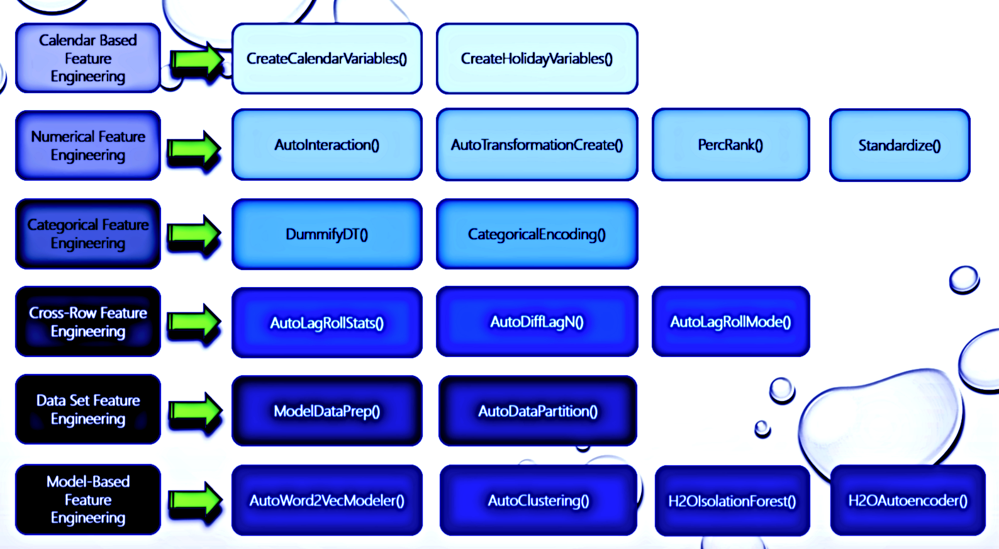

[](https://opensource.org/licenses/MPL-2.0)
[](https://GitHub.com/Naereen/StrapDown.js/graphs/commit-activity)
[](http://makeapullrequest.com)
[](https://github.com/AdrianAntico/RemixAutoML)


- [Background](#background)
- [Installation](#installation)
- [RemixAutoML Blogs](#remixautoml-blogs)
- [Feature Engineering](#feature-engineering)
- [Supervised Learning](#supervised-learning)
- [Model Scoring](#model-scoring)
- [Model Evaluation](#model-evaluation)
- [Panel Data Forecasting](#panel-data-forecasting)
- [Intermittent Demand Forecasting](#intermittent-demand-forecasting)
- [Funnel Forecasting](#funnel-forecasting)
- [Time Series Forecasting](#time-series-forecasting)
- [Recommender Systems](#recommender-systems)
- [Database Management](#database-management)
- [Utilities, EDA, and Misc.](#utilities-eda-misc)


## Background


<details><summary>Expand to view content</summary>
<p>
 
> Automated Machine Learning - In my view, AutoML should consist of functions to help make professional model development and operationalization more efficient. The functions in this package are there to help no matter which part of the ML lifecycle you are working on. The functions in this package have been tested across a variety of industries and have consistently outperformed competing methods. RemixAutoML has enabled me to deliver exceptionally high quality solutions in minimal time and as a result I can focus more time on the other aspects of projects that are critical for generating a high ROI and high adoption rate.

### Package Details
> Supervised Learning - Currently, I'm utilizing CatBoost, LightGBM, XGBoost, and H2O for all of the automated Machine Learning related functions. GPU's can be utilized with CatBoost, LightGBM, and XGBoost, while those and the H2O models can all utilize 100% of CPU. Multi-armed bandit grid tuning is available for CatBoost, LightGBM, and XGBoost models, which utilize the concept of randomized probability matching, which is detailed in the R pacakge "bandit". My choice of included ML algorithms in the package is based on previous success when compared against other algorithms on real world use cases, the additional utilities these packages offer aside from accurate predictions, their ability to work on big data, and the fact that they're available in both R and Python which makes managing multiple languages a little more seamless in a professional setting.

> Forecasting - Automated functions for single series, panel data, vector autoregression, intermittent demand, and funnel panel data. The panel data models utilize the machine learning algos from above and the feature engineering functions below. They are extremely feature rich and the combination of all possible feature settings is huge. The models for individual series are fully optimized versions from the R package "forecast". I utilize the multi-armed bandit grid tuning algo used in the supervised learning models and apply it to the SARIMA and NNETAR models from the forecast package. I also measure performance on hold out data (and training data, or a blend of the two).

> Feature Engineering - Some of the feature engineering functions can only be found in this package. I believe feature engineering is your best bet for improving model performance. I have functions that cover all feature types except image data. There are feature engineering functions for numeric data, categorical data, text data, and date data. They are all designed to generate features for training and scoring pipelines and they run extremely fast with low memory utilization. The package takes advantage of data.table for all feature engineering and data wrangling related functions which means I only have to go to big data tools if absolutely necessary.

> Documentation - Each exported function in the package has a help file and can be viewed in your RStudio session, e.g. <code>?RemixAutoML::ModelDataPrep</code>. Many of them come with examples coded up in the help files (at the bottom) that you can run to get a feel for how to set the parameters. There's also a listing of exported functions by category with code examples at the bottom of this readme. You can also jump into the R folder here to dig into the source code. 

> Overall process: Typically, I go to the warehouse to get all of my base features and then I run through all the relevant feature engineering functions in this package. Personally, I set up templates for features engineering, model training optimization, and model scoring (including feature engineering for scoring). I collect all relevant metdata in a list that is shared across templates and as a result, I never have to touch the model scoring template, which makes operationalize and maintenace a breeze. I can simply list out the columns of interest, which feature engineering functions I want to utilize, and then I simply kick off some command line scripts and everything else is automatically managed.

</p>
</details>

## Installation

The Description File is designed to require only the minimum number of packages to install RemixAutoML. However, in order to utilize most of the functions in the package, you'll have to install additional libraries. I set it up this way on purpose. You don't need to install every single possible dependency if you are only interested in using a few of the functions. For example, if you only want to use CatBoost then intall the catboost package and forget about the h2o, xgboost, and lightgbm packages. This is one of the primary benefits of not hosting an R package on cran, as they require dependencies to be part of the Imports section on the Description File, which subsequently requires users to have all dependencies installed in order to install the package.

The minimal set of packages that need to be installed are below. The full list can be found by expanding the section (Expand to view content).
* arules
* bit64
* data.table
* doParallel
* foreach
* lubridate
* timeDate

<details><summary>Expand to view content</summary>
<p>

#### Install ALL R package dependencies for all functions: 
XGBoost and LightGBM can be used with GPU. However, their installation is much more involved than CatBoost, which comes with GPU capabilities simply by installing their package. The installation instructions for them below is for the CPU version only. Refer to each's home page for instructions for installing for GPU. 
 
```r
# Install Dependencies----
if(!("devtools" %in% rownames(installed.packages()))) install.packages("devtools"); print("devtools")
if(!("arules" %in% rownames(installed.packages()))) install.packages("arules"); print("arules")
if(!("bit64" %in% rownames(installed.packages()))) install.packages("bit64"); print("bit64")
if(!("combinat" %in% rownames(install.packages()))) install.packages("combinat"); print("combinat")
if(!("data.table" %in% rownames(installed.packages()))) install.packages("data.table"); print("data.table")
if(!("doParallel" %in% rownames(installed.packages()))) install.packages("doParallel"); print("doParallel")
if(!("e1071" %in% rownames(installed.packages()))) install.packages("e1071"); print("e1071")
if(!("fBasics" %in% rownames(installed.packages()))) install.packages("fBasics"); print("fBasics")
if(!("foreach" %in% rownames(installed.packages()))) install.packages("foreach"); print("foreach")
if(!("forecast" %in% rownames(installed.packages()))) install.packages("forecast"); print("forecast")
if(!("fpp" %in% rownames(installed.packages()))) install.packages("fpp"); print("fpp")
if(!("ggplot2" %in% rownames(installed.packages()))) install.packages("ggplot2"); print("ggplot2")
if(!("gridExtra" %in% rownames(installed.packages()))) install.packages("gridExtra"); print("gridExtra")
if(!("itertools" %in% rownames(installed.packages()))) install.packages("itertools"); print("itertools")
if(!("lubridate" %in% rownames(installed.packages()))) install.packages("lubridate"); print("lubridate")
if(!("MLmetrics" %in% rownames(installed.packages()))) install.packages("MLmetrics"); print("MLmetrics")
if(!("nortest" %in% rownames(installed.packages()))) install.packages("nortest"); print("nortest")
if(!("RColorBrewer" %in% rownames(installed.packages()))) install.packages("RColorBrewer"); print("RColorBrewer")
if(!("recommenderlab" %in% rownames(installed.packages()))) install.packages("recommenderlab"); print("recommenderlab")
if(!("pROC" %in% rownames(installed.packages()))) install.packages("pROC"); print("pROC")
if(!("Rfast" %in% rownames(installed.packages()))) install.packages("Rfast"); print("Rfast")
if(!("scatterplot3d" %in% rownames(installed.packages()))) install.packages("scatterplot3d"); print("scatterplot3d")
if(!("stringr" %in% rownames(installed.packages()))) install.packages("stringr"); print("stringr")
if(!("timeDate" %in% rownames(installed.packages()))) install.packages("timeDate"); print("timeDate")
if(!("tsoutliers" %in% rownames(installed.packages()))) install.packages("tsoutliers"); print("tsoutliers")
if(!("xgboost" %in% rownames(installed.packages()))) install.packages("xgboost"); print("xgboost")
if(!("lightgbm" %in% rownames(installed.packages()))) install.packages("lightgbm"); print("lightgbm")
for (pkg in c("RCurl","jsonlite")) if (! (pkg %in% rownames(installed.packages()))) { install.packages(pkg) }
install.packages("h2o", type = "source", repos = (c("http://h2o-release.s3.amazonaws.com/h2o/latest_stable_R")))
devtools::install_github('catboost/catboost', subdir = 'catboost/R-package')
devtools::install_github('AdrianAntico/RemixAutoML', upgrade = FALSE, dependencies = FALSE, force = TRUE)
```

#### Installation Troubleshooting 
The most common issue some users are having when trying to install <code>RemixAutoML</code> is the installation of the <code>catboost</code> package dependency. Since <code>catboost</code> is not on CRAN it can only be installed through GitHub. To install <code>catboost</code> without error (and consequently install <code>RemixAutoML</code> without error), try running this line of code first, then restart your R session, then re-run the 2-step installation process above. (<a href="https://github.com/catboost/catboost/issues/612" target="_blank">Reference</a>):
If you're still having trouble submit an issue and I'll work with you to get it installed.

```r
# Method for on premise servers
options(devtools.install.args = c("--no-multiarch", "--no-test-load"))
install.packages("https://github.com/catboost/catboost/releases/download/v0.26.1/catboost-R-Windows-0.26.1.tgz", repos = NULL, type = "source", INSTALL_opts = c("--no-multiarch", "--no-test-load"))

# Method for azure machine learning Designer pipelines

## catboost
install.packages("https://github.com/catboost/catboost/releases/download/v0.26.1/catboost-R-Windows-0.26.1.tgz", repos = NULL, type = "source", INSTALL_opts = c("--no-multiarch", "--no-test-load"))

## RemixAutoML
install.packages("https://github.com/AdrianAntico/RemixAutoML/archive/refs/tags/V0.5.9.tar.gz", repos = NULL, type = "source", INSTALL_opts = c("--no-multiarch", "--no-test-load"))
```
 
If you're having still having trouble installing see if the issue below helps out:


</p>
</details>

## RemixAutoML Blogs

<details><summary>Expand to view content</summary>
<p>

[Sales Funnel Forecasting with ML using RemixAutoML](https://adrianantico.medium.com/sales-funnel-forecasting-using-ml-with-remixautoml-86361ce281b3)
 
[The Most Feature Rich ML Forecasting Methods Available](https://adrianantico.medium.com/the-most-feature-rich-ml-forecasting-methods-available-compliments-of-remixautoml-61b53daf42e6)

[AutoML Frameworks in R & Python](https://iamnagdev.com/2020/04/01/automl-frameworks-in-r-python/)

[AI for Small to Medium Size Businesses: A Management Take On The Challenges...](https://www.remixinstitute.com/blog/business-ai-for-small-to-medium-sized-businesses-with-remixautoml/#.XX-lD2ZlD8A)

[Why Machine Learning is more Practical than Econometrics in the Real World](https://medium.com/@adrianantico/machine-learning-vs-econometrics-in-the-real-world-4058095b1013)

[Build Thousands of Automated Demand Forecasts in 15 Minutes Using AutoCatBoostCARMA in R](https://www.remixinstitute.com/blog/automated-demand-forecasts-using-autocatboostcarma-in-r/#.XUIO1ntlCDM)

[Automate Your KPI Forecasts With Only 1 Line of R Code Using AutoTS](https://www.remixinstitute.com/blog/automate-your-kpi-forecasts-with-only-1-line-of-r-code-using-autots/#.XUIOr3tlCDM)

</p>
</details>


## Feature Engineering 

<details><summary>Expand to view content</summary>
<p>


#### **AutoLagRollStats()** and **AutoLagRollStatsScoring()**

<details><summary>Code Example</summary>
<p>

```r
# Create fake Panel Data----
Count <- 1L
for(Level in LETTERS) {
  datatemp <- RemixAutoML::FakeDataGenerator(
    Correlation = 0.75,
    N = 25000L,
    ID = 0L,
    ZIP = 0L,
    FactorCount = 0L,
    AddDate = TRUE,
    Classification = FALSE,
    MultiClass = FALSE)
  datatemp[, Factor1 := eval(Level)]
  if(Count == 1L) {
    data <- data.table::copy(datatemp)
  } else {
    data <- data.table::rbindlist(list(data, data.table::copy(datatemp)))
  }
  Count <- Count + 1L
}

# Add scoring records
data <- RemixAutoML::AutoLagRollStats(

  # Data
  data                 = data,
  DateColumn           = "DateTime",
  Targets              = "Adrian",
  HierarchyGroups      = NULL,
  IndependentGroups    = c("Factor1"),
  TimeUnitAgg          = "days",
  TimeGroups           = c("days", "weeks", "months", "quarters"),
  TimeBetween          = NULL,
  TimeUnit             = "days",

  # Services
  RollOnLag1           = TRUE,
  Type                 = "Lag",
  SimpleImpute         = TRUE,

  # Calculated Columns
  Lags                 = list("days" = c(seq(1,5,1)), "weeks" = c(seq(1,3,1)), "months" = c(seq(1,2,1)), "quarters" = c(seq(1,2,1))),
  MA_RollWindows       = list("days" = c(seq(1,5,1)), "weeks" = c(seq(1,3,1)), "months" = c(seq(1,2,1)), "quarters" = c(seq(1,2,1))),
  SD_RollWindows       = NULL,
  Skew_RollWindows     = NULL,
  Kurt_RollWindows     = NULL,
  Quantile_RollWindows = NULL,
  Quantiles_Selected   = NULL,
  Debug                = FALSE)
```

</p>
</details>

<details><summary>Code Example</summary>
<p>

```r
# Create fake Panel Data----
Count <- 1L
for(Level in LETTERS) {
  datatemp <- RemixAutoML::FakeDataGenerator(
    Correlation = 0.75,
    N = 25000L,
    ID = 0L,
    ZIP = 0L,
    FactorCount = 0L,
    AddDate = TRUE,
    Classification = FALSE,
    MultiClass = FALSE)
  datatemp[, Factor1 := eval(Level)]
  if(Count == 1L) {
    data <- data.table::copy(datatemp)
  } else {
    data <- data.table::rbindlist(list(data, data.table::copy(datatemp)))
  }
  Count <- Count + 1L
}

# Create ID columns to know which records to score
data[, ID := .N:1L, by = "Factor1"]
data.table::set(data, i = which(data[["ID"]] == 2L), j = "ID", value = 1L)

# Score records
data <- RemixAutoML::AutoLagRollStatsScoring(

  # Data
  data                 = data,
  RowNumsID            = "ID",
  RowNumsKeep          = 1,
  DateColumn           = "DateTime",
  Targets              = "Adrian",
  HierarchyGroups      = c("Store","Dept"),
  IndependentGroups    = NULL,

  # Services
  TimeBetween          = NULL,
  TimeGroups           = c("days", "weeks", "months"),
  TimeUnit             = "day",
  TimeUnitAgg          = "day",
  RollOnLag1           = TRUE,
  Type                 = "Lag",
  SimpleImpute         = TRUE,

  # Calculated Columns
  Lags                  = list("days" = c(seq(1,5,1)), "weeks" = c(seq(1,3,1)), "months" = c(seq(1,2,1))),
  MA_RollWindows        = list("days" = c(seq(1,5,1)), "weeks" = c(seq(1,3,1)), "months" = c(seq(1,2,1))),
  SD_RollWindows        = list("days" = c(seq(1,5,1)), "weeks" = c(seq(1,3,1)), "months" = c(seq(1,2,1))),
  Skew_RollWindows      = list("days" = c(seq(1,5,1)), "weeks" = c(seq(1,3,1)), "months" = c(seq(1,2,1))),
  Kurt_RollWindows      = list("days" = c(seq(1,5,1)), "weeks" = c(seq(1,3,1)), "months" = c(seq(1,2,1))),
  Quantile_RollWindows  = list("days" = c(seq(1,5,1)), "weeks" = c(seq(1,3,1)), "months" = c(seq(1,2,1))),
  Quantiles_Selected    = c("q5","q10","q95"),
  Debug                 = FALSE)
```

</p>
</details>

<details><summary>Function Description</summary>
<p>
 
<code>AutoLagRollStats()</code> builds lags and rolling statistics by grouping variables and their interactions along with multiple different time aggregations if selected. Rolling stats include mean, sd, skewness, kurtosis, and the 5th - 95th percentiles. This function was inspired by the distributed lag modeling framework but I wanted to use it for time series analysis as well and really generalize it as much as possible. The beauty of this function is inspired by analyzing whether a baseball player will get a basehit or more in his next at bat. One easy way to get a better idea of the likelihood is to look at his batting average and his career batting average. However, players go into hot streaks and slumps. How do we account for that? Well, in comes the functions here. You look at the batting average over the last N to N+x at bats, for various N and x. I keep going though - I want the same windows for calculating the players standard deviation, skewness, kurtosis, and various quantiles over those time windows. I also want to look at all those measure but by using weekly data - as in, over the last N weeks, pull in those stats too. 

<code>AutoLagRollStatsScoring()</code> builds the above features for a partial set of records in a data set. The function is extremely useful as it can compute these feature vectors at a significantly faster rate than the non scoring version which comes in handy for scoring ML models. If you can find a way to make it faster, let me know.

</p>
</details>


#### **AutoLagRollMode()**

<details><summary>Code Example</summary>
<p>
 
```r
# NO GROUPING CASE: Create fake Panel Data----
Count <- 1L
for(Level in LETTERS) {
  datatemp <- RemixAutoML::FakeDataGenerator(
    Correlation = 0.75,
    N = 25000L,
    ID = 0L,
    ZIP = 0L,
    FactorCount = 2L,
    AddDate = TRUE,
    Classification = FALSE,
    MultiClass = FALSE)
  datatemp[, Factor1 := eval(Level)]
  if(Count == 1L) {
    data <- data.table::copy(datatemp)
  } else {
    data <- data.table::rbindlist(
      list(data, data.table::copy(datatemp)))
  }
  Count <- Count + 1L
}

# NO GROUPING CASE: Create rolling modes for categorical features
data <- RemixAutoML::AutoLagRollMode(
  data,
  Lags           = seq(1,5,1),
  ModePeriods    = seq(2,5,1),
  Targets        = c("Factor_1"),
  GroupingVars   = NULL,
  SortDateName   = "DateTime",
  WindowingLag   = 1,
  Type           = "Lag",
  SimpleImpute   = TRUE)

# GROUPING CASE: Create fake Panel Data----
Count <- 1L
for(Level in LETTERS) {
  datatemp <- RemixAutoML::FakeDataGenerator(
    Correlation = 0.75,
    N = 25000L,
    ID = 0L,
    ZIP = 0L,
    FactorCount = 2L,
    AddDate = TRUE,
    Classification = FALSE,
    MultiClass = FALSE)
  datatemp[, Factor1 := eval(Level)]
  if(Count == 1L) {
    data <- data.table::copy(datatemp)
  } else {
    data <- data.table::rbindlist(
      list(data, data.table::copy(datatemp)))
  }
  Count <- Count + 1L
}

# GROUPING CASE: Create rolling modes for categorical features
data <- RemixAutoML::AutoLagRollMode(
  data,
  Lags           = seq(1,5,1),
  ModePeriods    = seq(2,5,1),
  Targets        = c("Factor_1"),
  GroupingVars   = "Factor_2",
  SortDateName   = "DateTime",
  WindowingLag   = 1,
  Type           = "Lag",
  SimpleImpute   = TRUE)
```

</p>
</details>

<details><summary>Function Description</summary>
<p>
 
<code>AutoLagRollMode()</code> Generate lags and rolling modes for categorical variables
 
</p>
</details>


#### **AutoDiffLagN()**

<details><summary>Code Example</summary>
<p>

```r
##############################
# Current minus lag1
##############################
 
# Create fake data
data <- RemixAutoML::FakeDataGenerator(
  Correlation = 0.70,
  N = 50000,
  ID = 2L,
  FactorCount = 3L,
  AddDate = TRUE,
  ZIP = 0L,
  TimeSeries = FALSE,
  ChainLadderData = FALSE,
  Classification = FALSE,
  MultiClass = FALSE)

# Store Cols to diff
Cols <- names(data)[which(unlist(data[, lapply(.SD, is.numeric)]))]

# Clean data before running AutoDiffLagN
data <- RemixAutoML::ModelDataPrep(
  data = data,
  Impute = FALSE,
  CharToFactor = FALSE,
  FactorToChar = TRUE)

# Run function
data <- RemixAutoML::AutoDiffLagN(
  data,
  DateVariable = "DateTime",
  GroupVariables = c("Factor_2"),
  DiffVariables = Cols,
  DiffDateVariables = "DateTime",
  DiffGroupVariables = "Factor_1",
  NLag1 = 0,
  NLag2 = 1,
  Sort = TRUE,
  RemoveNA = TRUE)

##############################
# lag1 minus lag3
##############################

# Create fake data
data <- RemixAutoML::FakeDataGenerator(
  Correlation = 0.70,
  N = 50000,
  ID = 2L,
  FactorCount = 3L,
  AddDate = TRUE,
  ZIP = 0L,
  TimeSeries = FALSE,
  ChainLadderData = FALSE,
  Classification = FALSE,
  MultiClass = FALSE)

# Store Cols to diff
Cols <- names(data)[which(unlist(data[, lapply(.SD, is.numeric)]))]

# Clean data before running AutoDiffLagN
data <- RemixAutoML::ModelDataPrep(
  data = data,
  Impute = FALSE,
  CharToFactor = FALSE,
  FactorToChar = TRUE)

# Run function
data <- RemixAutoML::AutoDiffLagN(
  data,
  DateVariable = "DateTime",
  GroupVariables = c("Factor_2"),
  DiffVariables = Cols,
  DiffDateVariables = "DateTime",
  DiffGroupVariables = "Factor_1",
  NLag1 = 1,
  NLag2 = 3,
  Sort = TRUE,
  RemoveNA = TRUE)
```

</p>
</details>

<details><summary>Function Description</summary>
<p>
 
<code>AutoDiffLagN()</code> Generate differences for numeric columns, date columns, and categorical columns, by groups. You can specify NLag1 and NLag2 to generate the diffs based on any two time periods.
 
</p>
</details>

#### **AutoInteraction()**

<details><summary>Code Example</summary>
<p>

```r
#########################################
# Feature Engineering for Model Training
#########################################

# Create fake data
data <- RemixAutoML::FakeDataGenerator(
  Correlation = 0.70,
  N = 50000,
  ID = 2L,
  FactorCount = 2L,
  AddDate = TRUE,
  ZIP = 0L,
  TimeSeries = FALSE,
  ChainLadderData = FALSE,
  Classification = FALSE,
  MultiClass = FALSE)

# Print number of columns
print(ncol(data))

# Store names of numeric and integer cols
Cols <-names(data)[c(which(unlist(lapply(data, is.numeric))),
                     which(unlist(lapply(data, is.integer))))]

# Model Training Feature Engineering
system.time(data <- RemixAutoML::AutoInteraction(
  data = data,
  NumericVars = Cols,
  InteractionDepth = 4,
  Center = TRUE,
  Scale = TRUE,
  SkipCols = NULL,
  Scoring = FALSE,
  File = getwd()))

# user  system elapsed
# 0.32    0.22    0.53

# Print number of columns
print(ncol(data))
# 16

########################################
# Feature Engineering for Model Scoring
########################################

# Create fake data
data <- RemixAutoML::FakeDataGenerator(
  Correlation = 0.70,
  N = 50000,
  ID = 2L,
  FactorCount = 2L,
  AddDate = TRUE,
  ZIP = 0L,
  TimeSeries = FALSE,
  ChainLadderData = FALSE,
  Classification = FALSE,
  MultiClass = FALSE)

# Print number of columns
print(ncol(data))
# 16

# Reduce to single row to mock a scoring scenario
data <- data[1L]

# Model Scoring Feature Engineering
system.time(data <- RemixAutoML::AutoInteraction(
  data = data,
  NumericVars = names(data)[
    c(which(unlist(lapply(data, is.numeric))),
      which(unlist(lapply(data, is.integer))))],
  InteractionDepth = 4,
  Center = TRUE,
  Scale = TRUE,
  SkipCols = NULL,
  Scoring = TRUE,
  File = file.path(getwd(), "Standardize.Rdata")))

# user  system elapsed
# 0.19    0.00    0.19

# Print number of columns
print(ncol(data))
# 1095
```

</p>
</details>

<details><summary>Function Description</summary>
<p>

<code>AutoInteraction()</code> will build out any number of interactions you want for numeric variables. You supply a character vector of numeric or integer column names, along with the names of any numeric columns you want to skip (including the interaction column names) and the interactions will be automatically created for you. For example, if you want a 4th degree interaction from 10 numeric columns, you will have 10 C 2, 10 C 3, and 10 C 4 columns created. Now, let's say you build all those features and decide you don't want all 10 features to be included. Remove the feature name from the NumericVars character vector. Now, let's say you modeled all of the interaction features and want to remove the ones will the lowest scores on the variable importance list. Grab the names and run the interaction function again except this time supply those poor performing interaction column names to the SkipCols argument and they will be ignored. Now, if you want to interact any categorical variable with a numeric variable, you'll have to dummify the categorical variable first and then include the level specific dummy variable column names to the NumericVars character vector argument. If you set Center and Scale to TRUE then the interaction multiplication won't create huge numbers.

</p>
</details>

#### **AutoWord2VecModeler()** and **AutoWord2VecScoring()**

<details><summary>Code Example</summary>
<p>

```r
# Create fake data
data <- RemixAutoML::FakeDataGenerator(
  Correlation = 0.70,
  N = 1000L,
  ID = 2L,
  FactorCount = 2L,
  AddDate = TRUE,
  AddComment = TRUE,
  ZIP = 2L,
  TimeSeries = FALSE,
  ChainLadderData = FALSE,
  Classification = FALSE,
  MultiClass = FALSE)

# Create Model and Vectors
data <- RemixAutoML::AutoWord2VecModeler(
  data,
  BuildType = "individual",
  stringCol = c("Comment"),
  KeepStringCol = FALSE,
  ModelID = "Model_1",
  model_path = getwd(),
  vects = 10,
  MinWords = 1,
  WindowSize = 1,
  Epochs = 25,
  SaveModel = "standard",
  Threads = max(1,parallel::detectCores()-2),
  MaxMemory = "28G")

# Remove data
rm(data)

# Create fake data for mock scoring
data <- RemixAutoML::FakeDataGenerator(
  Correlation = 0.70,
  N = 1000L,
  ID = 2L,
  FactorCount = 2L,
  AddDate = TRUE,
  AddComment = TRUE,
  ZIP = 2L,
  TimeSeries = FALSE,
  ChainLadderData = FALSE,
  Classification = FALSE,
  MultiClass = FALSE)

# Create vectors for scoring
data <- RemixAutoML::AutoWord2VecScoring(
  data,
  BuildType = "individual",
  ModelObject = NULL,
  ModelID = "Model_1",
  model_path = getwd(),
  stringCol = "Comment",
  KeepStringCol = FALSE,
  H2OStartUp = TRUE,
  H2OShutdown = TRUE,
  Threads = max(1L, parallel::detectCores() - 2L),
  MaxMemory = "28G")

```

</p>
</details>

<details><summary>Function Description</summary>
<p>
 
<code>AutoWord2VecModeler()</code> generates a specified number of vectors (word2vec) for each column of text data in your data set that you specify and it will save the models if you specify for re-creating them later in a model scoring process. You can choose to build individual models for each column or one model for all your columns. If you need to run several models for groups of text variables you can run the function several times. 

<code>AutoWord2VecScoring()</code> this is for generating word2vec vectors for model scoring situations. The function will load the model, create the transformations, and merge them onto the source data.table just like the training version does.

</p>
</details>

#### **CategoricalEncoding()**

<details><summary>Code Example</summary>
<p>

```r
# Create fake data with 10 categorical
data <- RemixAutoML::FakeDataGenerator(
  Correlation = 0.85,
  N = 1000000,
  ID = 2L,
  ZIP = 0,
  FactorCount = 10L,
  AddDate = FALSE,
  Classification = TRUE,
  MultiClass = FALSE)

# Take your pick
Meth <- c('m_estimator',
          'credibility',
          'woe',
          'target_encoding',
          'poly_encode',
          'backward_difference',
          'helmert')

# Pass to function
MethNum <- 1

# Mock test data with same factor levels
test <- data.table::copy(data)

# Run in Train Mode
data <- RemixAutoML::CategoricalEncoding(
  data = data,
  ML_Type = "classification",
  GroupVariables = paste0("Factor_", 1:10),
  TargetVariable = "Adrian",
  Method = Meth[MethNum],
  SavePath = getwd(),
  Scoring = FALSE,
  ReturnFactorLevelList = FALSE,
  SupplyFactorLevelList = NULL,
  KeepOriginalFactors = FALSE)

# View results
print(data)

# Run in Score Mode by pulling in the csv's
test <- RemixAutoML::CategoricalEncoding(
  data = data,
  ML_Type = "classification",
  GroupVariables = paste0("Factor_", 1:10),
  TargetVariable = "Adrian",
  Method = Meth[MethNum],
  SavePath = getwd(),
  Scoring = TRUE,
  ImputeValueScoring = 222,
  ReturnFactorLevelList = FALSE,
  SupplyFactorLevelList = NULL,
  KeepOriginalFactors = FALSE)
}
```

</p>
</details>

<details><summary>Function Description</summary>
<p>
 
<code>CategoricalEncoding()</code> enables you to convert your categorical variables into numeric variables in seven different ways. You can choose from m_estimator, credibility (a.k.a. James Stein), weight of evidence, target encoding, poly encoding, backward difference encoding, and helmert encoding. You can run the function for training data and for scoring situations (on demand or batch). For scoring, you can choose to supply an imputation value for new levels that may show up or you can manage them somewhere else in the pipeline. For scoring, you have two options: during the training run you can save the metadata to file by supplying a path to SavePath or you can have the metadata returned by setting ReturnFactorLevelList to TRUE and in scoring your can either have the files pulled from file using the SavePath argument and the function will take care of the rest or you can supply the ReturnFactorLevelList to the SupplyFactorLevelList argument and the function will take care of the rest.

</p>
</details>


#### **H2OAutoencoder()** and **H2OAutoencoderScoring()**

<details><summary>Code Example</summary>
<p>


```r
############################
# Training
############################

# Create simulated data
data <- RemixAutoML::FakeDataGenerator(
  Correlation = 0.70,
  N = 1000L,
  ID = 2L,
  FactorCount = 2L,
  AddDate = TRUE,
  AddComment = FALSE,
  ZIP = 2L,
  TimeSeries = FALSE,
  ChainLadderData = FALSE,
  Classification = FALSE,
  MultiClass = FALSE)

# Run algo
Output <- RemixAutoML::H2OAutoencoder(
  
  # Select the service
  AnomalyDetection = TRUE,
  DimensionReduction = TRUE,

  # Data related args
  data = data,
  ValidationData = NULL,
  Features = names(data)[2L:(ncol(data)-1L)],
  per_feature = FALSE,
  RemoveFeatures = TRUE,
  ModelID = "TestModel",
  model_path = getwd(),

  # H2O Environment
  NThreads = max(1L, parallel::detectCores()-2L),
  MaxMem = "28G",
  H2OStart = TRUE,
  H2OShutdown = TRUE,
  
  # H2O ML Args
  LayerStructure = NULL,
  ReturnLayer = 4L,
  Activation = "Tanh",
  Epochs = 5L,
  L2 = 0.10,
  ElasticAveraging = TRUE,
  ElasticAveragingMovingRate = 0.90,
  ElasticAveragingRegularization = 0.001)

# Inspect output
data <- Output$Data
Model <- Output$Model

# If ValidationData is not null
ValidationData <- Output$ValidationData

############################
# Scoring
############################

# Create simulated data
data <- RemixAutoML::FakeDataGenerator(
  Correlation = 0.70,
  N = 1000L,
  ID = 2L,
  FactorCount = 2L,
  AddDate = TRUE,
  AddComment = FALSE,
  ZIP = 2L,
  TimeSeries = FALSE,
  ChainLadderData = FALSE,
  Classification = FALSE,
  MultiClass = FALSE)

# Run algo
data <- RemixAutoML::H2OAutoencoderScoring(

  # Select the service
  AnomalyDetection = TRUE,
  DimensionReduction = TRUE,
   
  # Data related args
  data = data,
  Features = names(data)[2L:ncol(data)],
  RemoveFeatures = TRUE,
  ModelObject = NULL,
  ModelID = "TestModel",
  model_path = getwd(),

  # H2O args
  NThreads = max(1L, parallel::detectCores()-2L),
  MaxMem = "28G",
  H2OStart = TRUE,
  H2OShutdown = TRUE,
  ReturnLayer = 4L,
  per_feature = FALSE)
```

</p>
</details>

<details><summary>Function Description</summary>
<p>

<code>H2OAutoencoder()</code> Use for dimension reduction and anomaly detection

<code>H2OAutoencoderScoring()</code> Use for dimension reduction and anomaly detection scoring

</p>
</details>

#### **H2OIsolationForest()** and **H2OIsolationForestScoring()**

<details><summary>Code Example</summary>
<p>

```r
# Create simulated data
data <- RemixAutoML::FakeDataGenerator(
  Correlation = 0.70,
  N = 50000,
  ID = 2L,
  FactorCount = 2L,
  AddDate = TRUE,
  ZIP = 0L,
  TimeSeries = FALSE,
  ChainLadderData = FALSE,
  Classification = FALSE,
  MultiClass = FALSE)

# Run algo
data <- RemixAutoML::H2OIsolationForest(
  data,
  Features = names(data)[2L:ncol(data)],
  IDcols = c("Adrian", "IDcol_1", "IDcol_2"),
  ModelID = "Adrian",
  SavePath = getwd(),
  Threshold = 0.95,
  MaxMem = "28G",
  NThreads = -1,
  NTrees = 100,
  SampleRate = (sqrt(5)-1)/2,
  MaxDepth = 8,
  MinRows = 1,
  ColSampleRate = 1,
  ColSampleRatePerLevel = 1,
  ColSampleRatePerTree = 1,
  CategoricalEncoding = c("AUTO"),
  Debug = TRUE)

# Remove output from data and then score
data[, eval(names(data)[17:ncol(data)]) := NULL]

# Run algo
Outliers <- RemixAutoML::H2OIsolationForestScoring(
  data,
  Features = names(data)[2:ncol(data)],
  IDcols = c("Adrian", "IDcol_1", "IDcol_2"),
  H2OStart = TRUE,
  H2OShutdown = TRUE,
  ModelID = "TestModel",
  SavePath = getwd(),
  Threshold = 0.95,
  MaxMem = "28G",
  NThreads = -1,
  Debug = FALSE)
```

</p>
</details>

<details><summary>Function Description</summary>
<p>

<code>H2OIsolationForecast()</code> Anomaly detection and feature engineering using H2O Isolation Forest. A model is built, your training data is scored, and the model is saved to file for later use in scoring environments with H2OIsolationForestScoring()

<code>H2OIsolationForecastScoring()</code> Scoring function

</p>
</details>

#### **AutoClustering() and AutoClusteringScoring()** 

<details><summary>Code Example</summary>
<p>

```r
#########################
# Training Setup
#########################

# Create fake data
data <- RemixAutoML::FakeDataGenerator(
  Correlation = 0.85,
  N = 1000,
  ID = 2,
  ZIP = 0,
  AddDate = TRUE,
  Classification = FALSE,
  MultiClass = FALSE)

# Run function
data <- RemixAutoML::AutoClustering(
  data,
  FeatureColumns = names(data)[2:(ncol(data)-1)],
  ModelID = "TestModel",
  SavePath = getwd(),
  NThreads = 8,
  MaxMemory = "28G",
  MaxClusters = 50,
  ClusterMetric = "totss",
  RunDimReduction = TRUE,
  ShrinkRate = (sqrt(5) - 1) / 2,
  Epochs = 5L,
  L2_Reg = 0.10,
  ElasticAveraging = TRUE,
  ElasticAveragingMovingRate = 0.90,
  ElasticAveragingRegularization = 0.001)

#########################
# Scoring Setup
#########################

Sys.sleep(10)

# Create fake data
data <- RemixAutoML::FakeDataGenerator(
  Correlation = 0.85,
  N = 1000,
  ID = 2,
  ZIP = 0,
  AddDate = TRUE,
  Classification = FALSE,
  MultiClass = FALSE)

# Run function
data <- RemixAutoML::AutoClusteringScoring(
  data,
  FeatureColumns = names(data)[2:(ncol(data)-1)],
  ModelID = "TestModel",
  SavePath = getwd(),
  NThreads = 8,
  MaxMemory = "28G",
  DimReduction = TRUE)
```

<details><summary>Function Description</summary>
<p>
 
<code>AutoClustering()</code> Generates a single column and merges it onto your data. You can have an autoencoder ran to reduce the dimension size before running the KMeans grid tuning operation. If you provide a directory path, the models will be saved and can be used later in scoring enviroments. I find that I utilize clustering more often for feature engineering that unsupervised learning which is why I put the code example and description here. The function utilizes H2O under the hood with their KMeans algo for the clustering and their deep learning algo for the dimensionality reduction. 

</p>
</details>

</p>
</details>

#### **CreateCalendarVariables()**

<details><summary>Code Example</summary>
<p>

```r
# Create fake data with a Date column----
data <- RemixAutoML::FakeDataGenerator(
  Correlation = 0.75,
  N = 25000L,
  ID = 2L,
  ZIP = 0L,
  FactorCount = 4L,
  AddDate = TRUE,
  Classification = FALSE,
  MultiClass = FALSE)
for(i in seq_len(20L)) {
  print(i)
  data <- data.table::rbindlist(list(data, RemixAutoML::FakeDataGenerator(
    Correlation = 0.75,
    N = 25000L,
    ID = 2L,
    ZIP = 0L,
    FactorCount = 4L,
    AddDate = TRUE,
    Classification = FALSE,
    MultiClass = FALSE)))
}

# Create calendar variables - automatically excludes the second, minute, and hour selections since
#   it is not timestamp data
runtime <- system.time(
  data <- RemixAutoML::CreateCalendarVariables(
    data = data,
    DateCols = "DateTime",
    AsFactor = FALSE,
    TimeUnits = c("second", "minute", "hour", "wday", "mday", "yday", "week", "isoweek", "wom", "month", "quarter", "year")))
head(data)
print(runtime)
```

</p>
</details>

<details><summary>Function Description</summary>
<p>
 
<code>CreateCalendarVariables()</code> This functions creates numerical columns based on the date columns you supply such as second, minute, hour, week day, day of month, day of year, week, isoweek, wom, month, quarter, and year.

</p>
</details>

#### **CreateHolidayVariable()**

<details><summary>Code Example</summary>
<p>
 
```r
# Create fake data with a Date----
data <- RemixAutoML::FakeDataGenerator(
  Correlation = 0.75,
  N = 25000L,
  ID = 2L,
  ZIP = 0L,
  FactorCount = 4L,
  AddDate = TRUE,
  Classification = FALSE,
  MultiClass = FALSE)
for(i in seq_len(20L)) {
  print(i)
  data <- data.table::rbindlist(list(data, RemixAutoML::FakeDataGenerator(
    Correlation = 0.75,
    N = 25000L,
    ID = 2L,
    ZIP = 0L,
    FactorCount = 4L,
    AddDate = TRUE,
    Classification = FALSE,
    MultiClass = FALSE)))
}
# Run function and time it
runtime <- system.time(
  data <- CreateHolidayVariables(
    data,
    DateCols = "DateTime",
    LookbackDays = 7,
    HolidayGroups = c("USPublicHolidays","EasterGroup","ChristmasGroup","OtherEcclesticalFeasts"),
    Holidays = NULL
    Print = FALSE))
head(data)
print(runtime)
```

</p>
</details>

<details><summary>Function Description</summary>
<p>
 
<code>CreateHolidayVariable()</code> 
This function counts up the number of specified holidays between the current record time stamp and the previous record time stamp, by group as well if specified.

</p>
</details>

#### **DummifyDT()** 

<details><summary>Code Example</summary>
<p>

```r
# Create fake data with 10 categorical columns
data <- RemixAutoML::FakeDataGenerator(
  Correlation = 0.85,
  N = 25000,
  ID = 2L,
  ZIP = 0,
  FactorCount = 10L,
  AddDate = FALSE,
  Classification = FALSE,
  MultiClass = FALSE)

# Create dummy variables
data <- DummifyDT(
  data = data,
  cols = c("Factor_1",
           "Factor_2",
           "Factor_3",
           "Factor_4",
           "Factor_5",
           "Factor_6",
           "Factor_8",
           "Factor_9",
           "Factor_10"),
  TopN = c(rep(3,9)),
  KeepFactorCols = TRUE,
  OneHot = FALSE,
  SaveFactorLevels = TRUE,
  SavePath = getwd(),
  ImportFactorLevels = FALSE,
  FactorLevelsList = NULL,
  ClustScore = FALSE,
  ReturnFactorLevels = FALSE)

# Create Fake Data for Scoring Replication
data <- RemixAutoML::FakeDataGenerator(
  Correlation = 0.85,
  N = 25000,
  ID = 2L,
  ZIP = 0,
  FactorCount = 10L,
  AddDate = FALSE,
  Classification = FALSE,
  MultiClass = FALSE)

# Scoring Version (imports csv's to generate matching levels and ordering)
data <- RemixAutoML::DummifyDT(
  data = data,
  cols = c("Factor_1",
           "Factor_2",
           "Factor_3",
           "Factor_4",
           "Factor_5",
           "Factor_6",
           "Factor_8",
           "Factor_9",
           "Factor_10"),
  TopN = c(rep(3,9)),
  KeepFactorCols = TRUE,
  OneHot = FALSE,
  SaveFactorLevels = TRUE,
  SavePath = getwd(),
  ImportFactorLevels = TRUE,
  FactorLevelsList = NULL,
  ClustScore = FALSE,
  ReturnFactorLevels = FALSE)
```

</p>
</details>

<details><summary>Function Description</summary>
<p>

<code>DummifyDT()</code> This function is used in the AutoXGBoost__() suite of modeling functions to manage categorical variables in your training, validation, and test sets. This function rapidly dichotomizes categorical columns in a data.table (N+1 columns for N levels using one hot encoding or N columns for N levels otherwise). Several other arguments exist for outputting and saving factor levels. This is useful in model training, validating, and scoring processes.

</p>
</details>

#### **AutoDataPartition()**

<details><summary>Code Example</summary>
<p>

```r
# Create fake data
data <- RemixAutoML::FakeDataGenerator(
  Correlation = 0.85, 
  N = 1000, 
  ID = 2, 
  ZIP = 0, 
  AddDate = FALSE, 
  Classification = FALSE, 
  MultiClass = FALSE)

# Run data partitioning function
dataSets <- RemixAutoML::AutoDataPartition(
  data,
  NumDataSets = 3L,
  Ratios = c(0.70,0.20,0.10),
  PartitionType = "random",
  StratifyColumnNames = NULL,
  TimeColumnName = NULL)

# Collect data
TrainData <- dataSets$TrainData
ValidationData <- dataSets$ValidationData
TestData <- dataSets$TestData
```

</p>
</details>

<details><summary>Function Description</summary>
<p>

<code>AutoDataPartition()</code> is designed to achieve a few things that standard data partitioning processes or functions don't handle. First, you can choose to build any number of partitioned data sets beyond the standard train, validate, and test data sets. Second, you can choose between random sampling to split your data or you can choose a time-based partitioning. Third, for the random partitioning, you can specify a stratification columns in your data to stratify by in order to ensure a proper split amongst your categorical features (E.g. think MultiClass targets). Lastly, it's 100% data.table so it will run fast and with low memory overhead.

</p>
</details>

#### **ModelDataPrep()**

<details><summary>Code Example</summary>
<p>
 
```r
# Create fake data
data <- RemixAutoML::FakeDataGenerator(
  Correlation = 0.75,
  N = 250000L,
  ID = 2L,
  ZIP = 0L,
  FactorCount = 6L,
  AddDate = TRUE,
  AddComment = FALSE,
  TimeSeries = FALSE,
  AddDate = TRUE,
  Classification = FALSE,
  MultiClass = FALSE)

# Check column types
str(data)

# RUn function
data <- RemixAutoML::ModelDataPrep(
  data,
  Impute = TRUE,
  CharToFactor = FALSE,
  FactorToChar = TRUE,
  IntToNumeric = TRUE,
  LogicalToBinary = FALSE,
  DateToChar = FALSE,
  RemoveDates = TRUE,
  MissFactor = "0",
  MissNum = -1,
  IgnoreCols = c("Factor_1"))

# Check column types
str(data)
```

</p>
</details>

<details><summary>Function Description</summary>
<p>

<code>ModelDataPrep()</code> This function will loop through every column in your data and apply a variety of functions based on argument settings. For all columns not ignored, these tasks include:
* Character type to Factor type converstion
* Factor type to Character type conversion
* Constant value imputation for numeric and categorical columns
* Integer type to Numeric type conversion
* Date type to Character type conversion
* Remove date columns
* Ignore specified columns

</p>
</details>

#### **AutoTransformationCreate()** and **AutoTransformationScore()**

<details><summary>Function Description</summary>
<p>
 
<code>AutoTransformationCreate()</code> is a function for automatically identifying the optimal transformations for numeric features and transforming them once identified. This function will loop through your selected transformation options (YeoJohnson, BoxCox, Asinh, Log, LogPlus1, Sqrt, along with Asin and Logit for proportion data) and find the one that produces the best fit to a normal distribution. It then generates the transformation and collects the metadata information for use in the AutoTransformationScore() function, either by returning the objects or saving them to file.

<code>AutoTransformationScore()</code> is a the compliment function to AutoTransformationCreate(). Automatically apply or inverse the transformations you identified in AutoTransformationCreate() to other data sets. This is useful for applying transformations to your validation and test data sets for modeling, which is done automatically for you if you specify.

</p>
</details>

#### **AutoHierarchicalFourier()**

<details><summary>Function Description</summary>
<p>
 
<code>AutoHierarchicalFourier()</code> turns time series data into fourier series. This function can generate any number of fourier pairs the user wants (if they can actually build) and you can run it with grouped time series data. In the grouping case, fourier pairs can be created for each categorical variable along with the full interactions between specified categoricals. The process is parallelized as well to run as fast as possible.

</p>
</details>

</p>
</details>


## Supervised Learning 

<details><summary>Expand to view content</summary>
<p>


### Regression

<details><summary>click to expand</summary>
<p>

<details><summary>Regression Description</summary>
<p>
  
The Auto_Regression() models handle a multitude of tasks. In order:
1. Convert your data to data.table format for faster processing
2. Transform your target variable using the best normalization method based on the <code>AutoTransformationCreate()</code> function
3. Create train, validation, and test data, utilizing the <code>AutoDataPartition()</code> function, if you didn't supply those directly to the function
4. Consoldate columns that are used for modeling and what metadata you want returned in your test data with predictions
5. Dichotomize categorical variables (for <code>AutoXGBoostRegression()</code>) and save the factor levels for scoring in a way that guarentees consistency across training, validation, and test data sets, utilizing the <code>DummifyDT()</code> function
6. Save the final modeling column names for reference
7. Handles the data conversion to the appropriate modeling type, such as CatBoost, H2O, and XGBoost
8. Multi-armed bandit hyperparameter tuning using randomized probability matching, if you choose to grid tune
9. Loop through the grid-tuning process, building N models
10. Collect the evaluation metrics for each grid tune run
11. Identify the best model of the set of models built in the grid tuning search
12. Save the hyperparameters from the winning grid tuned model
13. Build the final model based on the best model from the grid tuning model search (I remove each model after evaluation metrics are generated in the grid tune to avoid memory overflow)
14. Back-transform your predictions based on the best transformation used earlier in the process
15. Collect evaluation metrics based on performance on test data (based on back-transformed data)
16. Store the final predictions with the associated test data and other columns you want included in that set
17. Save your transformation metadata for recreating them in a scoring process
18. Build out and save an Evaluation Calibration Line Plot and Evaluation Calibration Box-Plot, using the <code>EvalPlot()</code> function
19. Generate and save Variable Importance
20. Generate and save Partital Dependence Calibration Line Plots and Partital Dependence Calibration Box-Plots, using the <code>ParDepPlots()</code> function
21. Return all the objects generated in a named list for immediate use and evaluation
 
</p>
</details>

<details><summary>CatBoost Example</summary>
<p>

```r
# Create some dummy correlated data
data <- RemixAutoML::FakeDataGenerator(
  Correlation = 0.85,
  N = 10000,
  ID = 2,
  ZIP = 0,
  AddDate = FALSE,
  Classification = FALSE,
  MultiClass = FALSE)

# Run function
TestModel <- RemixAutoML::AutoCatBoostRegression(

  # GPU or CPU and the number of available GPUs
  TrainOnFull = FALSE,
  task_type = 'GPU',
  NumGPUs = 1,
  DebugMode = FALSE,

  # Metadata args
  OutputSelection = c('Importances', 'EvalPlots', 'EvalMetrics', 'Score_TrainData'),
  ModelID = 'Test_Model_1',
  model_path = normalizePath('./'),
  metadata_path = normalizePath('./'),
  SaveModelObjects = FALSE,
  SaveInfoToPDF = FALSE,
  ReturnModelObjects = TRUE,

  # Data args
  data = data,
  ValidationData = NULL,
  TestData = NULL,
  TargetColumnName = 'Adrian',
  FeatureColNames = names(data)[!names(data) %in%
    c('IDcol_1', 'IDcol_2','Adrian')],
  PrimaryDateColumn = NULL,
  WeightsColumnName = NULL,
  IDcols = c('IDcol_1','IDcol_2'),
  TransformNumericColumns = 'Adrian',
  Methods = c('BoxCox', 'Asinh', 'Asin', 'Log',
    'LogPlus1', 'Sqrt', 'Logit'),

  # Model evaluation
  eval_metric = 'RMSE',
  eval_metric_value = 1.5,
  loss_function = 'RMSE',
  loss_function_value = 1.5,
  MetricPeriods = 10L,
  NumOfParDepPlots = ncol(data)-1L-2L,

  # Grid tuning args
  PassInGrid = NULL,
  GridTune = FALSE,
  MaxModelsInGrid = 30L,
  MaxRunsWithoutNewWinner = 20L,
  MaxRunMinutes = 60*60,
  BaselineComparison = 'default',

  # ML args
  langevin = FALSE,
  diffusion_temperature = 10000,
  Trees = 1000,
  Depth = 9,
  L2_Leaf_Reg = NULL,
  RandomStrength = 1,
  BorderCount = 128,
  LearningRate = NULL,
  RSM = 1,
  BootStrapType = NULL,
  GrowPolicy = 'SymmetricTree',
  model_size_reg = 0.5,
  feature_border_type = 'GreedyLogSum',
  sampling_unit = 'Object',
  subsample = NULL,
  score_function = 'Cosine',
  min_data_in_leaf = 1)
```
 
</p>
</details>

<details><summary>XGBoost Example</summary>
<p>

```r
# Create some dummy correlated data
data <- RemixAutoML::FakeDataGenerator(
  Correlation = 0.85,
  N = 1000,
  ID = 2,
  ZIP = 0,
  AddDate = FALSE,
  Classification = FALSE,
  MultiClass = FALSE)

# Run function
TestModel <- RemixAutoML::AutoXGBoostRegression(
  
  # GPU or CPU
  TreeMethod = "hist",
  NThreads = parallel::detectCores(),
  LossFunction = 'reg:squarederror',
  
  # Metadata args
  OutputSelection = c("Importances", "EvalPlots", "EvalMetrics", "Score_TrainData"),
  model_path = normalizePath("./"),
  metadata_path = NULL,
  ModelID = "Test_Model_1",
  EncodingMethod = "binary",
  ReturnFactorLevels = TRUE,
  ReturnModelObjects = TRUE,
  SaveModelObjects = FALSE,
  SaveInfoToPDF = FALSE,
  DebugMode = FALSE,
  
  # Data args
  data = data,
  TrainOnFull = FALSE,
  ValidationData = NULL,
  TestData = NULL,
  TargetColumnName = "Adrian",
  FeatureColNames = names(data)[!names(data) %in%
                                  c("IDcol_1", "IDcol_2","Adrian")],
  PrimaryDateColumn = NULL,
  WeightsColumnName = NULL,
  IDcols = c("IDcol_1","IDcol_2"),
  TransformNumericColumns = NULL,
  Methods = c("BoxCox", "Asinh", "Asin", "Log",
              "LogPlus1", "Sqrt", "Logit", "YeoJohnson"),
  
  # Model evaluation args
  eval_metric = "rmse",
  NumOfParDepPlots = 3L,
  
  # Grid tuning args
  PassInGrid = NULL,
  GridTune = FALSE,
  grid_eval_metric = "r2",
  BaselineComparison = "default",
  MaxModelsInGrid = 10L,
  MaxRunsWithoutNewWinner = 20L,
  MaxRunMinutes = 24L*60L,
  Verbose = 1L,
  
  # ML args
  Trees = 50L,
  eta = 0.05,
  max_depth = 4L,
  min_child_weight = 1.0,
  subsample = 0.55,
  colsample_bytree = 0.55)
```

</p>
</details>

<details><summary>LightGBM Example</summary>
<p>

```r
# Create some dummy correlated data
data <- RemixAutoML::FakeDataGenerator(
  Correlation = 0.85,
  N = 1000,
  ID = 2,
  ZIP = 0,
  AddDate = FALSE,
  Classification = FALSE,
  MultiClass = FALSE)

# Run function
TestModel <- RemixAutoML::AutoLightGBMRegression(

  # Metadata args
  OutputSelection = c('Importances','EvalPlots','EvalMetrics','Score_TrainData'),
  model_path = normalizePath('./'),
  metadata_path = NULL,
  ModelID = 'Test_Model_1',
  NumOfParDepPlots = 3L,
  EncodingMethod = 'credibility',
  ReturnFactorLevels = TRUE,
  ReturnModelObjects = TRUE,
  SaveModelObjects = FALSE,
  SaveInfoToPDF = FALSE,
  DebugMode = FALSE,

  # Data args
  data = data,
  TrainOnFull = FALSE,
  ValidationData = NULL,
  TestData = NULL,
  TargetColumnName = 'Adrian',
  FeatureColNames = names(data)[!names(data) %in% c('IDcol_1', 'IDcol_2','Adrian')],
  PrimaryDateColumn = NULL,
  WeightsColumnName = NULL,
  IDcols = c('IDcol_1','IDcol_2'),
  TransformNumericColumns = NULL,
  Methods = c('Asinh','Asin','Log','LogPlus1','Sqrt','Logit'),

  # Grid parameters
  GridTune = FALSE,
  grid_eval_metric = 'r2',
  BaselineComparison = 'default',
  MaxModelsInGrid = 10L,
  MaxRunsWithoutNewWinner = 20L,
  MaxRunMinutes = 24L*60L,
  PassInGrid = NULL,

  # Core parameters
  # https://lightgbm.readthedocs.io/en/latest/Parameters.html#core-parameters
  input_model = NULL, # continue training a model that is stored to file
  task = 'train',
  device_type = 'CPU',
  NThreads = parallel::detectCores() / 2,
  objective = 'regression',
  metric = 'rmse',
  boosting = 'gbdt',
  LinearTree = FALSE,
  Trees = 50L,
  eta = NULL,
  num_leaves = 31,
  deterministic = TRUE,

  # Learning Parameters
  # https://lightgbm.readthedocs.io/en/latest/Parameters.html#learning-control-parameters
  force_col_wise = FALSE,
  force_row_wise = FALSE,
  max_depth = NULL,
  min_data_in_leaf = 20,
  min_sum_hessian_in_leaf = 0.001,
  bagging_freq = 0,
  bagging_fraction = 1.0,
  feature_fraction = 1.0,
  feature_fraction_bynode = 1.0,
  extra_trees = FALSE,
  early_stopping_round = 10,
  first_metric_only = TRUE,
  max_delta_step = 0.0,
  lambda_l1 = 0.0,
  lambda_l2 = 0.0,
  linear_lambda = 0.0,
  min_gain_to_split = 0,
  drop_rate_dart = 0.10,
  max_drop_dart = 50,
  skip_drop_dart = 0.50,
  uniform_drop_dart = FALSE,
  top_rate_goss = FALSE,
  other_rate_goss = FALSE,
  monotone_constraints = NULL,
  monotone_constraints_method = 'advanced',
  monotone_penalty = 0.0,
  forcedsplits_filename = NULL, # use for AutoStack option; .json file
  refit_decay_rate = 0.90,
  path_smooth = 0.0,

  # IO Dataset Parameters
  # https://lightgbm.readthedocs.io/en/latest/Parameters.html#io-parameters
  max_bin = 255,
  min_data_in_bin = 3,
  data_random_seed = 1,
  is_enable_sparse = TRUE,
  enable_bundle = TRUE,
  use_missing = TRUE,
  zero_as_missing = FALSE,
  two_round = FALSE,

  # Convert Parameters
  convert_model = NULL,
  convert_model_language = 'cpp',

  # Objective Parameters
  # https://lightgbm.readthedocs.io/en/latest/Parameters.html#objective-parameters
  boost_from_average = TRUE,
  alpha = 0.90,
  fair_c = 1.0,
  poisson_max_delta_step = 0.70,
  tweedie_variance_power = 1.5,
  lambdarank_truncation_level = 30,

  # Metric Parameters (metric is in Core)
  # https://lightgbm.readthedocs.io/en/latest/Parameters.html#metric-parameters
  is_provide_training_metric = TRUE,
  eval_at = c(1,2,3,4,5),

  # Network Parameters
  # https://lightgbm.readthedocs.io/en/latest/Parameters.html#network-parameters
  num_machines = 1,

  # GPU Parameters
  # https://lightgbm.readthedocs.io/en/latest/Parameters.html#gpu-parameters
  gpu_platform_id = -1,
  gpu_device_id = -1,
  gpu_use_dp = TRUE,
  num_gpu = 1)
```

</p>
</details> 

<details><summary>H2O-GBM Example</summary>
<p>

```r
# Create some dummy correlated data
data <- RemixAutoML::FakeDataGenerator(
  Correlation = 0.85,
  N = 1000,
  ID = 2,
  ZIP = 0,
  AddDate = FALSE,
  Classification = FALSE,
  MultiClass = FALSE)

# Run function
TestModel <- RemixAutoML::AutoH2oGBMRegression(
  
  # Compute management
  MaxMem = {gc();paste0(as.character(floor(as.numeric(system("awk '/MemFree/ {print $2}' /proc/meminfo", intern=TRUE)) / 1000000)),"G")},
  NThreads = max(1, parallel::detectCores()-2),
  H2OShutdown = TRUE,
  H2OStartUp = TRUE,
  IfSaveModel = "mojo",
  
  # Model evaluation
  NumOfParDepPlots = 3,
  
  # Metadata arguments:
  model_path = normalizePath("./"),
  metadata_path = file.path(normalizePath("./")),
  ModelID = "FirstModel",
  ReturnModelObjects = TRUE,
  SaveModelObjects = FALSE,
  SaveInfoToPDF = FALSE,
  
  # Data arguments
  data = data,
  TrainOnFull = FALSE,
  ValidationData = NULL,
  TestData = NULL,
  TargetColumnName = "Adrian",
  FeatureColNames = names(data)[!names(data) %in% c("IDcol_1", "IDcol_2","Adrian")],
  WeightsColumn = NULL,
  TransformNumericColumns = NULL,
  Methods = c("BoxCox", "Asinh", "Asin", "Log", "LogPlus1", "Sqrt", "Logit","YeoJohnson"),
  
  # ML grid tuning args
  GridTune = FALSE,
  GridStrategy = "Cartesian",
  MaxRuntimeSecs = 60*60*24,
  StoppingRounds = 10,
  MaxModelsInGrid = 2,
  
  # Model args
  Trees = 50,
  LearnRate = 0.10,
  LearnRateAnnealing = 1,
  eval_metric = "RMSE",
  Alpha = NULL,
  Distribution = "poisson",
  MaxDepth = 20,
  SampleRate = 0.632,
  ColSampleRate = 1,
  ColSampleRatePerTree = 1,
  ColSampleRatePerTreeLevel  = 1,
  MinRows = 1,
  NBins = 20,
  NBinsCats = 1024,
  NBinsTopLevel = 1024,
  HistogramType = "AUTO",
  CategoricalEncoding = "AUTO")
```
 
</p>
</details>

<details><summary>H2O-DRF Example</summary>
<p>
 
```r
# Create some dummy correlated data
data <- RemixAutoML::FakeDataGenerator(
  Correlation = 0.85,
  N = 1000,
  ID = 2,
  ZIP = 0,
  AddDate = FALSE,
  Classification = FALSE,
  MultiClass = FALSE)

# Run function
TestModel <- RemixAutoML::AutoH2oDRFRegression(
  
  # Compute management
  MaxMem = {gc();paste0(as.character(floor(as.numeric(system("awk '/MemFree/ {print $2}' /proc/meminfo", intern=TRUE)) / 1000000)),"G")},
  NThreads = max(1L, parallel::detectCores() - 2L),
  H2OShutdown = TRUE,
  H2OStartUp = TRUE,
  IfSaveModel = "mojo",
  
  # Model evaluation:
  eval_metric = "RMSE",
  NumOfParDepPlots = 3,
  
  # Metadata arguments:
  model_path = normalizePath("./"),
  metadata_path = NULL,
  ModelID = "FirstModel",
  ReturnModelObjects = TRUE,
  SaveModelObjects = FALSE,
  SaveInfoToPDF = FALSE,
  
  # Data Args
  data = data,
  TrainOnFull = FALSE,
  ValidationData = NULL,
  TestData = NULL,
  TargetColumnName = "Adrian",
  FeatureColNames = names(data)[!names(data) %in% c("IDcol_1", "IDcol_2","Adrian")],
  WeightsColumn = NULL,
  TransformNumericColumns = NULL,
  Methods = c("BoxCox", "Asinh", "Asin", "Log", "LogPlus1", "Sqrt", "Logit", "YeoJohnson"),
  
  # Grid Tuning Args
  GridStrategy = "Cartesian",
  GridTune = FALSE,
  MaxModelsInGrid = 10,
  MaxRuntimeSecs = 60*60*24,
  StoppingRounds = 10,
  
  # ML Args
  Trees = 50,
  MaxDepth = 20,
  SampleRate = 0.632,
  MTries = -1,
  ColSampleRatePerTree = 1,
  ColSampleRatePerTreeLevel = 1,
  MinRows = 1,
  NBins = 20,
  NBinsCats = 1024,
  NBinsTopLevel = 1024,
  HistogramType = "AUTO",
  CategoricalEncoding = "AUTO")
```
 
</p>
</details>

<details><summary>H2O-GLM Example</summary>
<p>
 
```r
# Create some dummy correlated data
data <- RemixAutoML::FakeDataGenerator(
  Correlation = 0.85,
  N = 1000,
  ID = 2,
  ZIP = 0,
  AddDate = FALSE,
  Classification = FALSE,
  MultiClass = FALSE)

# Run function
TestModel <- RemixAutoML::AutoH2oGLMRegression(
  
  # Compute management
  MaxMem = {gc();paste0(as.character(floor(as.numeric(system("awk '/MemFree/ {print $2}' /proc/meminfo", intern=TRUE)) / 1000000)),"G")},
  NThreads = max(1, parallel::detectCores()-2),
  H2OShutdown = TRUE,
  H2OStartUp = TRUE,
  IfSaveModel = "mojo",
  
  # Model evaluation:
  eval_metric = "RMSE",
  NumOfParDepPlots = 3,
  
  # Metadata arguments:
  model_path = NULL,
  metadata_path = NULL,
  ModelID = "FirstModel",
  ReturnModelObjects = TRUE,
  SaveModelObjects = FALSE,
  SaveInfoToPDF = FALSE,
  
  # Data arguments:
  data = data,
  TrainOnFull = FALSE,
  ValidationData = NULL,
  TestData = NULL,
  TargetColumnName = "Adrian",
  FeatureColNames = names(data)[!names(data) %in% c("IDcol_1", "IDcol_2","Adrian")],
  RandomColNumbers = NULL,
  InteractionColNumbers = NULL,
  WeightsColumn = NULL,
  TransformNumericColumns = NULL,
  Methods = c("BoxCox", "Asinh", "Asin", "Log", "LogPlus1", "Sqrt", "Logit", "YeoJohnson"),
  
  # Model args
  GridTune = FALSE,
  GridStrategy = "Cartesian",
  StoppingRounds = 10,
  MaxRunTimeSecs = 3600 * 24 * 7,
  MaxModelsInGrid = 10,
  Distribution = "gaussian",
  Link = "identity",
  TweedieLinkPower = NULL,
  TweedieVariancePower = NULL,
  RandomDistribution = NULL,
  RandomLink = NULL,
  Solver = "AUTO",
  Alpha = NULL,
  Lambda = NULL,
  LambdaSearch = FALSE,
  NLambdas = -1,
  Standardize = TRUE,
  RemoveCollinearColumns = FALSE,
  InterceptInclude = TRUE,
  NonNegativeCoefficients = FALSE)
```
 
</p>
</details>

<details><summary>H2O-AutoML Example</summary>
<p>
 
```r
# Create some dummy correlated data with numeric and categorical features
data <- RemixAutoML::FakeDataGenerator(
  Correlation = 0.85,
  N = 1000,
  ID = 2,
  ZIP = 0,
  AddDate = FALSE,
  Classification = FALSE,
  MultiClass = FALSE)

# Run function
TestModel <- RemixAutoML::AutoH2oMLRegression(

  # Compute management
  MaxMem = "32G",
  NThreads = max(1, parallel::detectCores()-2),
  H2OShutdown = TRUE,
  IfSaveModel = "mojo",

  # Model evaluation
  eval_metric = "RMSE",
  NumOfParDepPlots = 3,

  # Metadata arguments
  model_path = NULL,
  metadata_path = NULL,
  ModelID = "FirstModel",
  ReturnModelObjects = TRUE,
  SaveModelObjects = FALSE,

  # Data arguments
  TrainOnFull = FALSE,
  ValidationData = NULL,
  TestData = NULL,
  TargetColumnName = "Adrian",
  FeatureColNames = names(data)[!names(data) %in% c("IDcol_1", "IDcol_2","Adrian")],
  TransformNumericColumns = NULL,
  Methods = c("BoxCox", "Asinh", "Asin", "Log", "LogPlus1", "Logit", "YeoJohnson"),

  # Model args
  GridTune = FALSE,
  ExcludeAlgos = NULL,
  Trees = 50,
  MaxModelsInGrid = 10)
```

</p>
</details> 

<details><summary>H2O-GAM Example</summary>
<p>
 
```r
# Create some dummy correlated data
data <- RemixAutoML::FakeDataGenerator(
  Correlation = 0.85,
  N = 1000,
  ID = 2,
  ZIP = 0,
  AddDate = FALSE,
  Classification = FALSE,
  MultiClass = FALSE)

# Define GAM Columns to use - up to 9 are allowed
GamCols <- names(which(unlist(lapply(data, is.numeric))))
GamCols <- GamCols[!GamCols %in% c("Adrian","IDcol_1","IDcol_2")]
GamCols <- GamCols[1L:(min(9L,length(GamCols)))]

# Run function
TestModel <- RemixAutoML::AutoH2oGAMRegression(
  
  # Compute management
  MaxMem = {gc();paste0(as.character(floor(as.numeric(system("awk '/MemFree/ {print $2}' /proc/meminfo", intern=TRUE)) / 1000000)),"G")},
  NThreads = max(1, parallel::detectCores()-2),
  H2OShutdown = TRUE,
  H2OStartUp = TRUE,
  IfSaveModel = "mojo",
  
  # Model evaluation:
  eval_metric = "RMSE",
  NumOfParDepPlots = 3,
  
  # Metadata arguments:
  model_path = NULL,
  metadata_path = NULL,
  ModelID = "FirstModel",
  ReturnModelObjects = TRUE,
  SaveModelObjects = FALSE,
  SaveInfoToPDF = FALSE,
  
  # Data arguments:
  data = data,
  TrainOnFull = FALSE,
  ValidationData = NULL,
  TestData = NULL,
  TargetColumnName = "Adrian",
  FeatureColNames = names(data)[!names(data) %in% c("IDcol_1", "IDcol_2","Adrian")],
  InteractionColNumbers = NULL,
  WeightsColumn = NULL,
  GamColNames = GamCols,
  TransformNumericColumns = NULL,
  Methods = c("BoxCox", "Asinh", "Asin", "Log", "LogPlus1", "Sqrt", "Logit", "YeoJohnson"),
  
  # Model args
  num_knots = NULL,
  keep_gam_cols = TRUE,
  GridTune = FALSE,
  GridStrategy = "Cartesian",
  StoppingRounds = 10,
  MaxRunTimeSecs = 3600 * 24 * 7,
  MaxModelsInGrid = 10,
  Distribution = "gaussian",
  Link = "Family_Default",
  TweedieLinkPower = NULL,
  TweedieVariancePower = NULL,
  Solver = "AUTO",
  Alpha = NULL,
  Lambda = NULL,
  LambdaSearch = FALSE,
  NLambdas = -1,
  Standardize = TRUE,
  RemoveCollinearColumns = FALSE,
  InterceptInclude = TRUE,
  NonNegativeCoefficients = FALSE)
```
 
</p>
</details> 

</p>
</details>

### Binary Classification

<details><summary>click to expand</summary>
<p>

<details><summary>Classification Description</summary>
<p>
  
The Auto_Classifier() models handle a multitude of tasks. In order:
1. Convert your data to data.table format for faster processing
2. Create train, validation, and test data if you didn't supply those directly to the function
3. Consoldate columns that are used for modeling and what is to be kept for data returned
4. Dichotomize categorical variables (for AutoXGBoostRegression) and save the factor levels for scoring in a way that guarentees consistency across training, validation, and test data sets
5. Saves the final column names for modeling to a csv for later reference
6. Handles the data conversion to the appropriate type, based on model type (CatBoost, H2O, and XGBoost)
7. Multi-armed bandit hyperparameter tuning using randomized probability matching, if you choose to grid tune
8. Build the grid tuned models
9. Collect the evaluation metrics for each grid tune run
10. Identify the best model of the set of models built in the grid tuning setup
11. Save the hyperparameters from the winning grid tuned model
12. Build the final model based on the best model from the grid tuning model search
13. Collect evaluation metrics based on performance on test data
14. Store the final predictions with the associated test data and other columns you want included in that set
15. Build out and save an Evaluation Calibration Line Plot
16. Build out and save an ROC plot with the top 5 models used in grid-tuning (includes the winning model)
17. Generate and save Variable Importance data
18. Generate and save Partital Dependence Calibration Line Plots
19. Return all the objects generated in a named list for immediate use

</p>
</details>

<details><summary>CatBoost Example</summary>
<p>

```r
# Create some dummy correlated data
data <- RemixAutoML::FakeDataGenerator(
  Correlation = 0.85,
  N = 10000,
  ID = 2,
  ZIP = 0,
  AddDate = FALSE,
  Classification = TRUE,
  MultiClass = FALSE)

# Run function
TestModel <- RemixAutoML::AutoCatBoostClassifier(

  # GPU or CPU and the number of available GPUs
  task_type = 'GPU',
  NumGPUs = 1,
  TrainOnFull = FALSE,
  DebugMode = FALSE,

  # Metadata args
  OutputSelection = c('Score_TrainData', 'Importance', 'EvalPlots', 'Metrics', 'PDF'),
  ModelID = 'Test_Model_1',
  model_path = normalizePath('./'),
  metadata_path = normalizePath('./'),
  SaveModelObjects = FALSE,
  ReturnModelObjects = TRUE,
  SaveInfoToPDF = FALSE,

  # Data args
  data = data,
  ValidationData = NULL,
  TestData = NULL,
  TargetColumnName = 'Adrian',
  FeatureColNames = names(data)[!names(data) %in%
     c('IDcol_1','IDcol_2','Adrian')],
  PrimaryDateColumn = NULL,
  WeightsColumnName = NULL,
  IDcols = c('IDcol_1','IDcol_2'),

  # Evaluation args
  ClassWeights = c(1L,1L),
  CostMatrixWeights = c(1,0,0,1),
  EvalMetric = 'AUC',
  grid_eval_metric = 'MCC',
  LossFunction = 'Logloss',
  MetricPeriods = 10L,
  NumOfParDepPlots = ncol(data)-1L-2L,

  # Grid tuning args
  PassInGrid = NULL,
  GridTune = FALSE,
  MaxModelsInGrid = 30L,
  MaxRunsWithoutNewWinner = 20L,
  MaxRunMinutes = 24L*60L,
  BaselineComparison = 'default',

  # ML args
  Trees = 1000,
  Depth = 9,
  LearningRate = NULL,
  L2_Leaf_Reg = NULL,
  model_size_reg = 0.5,
  langevin = FALSE,
  diffusion_temperature = 10000,
  RandomStrength = 1,
  BorderCount = 128,
  RSM = 1,
  BootStrapType = 'Bayesian',
  GrowPolicy = 'SymmetricTree',
  feature_border_type = 'GreedyLogSum',
  sampling_unit = 'Object',
  subsample = NULL,
  score_function = 'Cosine',
  min_data_in_leaf = 1)
```

</p>
</details>

<details><summary>XGBoost Example</summary>
<p>
 
```r
# Create some dummy correlated data
data <- RemixAutoML::FakeDataGenerator(
  Correlation = 0.85,
  N = 1000L,
  ID = 2L,
  ZIP = 0L,
  AddDate = FALSE,
  Classification = TRUE,
  MultiClass = FALSE)

# Run function
TestModel <- RemixAutoML::AutoXGBoostClassifier(

  # GPU or CPU
  TreeMethod = "hist",
  NThreads = parallel::detectCores(),

  # Metadata args
  OutputSelection = c("Importances", "EvalPlots", "EvalMetrics", "PDFs", "Score_TrainData"),
  model_path = normalizePath("./"),
  metadata_path = NULL,
  ModelID = "Test_Model_1",
  EncodingMethod = "binary",
  ReturnFactorLevels = TRUE,
  ReturnModelObjects = TRUE,
  SaveModelObjects = FALSE,
  SaveInfoToPDF = FALSE,

  # Data args
  data = data,
  TrainOnFull = FALSE,
  ValidationData = NULL,
  TestData = NULL,
  TargetColumnName = "Adrian",
  FeatureColNames = names(data)[!names(data) %in%
    c("IDcol_1", "IDcol_2","Adrian")],
  WeightsColumnName = NULL,
  IDcols = c("IDcol_1","IDcol_2"),

  # Model evaluation
  LossFunction = 'reg:logistic',
  CostMatrixWeights = c(1,0,0,1),
  eval_metric = "auc",
  grid_eval_metric = "MCC",
  NumOfParDepPlots = 3L,

  # Grid tuning args
  PassInGrid = NULL,
  GridTune = FALSE,
  BaselineComparison = "default",
  MaxModelsInGrid = 10L,
  MaxRunsWithoutNewWinner = 20L,
  MaxRunMinutes = 24L*60L,
  Verbose = 1L,

  # ML args
  Trees = 500L,
  eta = 0.30,
  max_depth = 9L,
  min_child_weight = 1.0,
  subsample = 1,
  colsample_bytree = 1,
  DebugMode = FALSE)
```

</p>
</details> 

<details><summary>LightGBM Example</summary>
<p>
 
```r
# Create some dummy correlated data
data <- RemixAutoML::FakeDataGenerator(
  Correlation = 0.85,
  N = 1000,
  ID = 2,
  ZIP = 0,
  AddDate = FALSE,
  Classification = FALSE,
  MultiClass = FALSE)

# Run function
TestModel <- RemixAutoML::AutoLightGBMClassifier(

  # Metadata args
  OutputSelection = c("Importances","EvalPlots","EvalMetrics","Score_TrainData"),
  model_path = normalizePath("./"),
  metadata_path = NULL,
  ModelID = "Test_Model_1",
  NumOfParDepPlots = 3L,
  EncodingMethod = "credibility",
  ReturnFactorLevels = TRUE,
  ReturnModelObjects = TRUE,
  SaveModelObjects = FALSE,
  SaveInfoToPDF = FALSE,
  DebugMode = FALSE,

  # Data args
  data = data,
  TrainOnFull = FALSE,
  ValidationData = NULL,
  TestData = NULL,
  TargetColumnName = "Adrian",
  FeatureColNames = names(data)[!names(data) %in% c("IDcol_1", "IDcol_2","Adrian")],
  PrimaryDateColumn = NULL,
  WeightsColumnName = NULL,
  IDcols = c("IDcol_1","IDcol_2"),

  # Grid parameters
  GridTune = FALSE,
  grid_eval_metric = 'Utility',
  BaselineComparison = 'default',
  MaxModelsInGrid = 10L,
  MaxRunsWithoutNewWinner = 20L,
  MaxRunMinutes = 24L*60L,
  PassInGrid = NULL,

  # Core parameters
  # https://lightgbm.readthedocs.io/en/latest/Parameters.html#core-parameters
  input_model = NULL, # continue training a model that is stored to file
  task = "train",
  device_type = 'CPU',
  NThreads = parallel::detectCores() / 2,
  objective = 'binary',
  metric = 'binary_logloss',
  boosting = 'gbdt',
  LinearTree = FALSE,
  Trees = 50L,
  eta = NULL,
  num_leaves = 31,
  deterministic = TRUE,

  # Learning Parameters
  # https://lightgbm.readthedocs.io/en/latest/Parameters.html#learning-control-parameters
  force_col_wise = FALSE,
  force_row_wise = FALSE,
  max_depth = NULL,
  min_data_in_leaf = 20,
  min_sum_hessian_in_leaf = 0.001,
  bagging_freq = 0,
  bagging_fraction = 1.0,
  feature_fraction = 1.0,
  feature_fraction_bynode = 1.0,
  extra_trees = FALSE,
  early_stopping_round = 10,
  first_metric_only = TRUE,
  max_delta_step = 0.0,
  lambda_l1 = 0.0,
  lambda_l2 = 0.0,
  linear_lambda = 0.0,
  min_gain_to_split = 0,
  drop_rate_dart = 0.10,
  max_drop_dart = 50,
  skip_drop_dart = 0.50,
  uniform_drop_dart = FALSE,
  top_rate_goss = FALSE,
  other_rate_goss = FALSE,
  monotone_constraints = NULL,
  monotone_constraints_method = "advanced",
  monotone_penalty = 0.0,
  forcedsplits_filename = NULL, # use for AutoStack option; .json file
  refit_decay_rate = 0.90,
  path_smooth = 0.0,

  # IO Dataset Parameters
  # https://lightgbm.readthedocs.io/en/latest/Parameters.html#io-parameters
  max_bin = 255,
  min_data_in_bin = 3,
  data_random_seed = 1,
  is_enable_sparse = TRUE,
  enable_bundle = TRUE,
  use_missing = TRUE,
  zero_as_missing = FALSE,
  two_round = FALSE,

  # Convert Parameters
  convert_model = NULL,
  convert_model_language = "cpp",

  # Objective Parameters
  # https://lightgbm.readthedocs.io/en/latest/Parameters.html#objective-parameters
  boost_from_average = TRUE,
  is_unbalance = FALSE,
  scale_pos_weight = 1.0,

  # Metric Parameters (metric is in Core)
  # https://lightgbm.readthedocs.io/en/latest/Parameters.html#metric-parameters
  is_provide_training_metric = TRUE,
  eval_at = c(1,2,3,4,5),

  # Network Parameters
  # https://lightgbm.readthedocs.io/en/latest/Parameters.html#network-parameters
  num_machines = 1,

  # GPU Parameters
  # https://lightgbm.readthedocs.io/en/latest/Parameters.html#gpu-parameters
  gpu_platform_id = -1,
  gpu_device_id = -1,
  gpu_use_dp = TRUE,
  num_gpu = 1)
```

</p>
</details> 

<details><summary>H2O-GBM Example</summary>
<p>

```r
# Create some dummy correlated data
data <- RemixAutoML::FakeDataGenerator(
  Correlation = 0.85,
  N = 1000L,
  ID = 2L,
  ZIP = 0L,
  AddDate = FALSE,
  Classification = TRUE,
  MultiClass = FALSE)

TestModel <- RemixAutoML::AutoH2oGBMClassifier(
  
  # Compute management
  MaxMem = {gc();paste0(as.character(floor(as.numeric(system("awk '/MemFree/ {print $2}' /proc/meminfo", intern=TRUE)) / 1000000)),"G")},
  NThreads = max(1, parallel::detectCores()-2),
  H2OShutdown = TRUE,
  H2OStartUp = TRUE,
  IfSaveModel = "mojo",
  
  # Model evaluation
  NumOfParDepPlots = 3,
  
  # Metadata arguments:
  model_path = normalizePath("./"),
  metadata_path = file.path(normalizePath("./")),
  ModelID = "FirstModel",
  ReturnModelObjects = TRUE,
  SaveModelObjects = FALSE,
  SaveInfoToPDF = FALSE,
  
  # Data arguments
  data = data,
  TrainOnFull = FALSE,
  ValidationData = NULL,
  TestData = NULL,
  TargetColumnName = "Adrian",
  FeatureColNames = names(data)[!names(data) %in% c("IDcol_1", "IDcol_2","Adrian")],
  WeightsColumn = NULL,
  
  # ML grid tuning args
  GridTune = FALSE,
  GridStrategy = "Cartesian",
  MaxRuntimeSecs = 60*60*24,
  StoppingRounds = 10,
  MaxModelsInGrid = 2,
  
  # Model args
  Trees = 50,
  LearnRate = 0.10,
  LearnRateAnnealing = 1,
  eval_metric = "auc",
  Distribution = "bernoulli",
  MaxDepth = 20,
  SampleRate = 0.632,
  ColSampleRate = 1,
  ColSampleRatePerTree = 1,
  ColSampleRatePerTreeLevel  = 1,
  MinRows = 1,
  NBins = 20,
  NBinsCats = 1024,
  NBinsTopLevel = 1024,
  HistogramType = "AUTO",
  CategoricalEncoding = "AUTO")
```

</p>
</details> 

<details><summary>H2O-DRF Example</summary>
<p>
 
```r
# Create some dummy correlated data
data <- RemixAutoML::FakeDataGenerator(
  Correlation = 0.85,
  N = 1000L,
  ID = 2L,
  ZIP = 0L,
  AddDate = FALSE,
  Classification = TRUE,
  MultiClass = FALSE)

TestModel <- RemixAutoML::AutoH2oDRFClassifier(
  
  # Compute management
  MaxMem = {gc();paste0(as.character(floor(as.numeric(system("awk '/MemFree/ {print $2}' /proc/meminfo", intern=TRUE)) / 1000000)),"G")},
  NThreads = max(1L, parallel::detectCores() - 2L),
  IfSaveModel = "mojo",
  H2OShutdown = FALSE,
  H2OStartUp = TRUE,
  
  # Metadata arguments:
  eval_metric = "auc",
  NumOfParDepPlots = 3L,
  
  # Data arguments:
  model_path = normalizePath("./"),
  metadata_path = NULL,
  ModelID = "FirstModel",
  ReturnModelObjects = TRUE,
  SaveModelObjects = FALSE,
  SaveInfoToPDF = FALSE,
  
  # Model evaluation:
  data,
  TrainOnFull = FALSE,
  ValidationData = NULL,
  TestData = NULL,
  TargetColumnName = "Adrian",
  FeatureColNames = names(data)[!names(data) %in% c("IDcol_1", "IDcol_2", "Adrian")],
  WeightsColumn = NULL,
  
  # Grid Tuning Args
  GridStrategy = "Cartesian",
  GridTune = FALSE,
  MaxModelsInGrid = 10,
  MaxRuntimeSecs = 60*60*24,
  StoppingRounds = 10,
  
  # Model args
  Trees = 50L,
  MaxDepth = 20,
  SampleRate = 0.632,
  MTries = -1,
  ColSampleRatePerTree = 1,
  ColSampleRatePerTreeLevel = 1,
  MinRows = 1,
  NBins = 20,
  NBinsCats = 1024,
  NBinsTopLevel = 1024,
  HistogramType = "AUTO",
  CategoricalEncoding = "AUTO")
```
 
</p>
</details> 

<details><summary>H2O-GLM Example</summary>
<p>
 
```r
# Create some dummy correlated data with numeric and categorical features
data <- RemixAutoML::FakeDataGenerator(
  Correlation = 0.85,
  N = 1000L,
  ID = 2L,
  ZIP = 0L,
  AddDate = FALSE,
  Classification = TRUE,
  MultiClass = FALSE)

# Run function
TestModel <- RemixAutoML::AutoH2oGLMClassifier(
  
  # Compute management
  MaxMem = {gc();paste0(as.character(floor(as.numeric(system("awk '/MemFree/ {print $2}' /proc/meminfo", intern=TRUE)) / 1000000)),"G")},
  NThreads = max(1, parallel::detectCores()-2),
  H2OShutdown = TRUE,
  H2OStartUp = TRUE,
  IfSaveModel = "mojo",
  
  # Model evaluation args
  eval_metric = "auc",
  NumOfParDepPlots = 3,
  
  # Metadata args
  model_path = NULL,
  metadata_path = NULL,
  ModelID = "FirstModel",
  ReturnModelObjects = TRUE,
  SaveModelObjects = FALSE,
  SaveInfoToPDF = FALSE,
  
  # Data args
  data = data,
  TrainOnFull = FALSE,
  ValidationData = NULL,
  TestData = NULL,
  TargetColumnName = "Adrian",
  FeatureColNames = names(data)[!names(data) %in%
                                  c("IDcol_1", "IDcol_2","Adrian")],
  RandomColNumbers = NULL,
  InteractionColNumbers = NULL,
  WeightsColumn = NULL,
  
  # ML args
  GridTune = FALSE,
  GridStrategy = "Cartesian",
  StoppingRounds = 10,
  MaxRunTimeSecs = 3600 * 24 * 7,
  MaxModelsInGrid = 10,
  Distribution = "binomial",
  Link = "logit",
  RandomDistribution = NULL,
  RandomLink = NULL,
  Solver = "AUTO",
  Alpha = NULL,
  Lambda = NULL,
  LambdaSearch = FALSE,
  NLambdas = -1,
  Standardize = TRUE,
  RemoveCollinearColumns = FALSE,
  InterceptInclude = TRUE,
  NonNegativeCoefficients = FALSE)
```
 
</p>
</details> 

<details><summary>H2O-AutoML Example</summary>
<p>
 
```r
# Create some dummy correlated data with numeric and categorical features
data <- RemixAutoML::FakeDataGenerator(
  Correlation = 0.85, 
  N = 1000L, 
  ID = 2L, 
  ZIP = 0L, 
  AddDate = FALSE, 
  Classification = TRUE, 
  MultiClass = FALSE)

TestModel <- RemixAutoML::AutoH2oMLClassifier(
   data,
   TrainOnFull = FALSE,
   ValidationData = NULL,
   TestData = NULL,
   TargetColumnName = "Adrian",
   FeatureColNames = names(data)[!names(data) %in% c("IDcol_1", "IDcol_2","Adrian")],
   ExcludeAlgos = NULL,
   eval_metric = "auc",
   Trees = 50,
   MaxMem = "32G",
   NThreads = max(1, parallel::detectCores()-2),
   MaxModelsInGrid = 10,
   model_path = normalizePath("./"),
   metadata_path = file.path(normalizePath("./"), "MetaData"),
   ModelID = "FirstModel",
   NumOfParDepPlots = 3,
   ReturnModelObjects = TRUE,
   SaveModelObjects = FALSE,
   IfSaveModel = "mojo",
   H2OShutdown = FALSE,
   HurdleModel = FALSE)
```
 
</p>
</details> 

<details><summary>H2O-GAM Example</summary>
<p>
 
```r
# Create some dummy correlated data
data <- RemixAutoML::FakeDataGenerator(
  Correlation = 0.85,
  N = 1000,
  ID = 2,
  ZIP = 0,
  AddDate = FALSE,
  Classification = TRUE,
  MultiClass = FALSE)

# Define GAM Columns to use - up to 9 are allowed
GamCols <- names(which(unlist(lapply(data, is.numeric))))
GamCols <- GamCols[!GamCols %in% c("Adrian","IDcol_1","IDcol_2")]
GamCols <- GamCols[1L:(min(9L,length(GamCols)))]

# Run function
TestModel <- RemixAutoML::AutoH2oGAMClassifier(

  # Compute management
  MaxMem = {gc();paste0(as.character(floor(as.numeric(system("awk '/MemFree/ {print $2}' /proc/meminfo", intern=TRUE)) / 1000000)),"G")},
  NThreads = max(1, parallel::detectCores()-2),
  H2OShutdown = TRUE,
  H2OStartUp = TRUE,
  IfSaveModel = "mojo",

  # Model evaluation:
  eval_metric = "auc",
  NumOfParDepPlots = 3,

  # Metadata arguments:
  model_path = NULL,
  metadata_path = NULL,
  ModelID = "FirstModel",
  ReturnModelObjects = TRUE,
  SaveModelObjects = FALSE,
  SaveInfoToPDF = FALSE,

  # Data arguments:
  data = data,
  TrainOnFull = FALSE,
  ValidationData = NULL,
  TestData = NULL,
  TargetColumnName = "Adrian",
  FeatureColNames = names(data)[!names(data) %in% c("IDcol_1", "IDcol_2","Adrian")],
  WeightsColumn = NULL,
  GamColNames = GamCols,

  # ML args
  num_knots = NULL,
  keep_gam_cols = TRUE,
  GridTune = FALSE,
  GridStrategy = "Cartesian",
  StoppingRounds = 10,
  MaxRunTimeSecs = 3600 * 24 * 7,
  MaxModelsInGrid = 10,
  Distribution = "binomial",
  Link = "logit",
  Solver = "AUTO",
  Alpha = NULL,
  Lambda = NULL,
  LambdaSearch = FALSE,
  NLambdas = -1,
  Standardize = TRUE,
  RemoveCollinearColumns = FALSE,
  InterceptInclude = TRUE,
  NonNegativeCoefficients = FALSE)
```
 
</p>
</details>

</p>
</details>

### MultiClass Classification

<details><summary>click to expand</summary>
<p>

<details><summary>MultiClass Description</summary>
<p>
  
The Auto_MultiClass() models handle a multitude of tasks. In order:
1. Convert your data to data.table format for faster processing
2. Create train, validation, and test data if you didn't supply those directly to the function
3. Consoldate columns that are used for modeling and what is to be kept for data returned
4. Dichotomize categorical variables (for AutoXGBoostRegression) and save the factor levels for scoring in a way that guarentees consistency across training, validation, and test data sets
5. Saves the final column names for modeling to a csv for later reference
6. Ensures the target levels are consistent across train, validate, and test sets and save the levels to file
7. Handles the data conversion to the appropriate type, based on model type (CatBoost, H2O, and XGBoost)
8. Multi-armed bandit hyperparameter tuning using randomized probability matching, if you choose to grid tune
9. Build the grid tuned models
10. Collect the evaluation metrics for each grid tune run
11. Identify the best model of the set of models built in the grid tuning setup
12. Save the hyperparameters from the winning grid tuned model
13. Build the final model based on the best model from the grid tuning model search
14. Collect evaluation metrics based on performance on test data
15. Store the final predictions with the associated test data and other columns you want included in that set
16. Generate and save Variable Importance data
17. Return all the objects generated in a named list for immediate use

</p>
</details>

<details><summary>CatBoost Example</summary>
<p>

```r
# Create some dummy correlated data
data <- RemixAutoML::FakeDataGenerator(
  Correlation = 0.85,
  N = 10000L,
  ID = 2L,
  ZIP = 0L,
  AddDate = FALSE,
  Classification = FALSE,
  MultiClass = TRUE)

# Run function
TestModel <- RemixAutoML::AutoCatBoostMultiClass(
  
  # GPU or CPU and the number of available GPUs
  task_type = 'GPU',
  NumGPUs = 1,
  TrainOnFull = FALSE,
  DebugMode = FALSE,
  
  # Metadata args
  OutputSelection = c('Importances', 'EvalPlots', 'EvalMetrics', 'Score_TrainData'),
  ModelID = 'Test_Model_1',
  model_path = normalizePath('./'),
  metadata_path = normalizePath('./'),
  SaveModelObjects = FALSE,
  ReturnModelObjects = TRUE,
  
  # Data args
  data = data,
  ValidationData = NULL,
  TestData = NULL,
  TargetColumnName = 'Adrian',
  FeatureColNames = names(data)[!names(data) %in%
                                  c('IDcol_1', 'IDcol_2','Adrian')],
  PrimaryDateColumn = NULL,
  WeightsColumnName = NULL,
  ClassWeights = c(1L,1L,1L,1L,1L),
  IDcols = c('IDcol_1','IDcol_2'),
  
  # Model evaluation
  eval_metric = 'MCC',
  loss_function = 'MultiClassOneVsAll',
  grid_eval_metric = 'Accuracy',
  MetricPeriods = 10L,
  NumOfParDepPlots = 3,
  
  # Grid tuning args
  PassInGrid = NULL,
  GridTune = TRUE,
  MaxModelsInGrid = 30L,
  MaxRunsWithoutNewWinner = 20L,
  MaxRunMinutes = 24L*60L,
  BaselineComparison = 'default',
  
  # ML args
  langevin = FALSE,
  diffusion_temperature = 10000,
  Trees = seq(100L, 500L, 50L),
  Depth = seq(4L, 8L, 1L),
  LearningRate = seq(0.01,0.10,0.01),
  L2_Leaf_Reg = seq(1.0, 10.0, 1.0),
  RandomStrength = 1,
  BorderCount = 254,
  RSM = c(0.80, 0.85, 0.90, 0.95, 1.0),
  BootStrapType = c('Bayesian', 'Bernoulli', 'Poisson', 'MVS', 'No'),
  GrowPolicy = c('SymmetricTree', 'Depthwise', 'Lossguide'),
  model_size_reg = 0.5,
  feature_border_type = 'GreedyLogSum',
  sampling_unit = 'Object',
  subsample = NULL,
  score_function = 'Cosine',
  min_data_in_leaf = 1)
```

</p>
</details>

<details><summary>XGBoost Example</summary>
<p>

```r
# Create some dummy correlated data
data <- RemixAutoML::FakeDataGenerator(
  Correlation = 0.85,
  N = 1000L,
  ID = 2L,
  ZIP = 0L,
  AddDate = FALSE,
  Classification = FALSE,
  MultiClass = TRUE)

# Run function
TestModel <- RemixAutoML::AutoXGBoostMultiClass(
  
  # GPU or CPU
  TreeMethod = "hist",
  NThreads = parallel::detectCores(),
  
  # Metadata args
  OutputSelection = c("Importances", "EvalPlots", "EvalMetrics", "PDFs", "Score_TrainData"),
  model_path = normalizePath("./"),
  metadata_path = normalizePath("./"),
  ModelID = "Test_Model_1",
  EncodingMethod = "binary",
  ReturnFactorLevels = TRUE,
  ReturnModelObjects = TRUE,
  SaveModelObjects = FALSE,
  
  # Data args
  data = data,
  TrainOnFull = FALSE,
  ValidationData = NULL,
  TestData = NULL,
  TargetColumnName = "Adrian",
  FeatureColNames = names(data)[!names(data) %in%
                                  c("IDcol_1", "IDcol_2","Adrian")],
  WeightsColumnName = NULL,
  IDcols = c("IDcol_1","IDcol_2"),
  
  # Model evaluation args
  eval_metric = "merror",
  LossFunction = 'multi:softprob',
  grid_eval_metric = "accuracy",
  NumOfParDepPlots = 3L,
  
  # Grid tuning args
  PassInGrid = NULL,
  GridTune = FALSE,
  BaselineComparison = "default",
  MaxModelsInGrid = 10L,
  MaxRunsWithoutNewWinner = 20L,
  MaxRunMinutes = 24L*60L,
  Verbose = 1L,
  DebugMode = FALSE,
  
  # ML args
  Trees = 50L,
  eta = 0.05,
  max_depth = 4L,
  min_child_weight = 1.0,
  subsample = 0.55,
  colsample_bytree = 0.55)
```

</p>
</details>

<details><summary>LightGBM Example</summary>
<p>

```r
# Create some dummy correlated data
data <- RemixAutoML::FakeDataGenerator(
  Correlation = 0.85,
  N = 1000,
  ID = 2,
  ZIP = 0,
  AddDate = FALSE,
  Classification = FALSE,
  MultiClass = FALSE)

# Run function
TestModel <- RemixAutoML::AutoLightGBMMultiClass(

  # Metadata args
  OutputSelection = c("Importances","EvalPlots","EvalMetrics","Score_TrainData"),
  model_path = normalizePath("./"),
  metadata_path = NULL,
  ModelID = "Test_Model_1",
  NumOfParDepPlots = 3L,
  EncodingMethod = "credibility",
  ReturnFactorLevels = TRUE,
  ReturnModelObjects = TRUE,
  SaveModelObjects = FALSE,
  SaveInfoToPDF = FALSE,
  DebugMode = FALSE,

  # Data args
  data = data,
  TrainOnFull = FALSE,
  ValidationData = NULL,
  TestData = NULL,
  TargetColumnName = "Adrian",
  FeatureColNames = names(data)[!names(data) %in% c("IDcol_1", "IDcol_2","Adrian")],
  PrimaryDateColumn = NULL,
  WeightsColumnName = NULL,
  IDcols = c("IDcol_1","IDcol_2"),

  # Grid parameters
  GridTune = FALSE,
  grid_eval_metric = 'microauc',
  BaselineComparison = 'default',
  MaxModelsInGrid = 10L,
  MaxRunsWithoutNewWinner = 20L,
  MaxRunMinutes = 24L*60L,
  PassInGrid = NULL,

  # Core parameters
  # https://lightgbm.readthedocs.io/en/latest/Parameters.html#core-parameters
  input_model = NULL, # continue training a model that is stored to file
  task = "train",
  device_type = 'CPU',
  NThreads = parallel::detectCores() / 2,
  objective = 'multiclass',
  multi_error_top_k = 1,
  metric = 'multi_logloss',
  boosting = 'gbdt',
  LinearTree = FALSE,
  Trees = 50L,
  eta = NULL,
  num_leaves = 31,
  deterministic = TRUE,

  # Learning Parameters
  # https://lightgbm.readthedocs.io/en/latest/Parameters.html#learning-control-parameters
  force_col_wise = FALSE,
  force_row_wise = FALSE,
  max_depth = NULL,
  min_data_in_leaf = 20,
  min_sum_hessian_in_leaf = 0.001,
  bagging_freq = 0,
  bagging_fraction = 1.0,
  feature_fraction = 1.0,
  feature_fraction_bynode = 1.0,
  extra_trees = FALSE,
  early_stopping_round = 10,
  first_metric_only = TRUE,
  max_delta_step = 0.0,
  lambda_l1 = 0.0,
  lambda_l2 = 0.0,
  linear_lambda = 0.0,
  min_gain_to_split = 0,
  drop_rate_dart = 0.10,
  max_drop_dart = 50,
  skip_drop_dart = 0.50,
  uniform_drop_dart = FALSE,
  top_rate_goss = FALSE,
  other_rate_goss = FALSE,
  monotone_constraints = NULL,
  monotone_constraints_method = "advanced",
  monotone_penalty = 0.0,
  forcedsplits_filename = NULL, # use for AutoStack option; .json file
  refit_decay_rate = 0.90,
  path_smooth = 0.0,

  # IO Dataset Parameters
  # https://lightgbm.readthedocs.io/en/latest/Parameters.html#io-parameters
  max_bin = 255,
  min_data_in_bin = 3,
  data_random_seed = 1,
  is_enable_sparse = TRUE,
  enable_bundle = TRUE,
  use_missing = TRUE,
  zero_as_missing = FALSE,
  two_round = FALSE,

  # Convert Parameters
  convert_model = NULL,
  convert_model_language = "cpp",

  # Objective Parameters
  # https://lightgbm.readthedocs.io/en/latest/Parameters.html#objective-parameters
  boost_from_average = TRUE,
  is_unbalance = FALSE,
  scale_pos_weight = 1.0,

  # Metric Parameters (metric is in Core)
  # https://lightgbm.readthedocs.io/en/latest/Parameters.html#metric-parameters
  is_provide_training_metric = TRUE,
  eval_at = c(1,2,3,4,5),

  # Network Parameters
  # https://lightgbm.readthedocs.io/en/latest/Parameters.html#network-parameters
  num_machines = 1,

  # GPU Parameters
  # https://lightgbm.readthedocs.io/en/latest/Parameters.html#gpu-parameters
  gpu_platform_id = -1,
  gpu_device_id = -1,
  gpu_use_dp = TRUE,
  num_gpu = 1)
```

</p>
</details>

<details><summary>H2O-GBM Example</summary>
<p>

```r
# Create some dummy correlated data
data <- RemixAutoML::FakeDataGenerator(
  Correlation = 0.85,
  N = 1000,
  ID = 2,
  ZIP = 0,
  AddDate = FALSE,
  Classification = FALSE,
  MultiClass = TRUE)

# Run function
TestModel <- RemixAutoML::AutoH2oGBMMultiClass(
   data,
   TrainOnFull = FALSE,
   ValidationData = NULL,
   TestData = NULL,
   TargetColumnName = "Adrian",
   FeatureColNames = names(data)[!names(data) %in% c("IDcol_1", "IDcol_2","Adrian")],
   WeightsColumn = NULL,
   eval_metric = "logloss",
   MaxMem = {gc();paste0(as.character(floor(as.numeric(system("awk '/MemFree/ {print $2}' /proc/meminfo", intern=TRUE)) / 1000000)),"G")},
   NThreads = max(1, parallel::detectCores()-2),
   model_path = normalizePath("./"),
   metadata_path = file.path(normalizePath("./")),
   ModelID = "FirstModel",
   ReturnModelObjects = TRUE,
   SaveModelObjects = FALSE,
   IfSaveModel = "mojo",
   H2OShutdown = TRUE,
   H2OStartUp = TRUE,

   # Model args
   GridTune = FALSE,
   GridStrategy = "Cartesian",
   MaxRuntimeSecs = 60*60*24,
   StoppingRounds = 10,
   MaxModelsInGrid = 2,
   Trees = 50,
   LearnRate = 0.10,
   LearnRateAnnealing = 1,
   eval_metric = "RMSE",
   Distribution = "multinomial",
   MaxDepth = 20,
   SampleRate = 0.632,
   ColSampleRate = 1,
   ColSampleRatePerTree = 1,
   ColSampleRatePerTreeLevel  = 1,
   MinRows = 1,
   NBins = 20,
   NBinsCats = 1024,
   NBinsTopLevel = 1024,
   HistogramType = "AUTO",
   CategoricalEncoding = "AUTO")
```

</p>
</details>

<details><summary>H2O-DRF Example</summary>
<p>

```r
# Create some dummy correlated data
data <- RemixAutoML::FakeDataGenerator(
  Correlation = 0.85,
  N = 1000L,
  ID = 2L,
  ZIP = 0L,
  AddDate = FALSE,
  Classification = FALSE,
  MultiClass = TRUE)

# Run function
TestModel <- RemixAutoML::AutoH2oDRFMultiClass(
  data,
  TrainOnFull = FALSE,
  ValidationData = NULL,
  TestData = NULL,
  TargetColumnName = "Adrian",
  FeatureColNames = names(data)[!names(data) %in% c("IDcol_1", "IDcol_2","Adrian")],
  WeightsColumn = NULL,
  eval_metric = "logloss",
  MaxMem = {gc();paste0(as.character(floor(as.numeric(system("awk '/MemFree/ {print $2}' /proc/meminfo", intern=TRUE)) / 1000000)),"G")},
  NThreads = max(1, parallel::detectCores()-2),
  model_path = normalizePath("./"),
  metadata_path = file.path(normalizePath("./")),
  ModelID = "FirstModel",
  ReturnModelObjects = TRUE,
  SaveModelObjects = FALSE,
  IfSaveModel = "mojo",
  H2OShutdown = FALSE,
  H2OStartUp = TRUE,

  # Grid Tuning Args
  GridStrategy = "Cartesian",
  GridTune = FALSE,
  MaxModelsInGrid = 10,
  MaxRuntimeSecs = 60*60*24,
  StoppingRounds = 10,

  # ML args
  Trees = 50,
  MaxDepth = 20,
  SampleRate = 0.632,
  MTries = -1,
  ColSampleRatePerTree = 1,
  ColSampleRatePerTreeLevel = 1,
  MinRows = 1,
  NBins = 20,
  NBinsCats = 1024,
  NBinsTopLevel = 1024,
  HistogramType = "AUTO",
  CategoricalEncoding = "AUTO")
```

</p>
</details>

<details><summary>H2O-GLM Example</summary>
<p>

```r
# Create some dummy correlated data with numeric and categorical features
data <- RemixAutoML::FakeDataGenerator(
  Correlation = 0.85,
  N = 1000L,
  ID = 2L,
  ZIP = 0L,
  AddDate = FALSE,
  Classification = FALSE,
  MultiClass = TRUE)

# Run function
TestModel <- RemixAutoML::AutoH2oGLMMultiClass(
  
  # Compute management
  MaxMem = {gc();paste0(as.character(floor(as.numeric(system("awk '/MemFree/ {print $2}' /proc/meminfo", intern=TRUE)) / 1000000)),"G")},
  NThreads = max(1, parallel::detectCores()-2),
  H2OShutdown = TRUE,
  H2OStartUp = TRUE,
  IfSaveModel = "mojo",
  
  # Model evaluation:
  eval_metric = "logloss",
  NumOfParDepPlots = 3,
  
  # Metadata arguments:
  model_path = NULL,
  metadata_path = NULL,
  ModelID = "FirstModel",
  ReturnModelObjects = TRUE,
  SaveModelObjects = FALSE,
  SaveInfoToPDF = FALSE,
  
  # Data arguments:
  data = data,
  TrainOnFull = FALSE,
  ValidationData = NULL,
  TestData = NULL,
  TargetColumnName = "Adrian",
  FeatureColNames = names(data)[!names(data) %in% c("IDcol_1", "IDcol_2","Adrian")],
  RandomColNumbers = NULL,
  InteractionColNumbers = NULL,
  WeightsColumn = NULL,
  
  # Model args
  GridTune = FALSE,
  GridStrategy = "Cartesian",
  StoppingRounds = 10,
  MaxRunTimeSecs = 3600 * 24 * 7,
  MaxModelsInGrid = 10,
  Distribution = "multinomial",
  Link = "family_default",
  RandomDistribution = NULL,
  RandomLink = NULL,
  Solver = "AUTO",
  Alpha = NULL,
  Lambda = NULL,
  LambdaSearch = FALSE,
  NLambdas = -1,
  Standardize = TRUE,
  RemoveCollinearColumns = FALSE,
  InterceptInclude = TRUE,
  NonNegativeCoefficients = FALSE)
```

</p>
</details>

<details><summary>H2O-AutoML Example</summary>
<p>

```r
# Create some dummy correlated data with numeric and categorical features
data <- RemixAutoML::FakeDataGenerator(Correlation = 0.85, N = 1000, ID = 2, ZIP = 0, AddDate = FALSE, Classification = FALSE, MultiClass = TRUE)

# Run function
TestModel <- RemixAutoML::AutoH2oMLMultiClass(
   data,
   TrainOnFull = FALSE,
   ValidationData = NULL,
   TestData = NULL,
   TargetColumnName = "Adrian",
   FeatureColNames = names(data)[!names(data) %in% c("IDcol_1", "IDcol_2","Adrian")],
   ExcludeAlgos = NULL,
   eval_metric = "logloss",
   Trees = 50,
   MaxMem = "32G",
   NThreads = max(1, parallel::detectCores()-2),
   MaxModelsInGrid = 10,
   model_path = normalizePath("./"),
   metadata_path = file.path(normalizePath("./"), "MetaData"),
   ModelID = "FirstModel",
   ReturnModelObjects = TRUE,
   SaveModelObjects = FALSE,
   IfSaveModel = "mojo",
   H2OShutdown = FALSE,
   HurdleModel = FALSE)
```

</p>
</details>

<details><summary>H2O-GAM Example</summary>
<p>

```r
# Create some dummy correlated data with numeric and categorical features
data <- RemixAutoML::FakeDataGenerator(
  Correlation = 0.85,
  N = 1000L,
  ID = 2L,
  ZIP = 0L,
  AddDate = FALSE,
  Classification = FALSE,
  MultiClass = TRUE)

# Define GAM Columns to use - up to 9 are allowed
GamCols <- names(which(unlist(lapply(data, is.numeric))))
GamCols <- GamCols[!GamCols %in% c("Adrian","IDcol_1","IDcol_2")]
GamCols <- GamCols[1L:(min(9L,length(GamCols)))]

# Run function
TestModel <- RemixAutoML::AutoH2oGAMMultiClass(
  data,
  TrainOnFull = FALSE,
  ValidationData = NULL,
  TestData = NULL,
  TargetColumnName = "Adrian",
  FeatureColNames = names(data)[!names(data) %in% c("IDcol_1", "IDcol_2","Adrian")],
  WeightsColumn = NULL,
  GamColNames = GamCols,
  eval_metric = "logloss",
  MaxMem = {gc();paste0(as.character(floor(as.numeric(system("awk '/MemFree/ {print $2}' /proc/meminfo", intern=TRUE)) / 1000000)),"G")},
  NThreads = max(1, parallel::detectCores()-2),
  model_path = normalizePath("./"),
  metadata_path = NULL,
  ModelID = "FirstModel",
  ReturnModelObjects = TRUE,
  SaveModelObjects = FALSE,
  IfSaveModel = "mojo",
  H2OShutdown = FALSE,
  H2OStartUp = TRUE,
  
  # ML args
  num_knots = NULL,
  keep_gam_cols = TRUE,
  GridTune = FALSE,
  GridStrategy = "Cartesian",
  StoppingRounds = 10,
  MaxRunTimeSecs = 3600 * 24 * 7,
  MaxModelsInGrid = 10,
  Distribution = "multinomial",
  Link = "Family_Default",
  Solver = "AUTO",
  Alpha = NULL,
  Lambda = NULL,
  LambdaSearch = FALSE,
  NLambdas = -1,
  Standardize = TRUE,
  RemoveCollinearColumns = FALSE,
  InterceptInclude = TRUE,
  NonNegativeCoefficients = FALSE)
```

</p>
</details>

</p>
</details>

### Generalized Hurdle Models

<details><summary>click to expand</summary>
<p>

<details><summary>Hurdle Model Description</summary>
<p>
  
First step is to build either a binary classification model (in the case of a single bucket value, such as zero) or a multiclass model (for the case of multiple bucket values, such as zero and 10). The next step is to subset the data for the cases of: less than the first split value, in between the first and second split value, second and third split value, ..., second to last and last split value, along with greater than last split value. For each data subset, a regression model is built for predicting values in the split value ranges. The final compilation is to multiply the probabilities of being in each group times the values supplied by the regression values for each group.

**Single Partition**
* E(y|x<sub>i</sub>) = Pr(X = 0) * 0 + Pr(X > 0) * E(X | X >= 0)  
* E(y|x<sub>i</sub>) = Pr(X < x<sub>1</sub>) * E(X | X < x<sub>1</sub>) + Pr(X >= x<sub>1</sub>) * E(X | X >= x<sub>1</sub>)

**Multiple Partitions**
* E(y|x<sub>i</sub>) = Pr(X = 0) * 0 + Pr(X < x<sub>2</sub>) * E(X | X < x<sub>2</sub>) + ... + Pr(X < x<sub>n</sub>) * E(X | X < x<sub>n</sub>) + Pr(X >= x<sub>n</sub>) * E(X | X >= x<sub>n</sub>)
* E(y|x<sub>i</sub>) = Pr(X < x<sub>1</sub>) * E(X | X < x<sub>1</sub>) + Pr(x<sub>1</sub> <= X < x<sub>2</sub>) * E(X | x<sub>1</sub> <= X < x<sub>2</sub>) + ... + Pr(x<sub>n-1</sub> <= X < x<sub>n</sub>) * E(X | x<sub>n-1</sub> <= X < x<sub>n</sub>) + Pr(X >= x<sub>n</sub>) * E(X | X >= x<sub>n</sub>)
  
<code>AutoCatBoostHurdleModel()</code> utilizes the CatBoost algorithm on the backend. 

<code>AutoXGBoostHurdleModel()</code> utilizes the XGBoost algorithm on the backend. 

<code>AutoLightGBMHurdleModel()</code> utilizes the H2O distributed random forest algorithm on the backend. 

</p>
</details>

<details><summary>CatBoost Example</summary>
<p>

```r
# Test data.table
CatBoost_QA <- data.table::CJ(
  TOF = c(TRUE,FALSE),
  Classification = c(TRUE,FALSE),
  TaskType = c("CPU","GPU"),
  Success = "Failure",
  PartitionInFunction = c(TRUE,FALSE), sorted = FALSE
)

# Remove impossible combinations
CatBoost_QA <- CatBoost_QA[!(PartitionInFunction & TOF)]
CatBoost_QA[, RunNumber := seq_len(.N)]


# Path File
Path <- getwd()

#       TOF Classification TaskType Success PartitionInFunction RunNumber
# 1:   TRUE           TRUE      CPU Failure               FALSE         1  success
# 2:   TRUE           TRUE      GPU Failure               FALSE         2  success
# 3:   TRUE          FALSE      CPU Failure               FALSE         3  success
# 4:   TRUE          FALSE      GPU Failure               FALSE         4  success
# 5:  FALSE           TRUE      CPU Failure                TRUE         5  fail
# 6:  FALSE           TRUE      CPU Failure               FALSE         6  fail
# 7:  FALSE           TRUE      GPU Failure                TRUE         7  fail
# 8:  FALSE           TRUE      GPU Failure               FALSE         8  fail
# 9:  FALSE          FALSE      CPU Failure                TRUE         9  fail
# 10: FALSE          FALSE      CPU Failure               FALSE        10  fail
# 11: FALSE          FALSE      GPU Failure                TRUE        11  fail
# 12: FALSE          FALSE      GPU Failure               FALSE        12  fail

# AutoCatBoostHurdleModel
# run = 1
# run = 2
for(run in seq_len(CatBoost_QA[,.N])) {

  # Define values
  tasktypemode <- CatBoost_QA[run, TaskType]
  tof <- CatBoost_QA[run, TOF]
  PartitionInFunction <- CatBoost_QA[run, PartitionInFunction]
  Classify <- CatBoost_QA[run, Classification]
  Tar <- "Adrian"

  # Get data
  if(Classify) {
    data <- RemixAutoML::FakeDataGenerator(N = 15000, ZIP = 1)
  } else {
    data <- RemixAutoML::FakeDataGenerator(N = 15000, ZIP = 2)
  }

  # Partition Data
  if(!tof && !PartitionInFunction) {
    Sets <- RemixAutoML::AutoDataPartition(
      data = data,
      NumDataSets = 3,
      Ratios = c(0.7,0.2,0.1),
      PartitionType = "random",
      StratifyColumnNames = "Adrian",
      TimeColumnName = NULL)
    TTrainData <- Sets$TrainData
    VValidationData <- Sets$ValidationData
    TTestData <- Sets$TestData
    rm(Sets)
  } else {
    TTrainData <- data.table::copy(data)
    VValidationData <- NULL
    TTestData <- NULL
  }

  # Run function
  TestModel <- tryCatch({RemixAutoML::AutoCatBoostHurdleModel(

    # Operationalization
    task_type = 'GPU',
    ModelID = 'ModelTest',
    SaveModelObjects = FALSE,
    ReturnModelObjects = TRUE,

    # Data related args
    data = TTrainData,
    ValidationData = VValidationData,
    TestData = TTestData,
    WeightsColumnName = NULL,
    TrainOnFull = tof,
    Buckets = if(Classify) 0L else c(0,2,3),
    TargetColumnName = "Adrian",
    FeatureColNames = names(TTrainData)[!names(data) %in% c("Adrian","IDcol_1","IDcol_2","IDcol_3","IDcol_4","IDcol_5","DateTime")],
    PrimaryDateColumn = "DateTime",
    IDcols = c("IDcol_1","IDcol_2","IDcol_3","IDcol_4","IDcol_5","DateTime"),
    DebugMode = TRUE,

    # Metadata args
    Paths = Path,
    MetaDataPaths = Path,
    TransformNumericColumns = NULL,
    Methods = c('Asinh', 'Asin', 'Log', 'LogPlus1', 'Sqrt', 'Logit'),
    ClassWeights = NULL,
    SplitRatios = if(PartitionInFunction) c(0.70, 0.20, 0.10) else NULL,
    NumOfParDepPlots = 10L,

    # Grid tuning setup
    PassInGrid = NULL,
    GridTune = FALSE,
    BaselineComparison = 'default',
    MaxModelsInGrid = 1L,
    MaxRunsWithoutNewWinner = 20L,
    MaxRunMinutes = 60L*60L,
    MetricPeriods = 25L,

    # Bandit grid args
    Langevin = FALSE,
    DiffusionTemperature = 10000,
    Trees = list('classifier' = 50, 'regression' = 50),
    Depth = list('classifier' = 4, 'regression' = 4),
    RandomStrength = list('classifier' = 1, 'regression' = 1),
    BorderCount = list('classifier' = 32, 'regression' = 32),
    LearningRate = list('classifier' = 0.01, 'regression' = 0.01),
    L2_Leaf_Reg = list('classifier' = 3.0, 'regression' = 1.0),
    RSM = list('classifier' = 0.80, 'regression' = 0.80),
    BootStrapType = list('classifier' = 'Bayesian', 'regression' = 'Bayesian'),
    GrowPolicy = list('classifier' = 'SymmetricTree', 'regression' = 'SymmetricTree'))}, error = function(x) NULL)

  # Outcome
  if(!is.null(TestModel)) CatBoost_QA[run, Success := "Success"]
  TestModel <- NULL
  gc(); Sys.sleep(5)
  data.table::fwrite(CatBoost_QA, file = file.path(Path, "AutoCatBoostHurdleModel_QA.csv"))

  # Outcome
  if(!is.null(TestModel)) CatBoost_QA[run, Success := "Success"]
  data.table::fwrite(CatBoost_QA, file = file.path(Path, "AutoCatBoostHurdleModel_QA.csv"))

  # Score CatBoost Hurdle Model
  Output <- tryCatch({RemixAutoML::AutoCatBoostHurdleModelScoring(
    TestData = TTrainData,
    Path = Path,
    ModelID = "ModelTest",
    ModelList = TestModel$ModelList,
    ArgsList = TestModel$ArgsList,
    Threshold = NULL)}, error = function(x) NULL)

  # Outcome
  if(!is.null(Output)) CatBoost_QA[run, ScoreSuccess := "Success"]
  TestModel <- NULL
  Output <- NULL
  gc(); Sys.sleep(5)
  data.table::fwrite(CatBoost_QA, file = file.path(Path, "AutoCatBoostHurdleModel_QA.csv"))
}
```

</p>
</details>

<details><summary>XGBoost Example</summary>
<p>

```r
# Test data.table
XGBoost_QA <- data.table::CJ(
  TOF = c(TRUE,FALSE),
  Classification = c(TRUE,FALSE),
  Success = "Failure",
  ScoreSuccess = "Failure",
  PartitionInFunction = c(TRUE,FALSE), sorted = FALSE
)

# Remove impossible combinations
XGBoost_QA <- XGBoost_QA[!(PartitionInFunction & TOF)]
XGBoost_QA[, RunNumber := seq_len(.N)]

# Path File
Path <- getwd()

#      TOF Classification Success PartitionInFunction RunNumber
# 1:  TRUE           TRUE Failure               FALSE         1
# 2:  TRUE          FALSE Failure               FALSE         2
# 3: FALSE           TRUE Failure                TRUE         3
# 4: FALSE           TRUE Failure               FALSE         4
# 5: FALSE          FALSE Failure                TRUE         5
# 6: FALSE          FALSE Failure               FALSE         6

# AutoCatBoostHurdleModel
# run = 5
# run = 6
for(run in seq_len(XGBoost_QA[,.N])) {

  # Define values
  tof <- XGBoost_QA[run, TOF]
  PartitionInFunction <- XGBoost_QA[run, PartitionInFunction]
  Classify <- XGBoost_QA[run, Classification]
  Tar <- "Adrian"

  # Get data
  if(Classify) {
    data <- RemixAutoML::FakeDataGenerator(N = 15000, ZIP = 1)
  } else {
    data <- RemixAutoML::FakeDataGenerator(N = 100000, ZIP = 2)
  }

  # Partition Data
  if(!tof && !PartitionInFunction) {
    Sets <- RemixAutoML::AutoDataPartition(
      data = data,
      NumDataSets = 3,
      Ratios = c(0.7,0.2,0.1),
      PartitionType = "random",
      StratifyColumnNames = "Adrian",
      TimeColumnName = NULL)
    TTrainData <- Sets$TrainData
    VValidationData <- Sets$ValidationData
    TTestData <- Sets$TestData
    rm(Sets)
  } else {
    TTrainData <- data.table::copy(data)
    VValidationData <- NULL
    TTestData <- NULL
  }

  # Run function
  TestModel <- tryCatch({RemixAutoML::AutoXGBoostHurdleModel(

    # Operationalization
    ModelID = 'ModelTest',
    SaveModelObjects = FALSE,
    ReturnModelObjects = TRUE,
    NThreads = parallel::detectCores(),

    # Data related args
    data = TTrainData,
    ValidationData = VValidationData,
    PrimaryDateColumn = "DateTime",
    TestData = TTestData,
    WeightsColumnName = NULL,
    TrainOnFull = tof,
    Buckets = if(Classify) 0L else c(0,2,3),
    TargetColumnName = "Adrian",
    FeatureColNames = names(TTrainData)[!names(data) %in% c("Adrian","IDcol_1","IDcol_2","IDcol_3","IDcol_4","IDcol_5","DateTime")],
    IDcols = c("IDcol_1","IDcol_2","IDcol_3","IDcol_4","IDcol_5","DateTime"),
    DebugMode = TRUE,

    # Metadata args
    EncodingMethod = "credibility",
    Paths = normalizePath('./'),
    MetaDataPaths = NULL,
    TransformNumericColumns = NULL,
    Methods = c('Asinh', 'Asin', 'Log', 'LogPlus1', 'Logit'),
    ClassWeights = c(1,1),
    SplitRatios = if(PartitionInFunction) c(0.70, 0.20, 0.10) else NULL,
    NumOfParDepPlots = 10L,

    # Grid tuning setup
    PassInGrid = NULL,
    GridTune = FALSE,
    BaselineComparison = 'default',
    MaxModelsInGrid = 1L,
    MaxRunsWithoutNewWinner = 20L,
    MaxRunMinutes = 60L*60L,

    # XGBoost parameters
    TreeMethod = "hist",
    Trees = list("classifier" = 50, "regression" = 50),
    eta = list("classifier" = 0.05, "regression" = 0.05),
    max_depth = list("classifier" = 4L, "regression" = 4L),
    min_child_weight = list("classifier" = 1.0, "regression" = 1.0),
    subsample = list("classifier" = 0.55, "regression" = 0.55),
    colsample_bytree = list("classifier" = 0.55, "regression" = 0.55))}, error = function(x) NULL)

  # Outcome
  if(!is.null(TestModel)) XGBoost_QA[run, Success := "Success"]
  data.table::fwrite(XGBoost_QA, file = "C:/Users/Bizon/Documents/GitHub/QA_Code/QA_CSV/AutoXGBoostHurdleModel_QA.csv")

  # Remove Target Variable
  TTrainData[, c("Target_Buckets", "Adrian") := NULL]

  # Score XGBoost Hurdle Model
  Output <- tryCatch({RemixAutoML::AutoXGBoostHurdleModelScoring(
    TestData = TTrainData,
    Path = Path,
    ModelID = "ModelTest",
    ModelList = TestModel$ModelList,
    ArgsList = TestModel$ArgsList,
    Threshold = NULL)}, error = function(x) NULL)

  # Outcome
  if(!is.null(Output)) XGBoost_QA[run, Score := "Success"]
  TestModel <- NULL
  Output <- NULL
  TTrainData <- NULL
  VValidationData <- NULL
  TTestData <- NULL
  gc(); Sys.sleep(5)
  data.table::fwrite(XGBoost_QA, file = file.path(Path, "AutoXGBoostHurdleModel_QA.csv"))
}
```

</p>
</details>

<details><summary>LightGBM Example</summary>
<p>

```r
# Test data.table
LightGBM_QA <- data.table::CJ(
  TOF = c(TRUE,FALSE),
  Classification = c(TRUE,FALSE),
  Success = "Failure",
  ScoreSuccess = "Failure",
  PartitionInFunction = c(TRUE,FALSE), sorted = FALSE
)

# Remove impossible combinations
LightGBM_QA <- LightGBM_QA[!(PartitionInFunction & TOF)]
LightGBM_QA[, RunNumber := seq_len(.N)]

# Path File
Path <- getwd()

#      TOF Classification Success PartitionInFunction RunNumber
# 1:  TRUE           TRUE Failure               FALSE         1
# 2:  TRUE          FALSE Failure               FALSE         2
# 3: FALSE           TRUE Failure                TRUE         3
# 4: FALSE           TRUE Failure               FALSE         4
# 5: FALSE          FALSE Failure                TRUE         5
# 6: FALSE          FALSE Failure               FALSE         6

# AutoCatBoostHurdleModel
# run = 1
# run = 6
for(run in seq_len(LightGBM_QA[,.N])) {

  # Define values
  tof <- LightGBM_QA[run, TOF]
  PartitionInFunction <- LightGBM_QA[run, PartitionInFunction]
  Classify <- LightGBM_QA[run, Classification]
  Tar <- "Adrian"

  # Get data
  if(Classify) {
    data <- RemixAutoML::FakeDataGenerator(N = 15000, ZIP = 1)
  } else {
    data <- RemixAutoML::FakeDataGenerator(N = 100000, ZIP = 2)
  }

  # Partition Data
  if(!tof && !PartitionInFunction) {
    Sets <- RemixAutoML::AutoDataPartition(
      data = data,
      NumDataSets = 3,
      Ratios = c(0.7,0.2,0.1),
      PartitionType = "random",
      StratifyColumnNames = "Adrian",
      TimeColumnName = NULL)
    TTrainData <- Sets$TrainData
    VValidationData <- Sets$ValidationData
    TTestData <- Sets$TestData
    rm(Sets)
  } else {
    TTrainData <- data.table::copy(data)
    VValidationData <- NULL
    TTestData <- NULL
  }

  # Run function
  TestModel <- tryCatch({RemixAutoML::AutoLightGBMHurdleModel(

    # Operationalization
    ModelID = 'ModelTest',
    SaveModelObjects = FALSE,
    ReturnModelObjects = TRUE,
    NThreads = parallel::detectCores(),

    # Data related args
    data = TTrainData,
    ValidationData = VValidationData,
    PrimaryDateColumn = "DateTime",
    TestData = TTestData,
    WeightsColumnName = NULL,
    TrainOnFull = tof,
    Buckets = if(Classify) 0L else c(0,2,3),
    TargetColumnName = "Adrian",
    FeatureColNames = names(TTrainData)[!names(data) %in% c("Adrian","IDcol_1","IDcol_2","IDcol_3","IDcol_4","IDcol_5","DateTime")],
    IDcols = c("IDcol_1","IDcol_2","IDcol_3","IDcol_4","IDcol_5","DateTime"),
    DebugMode = TRUE,

    # Metadata args
    EncodingMethod = "credibility",
    Paths = getwd(),
    MetaDataPaths = NULL,
    TransformNumericColumns = NULL,
    Methods = c('Asinh', 'Asin', 'Log', 'LogPlus1', 'Logit'),
    ClassWeights = c(1,1),
    SplitRatios = if(PartitionInFunction) c(0.70, 0.20, 0.10) else NULL,
    NumOfParDepPlots = 10L,

    # Grid tuning setup
    PassInGrid = NULL,
    GridTune = FALSE,
    BaselineComparison = 'default',
    MaxModelsInGrid = 1L,
    MaxRunsWithoutNewWinner = 20L,
    MaxRunMinutes = 60L*60L,

    # LightGBM parameters
    task = list('classifier' = 'train', 'regression' = 'train'),
    device_type = list('classifier' = 'CPU', 'regression' = 'CPU'),
    objective = if(Classify) list('classifier' = 'binary', 'regression' = 'regression') else list('classifier' = 'multiclass', 'regression' = 'regression'),
    metric = if(Classify

    ) list('classifier' = 'binary_logloss', 'regression' = 'rmse') else list('classifier' = 'multi_logloss', 'regression' = 'rmse'),
    boosting = list('classifier' = 'gbdt', 'regression' = 'gbdt'),
    LinearTree = list('classifier' = FALSE, 'regression' = FALSE),
    Trees = list('classifier' = 50L, 'regression' = 50L),
    eta = list('classifier' = NULL, 'regression' = NULL),
    num_leaves = list('classifier' = 31, 'regression' = 31),
    deterministic = list('classifier' = TRUE, 'regression' = TRUE),

    # Learning Parameters
    force_col_wise = list('classifier' = FALSE, 'regression' = FALSE),
    force_row_wise = list('classifier' = FALSE, 'regression' = FALSE),
    max_depth = list('classifier' = NULL, 'regression' = NULL),
    min_data_in_leaf = list('classifier' = 20, 'regression' = 20),
    min_sum_hessian_in_leaf = list('classifier' = 0.001, 'regression' = 0.001),
    bagging_freq = list('classifier' = 0, 'regression' = 0),
    bagging_fraction = list('classifier' = 1.0, 'regression' = 1.0),
    feature_fraction = list('classifier' = 1.0, 'regression' = 1.0),
    feature_fraction_bynode = list('classifier' = 1.0, 'regression' = 1.0),
    extra_trees = list('classifier' = FALSE, 'regression' = FALSE),
    early_stopping_round = list('classifier' = 10, 'regression' = 10),
    first_metric_only = list('classifier' = TRUE, 'regression' = TRUE),
    max_delta_step = list('classifier' = 0.0, 'regression' = 0.0),
    lambda_l1 = list('classifier' = 0.0, 'regression' = 0.0),
    lambda_l2 = list('classifier' = 0.0, 'regression' = 0.0),
    linear_lambda = list('classifier' = 0.0, 'regression' = 0.0),
    min_gain_to_split = list('classifier' = 0, 'regression' = 0),
    drop_rate_dart = list('classifier' = 0.10, 'regression' = 0.10),
    max_drop_dart = list('classifier' = 50, 'regression' = 50),
    skip_drop_dart = list('classifier' = 0.50, 'regression' = 0.50),
    uniform_drop_dart = list('classifier' = FALSE, 'regression' = FALSE),
    top_rate_goss = list('classifier' = FALSE, 'regression' = FALSE),
    other_rate_goss = list('classifier' = FALSE, 'regression' = FALSE),
    monotone_constraints = list('classifier' = NULL, 'regression' = NULL),
    monotone_constraints_method = list('classifier' = 'advanced', 'regression' = 'advanced'),
    monotone_penalty = list('classifier' = 0.0, 'regression' = 0.0),
    forcedsplits_filename = list('classifier' = NULL, 'regression' = NULL),
    refit_decay_rate = list('classifier' = 0.90, 'regression' = 0.90),
    path_smooth = list('classifier' = 0.0, 'regression' = 0.0),

    # IO Dataset Parameters
    max_bin = list('classifier' = 255, 'regression' = 255),
    min_data_in_bin = list('classifier' = 3, 'regression' = 3),
    data_random_seed = list('classifier' = 1, 'regression' = 1),
    is_enable_sparse = list('classifier' = TRUE, 'regression' = TRUE),
    enable_bundle = list('classifier' = TRUE, 'regression' = TRUE),
    use_missing = list('classifier' = TRUE, 'regression' = TRUE),
    zero_as_missing = list('classifier' = FALSE, 'regression' = FALSE),
    two_round = list('classifier' = FALSE, 'regression' = FALSE),

    # Convert Parameters
    convert_model = list('classifier' = NULL, 'regression' = NULL),
    convert_model_language = list('classifier' = "cpp", 'regression' = "cpp"),

    # Objective Parameters
    boost_from_average = list('classifier' = TRUE, 'regression' = TRUE),
    is_unbalance = list('classifier' = FALSE, 'regression' = FALSE),
    scale_pos_weight = list('classifier' = 1.0, 'regression' = 1.0),

    # Metric Parameters (metric is in Core)
    is_provide_training_metric = list('classifier' = TRUE, 'regression' = TRUE),
    eval_at = list('classifier' = c(1,2,3,4,5), 'regression' = c(1,2,3,4,5)),

    # Network Parameters
    num_machines = list('classifier' = 1, 'regression' = 1),

    # GPU Parameters
    gpu_platform_id = list('classifier' = -1, 'regression' = -1),
    gpu_device_id = list('classifier' = -1, 'regression' = -1),
    gpu_use_dp = list('classifier' = TRUE, 'regression' = TRUE),
    num_gpu = list('classifier' = 1, 'regression' = 1))}, error = function(x) NULL)

  # Outcome
  if(!is.null(TestModel)) LightGBM_QA[run, Success := "Success"]
  data.table::fwrite(LightGBM_QA, file = "C:/Users/Bizon/Documents/GitHub/QA_Code/QA_CSV/AutoLightGBMHurdleModel_QA.csv")

  # Remove Target Variable
  TTrainData[, c("Target_Buckets", "Adrian") := NULL]

  # Score CatBoost Hurdle Model
  Output <- tryCatch({RemixAutoML::AutoLightGBMHurdleModelScoring(
    TestData = TTrainData,
    Path = Path,
    ModelID = "ModelTest",
    ModelList = TestModel$ModelList,
    ArgsList = TestModel$ArgsList,
    Threshold = NULL)}, error = function(x) NULL)

  # Outcome
  if(!is.null(Output)) LightGBM_QA[run, Score := "Success"]
  TestModel <- NULL
  Output <- NULL
  TTrainData <- NULL
  VValidationData <- NULL
  TTestData <- NULL
  gc(); Sys.sleep(5)
  data.table::fwrite(LightGBM_QA, file = file.path(Path, "AutoLightGBMHurdleModel_QA.csv"))
}
```

</p>
</details>

</p>
</details>


</p>
</details>


## Model Scoring 
<details><summary>Expand to view content</summary>
<p>


<details><summary>Scoring Description</summary>
<p>

<code>AutoCatBoostScoring()</code> is an automated scoring function that compliments the AutoCatBoost__() model training functions. This function requires you to supply features for scoring. It will run ModelDataPrep() to prepare your features for catboost data conversion and scoring. It will also handle and transformations and back-transformations if you utilized that feature in the regression training case.

<code>AutoXGBoostScoring()</code> is an automated scoring function that compliments the AutoXGBoost__() model training functions. This function requires you to supply features for scoring. It will run ModelDataPrep() and the CategoricalEncoding() functions to prepare your features for xgboost data conversion and scoring. It will also handle and transformations and back-transformations if you utilized that feature in the regression training case.

<code>AutoLightGBMScoring()</code> is an automated scoring function that compliments the AutoLightGBM__() model training functions. This function requires you to supply features for scoring. It will run ModelDataPrep() and the CategoricalEncoding() functions to prepare your features for lightgbm data conversion and scoring. It will also handle and transformations and back-transformations if you utilized that feature in the regression training case.

<code>AutoH2OMLScoring()</code> is an automated scoring function that compliments the AutoH2oGBM__() and AutoH2oDRF__() model training functions. This function requires you to supply features for scoring. It will run ModelDataPrep()to prepare your features for H2O data conversion and scoring. It will also handle transformations and back-transformations if you utilized that feature in the regression training case and didn't do it yourself before hand.

<code>AutoCatBoostHurdleModelScoring()</code> for scoring models developed with AutoCatBoostHurdleModel()

<code>AutoLightGBMHurdleModelScoring()</code> for scoring models developed with AutoLightGBMHurdleModel()

<code>AutoXGBoostHurdleModelScoring()</code> for scoring models developed with AutoXGBoostHurdleModel()

</p>
</details>


<details><summary>AutoCatBoost__() Examples</summary>
<p>

<details><summary>AutoCatBoostRegression() Scoring Example</summary>
<p>

```r
# Create some dummy correlated data
data <- RemixAutoML::FakeDataGenerator(
  Correlation = 0.85,
  N = 10000,
  ID = 2,
  ZIP = 0,
  AddDate = FALSE,
  Classification = FALSE,
  MultiClass = FALSE)

# Copy data
data1 <- data.table::copy(data)

# Run function
TestModel <- RemixAutoML::AutoCatBoostRegression(
  
  # GPU or CPU and the number of available GPUs
  TrainOnFull = FALSE,
  task_type = 'CPU',
  NumGPUs = 1,
  DebugMode = FALSE,
  
  # Metadata args
  OutputSelection = c('Importances','EvalPlots','EvalMetrics','Score_TrainData'),
  ModelID = 'Test_Model_1',
  model_path = getwd(),
  metadata_path = getwd(),
  SaveModelObjects = FALSE,
  SaveInfoToPDF = FALSE,
  ReturnModelObjects = TRUE,
  
  # Data args
  data = data1,
  ValidationData = NULL,
  TestData = NULL,
  TargetColumnName = 'Adrian',
  FeatureColNames = names(data1)[!names(data1) %in% c('IDcol_1','IDcol_2','Adrian')],
  PrimaryDateColumn = NULL,
  WeightsColumnName = NULL,
  IDcols = c('IDcol_1','IDcol_2'),
  TransformNumericColumns = 'Adrian',
  Methods = c('Asinh','Asin','Log','LogPlus1','Sqrt','Logit'),
  
  # Model evaluation
  eval_metric = 'RMSE',
  eval_metric_value = 1.5,
  loss_function = 'RMSE',
  loss_function_value = 1.5,
  MetricPeriods = 10L,
  NumOfParDepPlots = ncol(data1)-1L-2L,
  
  # Grid tuning args
  PassInGrid = NULL,
  GridTune = FALSE,
  MaxModelsInGrid = 30L,
  MaxRunsWithoutNewWinner = 20L,
  MaxRunMinutes = 60*60,
  BaselineComparison = 'default',
  
  # ML args
  langevin = FALSE,
  diffusion_temperature = 10000,
  Trees = 1000,
  Depth = 9,
  L2_Leaf_Reg = NULL,
  RandomStrength = 1,
  BorderCount = 128,
  LearningRate = NULL,
  RSM = 1,
  BootStrapType = NULL,
  GrowPolicy = 'SymmetricTree',
  model_size_reg = 0.5,
  feature_border_type = 'GreedyLogSum',
  sampling_unit = 'Object',
  subsample = NULL,
  score_function = 'Cosine',
  min_data_in_leaf = 1)

## Model Output ##
             
# Trained Model Object
TestModel$Model

# Train Data (includes validation data) and Test Data with predictions and shap values
TestModel$TrainData
TestModel$TestData

# Calibration Plots
TestModel$PlotList$Train_EvaluationPlot
TestModel$PlotList$Test_EvaluationPlot

# Calibration Box Plots
TestModel$PlotList$Train_EvaluationBoxPlot
TestModel$PlotList$Test_EvaluationBoxPlot

# Residual Analysis Plots
TestModel$PlotList$Train_ResidualsHistogram
TestModel$PlotList$Test_ResidualsHistogram

# Preds vs Actuals Scatterplots
TestModel$PlotList$Train_ScatterPlot
TestModel$PlotList$Test_ScatterPlot

# Preds vs Actuals Copula Plots
TestModel$PlotList$Train_CopulaPlot
TestModel$PlotList$Test_CopulaPlot

# Variable Importance Plots
TestModel$PlotList$Train_VariableImportance
TestModel$PlotList$Validation_VariableImportance
TestModel$PlotList$Test_VariableImportance

# Evaluation Metrics
TestModel$EvaluationMetrics$TrainData
TestModel$EvaluationMetrics$TestData

# Variable Importance Tables
TestModel$VariableImportance$Train_Importance
TestModel$VariableImportance$Validation_Importance
TestModel$VariableImportance$Test_Importance

# Interaction Importance Tables
TestModel$InteractionImportance$Train_Interaction
TestModel$InteractionImportance$Validation_Interaction
TestModel$InteractionImportance$Test_Interaction

# Meta Data
TestModel$ColNames
TestModel$TransformationResults
TestModel$GridList

# Score data
Preds <- RemixAutoML::AutoCatBoostScoring(
  TargetType = 'regression',
  ScoringData = data,
  FeatureColumnNames = names(data)[!names(data) %in% c('IDcol_1', 'IDcol_2','Adrian')],
  FactorLevelsList = TestModel$FactorLevelsList,
  IDcols = c('IDcol_1','IDcol_2'),
  OneHot = FALSE,
  ReturnShapValues = TRUE,
  ModelObject = TestModel$Model,
  ModelPath = NULL,
  ModelID = 'Test_Model_1',
  ReturnFeatures = TRUE,
  MultiClassTargetLevels = NULL,
  TransformNumeric = FALSE,
  BackTransNumeric = FALSE,
  TargetColumnName = NULL,
  TransformationObject = NULL,
  TransID = NULL,
  TransPath = NULL,
  MDP_Impute = TRUE,
  MDP_CharToFactor = TRUE,
  MDP_RemoveDates = TRUE,
  MDP_MissFactor = '0',
  MDP_MissNum = -1,
  RemoveModel = FALSE)
```

</p>
</details>

<details><summary>AutoCatBoostClassifier() Scoring Example</summary>
<p>

```r
# Refresh data
data <- RemixAutoML::FakeDataGenerator(
  Correlation = 0.85,
  N = 25000L,
  ID = 2L,
  AddWeightsColumn = TRUE,
  ZIP = 0L,
  AddDate = TRUE,
  Classification = TRUE,
  MultiClass = FALSE)

# Copy data (used for scoring below``)
data1 <- data.table::copy(data)

# Partition Data
Sets <- RemixAutoML::AutoDataPartition(
  data = data,
  NumDataSets = 3,
  Ratios = c(0.7,0.2,0.1),
  PartitionType = "random",
  StratifyColumnNames = "Adrian",
  TimeColumnName = NULL)
TTrainData <- Sets$TrainData
VValidationData <- Sets$ValidationData
TTestData <- Sets$TestData
rm(Sets)

# AutoCatBoostClassifier
TestModel <- RemixAutoML::AutoCatBoostClassifier(
  
  # GPU or CPU and the number of available GPUs
  task_type = tasktypemode,
  NumGPUs = 1,
  
  # Metadata arguments
  OutputSelection = c("Importances", "EvalPlots", "EvalMetrics", "Score_TrainData"),
  ModelID = "Test_Model_1",
  model_path = normalizePath("./"),
  metadata_path = normalizePath("./"),
  SaveModelObjects = TRUE,
  ReturnModelObjects = TRUE,
  SaveInfoToPDF = TRUE,
  
  # Data arguments
  data = TTrainData,
  TrainOnFull = tof,
  ValidationData = VValidationData,
  TestData = TTestData,
  TargetColumnName = "Adrian",
  FeatureColNames = names(TTrainData)[!names(TTrainData) %in% c("IDcol_1", "IDcol_2","DateTime","Adrian")],
  PrimaryDateColumn = "DateTime",
  WeightsColumnName = "Weights",
  ClassWeights = c(1L,1L),
  IDcols = c("IDcol_1","IDcol_2","DateTime"),
  
  # Model evaluation
  CostMatrixWeights = c(2,0,0,1),
  EvalMetric = "MCC",
  LossFunction = "Logloss",
  grid_eval_metric = "Utility",
  MetricPeriods = 10L,
  NumOfParDepPlots = 3,
  
  # Grid tuning arguments
  PassInGrid = NULL,
  GridTune = FALSE,
  MaxModelsInGrid = 30L,
  MaxRunsWithoutNewWinner = 20L,
  MaxRunMinutes = 24L*60L,
  BaselineComparison = "default",
  
  # ML args
  Trees = 100L,
  Depth = 4L,
  LearningRate = NULL,
  L2_Leaf_Reg = NULL,
  RandomStrength = 1,
  BorderCount = 128,
  RSM = 0.80,
  BootStrapType = "Bayesian",
  GrowPolicy = "SymmetricTree",
  langevin = FALSE,
  diffusion_temperature = 10000,
  model_size_reg = 0.5,
  feature_border_type = "GreedyLogSum",
  sampling_unit = "Object",
  subsample = NULL,
  score_function = "Cosine",
  min_data_in_leaf = 1,
  DebugMode = TRUE)

## Model Evaluation ##

# Evaluation Metrics 
TestModel$EvaluationMetrics$TrainData
TestModel$EvaluationMetrics$TestData

# By decile
TestModel$EvaluationMetrics2$TrainData
TestModel$EvaluationMetrics2$TestData

# Model Calibration Plot
TestModel$PlotList$Train_EvaluationPlot
TestModel$PlotList$Test_EvaluationPlot

# Gains Plots
TestModel$PlotList$Train_GainsPlot
TestModel$PlotList$Test_GainsPlot

# Lift Plots
TestModel$PlotList$Train_LiftPlot
TestModel$PlotList$Test_LiftPlot

# ROC Plots
TestModel$PlotList$Train_ROC_Plot
TestModel$PlotList$Test_ROC_Plot

# Variable Importance Plots
TestModel$PlotList$Train_VariableImportance
TestModel$PlotList$Validation_VariableImportance
TestModel$PlotList$Test_VariableImportance

# Partial Dependence Calibration Plots
TestModel$PlotList$Train_ParDepPlots
TestModel$PlotList$Test_ParDepPlots

# Score data
Preds <- RemixAutoML::AutoCatBoostScoring(
  TargetType = 'classifier',
  ScoringData = data,
  FeatureColumnNames = names(TTrainData)[!names(TTrainData) %in% c("IDcol_1", "IDcol_2","DateTime","Adrian")],
  FactorLevelsList = TestModel$FactorLevelsList,
  IDcols = c("IDcol_1","IDcol_2","DateTime"),
  OneHot = FALSE,
  ReturnShapValues = TRUE,
  ModelObject = TestModel$Model,
  ModelPath = NULL,
  ModelID = 'Test_Model_1',
  ReturnFeatures = TRUE,
  MultiClassTargetLevels = NULL,
  TransformNumeric = FALSE,
  BackTransNumeric = FALSE,
  TargetColumnName = NULL,
  TransformationObject = NULL,
  TransID = NULL,
  TransPath = NULL,
  MDP_Impute = TRUE,
  MDP_CharToFactor = TRUE,
  MDP_RemoveDates = TRUE,
  MDP_MissFactor = '0',
  MDP_MissNum = -1,
  RemoveModel = FALSE)
```

</p>
</details>

<details><summary>AutoCatBoostMultiClasss() Scoring Example</summary>
<p>

```r
# Refresh data
data <- RemixAutoML::FakeDataGenerator(
  Correlation = 0.85,
  N = 25000L,
  ID = 2L,
  AddWeightsColumn = TRUE,
  ZIP = 0L,
  AddDate = TRUE,
  Classification = FALSE,
  MultiClass = TRUE)

# Copy data (used for scoring below``)
data1 <- data.table::copy(data)

# Partition Data
Sets <- RemixAutoML::AutoDataPartition(
  data = data,
  NumDataSets = 3,
  Ratios = c(0.7,0.2,0.1),
  PartitionType = "random",
  StratifyColumnNames = "Adrian",
  TimeColumnName = NULL)
TTrainData <- Sets$TrainData
VValidationData <- Sets$ValidationData
TTestData <- Sets$TestData
rm(Sets)

# Run function
TestModel <- RemixAutoML::AutoCatBoostMultiClass(
  
  # GPU or CPU and the number of available GPUs
  task_type = "GPU",
  NumGPUs = 1,
  
  # Metadata arguments
  OutputSelection = c("Importances", "EvalPlots", "EvalMetrics", "Score_TrainData"),
  ModelID = "Test_Model_1",
  model_path = normalizePath("./"),
  metadata_path = normalizePath("./"),
  SaveModelObjects = FALSE,
  ReturnModelObjects = TRUE,
  
  # Data arguments
  data = TTrainData,
  TrainOnFull = FALSE,
  ValidationData = VValidationData,
  TestData = TTestData,
  TargetColumnName = "Adrian",
  FeatureColNames = names(TTrainData)[!names(TTrainData) %in% c("IDcol_1", "IDcol_2","Adrian","DateTime")],
  PrimaryDateColumn = "DateTime",
  WeightsColumnName = "Weights",
  ClassWeights = c(1L,1L,1L,1L,1L),
  IDcols = c("IDcol_1","IDcol_2","DateTime"),
  
  # Model evaluation
  eval_metric = "MCC",
  loss_function = "MultiClassOneVsAll",
  grid_eval_metric = "Accuracy",
  MetricPeriods = 10L,
  
  # Grid tuning arguments
  PassInGrid = NULL,
  GridTune = FALSE,
  MaxModelsInGrid = 30L,
  MaxRunsWithoutNewWinner = 20L,
  MaxRunMinutes = 24L*60L,
  BaselineComparison = "default",
  
  # ML args
  Trees = 100L,
  Depth = 4L,
  LearningRate = 0.01,
  L2_Leaf_Reg = 1.0,
  RandomStrength = 1,
  BorderCount = 128,
  langevin = FALSE,
  diffusion_temperature = 10000,
  RSM = 0.80,
  BootStrapType = "Bayesian",
  GrowPolicy = "SymmetricTree",
  model_size_reg = 0.5,
  feature_border_type = "GreedyLogSum",
  sampling_unit = "Group",
  subsample = NULL,
  score_function = "Cosine",
  min_data_in_leaf = 1,
  DebugMode = TRUE)

## Model Evaluation ##

# Evaluation Metrics (individual output per target level for both train and test)
TestModel$EvaluationMetrics # list

# Evaluation Metrics by Decile (individual output per target level for both train and test)
TestModel$EvaluationMetrics2 # list

# Model Plots (by train and test data and by each target level)
TestModel$PlotList

# Score data
Preds <- RemixAutoML::AutoCatBoostScoring(
  TargetType = 'multiclass',
  ScoringData = data,
  FeatureColumnNames = names(TTrainData)[!names(TTrainData) %in% c("IDcol_1", "IDcol_2","DateTime","Adrian")],
  FactorLevelsList = TestModel$FactorLevelsList,
  IDcols = c("IDcol_1","IDcol_2","DateTime"),
  OneHot = FALSE,
  ReturnShapValues = FALSE,
  ModelObject = TestModel$Model,
  ModelPath = NULL,
  ModelID = 'Test_Model_1',
  ReturnFeatures = TRUE,
  MultiClassTargetLevels = TestModel$TargetLevels,
  TransformNumeric = FALSE,
  BackTransNumeric = FALSE,
  TargetColumnName = NULL,
  TransformationObject = NULL,
  TransID = NULL,
  TransPath = NULL,
  MDP_Impute = TRUE,
  MDP_CharToFactor = TRUE,
  MDP_RemoveDates = TRUE,
  MDP_MissFactor = '0',
  MDP_MissNum = -1,
  RemoveModel = FALSE)
```

</p>
</details>

<details><summary>AutoCatBoostHurdleModel() Scoring Example</summary>
<p>

```r
# Classify or Multiclass example
Classify <- TRUE

# Create data
if(Classify) {
  data <- RemixAutoML::FakeDataGenerator(N = 15000, ZIP = 1)
} else {
  data <- RemixAutoML::FakeDataGenerator(N = 15000, ZIP = 2)
}

# Partition Data
Sets <- RemixAutoML::AutoDataPartition(
  data = data,
  NumDataSets = 3,
  Ratios = c(0.7,0.2,0.1),
  PartitionType = "random",
  StratifyColumnNames = "Adrian",
  TimeColumnName = NULL)
TTrainData <- Sets$TrainData
VValidationData <- Sets$ValidationData
TTestData <- Sets$TestData
rm(Sets)

# Run function
TestModel <- RemixAutoML::AutoCatBoostHurdleModel(
  
  # Operationalization
  task_type = 'GPU',
  ModelID = 'ModelTest',
  SaveModelObjects = FALSE,
  ReturnModelObjects = TRUE,
  
  # Data related args
  data = data.table::copy(TTrainData),
  ValidationData = VValidationData,
  TestData = TTestData,
  WeightsColumnName = NULL,
  TrainOnFull = FALSE,
  Buckets = if(Classify) 0L else c(0,2,3),
  TargetColumnName = "Adrian",
  FeatureColNames = names(TTrainData)[!names(data) %in% c("Adrian","IDcol_1","IDcol_2","IDcol_3","IDcol_4","IDcol_5","DateTime")],
  PrimaryDateColumn = "DateTime",
  IDcols = c("IDcol_1","IDcol_2","IDcol_3","IDcol_4","IDcol_5","DateTime"),
  DebugMode = TRUE,
  
  # Metadata args
  Paths = normalizePath('./'),
  MetaDataPaths = NULL,
  TransformNumericColumns = NULL,
  Methods = c('Asinh', 'Asin', 'Log', 'LogPlus1', 'Logit'),
  ClassWeights = NULL,
  SplitRatios = NULL,
  NumOfParDepPlots = 10L,
  
  # Grid tuning setup
  PassInGrid = NULL,
  GridTune = FALSE,
  BaselineComparison = 'default',
  MaxModelsInGrid = 1L,
  MaxRunsWithoutNewWinner = 20L,
  MaxRunMinutes = 60L*60L,
  MetricPeriods = 25L,
  
  # Bandit grid args
  Langevin = FALSE,
  DiffusionTemperature = 10000,
  Trees = list('classifier' = 50, 'regression' = 50),
  Depth = list('classifier' = 4, 'regression' = 4),
  RandomStrength = list('classifier' = 1, 'regression' = 1),
  BorderCount = list('classifier' = 32, 'regression' = 32),
  LearningRate = list('classifier' = 0.01, 'regression' = 0.01),
  L2_Leaf_Reg = list('classifier' = 3.0, 'regression' = 1.0),
  RSM = list('classifier' = 0.80, 'regression' = 0.80),
  BootStrapType = list('classifier' = 'Bayesian', 'regression' = 'Bayesian'),
  GrowPolicy = list('classifier' = 'SymmetricTree', 'regression' = 'SymmetricTree'))

# Remove Target Variable
TTrainData[, c("Target_Buckets", "Adrian") := NULL]

# Score CatBoost Hurdle Model
Output <- RemixAutoML::AutoCatBoostHurdleModelScoring(
  TestData = TTrainData,
  Path = NULL,
  ModelID = "ModelTest",
  ModelList = TestModel$ModelList,
  ArgsList = TestModel$ArgsList,
  Threshold = NULL)
```

</p>
</details>

</p>
</details>


<details><summary>AutoLightGBM__() Examples</summary>
<p>

<details><summary>AutoLightGBMRegression() Scoring Example</summary>
<p>

```r
# Refresh data
data <- RemixAutoML::FakeDataGenerator(
  Correlation = 0.85,
  N = 25000L,
  ID = 2L,
  AddWeightsColumn = TRUE,
  ZIP = 0L,
  AddDate = TRUE,
  Classification = FALSE,
  MultiClass = FALSE)

# Partition Data
Sets <- RemixAutoML::AutoDataPartition(
  data = data,
  NumDataSets = 3,
  Ratios = c(0.7,0.2,0.1),
  PartitionType = "random",
  StratifyColumnNames = "Adrian",
  TimeColumnName = NULL)
TTrainData <- Sets$TrainData
VValidationData <- Sets$ValidationData
TTestData <- Sets$TestData
rm(Sets)

# Run function
TestModel <- RemixAutoML::AutoLightGBMRegression(
  
  # GPU or CPU
  NThreads = parallel::detectCores(),
  
  # Metadata args
  OutputSelection = c("Importances","EvalPlots","EvalMetrics","Score_TrainData"),
  model_path = getwd(),
  metadata_path = getwd(),
  ModelID = "Test_Model_1",
  NumOfParDepPlots = 3L,
  EncodingMethod = "credibility",
  ReturnFactorLevels = TRUE,
  ReturnModelObjects = TRUE,
  SaveModelObjects = TRUE,
  SaveInfoToPDF = FALSE,
  DebugMode = TRUE,
  
  # Data args
  data = TTrainData,
  TrainOnFull = FALSE,
  ValidationData = VValidationData,
  TestData = TTestData,
  TargetColumnName = "Adrian",
  FeatureColNames = names(TTrainData)[!names(TTrainData) %in% c("IDcol_1", "IDcol_2","DateTime","Adrian")],
  PrimaryDateColumn = "DateTime",
  WeightsColumnName = "Weights",
  IDcols = c("IDcol_1","IDcol_2","DateTime"),
  TransformNumericColumns = NULL,
  Methods = c("Asinh","Asin","Log","LogPlus1","Sqrt","Logit"),
  
  # Grid parameters
  GridTune = FALSE,
  grid_eval_metric = "r2",
  BaselineComparison = "default",
  MaxModelsInGrid = 10L,
  MaxRunsWithoutNewWinner = 20L,
  MaxRunMinutes = 24L*60L,
  PassInGrid = NULL,
  
  # Core parameters
  # https://lightgbm.readthedocs.io/en/latest/Parameters.html#core-parameters
  input_model = NULL, # continue training a model that is stored to file
  task = "train",
  device_type = "CPU",
  objective = 'regression',
  metric = "rmse",
  boosting = "gbdt",
  LinearTree = FALSE,
  Trees = 50L,
  eta = NULL,
  num_leaves = 31,
  deterministic = TRUE,
  
  # Learning Parameters
  # https://lightgbm.readthedocs.io/en/latest/Parameters.html#learning-control-parameters
  force_col_wise = FALSE,
  force_row_wise = FALSE,
  max_depth = 6,
  min_data_in_leaf = 20,
  min_sum_hessian_in_leaf = 0.001,
  bagging_freq = 1.0,
  bagging_fraction = 1.0,
  feature_fraction = 1.0,
  feature_fraction_bynode = 1.0,
  lambda_l1 = 0.0,
  lambda_l2 = 0.0,
  extra_trees = FALSE,
  early_stopping_round = 10,
  first_metric_only = TRUE,
  max_delta_step = 0.0,
  linear_lambda = 0.0,
  min_gain_to_split = 0,
  drop_rate_dart = 0.10,
  max_drop_dart = 50,
  skip_drop_dart = 0.50,
  uniform_drop_dart = FALSE,
  top_rate_goss = FALSE,
  other_rate_goss = FALSE,
  monotone_constraints = NULL,
  monotone_constraints_method = "advanced",
  monotone_penalty = 0.0,
  forcedsplits_filename = NULL, # use for AutoStack option; .json file
  refit_decay_rate = 0.90,
  path_smooth = 0.0,
  
  # IO Dataset Parameters
  # https://lightgbm.readthedocs.io/en/latest/Parameters.html#io-parameters
  max_bin = 255,
  min_data_in_bin = 3,
  data_random_seed = 1,
  is_enable_sparse = TRUE,
  enable_bundle = TRUE,
  use_missing = TRUE,
  zero_as_missing = FALSE,
  two_round = FALSE,
  
  # Convert Parameters
  convert_model = NULL,
  convert_model_language = "cpp",
  
  # Objective Parameters
  # https://lightgbm.readthedocs.io/en/latest/Parameters.html#objective-parameters
  boost_from_average = TRUE,
  alpha = 0.90,
  fair_c = 1.0,
  poisson_max_delta_step = 0.70,
  tweedie_variance_power = 1.5,
  lambdarank_truncation_level = 30,
  
  # Metric Parameters (metric is in Core)
  # https://lightgbm.readthedocs.io/en/latest/Parameters.html#metric-parameters
  is_provide_training_metric = TRUE,
  eval_at = c(1,2,3,4,5),
  
  # Network Parameters
  # https://lightgbm.readthedocs.io/en/latest/Parameters.html#network-parameters
  num_machines = 1,
  
  # GPU Parameters
  # https://lightgbm.readthedocs.io/en/latest/Parameters.html#gpu-parameters
  gpu_platform_id = -1,
  gpu_device_id = -1,
  gpu_use_dp = TRUE,
  num_gpu = 1)

# Outcome
ModelID = "Test_Model_1"
colnames <- data.table::fread(file = file.path(getwd(), paste0(ModelID, "_ColNames.csv")))
Preds <- RemixAutoML::AutoLightGBMScoring(
  TargetType = "regression",
  ScoringData = TTestData,
  ReturnShapValues = FALSE,
  FeatureColumnNames = colnames[[1L]],
  IDcols = c("IDcol_1","IDcol_2"),
  EncodingMethod = "credibility",
  FactorLevelsList = NULL,
  TargetLevels = NULL,
  ModelObject = NULL,
  ModelPath = getwd(),
  ModelID = "Test_Model_1",
  ReturnFeatures = TRUE,
  TransformNumeric = FALSE,
  BackTransNumeric = FALSE,
  TargetColumnName = NULL,
  TransformationObject = NULL,
  TransID = NULL,
  TransPath = NULL,
  MDP_Impute = TRUE,
  MDP_CharToFactor = TRUE,
  MDP_RemoveDates = TRUE,
  MDP_MissFactor = "0",
  MDP_MissNum = -1)
```

</p>
</details>

<details><summary>AutoLightGBMClassifier() Scoring Example</summary>
<p>

```r
# Refresh data
data <- RemixAutoML::FakeDataGenerator(
  Correlation = 0.85,
  N = 25000L,
  ID = 2L,
  AddWeightsColumn = TRUE,
  ZIP = 0L,
  AddDate = TRUE,
  Classification = TRUE,
  MultiClass = FALSE)

# Partition Data
Sets <- RemixAutoML::AutoDataPartition(
  data = data,
  NumDataSets = 3,
  Ratios = c(0.7,0.2,0.1),
  PartitionType = "random",
  StratifyColumnNames = "Adrian",
  TimeColumnName = NULL)
TTrainData <- Sets$TrainData
VValidationData <- Sets$ValidationData
TTestData <- Sets$TestData
rm(Sets)

# Run function
TestModel <- RemixAutoML::AutoLightGBMClassifier(
  
  # Multithreading
  NThreads = parallel::detectCores(),
  
  # Metadata args
  OutputSelection = c("Importances","EvalPlots","EvalMetrics","Score_TrainData"),
  model_path = normalizePath("./"),
  metadata_path = NULL,
  ModelID = "Test_Model_1",
  NumOfParDepPlots = 3L,
  EncodingMethod = "credibility",
  ReturnFactorLevels = TRUE,
  ReturnModelObjects = TRUE,
  SaveModelObjects = TRUE,
  SaveInfoToPDF = FALSE,
  DebugMode = TRUE,
  
  # Data args
  data = TTrainData,
  TrainOnFull = FALSE,
  ValidationData = VValidationData,
  TestData = TTestData,
  TargetColumnName = "Adrian",
  FeatureColNames = names(TTrainData)[!names(TTrainData) %in% c("IDcol_1", "IDcol_2","DateTime","Adrian")],
  PrimaryDateColumn = NULL,
  WeightsColumnName = "Weights",
  IDcols = c("IDcol_1","IDcol_2","DateTime"),
  CostMatrixWeights = c(1,0,0,1),
  
  # Grid parameters
  GridTune = FALSE,
  grid_eval_metric = "Utility",
  BaselineComparison = "default",
  MaxModelsInGrid = 10L,
  MaxRunsWithoutNewWinner = 20L,
  MaxRunMinutes = 24L*60L,
  PassInGrid = NULL,
  
  # Core parameters
  # https://lightgbm.readthedocs.io/en/latest/Parameters.html#core-parameters
  input_model = NULL, # continue training a model that is stored to file
  task = "train",
  device_type = "CPU",
  objective = 'binary',
  metric = 'binary_logloss',
  boosting = "gbdt",
  LinearTree = FALSE,
  Trees = 50L,
  eta = NULL,
  num_leaves = 31,
  deterministic = TRUE,
  
  # Learning Parameters
  # https://lightgbm.readthedocs.io/en/latest/Parameters.html#learning-control-parameters
  force_col_wise = FALSE,
  force_row_wise = FALSE,
  max_depth = 6,
  min_data_in_leaf = 20,
  min_sum_hessian_in_leaf = 0.001,
  bagging_freq = 1.0,
  bagging_fraction = 1.0,
  feature_fraction = 1.0,
  feature_fraction_bynode = 1.0,
  lambda_l1 = 0.0,
  lambda_l2 = 0.0,
  extra_trees = FALSE,
  early_stopping_round = 10,
  first_metric_only = TRUE,
  max_delta_step = 0.0,
  linear_lambda = 0.0,
  min_gain_to_split = 0,
  drop_rate_dart = 0.10,
  max_drop_dart = 50,
  skip_drop_dart = 0.50,
  uniform_drop_dart = FALSE,
  top_rate_goss = FALSE,
  other_rate_goss = FALSE,
  monotone_constraints = NULL,
  monotone_constraints_method = 'advanced',
  monotone_penalty = 0.0,
  forcedsplits_filename = NULL, # use for AutoStack option; .json file
  refit_decay_rate = 0.90,
  path_smooth = 0.0,
  
  # IO Dataset Parameters
  # https://lightgbm.readthedocs.io/en/latest/Parameters.html#io-parameters
  max_bin = 255,
  min_data_in_bin = 3,
  data_random_seed = 1,
  is_enable_sparse = TRUE,
  enable_bundle = TRUE,
  use_missing = TRUE,
  zero_as_missing = FALSE,
  two_round = FALSE,
  
  # Convert Parameters
  convert_model = NULL,
  convert_model_language = "cpp",
  
  # Objective Parameters
  # https://lightgbm.readthedocs.io/en/latest/Parameters.html#objective-parameters
  boost_from_average = TRUE,
  is_unbalance = FALSE,
  scale_pos_weight = 1.0,
  
  # Metric Parameters (metric is in Core)
  # https://lightgbm.readthedocs.io/en/latest/Parameters.html#metric-parameters
  is_provide_training_metric = TRUE,
  eval_at = c(1,2,3,4,5),
  
  # Network Parameters
  # https://lightgbm.readthedocs.io/en/latest/Parameters.html#network-parameters
  num_machines = 1,
  
  # GPU Parameters
  # https://lightgbm.readthedocs.io/en/latest/Parameters.html#gpu-parameters
  gpu_platform_id = -1,
  gpu_device_id = -1,
  gpu_use_dp = TRUE,
  num_gpu = 1)

# Outcome
ModelID = "Test_Model_1"
colnames <- data.table::fread(file = file.path(getwd(), paste0(ModelID, "_ColNames.csv")))
Preds <- RemixAutoML::AutoLightGBMScoring(
  TargetType = "classification",
  ScoringData = TTestData,
  ReturnShapValues = FALSE,
  FeatureColumnNames = colnames[[1L]],
  IDcols = c("IDcol_1","IDcol_2","DateTime"),
  EncodingMethod = "credibility",
  FactorLevelsList = NULL,
  TargetLevels = NULL,
  ModelObject = NULL,
  ModelPath = getwd(),
  ModelID = "Test_Model_1",
  ReturnFeatures = TRUE,
  TransformNumeric = FALSE,
  BackTransNumeric = FALSE,
  TargetColumnName = NULL,
  TransformationObject = NULL,
  TransID = NULL,
  TransPath = NULL,
  MDP_Impute = TRUE,
  MDP_CharToFactor = TRUE,
  MDP_RemoveDates = TRUE,
  MDP_MissFactor = "0",
  MDP_MissNum = -1)
```

</p>
</details>

<details><summary>AutoLightGBMMultiClasss() Scoring Example</summary>
<p>

```r
# Refresh data
data <- RemixAutoML::FakeDataGenerator(
  Correlation = 0.85,
  N = 25000L,
  ID = 2L,
  AddWeightsColumn = TRUE,
  ZIP = 0L,
  AddDate = TRUE,
  Classification = FALSE,
  MultiClass = TRUE)

# Partition Data
Sets <- RemixAutoML::AutoDataPartition(
  data = data,
  NumDataSets = 3,
  Ratios = c(0.7,0.2,0.1),
  PartitionType = "random",
  StratifyColumnNames = "Adrian",
  TimeColumnName = NULL)
TTrainData <- Sets$TrainData
VValidationData <- Sets$ValidationData
TTestData <- Sets$TestData
rm(Sets)

# Run function
TestModel <- RemixAutoML::AutoLightGBMMultiClass(
  
  # GPU or CPU
  NThreads = parallel::detectCores(),
  
  # Metadata args
  OutputSelection = c("Importances","EvalPlots","EvalMetrics","Score_TrainData"),
  model_path = normalizePath("./"),
  metadata_path = NULL,
  ModelID = "Test_Model_1",
  NumOfParDepPlots = 3L,
  EncodingMethod = "credibility",
  ReturnFactorLevels = TRUE,
  ReturnModelObjects = TRUE,
  SaveModelObjects = TRUE,
  SaveInfoToPDF = FALSE,
  DebugMode = TRUE,
  
  # Data args
  data = TTrainData,
  TrainOnFull = FALSE,
  ValidationData = VValidationData,
  TestData = TTestData,
  TargetColumnName = "Adrian",
  FeatureColNames = names(TTrainData)[!names(TTrainData) %in% c("IDcol_1","IDcol_2","DateTime","Adrian")],
  PrimaryDateColumn = NULL,
  WeightsColumnName = "Weights",
  IDcols = c("IDcol_1","IDcol_2",'DateTime'),
  CostMatrixWeights = c(1,0,0,1),
  
  # Grid parameters
  GridTune = FALSE,
  grid_eval_metric = "microauc",
  BaselineComparison = "default",
  MaxModelsInGrid = 10L,
  MaxRunsWithoutNewWinner = 20L,
  MaxRunMinutes = 24L*60L,
  PassInGrid = NULL,
  
  # Core parameters
  # https://lightgbm.readthedocs.io/en/latest/Parameters.html#core-parameters
  input_model = NULL, # continue training a model that is stored to file
  task = "train",
  device_type = "CPU",
  objective = 'multiclass',
  multi_error_top_k = 1,
  metric = 'multiclass_logloss',
  boosting = "gbdt",
  LinearTree = FALSE,
  Trees = 50L,
  eta = NULL,
  num_leaves = 31,
  deterministic = TRUE,
  
  # Learning Parameters
  # https://lightgbm.readthedocs.io/en/latest/Parameters.html#learning-control-parameters
  force_col_wise = FALSE,
  force_row_wise = FALSE,
  max_depth = 6,
  min_data_in_leaf = 20,
  min_sum_hessian_in_leaf = 0.001,
  bagging_freq = 1.0,
  bagging_fraction = 1.0,
  feature_fraction = 1.0,
  feature_fraction_bynode = 1.0,
  lambda_l1 = 0.0,
  lambda_l2 = 0.0,
  extra_trees = FALSE,
  early_stopping_round = 10,
  first_metric_only = TRUE,
  max_delta_step = 0.0,
  linear_lambda = 0.0,
  min_gain_to_split = 0,
  drop_rate_dart = 0.10,
  max_drop_dart = 50,
  skip_drop_dart = 0.50,
  uniform_drop_dart = FALSE,
  top_rate_goss = FALSE,
  other_rate_goss = FALSE,
  monotone_constraints = NULL,
  monotone_constraints_method = 'advanced',
  monotone_penalty = 0.0,
  forcedsplits_filename = NULL, # use for AutoStack option; .json file
  refit_decay_rate = 0.90,
  path_smooth = 0.0,
  
  # IO Dataset Parameters
  # https://lightgbm.readthedocs.io/en/latest/Parameters.html#io-parameters
  max_bin = 255,
  min_data_in_bin = 3,
  data_random_seed = 1,
  is_enable_sparse = TRUE,
  enable_bundle = TRUE,
  use_missing = TRUE,
  zero_as_missing = FALSE,
  two_round = FALSE,
  
  # Convert Parameters
  convert_model = NULL,
  convert_model_language = "cpp",
  
  # Objective Parameters
  # https://lightgbm.readthedocs.io/en/latest/Parameters.html#objective-parameters
  boost_from_average = TRUE,
  is_unbalance = FALSE,
  scale_pos_weight = 1.0,
  
  # Metric Parameters (metric is in Core)
  # https://lightgbm.readthedocs.io/en/latest/Parameters.html#metric-parameters
  is_provide_training_metric = TRUE,
  eval_at = c(1,2,3,4,5),
  
  # Network Parameters
  # https://lightgbm.readthedocs.io/en/latest/Parameters.html#network-parameters
  num_machines = 1,
  
  # GPU Parameters
  # https://lightgbm.readthedocs.io/en/latest/Parameters.html#gpu-parameters
  gpu_platform_id = -1,
  gpu_device_id = -1,
  gpu_use_dp = TRUE,
  num_gpu = 1)

# Outcome
ModelID = "Test_Model_1"
colnames <- data.table::fread(file = file.path(getwd(), paste0(ModelID, "_ColNames.csv")))
Preds <- RemixAutoML::AutoLightGBMScoring(
  TargetType = "multiclass",
  ScoringData = TTestData,
  ReturnShapValues = FALSE,
  FeatureColumnNames = colnames[[1L]],
  IDcols = c("IDcol_1","IDcol_2","DateTime"),
  EncodingMethod = "credibility",
  FactorLevelsList = NULL,
  TargetLevels = NULL,
  ModelObject = NULL,
  ModelPath = getwd(),
  ModelID = "Test_Model_1",
  ReturnFeatures = TRUE,
  TransformNumeric = FALSE,
  BackTransNumeric = FALSE,
  TargetColumnName = NULL,
  TransformationObject = NULL,
  TransID = NULL,
  TransPath = NULL,
  MDP_Impute = TRUE,
  MDP_CharToFactor = TRUE,
  MDP_RemoveDates = TRUE,
  MDP_MissFactor = "0",
  MDP_MissNum = -1)
```

</p>
</details>

<details><summary>AutoLightGBMHurdleModel() Scoring Example</summary>
<p>

```r
# Classify
Classify <- TRUE

# Get data
if(Classify) {
  data <- RemixAutoML::FakeDataGenerator(N = 15000, ZIP = 1)
} else {
  data <- RemixAutoML::FakeDataGenerator(N = 100000, ZIP = 2)
}

# Partition Data
Sets <- RemixAutoML::AutoDataPartition(
  data = data,
  NumDataSets = 3,
  Ratios = c(0.7,0.2,0.1),
  PartitionType = "random",
  StratifyColumnNames = "Adrian",
  TimeColumnName = NULL)
TTrainData <- Sets$TrainData
VValidationData <- Sets$ValidationData
TTestData <- Sets$TestData
rm(Sets)

# Run function
TestModel <- RemixAutoML::AutoLightGBMHurdleModel(
  
  # Operationalization
  ModelID = 'ModelTest',
  SaveModelObjects = FALSE,
  ReturnModelObjects = TRUE,
  NThreads = parallel::detectCores(),
  
  # Data related args
  data = TTrainData,
  ValidationData = VValidationData,
  PrimaryDateColumn = "DateTime",
  TestData = TTestData,
  WeightsColumnName = NULL,
  TrainOnFull = FALSE,
  Buckets = if(Classify) 0L else c(0,2,3),
  TargetColumnName = "Adrian",
  FeatureColNames = names(TTrainData)[!names(data) %in% c("Adrian","IDcol_1","IDcol_2","IDcol_3","IDcol_4","IDcol_5","DateTime")],
  IDcols = c("IDcol_1","IDcol_2","IDcol_3","IDcol_4","IDcol_5","DateTime"),
  DebugMode = TRUE,
  
  # Metadata args
  EncodingMethod = "credibility",
  Paths = getwd(),
  MetaDataPaths = NULL,
  TransformNumericColumns = NULL,
  Methods = c('Asinh', 'Asin', 'Log', 'LogPlus1', 'Logit'),
  ClassWeights = c(1,1),
  SplitRatios = NULL,
  NumOfParDepPlots = 10L,
  
  # Grid tuning setup
  PassInGrid = NULL,
  GridTune = FALSE,
  BaselineComparison = 'default',
  MaxModelsInGrid = 1L,
  MaxRunsWithoutNewWinner = 20L,
  MaxRunMinutes = 60L*60L,
  
  # LightGBM parameters
  task = list('classifier' = 'train', 'regression' = 'train'),
  device_type = list('classifier' = 'CPU', 'regression' = 'CPU'),
  objective = if(Classify) list('classifier' = 'binary', 'regression' = 'regression') else list('classifier' = 'multiclass', 'regression' = 'regression'),
  metric = if(Classify) list('classifier' = 'binary_logloss', 'regression' = 'rmse') else list('classifier' = 'multi_logloss', 'regression' = 'rmse'),
  boosting = list('classifier' = 'gbdt', 'regression' = 'gbdt'),
  LinearTree = list('classifier' = FALSE, 'regression' = FALSE),
  Trees = list('classifier' = 50L, 'regression' = 50L),
  eta = list('classifier' = NULL, 'regression' = NULL),
  num_leaves = list('classifier' = 31, 'regression' = 31),
  deterministic = list('classifier' = TRUE, 'regression' = TRUE),
  
  # Learning Parameters
  force_col_wise = list('classifier' = FALSE, 'regression' = FALSE),
  force_row_wise = list('classifier' = FALSE, 'regression' = FALSE),
  max_depth = list('classifier' = NULL, 'regression' = NULL),
  min_data_in_leaf = list('classifier' = 20, 'regression' = 20),
  min_sum_hessian_in_leaf = list('classifier' = 0.001, 'regression' = 0.001),
  bagging_freq = list('classifier' = 0, 'regression' = 0),
  bagging_fraction = list('classifier' = 1.0, 'regression' = 1.0),
  feature_fraction = list('classifier' = 1.0, 'regression' = 1.0),
  feature_fraction_bynode = list('classifier' = 1.0, 'regression' = 1.0),
  extra_trees = list('classifier' = FALSE, 'regression' = FALSE),
  early_stopping_round = list('classifier' = 10, 'regression' = 10),
  first_metric_only = list('classifier' = TRUE, 'regression' = TRUE),
  max_delta_step = list('classifier' = 0.0, 'regression' = 0.0),
  lambda_l1 = list('classifier' = 0.0, 'regression' = 0.0),
  lambda_l2 = list('classifier' = 0.0, 'regression' = 0.0),
  linear_lambda = list('classifier' = 0.0, 'regression' = 0.0),
  min_gain_to_split = list('classifier' = 0, 'regression' = 0),
  drop_rate_dart = list('classifier' = 0.10, 'regression' = 0.10),
  max_drop_dart = list('classifier' = 50, 'regression' = 50),
  skip_drop_dart = list('classifier' = 0.50, 'regression' = 0.50),
  uniform_drop_dart = list('classifier' = FALSE, 'regression' = FALSE),
  top_rate_goss = list('classifier' = FALSE, 'regression' = FALSE),
  other_rate_goss = list('classifier' = FALSE, 'regression' = FALSE),
  monotone_constraints = list('classifier' = NULL, 'regression' = NULL),
  monotone_constraints_method = list('classifier' = 'advanced', 'regression' = 'advanced'),
  monotone_penalty = list('classifier' = 0.0, 'regression' = 0.0),
  forcedsplits_filename = list('classifier' = NULL, 'regression' = NULL),
  refit_decay_rate = list('classifier' = 0.90, 'regression' = 0.90),
  path_smooth = list('classifier' = 0.0, 'regression' = 0.0),
  
  # IO Dataset Parameters
  max_bin = list('classifier' = 255, 'regression' = 255),
  min_data_in_bin = list('classifier' = 3, 'regression' = 3),
  data_random_seed = list('classifier' = 1, 'regression' = 1),
  is_enable_sparse = list('classifier' = TRUE, 'regression' = TRUE),
  enable_bundle = list('classifier' = TRUE, 'regression' = TRUE),
  use_missing = list('classifier' = TRUE, 'regression' = TRUE),
  zero_as_missing = list('classifier' = FALSE, 'regression' = FALSE),
  two_round = list('classifier' = FALSE, 'regression' = FALSE),
  
  # Convert Parameters
  convert_model = list('classifier' = NULL, 'regression' = NULL),
  convert_model_language = list('classifier' = "cpp", 'regression' = "cpp"),
  
  # Objective Parameters
  boost_from_average = list('classifier' = TRUE, 'regression' = TRUE),
  is_unbalance = list('classifier' = FALSE, 'regression' = FALSE),
  scale_pos_weight = list('classifier' = 1.0, 'regression' = 1.0),
  
  # Metric Parameters (metric is in Core)
  is_provide_training_metric = list('classifier' = TRUE, 'regression' = TRUE),
  eval_at = list('classifier' = c(1,2,3,4,5), 'regression' = c(1,2,3,4,5)),
  
  # Network Parameters
  num_machines = list('classifier' = 1, 'regression' = 1),
  
  # GPU Parameters
  gpu_platform_id = list('classifier' = -1, 'regression' = -1),
  gpu_device_id = list('classifier' = -1, 'regression' = -1),
  gpu_use_dp = list('classifier' = TRUE, 'regression' = TRUE),
  num_gpu = list('classifier' = 1, 'regression' = 1))

# Remove Target Variable
TTrainData[, c("Target_Buckets", "Adrian") := NULL]

# Score LightGBM Hurdle Model
Output <- RemixAutoML::AutoLightGBMHurdleModelScoring(
  TestData = TTrainData,
  Path = NULL,
  ModelID = "ModelTest",
  ModelList = TestModel$ModelList,
  ArgsList = TestModel$ArgsList,
  Threshold = NULL)
```

</p>
</details>

</p>
</details>


<details><summary>AutoXGBoost__() Examples</summary>
<p>

<details><summary>AutoXGBoostRegression() Scoring Example</summary>
<p>

```r
# Refresh data
data <- RemixAutoML::FakeDataGenerator(
  Correlation = 0.85,
  N = 25000L,
  ID = 2L,
  FactorCount = 3,
  AddWeightsColumn = TRUE,
  ZIP = 0L,
  AddDate = TRUE,
  Classification = FALSE,
  MultiClass = FALSE)

# Copy data
data1 <- data.table::copy(data)

# Partition Data
Sets <- RemixAutoML::AutoDataPartition(
  data = data1,
  NumDataSets = 3,
  Ratios = c(0.7,0.2,0.1),
  PartitionType = "random",
  StratifyColumnNames = "Adrian",
  TimeColumnName = NULL)
TTrainData <- Sets$TrainData
VValidationData <- Sets$ValidationData
TTestData <- Sets$TestData
rm(Sets)

# Run function
TestModel <- RemixAutoML::AutoXGBoostRegression(
  
  # GPU or CPU
  TreeMethod = "hist",
  NThreads = parallel::detectCores(),
  LossFunction = 'reg:squarederror',
  
  # Metadata arguments
  model_path = normalizePath("./"),
  metadata_path = NULL,
  ModelID = "Test_Model_1",
  EncodingMethod = "credibility",
  ReturnFactorLevels = TRUE,
  ReturnModelObjects = TRUE,
  SaveModelObjects = TRUE,
  DebugMode = TRUE,
  
  # Data arguments
  data = TTrainData,
  TrainOnFull = FALSE,
  ValidationData = VValidationData,
  TestData = TTestData,
  TargetColumnName = "Adrian",
  FeatureColNames = names(TTrainData)[!names(TTrainData) %in% c("IDcol_1", "IDcol_2","DateTime","Adrian")],
  WeightsColumnName = "Weights",
  IDcols = c("IDcol_1","IDcol_2","DateTime"),
  TransformNumericColumns = NULL,
  Methods = c("BoxCox", "Asinh", "Asin", "Log", "LogPlus1", "Sqrt", "Logit", "YeoJohnson"),
  
  # Model evaluation
  eval_metric = "rmse",
  NumOfParDepPlots = 3L,
  
  # Grid tuning arguments
  PassInGrid = NULL,
  GridTune = FALSE,
  grid_eval_metric = "r2",
  BaselineComparison = "default",
  MaxModelsInGrid = 10L,
  MaxRunsWithoutNewWinner = 20L,
  MaxRunMinutes = 24L*60L,
  Verbose = 1L,
  SaveInfoToPDF = TRUE,
  
  # ML args
  Trees = 50L,
  eta = 0.05,
  max_depth = 4L,
  min_child_weight = 1.0,
  subsample = 0.55,
  colsample_bytree = 0.55)

# Score model
Preds <- RemixAutoML::AutoXGBoostScoring(
  TargetType = "regression",
  ScoringData = data,
  ReturnShapValues = FALSE,
  FeatureColumnNames = names(TTrainData)[!names(TTrainData) %in% c("IDcol_1", "IDcol_2","DateTime","Adrian")],
  IDcols = c("IDcol_1","IDcol_2","DateTime"),
  EncodingMethod = "credibility",
  FactorLevelsList = TestModel$FactorLevelsList,
  TargetLevels = NULL,
  ModelObject = TestModel$Model,
  ModelPath = "home",
  ModelID = "ModelTest",
  ReturnFeatures = TRUE,
  TransformNumeric = FALSE,
  BackTransNumeric = FALSE,
  TargetColumnName = NULL,
  TransformationObject = NULL,
  TransID = NULL,
  TransPath = NULL,
  MDP_Impute = TRUE,
  MDP_CharToFactor = TRUE,
  MDP_RemoveDates = TRUE,
  MDP_MissFactor = "0",
  MDP_MissNum = -1)
```

</p>
</details>

<details><summary>AutoXGBoostClassifier() Scoring Example</summary>
<p>

```r
# Refresh data
data <- RemixAutoML::FakeDataGenerator(
  Correlation = 0.85,
  N = 25000L,
  ID = 2L,
  AddWeightsColumn = TRUE,
  ZIP = 0L,
  AddDate = TRUE,
  Classification = TRUE,
  MultiClass = FALSE)

# Partition Data
Sets <- RemixAutoML::AutoDataPartition(
  data = data,
  NumDataSets = 3,
  Ratios = c(0.7,0.2,0.1),
  PartitionType = "random",
  StratifyColumnNames = "Adrian",
  TimeColumnName = NULL)
TTrainData <- Sets$TrainData
VValidationData <- Sets$ValidationData
TTestData <- Sets$TestData
rm(Sets)

# Run function
TestModel <- RemixAutoML::AutoXGBoostClassifier(
  
  # GPU or CPU
  TreeMethod = "hist",
  NThreads = parallel::detectCores(),
  
  # Metadata arguments
  OutputSelection = c("Importances", "EvalPlots", "EvalMetrics", "Score_TrainData"),
  model_path = normalizePath("./"),
  metadata_path = NULL,
  ModelID = "Test_Model_1",
  EncodingMethod = "credibility",
  ReturnFactorLevels = TRUE,
  ReturnModelObjects = TRUE,
  SaveModelObjects = TRUE,
  SaveInfoToPDF = TRUE,
  DebugMode = TRUE,
  
  # Data arguments
  data = TTrainData,
  TrainOnFull = FALSE,
  ValidationData = VValidationData,
  TestData = TTestData,
  TargetColumnName = "Adrian",
  FeatureColNames = names(TTrainData)[!names(TTrainData) %in% c("IDcol_1", "IDcol_2","DateTime","Adrian")],
  WeightsColumnName = "Weights",
  IDcols = c("IDcol_1","IDcol_2","DateTime"),
  
  # Model evaluation
  LossFunction = 'reg:logistic',
  eval_metric = "auc",
  grid_eval_metric = "MCC",
  CostMatrixWeights = c(1,0,0,1),
  NumOfParDepPlots = 3L,
  
  # Grid tuning arguments
  PassInGrid = NULL,
  GridTune = FALSE,
  BaselineComparison = "default",
  MaxModelsInGrid = 10L,
  MaxRunsWithoutNewWinner = 20L,
  MaxRunMinutes = 24L*60L,
  Verbose = 1L,
  
  # ML Args
  Trees = 50L,
  eta = 0.05,
  max_depth = 4L,
  min_child_weight = 1.0,
  subsample = 0.55,
  colsample_bytree = 0.55)

# Score model
Preds <- RemixAutoML::AutoXGBoostScoring(
  TargetType = "classifier",
  ScoringData = data,
  ReturnShapValues = FALSE,
  FeatureColumnNames = names(TTrainData)[!names(TTrainData) %in% c("IDcol_1", "IDcol_2","DateTime","Adrian")],
  IDcols = c("IDcol_1","IDcol_2","DateTime"),
  EncodingMethod = "credibility",
  FactorLevelsList = TestModel$FactorLevelsList,
  TargetLevels = NULL,
  ModelObject = TestModel$Model,
  ModelPath = "home",
  ModelID = "ModelTest",
  ReturnFeatures = TRUE,
  TransformNumeric = FALSE,
  BackTransNumeric = FALSE,
  TargetColumnName = NULL,
  TransformationObject = NULL,
  TransID = NULL,
  TransPath = NULL,
  MDP_Impute = TRUE,
  MDP_CharToFactor = TRUE,
  MDP_RemoveDates = TRUE,
  MDP_MissFactor = "0",
  MDP_MissNum = -1)
```

</p>
</details>

<details><summary>AutoXGBoostMultiClasss() Scoring Example</summary>
<p>

```r
# Refresh data
data <- RemixAutoML::FakeDataGenerator(
  Correlation = 0.85,
  N = 25000L,
  ID = 2L,
  AddWeightsColumn = TRUE,
  ZIP = 0L,
  AddDate = TRUE,
  Classification = FALSE,
  MultiClass = TRUE)

# Partition Data
Sets <- RemixAutoML::AutoDataPartition(
  data = data,
  NumDataSets = 3,
  Ratios = c(0.7,0.2,0.1),
  PartitionType = "random",
  StratifyColumnNames = "Adrian",
  TimeColumnName = NULL)
TTrainData <- Sets$TrainData
VValidationData <- Sets$ValidationData
TTestData <- Sets$TestData
rm(Sets)

# Run function
TestModel <- RemixAutoML::AutoXGBoostMultiClass(
  
  # GPU or CPU
  TreeMethod = "hist",
  NThreads = parallel::detectCores(),
  
  # Metadata arguments
  OutputSelection = c("Importances", "EvalPlots", "EvalMetrics", "Score_TrainData"),
  model_path = normalizePath("./"),
  metadata_path = normalizePath("./"),
  ModelID = "Test_Model_1",
  ReturnFactorLevels = TRUE,
  ReturnModelObjects = TRUE,
  SaveModelObjects = FALSE,
  EncodingMethod = "credibility",
  DebugMode = TRUE,
  
  # Data arguments
  data = TTrainData,
  TrainOnFull = FALSE,
  ValidationData = VValidationData,
  TestData = TTestData,
  TargetColumnName = "Adrian",
  FeatureColNames = names(TTrainData)[!names(TTrainData) %in% c("IDcol_1", "IDcol_2","DateTime","Adrian")],
  IDcols = c("IDcol_1","IDcol_2","DateTime"),
  
  # Model evaluation
  eval_metric = "merror",
  LossFunction = 'multi:softprob',
  grid_eval_metric = "accuracy",
  NumOfParDepPlots = 3L,
  
  # Grid tuning arguments
  PassInGrid = NULL,
  GridTune = FALSE,
  BaselineComparison = "default",
  MaxModelsInGrid = 10L,
  MaxRunsWithoutNewWinner = 20L,
  MaxRunMinutes = 24L*60L,
  Verbose = 1L,
  
  # ML Args
  Trees = 50L,
  eta = 0.05,
  max_depth = 4L,
  min_child_weight = 1.0,
  subsample = 0.55,
  colsample_bytree = 0.55)

# Score model
Preds <- RemixAutoML::AutoXGBoostScoring(
  TargetType = "multiclass",
  ScoringData = data,
  ReturnShapValues = FALSE,
  FeatureColumnNames = names(TTrainData)[!names(TTrainData) %in% c("IDcol_1", "IDcol_2","DateTime","Adrian")],
  IDcols = c("IDcol_1","IDcol_2","DateTime"),
  EncodingMethod = "credibility",
  FactorLevelsList = TestModel$FactorLevelsList,
  TargetLevels = TestModel$TargetLevels,
  ModelObject = TestModel$Model,
  ModelPath = NULL,
  ModelID = "ModelTest",
  ReturnFeatures = TRUE,
  TransformNumeric = FALSE,
  BackTransNumeric = FALSE,
  TargetColumnName = NULL,
  TransformationObject = NULL,
  TransID = NULL,
  TransPath = NULL,
  MDP_Impute = TRUE,
  MDP_CharToFactor = TRUE,
  MDP_RemoveDates = TRUE,
  MDP_MissFactor = "0",
  MDP_MissNum = -1)
```

</p>
</details>

<details><summary>AutoXGBoostHurdleModel() Scoring Example</summary>
<p>

```r
# Classify
Classify <- TRUE

# Get data
if(Classify) {
  data <- RemixAutoML::FakeDataGenerator(N = 15000, ZIP = 1)
} else {
  data <- RemixAutoML::FakeDataGenerator(N = 100000, ZIP = 2)
}

# Partition Data
Sets <- RemixAutoML::AutoDataPartition(
  data = data,
  NumDataSets = 3,
  Ratios = c(0.7,0.2,0.1),
  PartitionType = "random",
  StratifyColumnNames = "Adrian",
  TimeColumnName = NULL)
TTrainData <- Sets$TrainData
VValidationData <- Sets$ValidationData
TTestData <- Sets$TestData
rm(Sets)

# Run function
TestModel <- RemixAutoML::AutoXGBoostHurdleModel(
  
  # Operationalization
  ModelID = 'ModelTest',
  SaveModelObjects = FALSE,
  ReturnModelObjects = TRUE,
  NThreads = parallel::detectCores(),
  
  # Data related args
  data = TTrainData,
  ValidationData = VValidationData,
  PrimaryDateColumn = "DateTime",
  TestData = TTestData,
  WeightsColumnName = NULL,
  TrainOnFull = FALSE,
  Buckets = if(Classify) 0L else c(0,2,3),
  TargetColumnName = "Adrian",
  FeatureColNames = names(TTrainData)[!names(data) %in% c("Adrian","IDcol_1","IDcol_2","IDcol_3","IDcol_4","IDcol_5","DateTime")],
  IDcols = c("IDcol_1","IDcol_2","IDcol_3","IDcol_4","IDcol_5","DateTime"),
  DebugMode = FALSE,
  
  # Metadata args
  EncodingMethod = "credibility",
  Paths = normalizePath('./'),
  MetaDataPaths = NULL,
  TransformNumericColumns = NULL,
  Methods = c('Asinh', 'Asin', 'Log', 'LogPlus1', 'Logit'),
  ClassWeights = c(1,1),
  SplitRatios = NULL,
  NumOfParDepPlots = 10L,
  
  # Grid tuning setup
  PassInGrid = NULL,
  GridTune = FALSE,
  BaselineComparison = 'default',
  MaxModelsInGrid = 1L,
  MaxRunsWithoutNewWinner = 20L,
  MaxRunMinutes = 60L*60L,
  
  # XGBoost parameters
  TreeMethod = "hist",
  Trees = list("classifier" = 50, "regression" = 50),
  eta = list("classifier" = 0.05, "regression" = 0.05),
  max_depth = list("classifier" = 4L, "regression" = 4L),
  min_child_weight = list("classifier" = 1.0, "regression" = 1.0),
  subsample = list("classifier" = 0.55, "regression" = 0.55),
  colsample_bytree = list("classifier" = 0.55, "regression" = 0.55))

# Remove Target Variable
TTrainData[, c("Target_Buckets", "Adrian") := NULL]

# Score XGBoost Hurdle Model
Output <- RemixAutoML::AutoXGBoostHurdleModelScoring(
  TestData = TTrainData,
  Path = NULL,
  ModelID = "ModelTest",
  ModelList = TestModel$ModelList,
  ArgsList = TestModel$ArgsList,
  Threshold = NULL)
```

</p>
</details>

</p>
</details>


</p>
</details>


## Model Evaluation 
<details><summary>Expand to view content</summary>
<p>

<details><summary>AutoShapeShap() Example</summary>
<p>

```r
ShapTable <- AutoShapeShap(
  ScoringData = TestData,
  Threads = max(1L, parallel::detectCores()-2L),
  DateColumnName = "Date",
  ByVariableName = "GroupVariable")
```

</p>
</details>

<details><summary>SingleRowShapeShap() Example</summary>
<p>

```r
ShapTable <- SingleRowShapeShap(
  ShapData = SinglePrediction, 
  EntityID = "UserID", 
  DateColumnName = "DateTime")
```

</p>
</details>


<details><summary>Functions Description</summary>
<p>

<code>AutoShapeShap()</code> will take your CatBoost or XGBoost TestData or TrainData returned from one of the supervised learning functions and build out a table. The table will have columns, 'Date', 'EntityID', 'Variable', 'AbsShapValue', 'ShapValue', 'CurrentValue', 'DiffValue', 'PreviousValue' which can be used to analyze variable importance for any slice of the data. A few interesting areas to investigate include varible importance by records associated with a classifier label of 1 vs 0, for different grouping levels, and for different time slices. Further, if you analyze the ShapeValue column you will get a directional variable importance instead of a magnitute importance. You can further analyze the data by looking at standard deviation of ShapValues or any other aggregations method of interest. The function runs row by row so I set it up to run in parallel. You can specify the number of cores to utilize in case you have other processes running on your computer. The function calls the SingleRowShapeShap() function repeatedly. If you want to return information from the Shap Table for a single record you can run SingleRowShapeShap().

<code>SingleRowShapeShap()</code> Generate a table of shap values, current value, and diff values if diff variables are present, for a single predicted value.
 
<code>RemixClassificationMetrics()</code> will return all confusion matrix metrics across all possible thresholds (seq(0.01,0.99,0.01) for any Remix Auto_Classification() model. Cost sensitive thresholds are also returned.

<code>ParDepCalPlots()</code> is for visualizing the relationships of features and the reliability of the model in predicting those effects. Build a partial dependence calibration line plot, box plot or bar plot for the case of categorical variables. For numeric variables, if you have a date variable you can supply the name of that column and a time aggregation to return a heatmap as well, which captures the relationship over time.

<code>EvalPlot()</code> Has two plot versions: calibration line plot of predicted values and actual values across range of predicted value, and calibration boxplot for seeing the accuracy and variability of predictions against actuals. 

<code>ROCPlot()</code> For classification evaluation
 
<code>CumGainsChart()</code> Create cumulative gains and lift plots
 
<code>ResidualPlots()</code> Plots to evaluate regression residuals

<code>VI_Plot()</code> For creating variable importance plots
 
<code>threshOptim()</code> is great for situations with asymmetric costs across the confusion matrix. Generate a cost-sensitive optimized threshold for classification models. Just supply the costs for false positives and false negatives (can supply costs for all four outcomes too) and the function will return the optimal threshold for maximizing "utility". 

<code>RedYellowGreen()</code> computes optimal thresholds for binary classification models where "don't classify" is an option. Consider a health care binary classification model that predicts whether or not a disease is present. This is certainly a case for threshOptim since the costs of false positives and false negatives can vary by a large margin. However, there is always the potential to run further analysis. The RedYellowGreen() function can compute two thresholds if you can supply a cost of "further analysis". Predicted values < the lower threshold are confidently classified as a negative case and predicted values > the upper threshold are confidently classified as a postive case. Predicted values in between the lower and upper thresholds are cases that should require further analysis.

</p>
</details>


</p>
</details>


## Panel Data Forecasting 
<details><summary>Expand to view content</summary>
<p>


<details><summary>Panel Models Description</summary>
<p>
 
The CARMA suite utilizes several features to ensure proper models are built to generate the best possible out-of-sample forecasts.

**Feature engineering:** I use a time trend, calendar variables, holiday counts, differencing, along with fourier pairs and lags / rolling statistics (mean, sd, skewness, kurtosis, quantiles) and they can be generated by categorical variables and their interactions plus for various time-based aggregations. Internally, the CARMA functions utilize several RemixAutoML functions, all written using data.table for fast and memory efficient processing:
  * <code>AutoLagRollStats()</code>-creates lags and moving average features (also creates lags and moving averages off of time between records)
  * <code>AutoLagRollStatsScoring()</code>-creates lags and moving average features for a single record (along with the time between vars)
  * <code>CreateCalendarVariables()</code>-creates numeric features identifying various time units based on date columns
  * <code>CreateHolidayVariables()</code>-creates count features based on the specified holiday groups you want to track and the date columns you supply
  * <code>AutoHierarchicalFourier()</code> - creates fourier pairs, by group, in paralell, for group variables and their interactions
  * <code>DifferenceData()</code> - differencing of the target variable for single series and panel data

**Optimal transformations:** the target variable along with the associated lags and moving average features were transformed. This is really useful for regression models with categorical features that have associated target values that significantly differ from each other. The transformation options that are tested (using a Pearson test for normality) include:
  * YeoJohnson
  * BoxCox
  * Log
  * LogPlus1
  * Sqrt
  * arcsinh
  * Identity
  * arcsin(sqrt(x)): proportion data only
  * logit(x): proportion data only

The functions used to create these and generate them for scoring models come from RemixAutoML:
* <code>AutoTransformationCreate()</code>
* <code>AutoTransformationScore()</code>

**Models:** there are eight CARMA functions and each use a different algorithm for the model fitting. The models used to fit the time series data come from RemixAutoML and include:
* <code>AutoCatBoostRegression()</code>
* <code>AutoXGBoostRegression()</code>
* <code>AutoLightGBMRegression()</code>
* <code>AutoH2oDRFRegression()</code>
* <code>AutoH2oGBMRegression()</code>
* <code>AutoH2oGLMRegression()</code>
* <code>AutoH2oGAMRegression()</code>
* <code>AutoH2oAutoMLRegression()</code>

**GPU:** With the CatBoost and XGBoost functions, you can build the models utilizing GPU (I run them with a GeForce 1080ti) which results in an average 10x speedup in model training time (compared to running on CPU with 8 threads).

**Data partitioning:** for creating the training, validation, and test data, the CARMA functions utilize the <code>AutoDataPartition()</code> function and utilizes the "timeseries" option for the PartitionType argument which ensures that the train data reflects the furthest points back in time, followed by the validation data, and then the test data which is the most recent in time.

**Forecasting:** Once the regression model is built, the forecast process replicates the ARIMA process. Once a single step-ahead forecast is made, the lags and moving average features are updated based on the predicted values from scoring the model. Next, the rest of the other features are updated. Then the next forecast step is made, rinse and repeat for remaining forecasting steps. This process utilizes the RemixAutoML functions:
* <code>AutoCatBoostScoring()</code>
* <code>AutoXGBoostScoring()</code>
* <code>AutoLightGBMScoring()</code>
* <code>AutoH2oMLScoring()</code>

**TimeSeriesFill()**
<code>TimeSeriesFill()</code> is a function that will zero pad (currently only zero pad) a time series data set (not transactional data). There are four ways to use this function:
Choose from:
  * maxmax - Fill from the absolute min date to the absolute max date (single series and panel data)
  * minmax - Fill from the max date of the min set to the absolute max date (panel data)
  * maxmin - Fill from the absolute min date to the min of the max dates (panel data)
  * minmin - Fill from the max date of the min dates to the min date of the max dates (panel data)

</p>
</details>

<details><summary>Code Example: AutoCatBoostCARMA()</summary>
<p>
 
```r
# @@@@@@@@@@@@@@@@@@@@@@@@@@@@@@@@@@@@@@@@@@@@@@@@@@@@@@@@@@@@@@@@@@@@@@@@
# Out-of-Sample Feature + Grid Tuning of RemixAutoML::AutoCatBoostCARMA()
# @@@@@@@@@@@@@@@@@@@@@@@@@@@@@@@@@@@@@@@@@@@@@@@@@@@@@@@@@@@@@@@@@@@@@@@@

# Set up your output file path for saving results as a .csv
Path <- "C:/YourPathHere"

# Run on GPU or CPU (some options in the grid tuning force usage of CPU for some runs)
TaskType = "GPU"

# Define number of CPU threads to allow data.table to utilize
data.table::setDTthreads(percent = max(1L, parallel::detectCores()-2L))

# Load data
data <- data <- data.table::fread("https://www.dropbox.com/s/2str3ek4f4cheqi/walmart_train.csv?dl=1")

# Ensure series have no missing dates (also remove series with more than 25% missing values)
data <- RemixAutoML::TimeSeriesFill(
  data,
  DateColumnName = "Date",
  GroupVariables = c("Store","Dept"),
  TimeUnit = "weeks",
  FillType = "maxmax",
  MaxMissingPercent = 0.25,
  SimpleImpute = TRUE)

# Set negative numbers to 0
data <- data[, Weekly_Sales := data.table::fifelse(Weekly_Sales < 0, 0, Weekly_Sales)]

# Remove IsHoliday column
data[, IsHoliday := NULL]

# Create xregs (this is the include the categorical variables instead of utilizing only the interaction of them)
xregs <- data[, .SD, .SDcols = c("Date", "Store", "Dept")]

# Change data types
data[, ":=" (Store = as.character(Store), Dept = as.character(Dept))]
xregs[, ":=" (Store = as.character(Store), Dept = as.character(Dept))]

# Subset data so we have an out of time sample
data1 <- data.table::copy(data[, ID := 1L:.N, by = c("Store","Dept")][ID <= 125L][, ID := NULL])
data[, ID := NULL]

# Define values for SplitRatios and FCWindow Args
N1 <- data1[, .N, by = c("Store","Dept")][1L, N]
N2 <- xregs[, .N, by = c("Store","Dept")][1L, N]

# Setup Grid Tuning & Feature Tuning data.table using a cross join of vectors
Tuning <- data.table::CJ(
  TimeWeights = c("None",0.999),
  MaxTimeGroups = c("weeks","months"),
  TargetTransformation = c("TRUE","FALSE"),
  Difference = c("TRUE","FALSE"),
  HoldoutTrain = c(6,18),
  Langevin = c("TRUE","FALSE"),
  NTrees = c(2500,5000),
  Depth = c(6,9),
  RandomStrength = c(0.75,1),
  L2_Leaf_Reg = c(3.0,4.0),
  RSM = c(0.75,"NULL"),
  GrowPolicy = c("SymmetricTree","Lossguide","Depthwise"),
  BootStrapType = c("Bayesian","MVS","No"))

# Remove options that are not compatible with GPU (skip over this otherwise)
Tuning <- Tuning[Langevin == "TRUE" | (Langevin == "FALSE" & RSM == "NULL" & BootStrapType %in% c("Bayesian","No"))]

# Randomize order of Tuning data.table
Tuning <- Tuning[order(runif(.N))]

# Load grid results and remove rows that have already been tested
if(file.exists(file.path(Path, "Walmart_CARMA_Metrics.csv"))) {
  Metrics <- data.table::fread(file.path(Path, "Walmart_CARMA_Metrics.csv"))
  temp <- data.table::rbindlist(list(Metrics,Tuning), fill = TRUE)
  temp <- unique(temp, by = c(4:(ncol(temp)-1)))
  Tuning <- temp[is.na(RunTime)][, .SD, .SDcols = names(Tuning)]
  rm(Metrics,temp)
}

# Define the total number of runs
TotalRuns <- Tuning[,.N]

# Kick off feature + grid tuning
for(Run in seq_len(TotalRuns)) {

  # Print run number
  for(zz in seq_len(100)) print(Run)

  # Use fresh data for each run
  xregs_new <- data.table::copy(xregs)
  data_new <- data.table::copy(data1)

  # Timer start
  StartTime <- Sys.time()

  # Run carma system
  CatBoostResults <- RemixAutoML::AutoCatBoostCARMA(

    # data args
    data = data_new,
    TimeWeights = if(Tuning[Run, TimeWeights] == "None") NULL else as.numeric(Tuning[Run, TimeWeights]),
    TargetColumnName = "Weekly_Sales",
    DateColumnName = "Date",
    HierarchGroups = NULL,
    GroupVariables = c("Store","Dept"),
    TimeUnit = "weeks",
    TimeGroups = if(Tuning[Run, MaxTimeGroups] == "weeks") "weeks" else if(Tuning[Run, MaxTimeGroups] == "months") c("weeks","months") else c("weeks","months","quarters"),

    # Production args
    TrainOnFull = TRUE,
    SplitRatios = c(1 - Tuning[Run, HoldoutTrain] / N2, Tuning[Run, HoldoutTrain] / N2),
    PartitionType = "random",
    FC_Periods = N2-N1,
    TaskType = TaskType,
    NumGPU = 1,
    Timer = TRUE,
    DebugMode = TRUE,

    # Target variable transformations
    TargetTransformation = as.logical(Tuning[Run, TargetTransformation]),
    Methods = c("BoxCox","Asinh","Log","LogPlus1","YeoJohnson"),
    Difference = as.logical(Tuning[Run, Difference]),
    NonNegativePred = TRUE,
    RoundPreds = FALSE,

    # Calendar-related features
    CalendarVariables = c("week","wom","month","quarter"),
    HolidayVariable = c("USPublicHolidays"),
    HolidayLookback = NULL,
    HolidayLags = c(1,2,3),
    HolidayMovingAverages = c(2,3),

    # Lags, moving averages, and other rolling stats
    Lags = if(Tuning[Run, MaxTimeGroups] == "weeks") c(1,2,3,4,5,8,9,12,13,51,52,53) else if(Tuning[Run, MaxTimeGroups] == "months") list("weeks" = c(1,2,3,4,5,8,9,12,13,51,52,53), "months" = c(1,2,6,12)) else list("weeks" = c(1,2,3,4,5,8,9,12,13,51,52,53), "months" = c(1,2,6,12), "quarters" = c(1,2,3,4)),
    MA_Periods = if(Tuning[Run, MaxTimeGroups] == "weeks") c(2,3,4,5,8,9,12,13,51,52,53) else if(Tuning[Run, MaxTimeGroups] == "months") list("weeks" = c(2,3,4,5,8,9,12,13,51,52,53), "months" = c(2,6,12)) else list("weeks" = c(2,3,4,5,8,9,12,13,51,52,53), "months" = c(2,6,12), "quarters" = c(2,3,4)),
    SD_Periods = NULL,
    Skew_Periods = NULL,
    Kurt_Periods = NULL,
    Quantile_Periods = NULL,
    Quantiles_Selected = NULL,

    # Bonus features
    AnomalyDetection = NULL,
    XREGS = xregs_new,
    FourierTerms = 0,
    TimeTrendVariable = TRUE,
    ZeroPadSeries = NULL,
    DataTruncate = FALSE,

    # ML grid tuning args
    GridTune = FALSE,
    PassInGrid = NULL,
    ModelCount = 5,
    MaxRunsWithoutNewWinner = 50,
    MaxRunMinutes = 60*60,

    # ML evaluation output
    PDFOutputPath = NULL,
    SaveDataPath = NULL,
    NumOfParDepPlots = 0L,

    # ML loss functions
    EvalMetric = "RMSE",
    EvalMetricValue = 1,
    LossFunction = "RMSE",
    LossFunctionValue = 1,

    # ML tuning args
    NTrees = Tuning[Run, NTrees],
    Depth = Tuning[Run, Depth],
    L2_Leaf_Reg = Tuning[Run, L2_Leaf_Reg],
    LearningRate = 0.03,
    Langevin = as.logical(Tuning[Run, Langevin]),
    DiffusionTemperature = 10000,
    RandomStrength = Tuning[Run, RandomStrength],
    BorderCount = 254,
    RSM = if(Tuning[Run, RSM] == "NULL") NULL else as.numeric(Tuning[Run, RSM]),
    GrowPolicy = Tuning[Run, GrowPolicy],
    BootStrapType = Tuning[Run, BootStrapType],
    ModelSizeReg = 0.5,
    FeatureBorderType = "GreedyLogSum",
    SamplingUnit = "Group",
    SubSample = NULL,
    ScoreFunction = "Cosine",
    MinDataInLeaf = 1)

  # Timer End
  EndTime <- Sys.time()

  # Prepare data for evaluation
  Results <- CatBoostResults$Forecast
  data.table::setnames(Results, "Weekly_Sales", "bla")
  Results <- merge(Results, data, by = c("Store","Dept","Date"), all = FALSE)
  Results <- Results[is.na(bla)][, bla := NULL]

  # Create totals and subtotals
  Results <- data.table::groupingsets(
    x = Results,
    j = list(Predictions = sum(Predictions), Weekly_Sales = sum(Weekly_Sales)),
    by = c("Date", "Store", "Dept"),
    sets = list(c("Date", "Store", "Dept"), c("Store", "Dept"), "Store", "Dept", "Date"))
  
  # Fill NAs with "Total" for totals and subtotals
  for(cols in c("Store","Dept")) Results[, eval(cols) := data.table::fifelse(is.na(get(cols)), "Total", get(cols))]

  # Add error measures
  Results[, Weekly_MAE := abs(Weekly_Sales - Predictions)]
  Results[, Weekly_MAPE := Weekly_MAE / Weekly_Sales]

  # Weekly results
  Weekly_MAPE <- Results[, list(Weekly_MAPE = mean(Weekly_MAPE)), by = list(Store,Dept)]

  # Monthly results
  temp <- data.table::copy(Results)
  temp <- temp[, Date := lubridate::floor_date(Date, unit = "months")]
  temp <- temp[, lapply(.SD, sum), by = c("Date","Store","Dept"), .SDcols = c("Predictions", "Weekly_Sales")]
  temp[, Monthly_MAE := abs(Weekly_Sales - Predictions)]
  temp[, Monthly_MAPE := Monthly_MAE / Weekly_Sales]
  Monthly_MAPE <- temp[, list(Monthly_MAPE = mean(Monthly_MAPE)), by = list(Store,Dept)]

  # Collect metrics for Total (feel free to switch to something else or no filter at all)
  Metrics <- data.table::data.table(
    RunNumber = Run,
    Total_Weekly_MAPE = Weekly_MAPE[Store == "Total" & Dept == "Total", Weekly_MAPE],
    Total_Monthly_MAPE = Monthly_MAPE[Store == "Total" & Dept == "Total", Monthly_MAPE],
    Tuning[Run],
    RunTime = EndTime - StartTime)

  # Append to file (not overwrite)
  data.table::fwrite(Metrics, file = file.path(Path, "Walmart_CARMA_Metrics.csv"), append = TRUE)
  
  # Remove objects (clear space before new runs)
  rm(CatBoostResults, Results, temp, Weekly_MAE, Weekly_MAPE, Monthly_MAE, Monthly_MAPE)

  # Garbage collection because of GPU
  gc()
}
```

</p>
</details>

<details><summary>Code Example: AutoCatBoostVectorCARMA()</summary>
<p>

```r
# @@@@@@@@@@@@@@@@@@@@@@@@@@@@@@@@@@@@@@@@@@@@@@@
# ML-Based Vector AutoRegression CARMA ----
# @@@@@@@@@@@@@@@@@@@@@@@@@@@@@@@@@@@@@@@@@@@@@@@

# Load Walmart Data from Dropbox----
data <- data.table::fread(
 "https://www.dropbox.com/s/2str3ek4f4cheqi/walmart_train.csv?dl=1")

# Filter out zeros
data <- data[Weekly_Sales != 0]

# Subset for Stores / Departments With Full Series
data <- data[, Counts := .N, by = c("Store","Dept")][Counts == 143][
 , Counts := NULL]

# Subset Columns (remove IsHoliday column)----
keep <- c("Store","Dept","Date","Weekly_Sales")
data <- data[, ..keep]
data <- data[Store %in% c(1,2)]
xregs <- data.table::copy(data)
xregs[, GroupVar := do.call(paste, c(.SD, sep = " ")), .SDcols = c("Store","Dept")]
xregs[, c("Store","Dept") := NULL]
data.table::setnames(xregs, "Weekly_Sales", "Other")
xregs[, Other := jitter(Other, factor = 25)]
data <- data[as.Date(Date) < as.Date('2012-09-28')]

#  Vector CARMA testingdata[, Weekly_Profit := Weekly_Sales * 0.75]

# Build forecast
CatBoostResults <- RemixAutoML::AutoCatBoostVectorCARMA(

  # data args
  data = data, # TwoGroup_Data,
  TimeWeights = NULL,
  TargetColumnName = c("Weekly_Sales","Weekly_Profit"),
  DateColumnName = "Date",
  HierarchGroups = NULL,
  GroupVariables = c("Store","Dept"),
  TimeUnit = "weeks",
  TimeGroups = c("weeks","months"),

  # Production args
  TrainOnFull = TRUE,
  SplitRatios = c(1 - 10 / 138, 10 / 138),
  PartitionType = "random",
  FC_Periods = 4,
  Timer = TRUE,
  DebugMode = TRUE,

  # Target transformations
  TargetTransformation = TRUE,
  Methods = c("BoxCox", "Asinh", "Asin", "Log",
              "LogPlus1", "Logit", "YeoJohnson"),
  Difference = FALSE,
  NonNegativePred = FALSE,
  RoundPreds = FALSE,

  # Date features
  CalendarVariables = c("week", "month", "quarter"),
  HolidayVariable = c("USPublicHolidays",
                      "EasterGroup",
                      "ChristmasGroup","OtherEcclesticalFeasts"),
  HolidayLookback = NULL,
  HolidayLags = 1,
  HolidayMovingAverages = 1:2,

  # Time series features
  Lags = list("weeks" = seq(2L, 10L, 2L),
              "months" = c(1:3)),
  MA_Periods = list("weeks" = seq(2L, 10L, 2L),
                    "months" = c(2,3)),
  SD_Periods = NULL,
  Skew_Periods = NULL,
  Kurt_Periods = NULL,
  Quantile_Periods = NULL,
  Quantiles_Selected = c("q5","q95"),

  # Bonus features
  AnomalyDetection = NULL,
  XREGS = xregs,
  FourierTerms = 2,
  TimeTrendVariable = TRUE,
  ZeroPadSeries = NULL,
  DataTruncate = FALSE,

  # ML Args
  NumOfParDepPlots = 100L,
  EvalMetric = "MultiRMSE",
  EvalMetricValue = 1.5,
  LossFunction = "MultiRMSE",
  LossFunctionValue = 1.5,
  GridTune = FALSE,
  PassInGrid = NULL,
  ModelCount = 5,
  TaskType = "GPU",
  NumGPU = 1,
  MaxRunsWithoutNewWinner = 50,
  MaxRunMinutes = 60*60,
  Langevin = FALSE,
  DiffusionTemperature = 10000,
  NTrees = 2500,
  L2_Leaf_Reg = 3.0,
  RandomStrength = 1,
  BorderCount = 254,
  BootStrapType = c("Bayesian", "Bernoulli", "Poisson", "MVS", "No"),
  Depth = 6)
```

</p>
</details>

<details><summary>Code Example: AutoXGBoostCARMA()</summary>
<p>

```r
# @@@@@@@@@@@@@@@@@@@@@@@@@@@@@@@
# XGBoost Version ----
# @@@@@@@@@@@@@@@@@@@@@@@@@@@@@@@

# Load data
data <- data.table::fread("https://www.dropbox.com/s/2str3ek4f4cheqi/walmart_train.csv?dl=1")

# Ensure series have no missing dates (also remove series with more than 25% missing values)
data <- RemixAutoML::TimeSeriesFill(
  data,
  DateColumnName = "Date",
  GroupVariables = c("Store","Dept"),
  TimeUnit = "weeks",
  FillType = "maxmax",
  MaxMissingPercent = 0.25,
  SimpleImpute = TRUE)

# Set negative numbers to 0
data <- data[, Weekly_Sales := data.table::fifelse(Weekly_Sales < 0, 0, Weekly_Sales)]

# Remove IsHoliday column
data[, IsHoliday := NULL]

# Create xregs (this is the include the categorical variables instead of utilizing only the interaction of them)
xregs <- data[, .SD, .SDcols = c("Date", "Store", "Dept")]

# Change data types
data[, ":=" (Store = as.character(Store), Dept = as.character(Dept))]
xregs[, ":=" (Store = as.character(Store), Dept = as.character(Dept))]

 # Build forecast
XGBoostResults <- AutoXGBoostCARMA(

  # Data Artifacts
  data = data,
  NonNegativePred = FALSE,
  RoundPreds = FALSE,
  TargetColumnName = "Weekly_Sales",
  DateColumnName = "Date",
  HierarchGroups = NULL,
  GroupVariables = c("Store","Dept"),
  TimeUnit = "weeks",
  TimeGroups = c("weeks","months"),

  # Data Wrangling Features
  ZeroPadSeries = NULL,
  DataTruncate = FALSE,
  SplitRatios = c(1 - 10 / 138, 10 / 138),
  PartitionType = "timeseries",
  AnomalyDetection = NULL,
  EncodingMethod = "binary",

  # Productionize
  FC_Periods = 0,
  TrainOnFull = FALSE,
  NThreads = 8,
  Timer = TRUE,
  DebugMode = FALSE,
  SaveDataPath = NULL,
  PDFOutputPath = NULL,

  # Target Transformations
  TargetTransformation = TRUE,
  Methods = c("BoxCox", "Asinh", "Asin", "Log", "LogPlus1", "Sqrt", "Logit","YeoJohnson"),
  Difference = FALSE,

  # Features
  Lags = list("weeks" = seq(1L, 10L, 1L), "months" = seq(1L, 5L, 1L)),
  MA_Periods = list("weeks" = seq(5L, 20L, 5L), "months" = seq(2L, 10L, 2L)),
  SD_Periods = NULL,
  Skew_Periods = NULL,
  Kurt_Periods = NULL,
  Quantile_Periods = NULL,
  Quantiles_Selected = c("q5","q95"),
  XREGS = xregs,
  FourierTerms = 4,
  CalendarVariables = c("week", "wom", "month", "quarter"),
  HolidayVariable = c("USPublicHolidays","EasterGroup","ChristmasGroup","OtherEcclesticalFeasts"),
  HolidayLookback = NULL,
  HolidayLags = 1,
  HolidayMovingAverages = 1:2,
  TimeTrendVariable = TRUE,

  # ML eval args
  TreeMethod = "hist",
  EvalMetric = "RMSE",
  LossFunction = 'reg:squarederror',

  # ML grid tuning
  GridTune = FALSE,
  ModelCount = 5,
  MaxRunsWithoutNewWinner = 20L,
  MaxRunMinutes = 24L*60L,

  # ML args
  NTrees = 300,
  LearningRate = 0.3,
  MaxDepth = 9L,
  MinChildWeight = 1.0,
  SubSample = 1.0,
  ColSampleByTree = 1.0)
```

</p>
</details>

<details><summary>Code Example: AutoLightGBMCARMA()</summary>
<p>

```r
# @@@@@@@@@@@@@@@@@@@@@@@@@@@@@@@
# LightGBM Version ----
# @@@@@@@@@@@@@@@@@@@@@@@@@@@@@@@

# Load data
data <- data.table::fread('https://www.dropbox.com/s/2str3ek4f4cheqi/walmart_train.csv?dl=1')

# Ensure series have no missing dates (also remove series with more than 25% missing values)
data <- RemixAutoML::TimeSeriesFill(
  data,
  DateColumnName = 'Date',
  GroupVariables = c('Store','Dept'),
  TimeUnit = 'weeks',
  FillType = 'maxmax',
  MaxMissingPercent = 0.25,
  SimpleImpute = TRUE)

# Set negative numbers to 0
data <- data[, Weekly_Sales := data.table::fifelse(Weekly_Sales < 0, 0, Weekly_Sales)]

# Remove IsHoliday column
data[, IsHoliday := NULL]

# Create xregs (this is the include the categorical variables instead of utilizing only the interaction of them)
xregs <- data[, .SD, .SDcols = c('Date', 'Store', 'Dept')]

# Change data types
data[, ':=' (Store = as.character(Store), Dept = as.character(Dept))]
xregs[, ':=' (Store = as.character(Store), Dept = as.character(Dept))]

# Build forecast
Results <- AutoLightGBMCARMA(

  # Data Artifacts
  data = data,
  NonNegativePred = FALSE,
  RoundPreds = FALSE,
  TargetColumnName = 'Weekly_Sales',
  DateColumnName = 'Date',
  HierarchGroups = NULL,
  GroupVariables = c('Store','Dept'),
  TimeUnit = 'weeks',
  TimeGroups = c('weeks','months'),

  # Data Wrangling Features
  EncodingMethod = 'binary',
  ZeroPadSeries = NULL,
  DataTruncate = FALSE,
  SplitRatios = c(1 - 10 / 138, 10 / 138),
  PartitionType = 'timeseries',
  AnomalyDetection = NULL,

  # Productionize
  FC_Periods = 0,
  TrainOnFull = FALSE,
  NThreads = 8,
  Timer = TRUE,
  DebugMode = FALSE,
  SaveDataPath = NULL,
  PDFOutputPath = NULL,

  # Target Transformations
  TargetTransformation = TRUE,
  Methods = c('Asinh', 'Asin', 'Log', 'LogPlus1', 'Sqrt', 'Logit'),
  Difference = FALSE,

  # Features
  Lags = list('weeks' = seq(1L, 10L, 1L), 'months' = seq(1L, 5L, 1L)),
  MA_Periods = list('weeks' = seq(5L, 20L, 5L), 'months' = seq(2L, 10L, 2L)),
  SD_Periods = NULL,
  Skew_Periods = NULL,
  Kurt_Periods = NULL,
  Quantile_Periods = NULL,
  Quantiles_Selected = c('q5','q95'),
  XREGS = xregs,
  FourierTerms = 4,
  CalendarVariables = c('week', 'wom', 'month', 'quarter'),
  HolidayVariable = c('USPublicHolidays','EasterGroup','ChristmasGroup','OtherEcclesticalFeasts'),
  HolidayLookback = NULL,
  HolidayLags = 1,
  HolidayMovingAverages = 1:2,
  TimeTrendVariable = TRUE,

  # ML eval args
  TreeMethod = 'hist',
  EvalMetric = 'RMSE',
  LossFunction = 'reg:squarederror',

  # Grid tuning args
  GridTune = FALSE,
  GridEvalMetric = 'mae',
  ModelCount = 30L,
  MaxRunsWithoutNewWinner = 20L,
  MaxRunMinutes = 24L*60L,

  # LightGBM Args
  Device_Type = TaskType,
  LossFunction = 'regression',
  EvalMetric = 'MAE',
  Input_Model = NULL,
  Task = 'train',
  Boosting = 'gbdt',
  LinearTree = FALSE,
  Trees = 1000,
  ETA = 0.10,
  Num_Leaves = 31,
  Deterministic = TRUE,

  # Learning Parameters
  # https://lightgbm.readthedocs.io/en/latest/Parameters.html#learning-control-parameters
  Force_Col_Wise = FALSE,
  Force_Row_Wise = FALSE,
  Max_Depth = 6,
  Min_Data_In_Leaf = 20,
  Min_Sum_Hessian_In_Leaf = 0.001,
  Bagging_Freq = 1.0,
  Bagging_Fraction = 1.0,
  Feature_Fraction = 1.0,
  Feature_Fraction_Bynode = 1.0,
  Lambda_L1 = 0.0,
  Lambda_L2 = 0.0,
  Extra_Trees = FALSE,
  Early_Stopping_Round = 10,
  First_Metric_Only = TRUE,
  Max_Delta_Step = 0.0,
  Linear_Lambda = 0.0,
  Min_Gain_To_Split = 0,
  Drop_Rate_Dart = 0.10,
  Max_Drop_Dart = 50,
  Skip_Drop_Dart = 0.50,
  Uniform_Drop_Dart = FALSE,
  Top_Rate_Goss = FALSE,
  Other_Rate_Goss = FALSE,
  Monotone_Constraints = NULL,
  Monotone_Constraints_Method = 'advanced',
  Monotone_Penalty = 0.0,
  Forcedsplits_Filename = NULL, # use for AutoStack option; .json file
  Refit_Decay_Rate = 0.90,
  Path_Smooth = 0.0,

  # IO Dataset Parameters
  # https://lightgbm.readthedocs.io/en/latest/Parameters.html#io-parameters
  Max_Bin = 255,
  Min_Data_In_Bin = 3,
  Data_Random_Seed = 1,
  Is_Enable_Sparse = TRUE,
  Enable_Bundle = TRUE,
  Use_Missing = TRUE,
  Zero_As_Missing = FALSE,
  Two_Round = FALSE,

  # Convert Parameters
  Convert_Model = NULL,
  Convert_Model_Language = 'cpp',

  # Objective Parameters
  # https://lightgbm.readthedocs.io/en/latest/Parameters.html#objective-parameters
  Boost_From_Average = TRUE,
  Alpha = 0.90,
  Fair_C = 1.0,
  Poisson_Max_Delta_Step = 0.70,
  Tweedie_Variance_Power = 1.5,
  Lambdarank_Truncation_Level = 30,

  # Metric Parameters (metric is in Core)
  # https://lightgbm.readthedocs.io/en/latest/Parameters.html#metric-parameters
  Is_Provide_Training_Metric = TRUE,
  Eval_At = c(1,2,3,4,5),

  # Network Parameters
  # https://lightgbm.readthedocs.io/en/latest/Parameters.html#network-parameters
  Num_Machines = 1,

  # GPU Parameters
  # https://lightgbm.readthedocs.io/en/latest/Parameters.html#gpu-parameters
  Gpu_Platform_Id = -1,
  Gpu_Device_Id = -1,
  Gpu_Use_Dp = TRUE,
  Num_Gpu = 1)
```

</p>
</details>

<details><summary>Code Example: AutoH2OCARMA()</summary>
<p>

```r
# @@@@@@@@@@@@@@@@@@@@@@@@@@@@@@@
# H2O Version ----
# @@@@@@@@@@@@@@@@@@@@@@@@@@@@@@@

# Load data
data <- data.table::fread("https://www.dropbox.com/s/2str3ek4f4cheqi/walmart_train.csv?dl=1")

# Ensure series have no missing dates (also remove series with more than 25% missing values)
data <- RemixAutoML::TimeSeriesFill(
  data,
  DateColumnName = "Date",
  GroupVariables = c("Store","Dept"),
  TimeUnit = "weeks",
  FillType = "maxmax",
  MaxMissingPercent = 0.25,
  SimpleImpute = TRUE)

# Set negative numbers to 0
data <- data[, Weekly_Sales := data.table::fifelse(Weekly_Sales < 0, 0, Weekly_Sales)]

# Remove IsHoliday column
data[, IsHoliday := NULL]

# Create xregs (this is the include the categorical variables instead of utilizing only the interaction of them)
xregs <- data[, .SD, .SDcols = c("Date", "Store", "Dept")]

# Change data types
data[, ":=" (Store = as.character(Store), Dept = as.character(Dept))]
xregs[, ":=" (Store = as.character(Store), Dept = as.character(Dept))]

# Build forecast
Results <- RemixAutoML::AutoH2OCARMA(

  # Data Artifacts
  AlgoType = "drf",
  ExcludeAlgos = NULL,
  data = data,
  TargetColumnName = "Weekly_Sales",
  DateColumnName = "Date",
  HierarchGroups = NULL,
  GroupVariables = c("Dept"),
  TimeUnit = "week",
  TimeGroups = c("weeks","months"),

  # Data Wrangling Features
  SplitRatios = c(1 - 10 / 138, 10 / 138),
  PartitionType = "random",

  # Production args
  FC_Periods = 4L,
  TrainOnFull = FALSE,
  MaxMem = {gc();paste0(as.character(floor(max(32, as.numeric(system("awk '/MemFree/ {print $2}' /proc/meminfo", intern=TRUE)) -32) / 1000000)),"G")},
  NThreads = parallel::detectCores(),
  PDFOutputPath = NULL,
  SaveDataPath = NULL,
  Timer = TRUE,
  DebugMode = TRUE,

  # Target Transformations
  TargetTransformation = FALSE,
  Methods = c("BoxCox", "Asinh", "Asin", "Log",
    "LogPlus1", "Sqrt", "Logit", "YeoJohnson"),
  Difference = FALSE,
  NonNegativePred = FALSE,
  RoundPreds = FALSE,

  # Calendar features
  CalendarVariables = c("week", "wom", "month", "quarter", "year"),
  HolidayVariable = c("USPublicHolidays","EasterGroup",
    "ChristmasGroup","OtherEcclesticalFeasts"),
  HolidayLookback = NULL,
  HolidayLags = 1:7,
  HolidayMovingAverages = 2:7,
  TimeTrendVariable = TRUE,

  # Time series features
  Lags = list("weeks" = c(1:4), "months" = c(1:3)),
  MA_Periods = list("weeks" = c(2:8), "months" = c(6:12)),
  SD_Periods = NULL,
  Skew_Periods = NULL,
  Kurt_Periods = NULL,
  Quantile_Periods = NULL,
  Quantiles_Selected = NULL,

  # Bonus Features
  XREGS = NULL,
  FourierTerms = 2L,
  AnomalyDetection = NULL,
  ZeroPadSeries = NULL,
  DataTruncate = FALSE,

  # ML evaluation args
  EvalMetric = "RMSE",
  NumOfParDepPlots = 0L,

  # ML grid tuning args
  GridTune = FALSE,
  GridStrategy = "Cartesian",
  ModelCount = 5,
  MaxRuntimeSecs = 60*60*24,
  StoppingRounds = 10,

  # ML Args
  NTrees = 1000L,
  MaxDepth = 20,
  SampleRate = 0.632,
  MTries = -1,
  ColSampleRatePerTree = 1,
  ColSampleRatePerTreeLevel  = 1,
  MinRows = 1,
  NBins = 20,
  NBinsCats = 1024,
  NBinsTopLevel = 1024,
  HistogramType = "AUTO",
  CategoricalEncoding = "AUTO",
  RandomColNumbers = NULL,
  InteractionColNumbers = NULL,
  WeightsColumn = NULL,

  # ML args
  Distribution = "gaussian",
  Link = "identity",
  RandomDistribution = NULL,
  RandomLink = NULL,
  Solver = "AUTO",
  Alpha = NULL,
  Lambda = NULL,
  LambdaSearch = FALSE,
  NLambdas = -1,
  Standardize = TRUE,
  RemoveCollinearColumns = FALSE,
  InterceptInclude = TRUE,
  NonNegativeCoefficients = FALSE)

```

</p>
</details>


</p>
</details>


## Intermittent Demand Forecasting 
<details><summary>Expand to view content</summary>
<p>


<details><summary>Funnel Forecasting Description</summary>
<p>

**Background**
The term intermittend demand forecasting is the process of forecasting entities that do not always have positive demand for each period in your data. This is a pretty broad field. Some entities could simply be missing demand for a few periods out of thousands while others could only have a few demand instances over a three year window. The functions in RemixAutoML allow you to forecast these types of processes for single series and grouped series. The available functions utilize CatBoost, LightGBM, and XGBoost. I don't think the functions here can handle every possible case of intermittend demand forecasting but I always have them available to test out for these types of projects. What's unique about these functions are that they deploy two machine learning models in an autoregressive forecasting style process. Under the hood both models are encapsulated by the Auto__HurdleModel() and Auto__HurdleModelScoring() functions. They deploy a classifier and a regression model. Both are combined to generate predictions that are hurdle in nature (opposed to zero inflated). They are appropriate because the classifier will determine if a period has zero demand and the regression is used to determine the size of the demand instance assuming one occurs.   

**Feature engineering**
Feature engineering matches that of the CARMA suite (more detail in that section of the README).

**Data structure**
Data structure matches that of the CARMA suite. Both the regular Panel CARMA and Hurdle CARMA models will zero-fill in any periods that are missing due to zero demand but I expect there to be many more missing periods for Hurdle CARMA. The Panel CARMA models can also handle periods with no demand and you should feel free to also test out those models for your intermittent demand forecasting project.

**API**
The API is near identical to the Panel CARMA models except that ML Args require a list() to be supplied that holds both the argument for the classifier and the regression model. E.g. list('classifier' = 100, 'regression' = 100). The list does need to be named and it is case sensitive. Both 'classifier' and 'regression' are lower case.

**ML parameters**
Similarly to the other ML functions, most ML args are exposed with the functions so you can tune them in a ton of ways. You can also run them with a GPU if you've installed the GPU versions of the packages (relevant for XGBoost and LightGBM).

**Usage for business**
Most intermittend demand forecasting I've done professionally were for supply chain use cases. These use cases typically involved some sort of optimization engine to tell procurement specialists when to buy and how much to buy when they do buy. In order to build a robust optimization engine, you will have to generate prediction intervals for the forecast. The CARMA suite does not provide those off the shelf but they are actually pretty easy to obtain. When you run the function with TrainOnFull = FALSE, you will have test data returned with predictions and you can use that data to understand the variability in predictions and proceed from there in generating your prediction intervals.

</p>
</details>

<details><summary>Code Example: AutoCatBoostHurdleCARMA()</summary>
<p>

```r
# Load Walmart Data from Dropbox----
data <- data.table::fread("https://www.dropbox.com/s/2str3ek4f4cheqi/walmart_train.csv?dl=1")

 # Subset for Stores / Departments With Full Series
data <- data[, Counts := .N, by = c("Store","Dept")][
  Counts == 143][
    , Counts := NULL]

# Subset Columns (remove IsHoliday column)----
keep <- c("Store","Dept","Date","Weekly_Sales")
data <- data[, ..keep]
data <- data[Store %in% c(1,2)]
xregs <- data.table::copy(data)
xregs[, GroupVar := do.call(paste, c(.SD, sep = " ")), .SDcols = c("Store","Dept")]
xregs[, c("Store","Dept") := NULL]
data.table::setnames(xregs, "Weekly_Sales", "Other")
xregs[, Other := jitter(Other, factor = 25)]
data <- data[as.Date(Date) < as.Date('2012-09-28')]

# Add some zeros for testing
data[runif(.N) < 0.25, Weekly_Sales := 0]

# Build Forecast ----
Output <- RemixAutoML::AutoCatBoostHurdleCARMA(

  # data args
  AlgoType = "catboost",
  data = data,
  TargetColumnName = "Weekly_Sales",
  DateColumnName = "Date",
  HierarchGroups = NULL,
  GroupVariables = c("Store","Dept"),
  TimeUnit = "weeks",
  TimeGroups = c("weeks","months"),

  # Production args
  TrainOnFull = TRUE,
  SplitRatios = c(1 - 10 / 138, 10 / 138),
  PartitionType = "random",
  FC_Periods = 4,
  Timer = TRUE,
  DebugMode = TRUE,

  # Target transformations
  TargetTransformation = FALSE,
  Methods = c("BoxCox","Asinh","Asin","Log","LogPlus1","Logit","YeoJohnson"),
  Difference = FALSE,
  NonNegativePred = FALSE,
  RoundPreds = FALSE,  

  # Date features
  CalendarVariables = c("week","month","quarter"),
  HolidayVariable = c("USPublicHolidays","EasterGroup","ChristmasGroup","OtherEcclesticalFeasts"),
  HolidayLookback = NULL,
  HolidayLags = 1,
  HolidayMovingAverages = 1:2,

  # Time series features
  Lags = list("weeks" = seq(2L,10L,2L), "months" = c(1:3)),
  MA_Periods = list("weeks" = seq(2L,10L,2L), "months" = c(2,3)),
  SD_Periods = NULL,
  Skew_Periods = NULL,
  Kurt_Periods = NULL,
  Quantile_Periods = NULL,
  Quantiles_Selected = NULL,

  # Bonus features
  AnomalyDetection = NULL,
  XREGS = xregs,
  FourierTerms = 1,
  TimeTrendVariable = TRUE,
  ZeroPadSeries = NULL,
  DataTruncate = FALSE,

  # ML Args
  NumOfParDepPlots = 100L,
  EvalMetric = "RMSE",
  GridTune = FALSE,
  PassInGrid = NULL,
  ModelCount = 5,
  MaxRunsWithoutNewWinner = 50,
  MaxRunMinutes = 60*60,
  
  # CatBoost Args
  TaskType = "GPU",
  NumGPU = 1,
  NTrees = list('classifier' = 1000, 'regression' = 1000),
  Depth = list('classifier' = 9, 'regression' = 9),
  LearningRate = list('classifier' = NULL, 'regression' = NULL),
  L2_Leaf_Reg = list('classifier' = NULL, 'regression' = NULL),
  RandomStrength = list('classifier' = 1, 'regression' = 1),
  BorderCount = list('classifier' = 254, 'regression' = 254),
  BootStrapType = list('classifier' = 'Bayesian', 'regression' = 'Bayesian'))
```

</p>
</details>

<details><summary>Code Example: AutoXGBoostHurdleCARMA()</summary>
<p>

```r
# Load Walmart Data from Dropbox----
data <- data.table::fread("https://www.dropbox.com/s/2str3ek4f4cheqi/walmart_train.csv?dl=1")

 # Subset for Stores / Departments With Full Series
data <- data[, Counts := .N, by = c("Store","Dept")][
  Counts == 143][
    , Counts := NULL]

# Subset Columns (remove IsHoliday column)----
keep <- c("Store","Dept","Date","Weekly_Sales")
data <- data[, ..keep]
data <- data[Store %in% c(1,2)]
xregs <- data.table::copy(data)
xregs[, GroupVar := do.call(paste, c(.SD, sep = " ")), .SDcols = c("Store","Dept")]
xregs[, c("Store","Dept") := NULL]
data.table::setnames(xregs, "Weekly_Sales", "Other")
xregs[, Other := jitter(Other, factor = 25)]
data <- data[as.Date(Date) < as.Date('2012-09-28')]

# Add some zeros for testing
data[runif(.N) < 0.25, Weekly_Sales := 0]

# Build Forecast ----
Output <- RemixAutoML::AutoXGBoostHurdleCARMA(

  # data args
  data = data,
  TargetColumnName = "Weekly_Sales",
  DateColumnName = "Date",
  HierarchGroups = NULL,
  GroupVariables = c("Store","Dept"),
  TimeUnit = "weeks",
  TimeGroups = c("weeks","months"),

  # Production args
  TrainOnFull = TRUE,
  SplitRatios = c(1 - 10 / 138, 10 / 138),
  PartitionType = "random",
  FC_Periods = 4,
  Timer = TRUE,
  DebugMode = TRUE,

  # Target transformations
  TargetTransformation = FALSE,
  Methods = c("BoxCox","Asinh","Asin","Log","LogPlus1","Logit","YeoJohnson"),
  Difference = FALSE,
  NonNegativePred = FALSE,
  RoundPreds = FALSE,  

  # Date features
  CalendarVariables = c("week","month","quarter"),
  HolidayVariable = c("USPublicHolidays","EasterGroup","ChristmasGroup","OtherEcclesticalFeasts"),
  HolidayLookback = NULL,
  HolidayLags = 1,
  HolidayMovingAverages = 1:2,

  # Time series features
  Lags = list("weeks" = seq(2L,10L,2L), "months" = c(1:3)),
  MA_Periods = list("weeks" = seq(2L,10L,2L), "months" = c(2,3)),
  SD_Periods = NULL,
  Skew_Periods = NULL,
  Kurt_Periods = NULL,
  Quantile_Periods = NULL,
  Quantiles_Selected = NULL,

  # Bonus features
  AnomalyDetection = NULL,
  XREGS = xregs,
  FourierTerms = 1,
  TimeTrendVariable = TRUE,
  ZeroPadSeries = NULL,
  DataTruncate = FALSE,

  # ML Args
  NumOfParDepPlots = 100L,
  EvalMetric = "RMSE",
  GridTune = FALSE,
  PassInGrid = NULL,
  ModelCount = 5,
  MaxRunsWithoutNewWinner = 50,
  MaxRunMinutes = 60*60,
  
  # XGBoost Args
  TreeMethod = "hist",
  Trees = list("classifier" = 1000, "regression" = 1000),
  eta = list("classifier" = 0.05, "regression" = 0.05),
  max_depth = list("classifier" = 4L, "regression" = 4L),
  min_child_weight = list("classifier" = 1.0, "regression" = 1.0),
  subsample = list("classifier" = 0.55, "regression" = 0.55),
  colsample_bytree = list("classifier" = 0.55, "regression" = 0.55))
```

</p>
</details>

<details><summary>Code Example: AutoLightGBMHurdleCARMA()</summary>
<p>

```r
# Load Walmart Data from Dropbox----
data <- data.table::fread("https://www.dropbox.com/s/2str3ek4f4cheqi/walmart_train.csv?dl=1")

 # Subset for Stores / Departments With Full Series
data <- data[, Counts := .N, by = c("Store","Dept")][
  Counts == 143][
    , Counts := NULL]

# Subset Columns (remove IsHoliday column)----
keep <- c("Store","Dept","Date","Weekly_Sales")
data <- data[, ..keep]
data <- data[Store %in% c(1,2)]
xregs <- data.table::copy(data)
xregs[, GroupVar := do.call(paste, c(.SD, sep = " ")), .SDcols = c("Store","Dept")]
xregs[, c("Store","Dept") := NULL]
data.table::setnames(xregs, "Weekly_Sales", "Other")
xregs[, Other := jitter(Other, factor = 25)]
data <- data[as.Date(Date) < as.Date('2012-09-28')]

# Add some zeros for testing
data[runif(.N) < 0.25, Weekly_Sales := 0]

# Build Forecast ----
Output <- RemixAutoML::AutoLightGBMHurdleCARMA(

  # data args
  data = data,
  TargetColumnName = "Weekly_Sales",
  DateColumnName = "Date",
  HierarchGroups = NULL,
  GroupVariables = c("Store","Dept"),
  TimeUnit = "weeks",
  TimeGroups = c("weeks","months"),

  # Production args
  TrainOnFull = TRUE,
  SplitRatios = c(1 - 10 / 138, 10 / 138),
  PartitionType = "random",
  FC_Periods = 4,
  Timer = TRUE,
  DebugMode = TRUE,

  # Target transformations
  TargetTransformation = FALSE,
  Methods = c("BoxCox","Asinh","Asin","Log","LogPlus1","Logit","YeoJohnson"),
  Difference = FALSE,
  NonNegativePred = FALSE,
  RoundPreds = FALSE,  

  # Date features
  CalendarVariables = c("week","month","quarter"),
  HolidayVariable = c("USPublicHolidays","EasterGroup","ChristmasGroup","OtherEcclesticalFeasts"),
  HolidayLookback = NULL,
  HolidayLags = 1,
  HolidayMovingAverages = 1:2,

  # Time series features
  Lags = list("weeks" = seq(2L,10L,2L), "months" = c(1:3)),
  MA_Periods = list("weeks" = seq(2L,10L,2L), "months" = c(2,3)),
  SD_Periods = NULL,
  Skew_Periods = NULL,
  Kurt_Periods = NULL,
  Quantile_Periods = NULL,
  Quantiles_Selected = NULL,

  # Bonus features
  AnomalyDetection = NULL,
  XREGS = xregs,
  FourierTerms = 1,
  TimeTrendVariable = TRUE,
  ZeroPadSeries = NULL,
  DataTruncate = FALSE,

  # ML Args
  NumOfParDepPlots = 100L,
  EvalMetric = "RMSE",
  GridTune = FALSE,
  PassInGrid = NULL,
  ModelCount = 5,
  MaxRunsWithoutNewWinner = 50,
  MaxRunMinutes = 60*60,
  
  # Core parameters https://lightgbm.readthedocs.io/en/latest/Parameters.html#core-parameters
  input_model = list('classifier' = NULL, 'regression' = NULL),
  task = list('classifier' = 'train', 'regression' = 'train'),
  device_type = list('classifier' = 'CPU', 'regression' = 'CPU'),
  objective = list('classifier' = 'binary', 'regression' = 'regression'),
  metric = list('classifier' = 'binary_logloss', 'regression' = 'rmse'),
  boosting = list('classifier' = 'gbdt', 'regression' = 'gbdt'),
  LinearTree = list('classifier' = FALSE, 'regression' = FALSE),
  Trees = list('classifier' = 1000L, 'regression' = 1000L),
  eta = list('classifier' = NULL, 'regression' = NULL),
  num_leaves = list('classifier' = 31, 'regression' = 31),
  deterministic = list('classifier' = TRUE, 'regression' = TRUE),

  # Learning Parameters https://lightgbm.readthedocs.io/en/latest/Parameters.html#learning-control-parameters
  force_col_wise = list('classifier' = FALSE, 'regression' = FALSE),
  force_row_wise = list('classifier' = FALSE, 'regression' = FALSE),
  max_depth = list('classifier' = NULL, 'regression' = NULL),
  min_data_in_leaf = list('classifier' = 20, 'regression' = 20),
  min_sum_hessian_in_leaf = list('classifier' = 0.001, 'regression' = 0.001),
  bagging_freq = list('classifier' = 0, 'regression' = 0),
  bagging_fraction = list('classifier' = 1.0, 'regression' = 1.0),
  feature_fraction = list('classifier' = 1.0, 'regression' = 1.0),
  feature_fraction_bynode = list('classifier' = 1.0, 'regression' = 1.0),
  extra_trees = list('classifier' = FALSE, 'regression' = FALSE),
  early_stopping_round = list('classifier' = 10, 'regression' = 10),
  first_metric_only = list('classifier' = TRUE, 'regression' = TRUE),
  max_delta_step = list('classifier' = 0.0, 'regression' = 0.0),
  lambda_l1 = list('classifier' = 0.0, 'regression' = 0.0),
  lambda_l2 = list('classifier' = 0.0, 'regression' = 0.0),
  linear_lambda = list('classifier' = 0.0, 'regression' = 0.0),
  min_gain_to_split = list('classifier' = 0, 'regression' = 0),
  drop_rate_dart = list('classifier' = 0.10, 'regression' = 0.10),
  max_drop_dart = list('classifier' = 50, 'regression' = 50),
  skip_drop_dart = list('classifier' = 0.50, 'regression' = 0.50),
  uniform_drop_dart = list('classifier' = FALSE, 'regression' = FALSE),
  top_rate_goss = list('classifier' = FALSE, 'regression' = FALSE),
  other_rate_goss = list('classifier' = FALSE, 'regression' = FALSE),
  monotone_constraints = list('classifier' = NULL, 'regression' = NULL),
  monotone_constraints_method = list('classifier' = 'advanced', 'regression' = 'advanced'),
  monotone_penalty = list('classifier' = 0.0, 'regression' = 0.0),
  forcedsplits_filename = list('classifier' = NULL, 'regression' = NULL),
  refit_decay_rate = list('classifier' = 0.90, 'regression' = 0.90),
  path_smooth = list('classifier' = 0.0, 'regression' = 0.0),

  # IO Dataset Parameters
  max_bin = list('classifier' = 255, 'regression' = 255),
  min_data_in_bin = list('classifier' = 3, 'regression' = 3),
  data_random_seed = list('classifier' = 1, 'regression' = 1),
  is_enable_sparse = list('classifier' = TRUE, 'regression' = TRUE),
  enable_bundle = list('classifier' = TRUE, 'regression' = TRUE),
  use_missing = list('classifier' = TRUE, 'regression' = TRUE),
  zero_as_missing = list('classifier' = FALSE, 'regression' = FALSE),
  two_round = list('classifier' = FALSE, 'regression' = FALSE),

  # Convert Parameters
  convert_model = list('classifier' = NULL, 'regression' = NULL),
  convert_model_language = list('classifier' = "cpp", 'regression' = "cpp"),

  # Objective Parameters
  boost_from_average = list('classifier' = TRUE, 'regression' = TRUE),
  is_unbalance = list('classifier' = FALSE, 'regression' = FALSE),
  scale_pos_weight = list('classifier' = 1.0, 'regression' = 1.0),

  # Metric Parameters (metric is in Core)
  is_provide_training_metric = list('classifier' = TRUE, 'regression' = TRUE),
  eval_at = list('classifier' = c(1,2,3,4,5), 'regression' = c(1,2,3,4,5)),

  # Network Parameters
  num_machines = list('classifier' = 1, 'regression' = 1),

  # GPU Parameters
  gpu_platform_id = list('classifier' = -1, 'regression' = -1),
  gpu_device_id = list('classifier' = -1, 'regression' = -1),
  gpu_use_dp = list('classifier' = TRUE, 'regression' = TRUE),
  num_gpu = list('classifier' = 1, 'regression' = 1))
```

</p>
</details>


</p>
</details>


## Funnel Forecasting 
<details><summary>Expand to view content</summary>
<p>


<details><summary>Funnel Forecasting Description</summary>
<p>

**Background**
The term funnel forecasting is the process of forecasting the periods out from cohort start dates and across calendar time. The functions in RemixAutoML allow you to forecast these types of processes for single series and grouped series. The available functions utilize CatBoost, LightGBM, and XGBoost. Typically these forecasting projects are centered around the sales funnel but could be applied to any cohort style data structure. There are two primiary reasons to utilize the functions in this package over some alternatives out there. One, they utilize machine learning algorithms whereas the alternative methods only utilize glm's at best, and simple averaging more commonly. Second, there are tons of feature engineering opportunities with this kind of data structure that are altogether ignored with other methods. 

**Feature engineering**
The feature engineering that go into these functions include calendar and cohort date features (e.g. day of week, week of month, month of year, etc.), holiday features for both calendar and cohort dates, and time series features that cover both calendar and cohort dates (lags and rollings stats). The lags and rolling stats across cohort dates is what makes these functions really unique. In the Panel CARMA functions in RemixAutoML, lags and rolling stats are generated for calendar time. Here, I also take advantage of cohort time. There are also automatic categorical encoding methods for LightGBM and XGBoost for categorical variables. CatBoost handles categorical variables internally. There are also automatic transformations that can be utilized and the functions manage the conversion and backtransform for you automatically. XREGS (exogenous variables) are also permitted and they must be attached to the base funnel data. The XREGS need to span the entire forecast horizon.

**Data structure**
Typical data sets begin with some sort of base funnel measure, such as leads. The conversion measures of interest typically include sales or intermediate steps between leads and sales. What the functions do internally is predict the **conversion rates** across cohort time and calendar time. Once all periods are forecasted, the conversion measure is also computed. Model insights are saved to file so you can inspect the driving factors to the cohort process and the model performance measures.

The data structure the functions expect will have columns such as, 'CalendarDateColumn', 'CohortDateColumn', 'CohortPeriodsOut', 'Leads', 'Appointments'. If you have group variables, they would also be columns. The data should be in long format - this means that for every 'CalendarDateColumn' there will be a bunch of corresponding 'CohortDateColumn' dates values. This makes sense since for each cohort there will be many periods out where conversion measures are generated. The CohortPeriodsVariable are values that represent the number of numeric units from the cohort date base value. Exmaple - if a single cohort is for the calendar date '2020-01-01' and the corresponding cohort date is '2020-01-10' then the CohortPeriodsVariable will have a value of 10 (numeric or integer). 

**API**
For this forecasting use case I split out training and forecasting process into two separate functions for each ML method. Auto__FunnelCARMA() (for model training) and Auto__FunnelCARMAScoring() (forecasting) are the two methods to be aware of.

**ML parameters**
Similarly to the other ML functions, most ML args are exposed with the functions so you can tune them in a ton of ways. You can also run them with a GPU if you've installed the GPU versions of the packages (relevant for XGBoost and LightGBM).

**Usage for business**
There are several additional benefits of forecasting using the Funnel models vs converting the data to standard panel data structures. Business groups are often interesting in individual cohorts and they utilize that information for not only planning but also to adjust strategies and identify issues with existing strategies. Anomaly detection can also be conducted by comparing forecasts to actuals when new data is made available, which is another way to help the business get ahead of issues before they become significant. 


</p>
</details>

<details><summary>CatBoost Funnel Example</summary>
<p>

<code>AutoCatBoostFunnelCARMA()</code> and <code>AutoCatBoostFunnelCARMAScoring()</code>

```r
# Create Fake Data
data <- RemixAutoML::FakeDataGenerator(ChainLadderData = TRUE)

# Subset data for training
ModelDataBase <- data[CalendarDateColumn < '2020-01-01' & CohortDateColumn < '2020-01-01']
ModelData <- data.table::copy(ModelDataBase)

# Build model
TestModel <- RemixAutoML::AutoCatBoostFunnelCARMA(
  
  # Data Arguments
  data = ModelData,
  GroupVariables = NULL,
  BaseFunnelMeasure = "Leads", # if you have XREGS, supply vector such as c("Leads", "XREGS1", "XREGS2")
  ConversionMeasure = "Appointments",
  ConversionRateMeasure = NULL,
  CohortPeriodsVariable = "CohortDays",
  CalendarDate = "CalendarDateColumn",
  CohortDate = "CohortDateColumn",
  PartitionRatios = c(0.70,0.20,0.10),
  TruncateDate = NULL,
  TimeUnit = "days",
  TransformTargetVariable = TRUE,
  TransformMethods = c("Asinh","Asin","Log","LogPlus1","Sqrt","Logit"),
  AnomalyDetection = list(tstat_high = 3, tstat_low = -2),
  
  # MetaData Arguments
  Jobs = c("eval","train"),
  SaveModelObjects = FALSE,
  ModelID = "ModelTest",
  ModelPath = getwd(),
  MetaDataPath = NULL,
  DebugMode = TRUE,
  NumOfParDepPlots = 1L,
  
  # Feature Engineering Arguments
  CalendarTimeGroups = c("days","weeks","months"),
  CohortTimeGroups = c("days", "weeks"),
  CalendarVariables = c("wday","mday","yday","week","month","quarter","year"),
  HolidayGroups = c("USPublicHolidays","EasterGroup","ChristmasGroup","OtherEcclesticalFeasts"),
  HolidayLookback = NULL,
  CohortHolidayLags = c(1L,2L,7L),
  CohortHolidayMovingAverages = c(3L,7L),
  CalendarHolidayLags = c(1L,2L,7L),
  CalendarHolidayMovingAverages = c(3L,7L),
  
  # Time Series Features
  ImputeRollStats = -0.001,
  CalendarLags = list("day" = c(1L,2L,7L,35L,42L), "week" = c(5L,6L,10L,12L,25L,26L)),
  CalendarMovingAverages = list("day" = c(7L,14L,35L,42L), "week" = c(5L,6L,10L,12L,20L,24L), "month" = c(6L,12L)),
  CalendarStandardDeviations = NULL,
  CalendarSkews = NULL,
  CalendarKurts = NULL,
  CalendarQuantiles = NULL,
  CalendarQuantilesSelected = "q50",
  CohortLags = list("day" = c(1L,2L,7L,35L,42L), "week" = c(5L,6L)),
  CohortMovingAverages = list("day" = c(7L,14L,35L,42L), "week" = c(5L,6L), "month" = c(1L,2L)),
  CohortStandardDeviations = NULL,
  CohortSkews = NULL,
  CohortKurts = NULL,
  CohortQuantiles = NULL,
  CohortQuantilesSelected = "q50",
  
  # ML Grid Tuning
  PassInGrid = NULL,
  GridTune = FALSE,
  BaselineComparison = "default",
  MaxModelsInGrid = 25L,
  MaxRunMinutes = 180L,
  MaxRunsWithoutNewWinner = 10L,
  
  # ML Setup Parameters
  MetricPeriods = 10,
  LossFunction = 'MAE',
  EvaluationMetric = 'MAE',
  TaskType = "CPU", 
  NumGPUs = 1,
  
  # ML Parameters
  Trees = 3000L,
  Depth = 8L,
  L2_Leaf_Reg = NULL,
  LearningRate = NULL,
  Langevin = FALSE,
  DiffusionTemperature = 10000,
  RandomStrength = 1,
  BorderCount = 254,
  RSM = NULL,
  GrowPolicy = "SymmetricTree",
  BootStrapType = "Bayesian",
  ModelSizeReg = 0.5,
  FeatureBorderType = "GreedyLogSum",
  SamplingUnit = "Group",
  SubSample = NULL,
  ScoreFunction = "Cosine",
  MinDataInLeaf = 1)

# Separate out the Base Funnel Measures Data
LeadsData <- data[, lapply(.SD, data.table::first), .SDcols = c("Leads"), by = c("CalendarDateColumn")]
ModelData <- ModelDataBase[, Leads := NULL]

# Scoring
Test <- RemixAutoML::AutoCatBoostFunnelCARMAScoring(
  TrainData = ModelData,
  ForwardLookingData = LeadsData,
  TrainEndDate = ModelData[, max(CalendarDateColumn)],
  ForecastEndDate = LeadsData[, max(CalendarDateColumn)],
  TrainOutput = TestModel$ModelOutput,
  ArgsList = TestModel$ArgsList,
  ModelPath = NULL,
  MaxCohortPeriod = 15,
  DebugMode = TRUE)
```

</p>
</details>

<details><summary>LightGBM Funnel Example</summary>
<p>

<code>AutoLightGBMFunnelCARMA()</code> and <code>AutoLightGBMFunnelCARMAScoring()</code>

```r
# Create Fake Data
data <- RemixAutoML::FakeDataGenerator(ChainLadderData = TRUE)

# Subset data for training
ModelDataBase <- data[CalendarDateColumn < '2020-01-01' & CohortDateColumn < '2020-01-01']
ModelData <- data.table::copy(ModelDataBase)

# Build model
TestModel <- RemixAutoML::AutoLightGBMFunnelCARMA(
  
  # Data Arguments
  data = ModelData,
  GroupVariables = NULL,
  BaseFunnelMeasure = "Leads", # if you have XREGS, supply vector such as c("Leads", "XREGS1", "XREGS2")
  ConversionMeasure = "Appointments",
  ConversionRateMeasure = NULL,
  CohortPeriodsVariable = "CohortDays",
  WeightsColumnName = NULL,
  CalendarDate = "CalendarDateColumn",
  CohortDate = "CohortDateColumn",
  PartitionRatios = c(0.70,0.20,0.10),
  TruncateDate = NULL,
  TimeUnit = "days",
  TransformTargetVariable = TRUE,
  TransformMethods = c("Asinh","Asin","Log","LogPlus1","Sqrt","Logit"),
  AnomalyDetection = list(tstat_high = 3, tstat_low = -2),
  
  # MetaData Arguments
  Jobs = c("eval","train"),
  SaveModelObjects = FALSE,
  ModelID = "ModelTest",
  ModelPath = getwd(),
  MetaDataPath = NULL,
  DebugMode = TRUE,
  NumOfParDepPlots = 1L,
  EncodingMethod = "credibility",
  NThreads = parallel::detectCores(),
  
  # Feature Engineering Arguments
  CalendarTimeGroups = c("days","weeks","months"),
  CohortTimeGroups = c("days", "weeks"),
  CalendarVariables = c("wday","mday","yday","week","month","quarter","year"),
  HolidayGroups = c("USPublicHolidays","EasterGroup","ChristmasGroup","OtherEcclesticalFeasts"),
  HolidayLookback = NULL,
  CohortHolidayLags = c(1L,2L,7L),
  CohortHolidayMovingAverages = c(3L,7L),
  CalendarHolidayLags = c(1L,2L,7L),
  CalendarHolidayMovingAverages = c(3L,7L),
  
  # Time Series Features
  ImputeRollStats = -0.001,
  CalendarLags = list("day" = c(1L,2L,7L,35L,42L), "week" = c(5L,6L,10L,12L,25L,26L)),
  CalendarMovingAverages = list("day" = c(7L,14L,35L,42L), "week" = c(5L,6L,10L,12L,20L,24L), "month" = c(6L,12L)),
  CalendarStandardDeviations = NULL,
  CalendarSkews = NULL,
  CalendarKurts = NULL,
  CalendarQuantiles = NULL,
  CalendarQuantilesSelected = "q50",
  CohortLags = list("day" = c(1L,2L,7L,35L,42L), "week" = c(5L,6L)),
  CohortMovingAverages = list("day" = c(7L,14L,35L,42L), "week" = c(5L,6L), "month" = c(1L,2L)),
  CohortStandardDeviations = NULL,
  CohortSkews = NULL,
  CohortKurts = NULL,
  CohortQuantiles = NULL,
  CohortQuantilesSelected = "q50",
  
  # ML Grid Tuning
  PassInGrid = NULL,
  GridTune = FALSE,
  BaselineComparison = "default",
  MaxModelsInGrid = 25L,
  MaxRunMinutes = 180L,
  MaxRunsWithoutNewWinner = 10L,
  
  # ML Setup Parameters
  LossFunction = 'regression',
  EvalMetric = 'mae',
  GridEvalMetric = 'mae',
  
  # LightGBM Args
  Device_Type = 'CPU',
  Input_Model = NULL,
  Task = 'train',
  Boosting = 'gbdt',
  LinearTree = FALSE,
  Trees = 50,
  ETA = 0.10,
  Num_Leaves = 31,
  Deterministic = TRUE,
  
  # Learning Parameters
  # https://lightgbm.readthedocs.io/en/latest/Parameters.html#learning-control-parameters
  Force_Col_Wise = FALSE,
  Force_Row_Wise = FALSE,
  Max_Depth = 6,
  Min_Data_In_Leaf = 20,
  Min_Sum_Hessian_In_Leaf = 0.001,
  Bagging_Freq = 1.0,
  Bagging_Fraction = 1.0,
  Feature_Fraction = 1.0,
  Feature_Fraction_Bynode = 1.0,
  Lambda_L1 = 0.0,
  Lambda_L2 = 0.0,
  Extra_Trees = FALSE,
  Early_Stopping_Round = 10,
  First_Metric_Only = TRUE,
  Max_Delta_Step = 0.0,
  Linear_Lambda = 0.0,
  Min_Gain_To_Split = 0,
  Drop_Rate_Dart = 0.10,
  Max_Drop_Dart = 50,
  Skip_Drop_Dart = 0.50,
  Uniform_Drop_Dart = FALSE,
  Top_Rate_Goss = FALSE,
  Other_Rate_Goss = FALSE,
  Monotone_Constraints = NULL,
  Monotone_Constraints_method = 'advanced',
  Monotone_Penalty = 0.0,
  Forcedsplits_Filename = NULL, # use for AutoStack option; .json file
  Refit_Decay_Rate = 0.90,
  Path_Smooth = 0.0,
  
  # IO Dataset Parameters
  # https://lightgbm.readthedocs.io/en/latest/Parameters.html#io-parameters
  Max_Bin = 255,
  Min_Data_In_Bin = 3,
  Data_Random_Seed = 1,
  Is_Enable_Sparse = TRUE,
  Enable_Bundle = TRUE,
  Use_Missing = TRUE,
  Zero_As_Missing = FALSE,
  Two_Round = FALSE,
  
  # Convert Parameters
  Convert_Model = NULL,
  Convert_Model_Language = 'cpp',
  
  # Objective Parameters
  # https://lightgbm.readthedocs.io/en/latest/Parameters.html#objective-parameters
  Boost_From_Average = TRUE,
  Alpha = 0.90,
  Fair_C = 1.0,
  Poisson_Max_Delta_Step = 0.70,
  Tweedie_Variance_Power = 1.5,
  Lambdarank_Truncation_Level = 30,
  
  # Metric Parameters (metric is in Core)
  # https://lightgbm.readthedocs.io/en/latest/Parameters.html#metric-parameters
  Is_Provide_Training_Metric = TRUE,
  Eval_At = c(1,2,3,4,5),
  
  # Network Parameters
  # https://lightgbm.readthedocs.io/en/latest/Parameters.html#network-parameters
  Num_Machines = 1,
  
  # GPU Parameters
  # https://lightgbm.readthedocs.io/en/latest/Parameters.html#gpu-parameters
  Gpu_Platform_Id = -1,
  Gpu_Device_Id = -1,
  Gpu_Use_Dp = TRUE,
  Num_Gpu = 1)

# Separate out the Base Funnel Measures Data
LeadsData <- data[, lapply(.SD, data.table::first), .SDcols = c("Leads"), by = c("CalendarDateColumn")]
ModelData <- ModelDataBase[, Leads := NULL]

# Scoring
Test <- RemixAutoML::AutoLightGBMFunnelCARMAScoring(
  TrainData = ModelData,
  ForwardLookingData = LeadsData,
  TrainEndDate = ModelData[, max(CalendarDateColumn)],
  ForecastEndDate = LeadsData[, max(CalendarDateColumn)],
  TrainOutput = TestModel$ModelOutput,
  ArgsList = TestModel$ArgsList,
  ModelPath = NULL,
  MaxCohortPeriod = 15,
  DebugMode = TRUE)
```

</p>
</details>

<details><summary>XGBoost Funnel Example</summary>
<p>

<code>AutoXGBoostFunnelCARMA()</code> and <code>AutoXGBoostFunnelCARMAScoring()</code>

```r
# Create Fake Data
data <- RemixAutoML::FakeDataGenerator(ChainLadderData = TRUE)

# Subset data for training
ModelDataBase <- data[CalendarDateColumn < '2020-01-01' & CohortDateColumn < '2020-01-01']
ModelData <- data.table::copy(ModelDataBase)

# Build model
TestModel <- RemixAutoML::AutoXGBoostFunnelCARMA(
  
  # Data Arguments
  data = ModelData,
  GroupVariables = NULL,
  BaseFunnelMeasure = "Leads", # if you have XREGS, supply vector such as c("Leads", "XREGS1", "XREGS2")
  ConversionMeasure = "Appointments",
  ConversionRateMeasure = NULL,
  CohortPeriodsVariable = "CohortDays",
  WeightsColumnName = NULL,
  CalendarDate = "CalendarDateColumn",
  CohortDate = "CohortDateColumn",
  PartitionRatios = c(0.70,0.20,0.10),
  TruncateDate = NULL,
  TimeUnit = "days",
  TransformTargetVariable = TRUE,
  TransformMethods = c("Asinh","Asin","Log","LogPlus1","Sqrt","Logit"),
  AnomalyDetection = list(tstat_high = 3, tstat_low = -2),
  
  # MetaData Arguments
  Jobs = c("eval","train"),
  SaveModelObjects = FALSE,
  ModelID = "ModelTest",
  ModelPath = getwd(),
  MetaDataPath = NULL,
  DebugMode = TRUE,
  NumOfParDepPlots = 1L,
  EncodingMethod = "credibility",
  NThreads = parallel::detectCores(),
  
  # Feature Engineering Arguments
  CalendarTimeGroups = c("days","weeks","months"),
  CohortTimeGroups = c("days", "weeks"),
  CalendarVariables = c("wday","mday","yday","week","month","quarter","year"),
  HolidayGroups = c("USPublicHolidays","EasterGroup","ChristmasGroup","OtherEcclesticalFeasts"),
  HolidayLookback = NULL,
  CohortHolidayLags = c(1L,2L,7L),
  CohortHolidayMovingAverages = c(3L,7L),
  CalendarHolidayLags = c(1L,2L,7L),
  CalendarHolidayMovingAverages = c(3L,7L),
  
  # Time Series Features
  ImputeRollStats = -0.001,
  CalendarLags = list("day" = c(1L,2L,7L,35L,42L), "week" = c(5L,6L,10L,12L,25L,26L)),
  CalendarMovingAverages = list("day" = c(7L,14L,35L,42L), "week" = c(5L,6L,10L,12L,20L,24L), "month" = c(6L,12L)),
  CalendarStandardDeviations = NULL,
  CalendarSkews = NULL,
  CalendarKurts = NULL,
  CalendarQuantiles = NULL,
  CalendarQuantilesSelected = "q50",
  CohortLags = list("day" = c(1L,2L,7L,35L,42L), "week" = c(5L,6L)),
  CohortMovingAverages = list("day" = c(7L,14L,35L,42L), "week" = c(5L,6L), "month" = c(1L,2L)),
  CohortStandardDeviations = NULL,
  CohortSkews = NULL,
  CohortKurts = NULL,
  CohortQuantiles = NULL,
  CohortQuantilesSelected = "q50",
  
  # ML Grid Tuning
  PassInGrid = NULL,
  GridTune = FALSE,
  BaselineComparison = "default",
  MaxModelsInGrid = 25L,
  MaxRunMinutes = 180L,
  MaxRunsWithoutNewWinner = 10L,
  
  # ML Setup Parameters
  GridEvalMetric = 'mae',
  
  # XGBoost arguments
  TreeMethod = 'hist',
  EvalMetric = 'MAE',
  LossFunction = 'reg:squarederror',
  Trees = 50L,
  LearningRate = 0.3,
  MaxDepth = 9L,
  MinChildWeight = 1.0,
  SubSample = 1.0,
  ColSampleByTree = 1.0)

# Separate out the Base Funnel Measures Data
LeadsData <- data[, lapply(.SD, data.table::first), .SDcols = c("Leads"), by = c("CalendarDateColumn")]
ModelData <- ModelDataBase[, Leads := NULL]

# Scoring
Test <- RemixAutoML::AutoXGBoostFunnelCARMAScoring(
  TrainData = ModelData,
  ForwardLookingData = LeadsData,
  TrainEndDate = ModelData[, max(CalendarDateColumn)],
  ForecastEndDate = LeadsData[, max(CalendarDateColumn)],
  TrainOutput = TestModel$ModelOutput,
  ArgsList = TestModel$ArgsList,
  ModelPath = NULL,
  MaxCohortPeriod = 15,
  DebugMode = TRUE)
```

</p>
</details>


</p>
</details>


## Time Series Forecasting 
<details><summary>Expand to view content</summary>
<p>


<details><summary>Time Series Forecasting Description</summary>
<p>

There are three sets of functions for single series traditional time series model forecasting. The first set includes the AutoBanditSarima() and AutoBanditNNet() functions. These two offer the most robust fitting strategies. The utilize a multi-armed-bandit to help narrow the search space of available parameter settings. The next batch includes the AutoTBATS(), AutoETS(), and the AutoArfima() functions. These don't utilze the bandit framework. Rather, they run through a near exhaustive search through all their possible settings. Both the bandit set and the non-bandit set utilize parallelism to burn through as many models as possible for a fixed amount of time. The third set includes the AutoTS() function. This function will run through ARIMA, ARFIMA, NNet, ETS, TBATS, TSLM, and DSHW models with a few variation of parameter settings. The best possible model of the set will likely come from the AutoBanditSarima() function but it's never a bad idea to start with a model search using AutoTS() and then running through the others. This way you can speak to different algorithm performance and the benefits of the selected model.

* Bandit: AutoBanditSarima
* Bandit: AutoBanditNNet
* Exhaustive: AutoTBATS
* Exhaustive: AutoETS
* Exhaustive: AutoArfima
* Best of forecast package: AutoTS

</p>
</details>

<details><summary>AutoBanditSarima() Example</summary>
<p>
 
```r
# Build model
data <- RemixAutoML::FakeDataGenerator(Correlation = 0.82, TimeSeries = TRUE, TimeSeriesTimeAgg = "1min")

# Run system
Output <- RemixAutoML::AutoBanditSarima(
  data = data,
  SaveFile = NULL,
  ByDataType = FALSE,
  TargetVariableName = "Weekly_Sales",
  DateColumnName = "Date",
  TimeAggLevel = "1min",
  EvaluationMetric = "MAE",
  NumHoldOutPeriods = 12L,
  NumFCPeriods = 16L,
  MaxLags = 10L,
  MaxSeasonalLags = 0L,
  MaxMovingAverages = 3L,
  MaxSeasonalMovingAverages = 0L,
  MaxFourierPairs = 2L,
  TrainWeighting = 0.50,
  MaxConsecutiveFails = 50L,
  MaxNumberModels = 100L,
  MaxRunTimeMinutes = 10L,
  NumberCores = 12,
  DebugMode = FALSE)

# View output
Output$ForecastPlot
Output$ErrorLagMA2x2
Output$Forecast
Output$PerformanceGrid
```

</p>
</details>

<details><summary>AutoBanditNNet() Example</summary>
<p>
 
```r
# Build model
data <- RemixAutoML::FakeDataGenerator(Correlation = 0.82, TimeSeries = TRUE, TimeSeriesTimeAgg = "1min")

# Run system
Output <- RemixAutoML::AutoBanditNNet(
  data = data,
  TargetVariableName = "Weekly_Sales",
  DateColumnName = "Date",
  TimeAggLevel = "1min",
  EvaluationMetric = "MAE",
  NumHoldOutPeriods = 12L,
  NumFCPeriods = 16L,
  MaxLags = 10L,
  MaxSeasonalLags = 0L,
  MaxFourierPairs = 2L,
  TrainWeighting = 0.50,
  MaxConsecutiveFails = 50L,
  MaxNumberModels = 100L,
  MaxRunTimeMinutes = 10L,
  NumberCores = 12)
  
# View output
Output$Forecast
Output$PerformanceGrid
```

</p>
</details>


<details><summary>AutoTBATS() Example</summary>
<p>
 
```r
# Build model
data <- RemixAutoML::FakeDataGenerator(Correlation = 0.82, TimeSeries = TRUE, TimeSeriesTimeAgg = "1min")

# Run system
Output <- RemixAutoML::AutoTBATS(
  data = data,
  FilePath = getwd(),
  TargetVariableName = "Weekly_Sales",
  DateColumnName = "Date",
  TimeAggLevel = "1min",
  EvaluationMetric = "MAE",
  NumHoldOutPeriods = 12L,
  NumFCPeriods = 16L,
  MaxLags = 10L,
  MaxMovingAverages = 5,
  MaxSeasonalPeriods = 1,
  TrainWeighting = 0.50,
  MaxConsecutiveFails = 50L,
  MaxNumberModels = 100L,
  MaxRunTimeMinutes = 10L,
  NumberCores = 12)

# View output
Output$Forecast
Output$PerformanceGrid
```

</p>
</details>


<details><summary>AutoETS() Example</summary>
<p>
 
```r
# Build model
data <- RemixAutoML::FakeDataGenerator(Correlation = 0.82, TimeSeries = TRUE, TimeSeriesTimeAgg = "1min")

# Run system
Output <- RemixAutoML::AutoETS(
  data = data,
  FilePath = getwd(),
  TargetVariableName = "Weekly_Sales",
  DateColumnName = "Date",
  TimeAggLevel = "1min",
  EvaluationMetric = "MAE",
  NumHoldOutPeriods = 12L,
  NumFCPeriods = 16L,
  TrainWeighting = 0.50,
  MaxConsecutiveFails = 50L,
  MaxNumberModels = 100L,
  MaxRunTimeMinutes = 10L,
  NumberCores = 12)

# View output
Output$Forecast
Output$PerformanceGrid
```

</p>
</details>


<details><summary>AutoArfima() Example</summary>
<p>
 
```r
# Build model
data <- RemixAutoML::FakeDataGenerator(Correlation = 0.82, TimeSeries = TRUE, TimeSeriesTimeAgg = "1min")

# Run system
Output <- RemixAutoML::AutoArfima(
  data = data,
  FilePath = getwd(),
  TargetVariableName = "Weekly_Sales",
  DateColumnName = "Date",
  TimeAggLevel = "1min",
  EvaluationMetric = "MAE",
  NumHoldOutPeriods = 12L,
  NumFCPeriods = 16L,
  TrainWeighting = 0.50,
  MaxLags = 5, 
  MaxMovingAverages = 5,
  MaxConsecutiveFails = 50L,
  MaxNumberModels = 100L,
  MaxRunTimeMinutes = 10L,
  NumberCores = 12)

# View output
Output$Forecast
Output$PerformanceGrid
```

</p>
</details>


<details><summary>AutoTS() Example</summary>
<p>
 
```r
# Build model
data <- RemixAutoML::FakeDataGenerator(Correlation = 0.82, TimeSeries = TRUE, TimeSeriesTimeAgg = "1min")

# Run system
Output <- RemixAutoML::AutoTS(
  data,
  TargetName = "Weekly_Sales",
  DateName = "Date",
  FCPeriods = 16L,
  HoldOutPeriods = 12L,
  EvaluationMetric = "MAPE",
  InnerEval = "AICc",
  TimeUnit = "day",
  Lags = 25,
  SLags = 2,
  MaxFourierPairs = 0,
  NumCores = 4,
  SkipModels = NULL,
  StepWise = TRUE,
  TSClean = TRUE,
  ModelFreq = TRUE,
  PrintUpdates = FALSE,
  PlotPredictionIntervals = TRUE)

# View output
Output$Forecast
Output$EvaluationMetrics
Output$ChampionModel
Output$TimeSeriesPlot
```

</p>
</details>


</p>
</details>


## Recommender Systems 
<details><summary>Expand to view content</summary>
<p>


<details><summary>Functions Description</summary>
<p>

<code>AutoRecommenderDataCreate()</code> automatically creates your binary ratings matix from transaction data

<code>AutoRecommenderTrain()</code> automated collaborative filtering modeling where each model below competes against one another for top performance
  * RandomItems
  * PopularItems
  * UserBasedCF  
  * ItemBasedCF
  * AssociationRules
  
<code>AutoRecommenderScore()</code> automatically score a recommender model from AutoRecommenderTrain()

<code>AutoMarketBasketModel()</code> is a function that runs a market basket analysis automatically. It will convert your data, run the algorithm, and generate the recommended items. On top of that, it includes additional significance values not provided by the source pacakge. 

</p>
</details>


<details><summary>AutoRecommenderDataCreate() Example</summary>
<p>
 
```r
# data comes in transactional form as a data.table
RatingsMatrix <- RemixAutoML::AutoRecommenderDataCreate(
  data,
  EntityColName = "CustomerID",
  ProductColName = "StockCode",
  MetricColName = "TotalSales",
  ReturnMatrix = TRUE)
}
```

</p>
</details>

<details><summary>AutoRecommenderTrain() Example</summary>
<p>
 
```r
# Build Model
WinningModel <- RemixAutoML::AutoRecommender(
  RatingsMatrix,
  Partition = "Split",
  KFolds = 1,
  Ratio = 0.75,
  Given = 1,
  RatingType = "TopN",
  RatingsKeep = 20,
  SkipModels = "AssociationRules",
  ModelMetric = "TPR")
}
```

</p>
</details>

<details><summary>AutoRecommenderScore() Example</summary>
<p>
 
```r
# Score new data
Results <- RemixAutoML::AutoRecommenderScore(
  data = data,
  WinningModel = WinningModel,
  EntityColName = "CustomerID",
  ProductColName = "StockCode")
```

</p>
</details>

<details><summary>AutoMarketBasketModel() Example</summary>
<p>
 
```r
# Build rules set
RulesData <- RemixAutoML::AutoMarketBasketModel(
  data,
  OrderIDColumnName = "OrderNumber",
  ItemIDColumnName = "ItemNumber",
  LHS_Delimeter = ",",
  Support = 0.001,
  Confidence = 0.1,
  MaxLength = 2,
  MinLength = 2,
  MaxTime = 5)
```

</p>
</details>

  
</p>
</details>


## Database Management 
<details><summary>Expand to view content</summary>
<p>

<code>AutoDataDictionary()</code> will pull back data dictionary data from a sql server data warehouse. There are several data dictionary types that can be returned, such as returning every table that exists along with every column with metadata information. Another good one is to pull back all tables and their counterparts that can be used in joins, along with the joining sql.

<code>SQL_Server_DBConnection()</code> Create a connect with sql server

<code>SQL_Query_Push()</code> Push data to a sql server warehouse

<code>SQL_Query()</code> Query a sql server table

<code>SQL_ClearTable()</code> Deletes all rows of a sql server table

<code>SQL_DropTable()</code> Removes a sql server table

<code>SQL_SaveTable()</code> Write a sql server table


</p>
</details>


## Utilities EDA and Misc 
<details><summary>Expand to view content</summary>
<p>

<code>UserBaseEvolution()</code> Create an output table of accumulated unique user counts, active unique user counts, new unique user counts, retained unique user counts, churned unique user counts, and reactivated unique user counts. You can specify the aggregation window (Month, Week, and Day) and you can specify the Churn Window.

<code>EDA_Histograms()</code> Create histograms and bar plots for all columns from a data.table, or a subset provided by the user to the PlotColumns arg.

<code>ScatterCopula()</code> Creates a copula-based scatterplot between two numeric variables. Additionally, a gam fit is added to the plot.
 
<code>PlotGUI()</code> Spins up the esquisse shiny app for generating quick plots. You need to have that package installed to utilize it. I did not include it as a dependency for the package.
 
<code>AutoWordFreq()</code> creates a word frequency data.table and a word cloud

<code>RemixTheme()</code> is a specific font, set of colors, and style for plots.

<code>ChartTheme()</code> is a specific font, set of colors, and style for plots.

<code>multiplot()</code> is useful for displaying multiple plots in a single pane. I've never had luck using grid so I just use this instead.

<code>FakeDataGenerator()</code> I use this to create fake data for the examples in the function help files
 
<code>DeleteFile()</code> If you are on a windows machine, you can use this functio to delete a file such that you don't have to delete it again from the recycle bin.
 
<code>PrintToPDF()</code> You can have plots or tables printed to pdf with this function. It will manage the grDevices for you.

</p>
</details>
